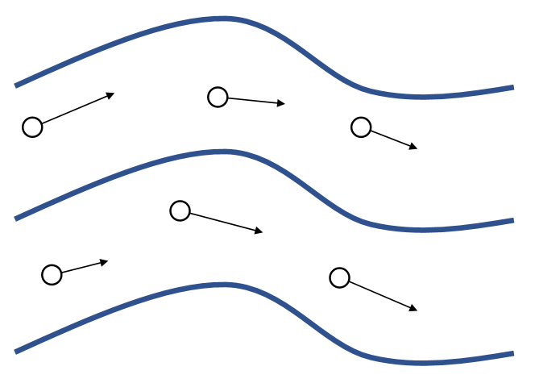

P2   
# Fluid Effects    

Unlike other bodies, Fluids exhibit highly volatile behaviors. As a result, it’s difficult to come up with a single, efficient way for simulating all of fluid effects.     

> &#x2705; 流体的形态很多，例如水滴、水花、水浪，对应的模拟方法也不同。难以用通用的方法高效地模拟所有场景。    

P3   
# Two Types of Simulation Approaches  

|     |    |  
|---|----|
| Lagrangian Approach  (dynamic particles or mesh)  Node movement carries physical quantities (mass, velocity, …). |  Eulerian Approach   (static grid or mesh)   Grid/Mesh doesn’t move.  Stored physical quantities change.  |
| &#x2705; 左：无 Grid. 物理量附加在粒子上，粒子运动时更新自身物理量。 | &#x2705; 右：固定 Grid. 物理量固定在 Grid 上。粒子运动后统一新格子的物理量。   |

---------------------------------------
> 本文出自CaterpillarStudyGroup，转载请注明出处。
>
> https://caterpillarstudygroup.github.io/GAMES103_mdbook/