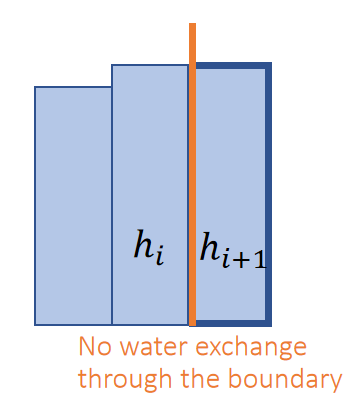

P23  
# Boundary Conditions   

## Dirichlet boundary 
 

A Dirichlet boundary assumes that the boundary height \\(H_{i+1}\\) is constant.  It’s considered as an open boundary.    

$$
ℎ_{i+1}−ℎ_i+ℎ_{i−1}−ℎ_i=H_{i+1}−ℎ_i+ℎ_{i−1}−ℎ_i
$$

 

> &#x2705; 这种方法用于模拟开放的水面，例如大海的区域、假设被模拟的区域外是静止的水面、高度为常数，(Dirichlet)    
> &#x2705; \\(h\\)为边界内，\\(H\\)为边界外。   

P25   
## Algorithm with Neumann Boundaries   

Extending the simulator to 3D is also straightforward.   

> $$\text{A Shallow Wave Simulator}$$      
For every cell \\(i, j\\)    
$$ℎ_{i,j}^{new}←ℎ_{i,j}+β(ℎ_{i,j}−ℎ_{i,j}^{old})\\\\\text{If } ℎ_{i−1,j} \text{ exists, then  } ℎ_{i,j}^{new}←ℎ_{i,j}^{new}+α(ℎ_{i−1,j}−ℎ_{i,j})\\\\ \text{If } ℎ_{i+1,j} \text{ exists, then  } ℎ_{i,j}^{new}←ℎ_{i,j}^{new}+α(ℎ_{i+1,j}−ℎ_{i,j})\\\\  \text{If } ℎ_{i,j−1} \text{ exists, then  } ℎ_{i,j}^{new} ←ℎ_{i,j}^{new}+α(ℎ_{i,j−1}−ℎ_{i,j})\\\\ \text{If } ℎ_{i,j+1} \text{ exists, then  } ℎ_{i,j}^{new}←ℎ_{i,j}^{new}+α(ℎ_{i,j+1}−ℎ_{i,j})$$
For every cell \\(i, j\\)    
$$ℎ_{i,j}^{old}←ℎ_{i,j}\\\\ℎ_{i,j}←ℎ_{i,j}^{new}$$

[@]P25内容换成截图

## Neumann boundary
A Neumann boundary specifies the boundary derivatives.  For example, a zero-derivative boundary means \\(ℎ_{i+1}≡ℎ_i\\).  It’s considered as a closed boundary.   

$$
ℎ_{i+1}−ℎ_i+ℎ_{i−1}−ℎ_i=ℎ_{i−1}−ℎ_i
$$

> &#x2705; Neuman 用于模拟有边界水域，例如池堂、假设边界上没有水流交换。   

P24   

> $$\text{A Shallow Wave Simulator}$$    
For every cell \\(i\\)   
$$ℎ_i^{new}←ℎ_i+β(ℎ_i−ℎ_i^{old})\\\\\text{If } ℎ_{i−1}\text{ exists, then  }ℎ_i^{new}←ℎ_i^{new}+α(ℎ_{i−1}−ℎ_i)\\\\ \text{If } ℎ_{i+1} \text{ exists,  then } ℎ_i^{new}←ℎ_i^{new}+α(ℎ_{i+1}−ℎ_i)$$
For every cell \\(i\\)    
$$ℎ_i^{old}←ℎ_i\\\\ℎ_i←ℎ_i^{new}  $$

[@]P24内容换成截图

---------------------------------------
> 本文出自CaterpillarStudyGroup，转载请注明出处。
>
> https://caterpillarstudygroup.github.io/GAMES103_mdbook/
