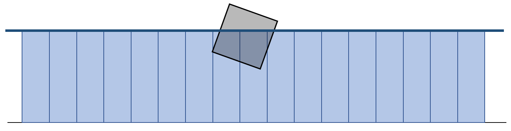
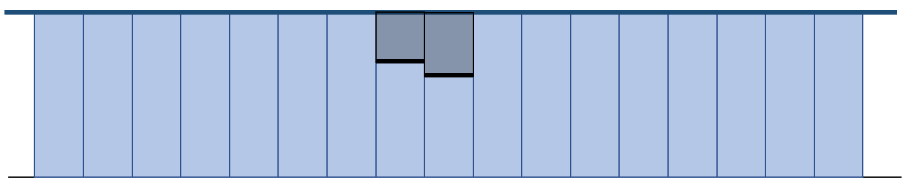
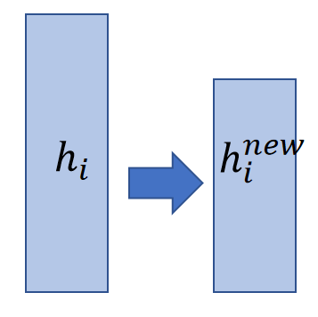

P26   
## Two-Way Coupling    

> &#x2705; 水和水中的物体相互作用，物体可以是刚体、弹性体能各种类型的物体。    

The coupling between a solid and a liquid should be two-way, i.e., liquid->solid and solid->liquid.    

   

> &#x2705; 水 → 物体：浮力。物体 → 水，会把这个水柱的水排出去，此处只讲 “物体 → 水” 部分   

P27   
## 关键问题

The coupling between solid and water should be two-way, i.e., water>solid and solid- >water.     

The key question is how to expel water out of the gray cell regions???    

    

P28   
## Virtual Height    

> &#x2705; 在要排的水柱上面增加一个虚拟的高度，然后正常模拟，关键是求出要加多少虚拟高度，能正好达到排出那么多水的效果。   

The idea is to set up a virtual height \\(v_i\\), so that  \\(ℎ_i^\text{real_new}=ℎ_i−e_i\\).    

$$
ℎ_i−e_i=ℎ_i+β(ℎ_i−ℎ_i^{old})+α(v_{i+1}+ℎ_{i+1}+ℎ_{i−1}−2v_i−2{ℎ_i})=ℎ_i^{new}+α(v_{i+1}−2v_i)
$$

> &#x2705; \\(ℎ_i^\text{real_new}=ℎ_i−e_i\\)：下图左边格子的理想高度。    

$$
ℎ_{i+1}−e_{i+1}=ℎ_{i+1}+β(ℎ_{i+1}−ℎ_{i+1}^{old})+α(ℎ_{i+2}+v_i+ℎ_i−2v_{i+1}−2ℎ_{i+1})=ℎ_{i+1}^{new}+α(v_i−2v_{i+1})
$$

> &#x2705; 公式2对应右边格子。    

    

P29   
## Poisson’s Equation    

The outcome is Poisson’s equation, with \\(v_i\\) and \\(v_{i+1}\\) being unknowns.    

$$
2v_i−v_{i+1}=\frac{1}{α}(ℎ_i^{new}−ℎ_i+e_i)=b_i
$$

$$
−v_i+2v_{i+1}=\frac{1}{α}(ℎ_{i+1}^{new}−ℎ_{i+1}+e_{i+1})=b_{i+1}
$$

> &#x2705; 通过公式化简提取出其中的线性关系。      

P30   

The outcome is Poisson’s equation, with \\(v_i\\) and \\(v_{i+1}\\) being unknowns.    

    

> &#x2705; 由于木块位置会变，需要解的\\(v_i\\)也要改变。 为了让公式统一方便计算，把图左矩阵乘法写成右边形式。公式结果不变，只是工程实现上的简化。    

P31  
## Algorithm with Coupling    

    

> &#x2705; \\(\gamma \\) 的作用：本算法显式积分，不稳定、\\(\gamma \\) 会让水波小很多。    

P32   
## Rigid Body Update   

We estimate the floating force by the actual water expelled in every column.      

    

$$
f_i=ρg∆x(ℎ_i−ℎ_i^{new})
$$

Or in 3D,   

$$
f_{i,j}=ρg∆A(ℎ_{i,j}−ℎ_{i,j}^{new})
$$

> &#x2705; 阿基米得定律：物体受到的浮力 = 排出去的水的重力  
> &#x2705; 同时要考虑旋转和力矩。但目前旋转的效果不太好，可以考虑改进为隐式积分。      
> &#x2705; 流体对方块的效果。   

