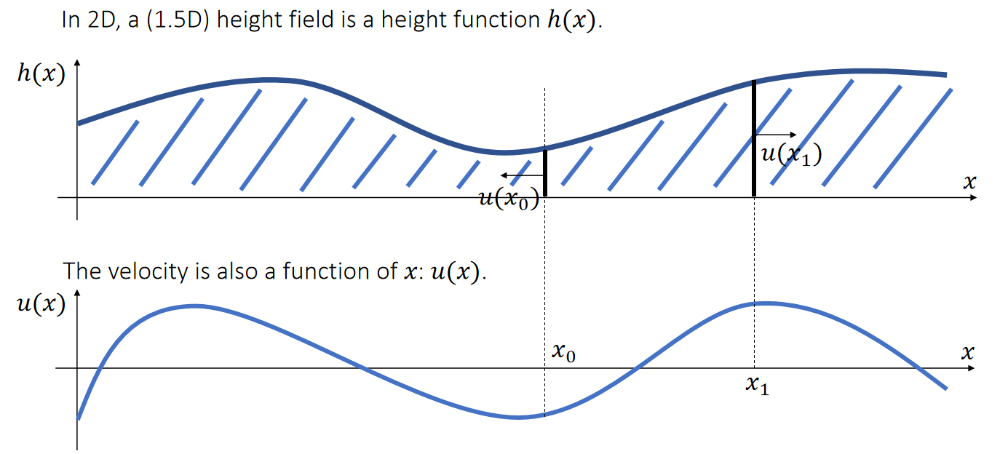
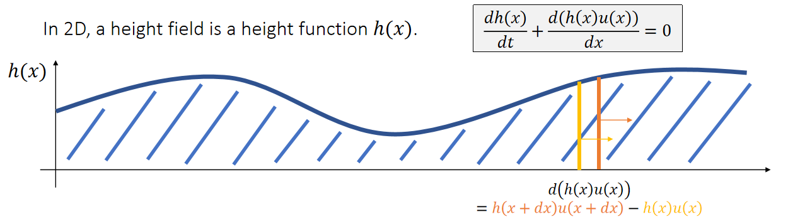
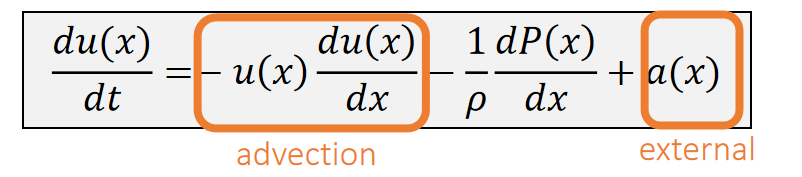
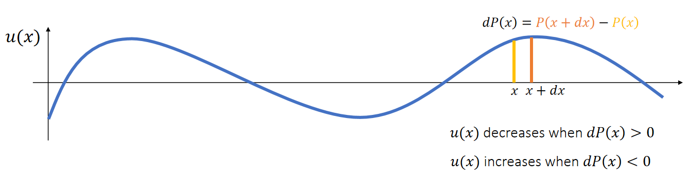
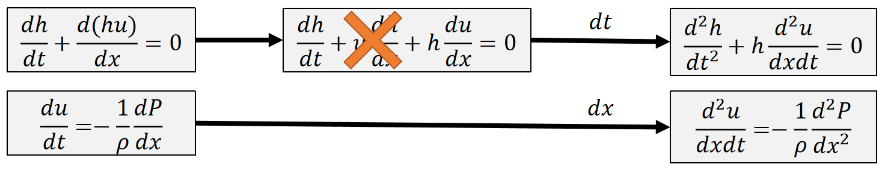
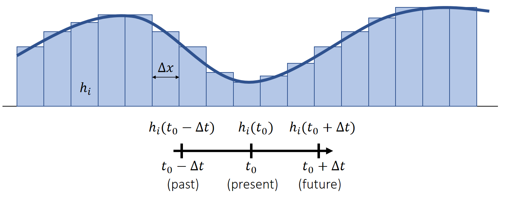
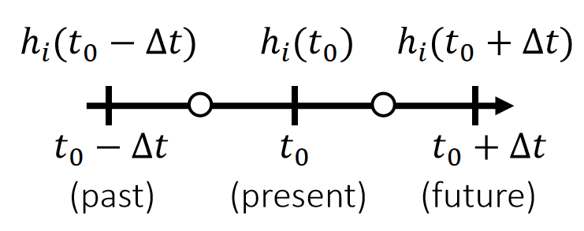
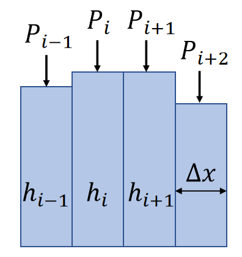

P4   
# A Height Field Model   

## 高度场（Height Field）和速度场

P5   
### 高度场（Height Field）和速度场的定义

    

> &#x2705; 利用高度函数来表达波的平面，通过更新\\(h(x)\\)来表达水面随时间波动的效果。    
> &#x2705; 由于用函数表达，无法描述大海浪的效果，因为这种情况下一个位置对应多个高度。  
> &#x2705; 速度场描述水流的速度和方向， 速度< 0 则右往左， > 0 则左往右。   

P6   
### 高度场的更新

 

> &#x2705; 高度场更新公式第一项：高度场随时间的变化。  
> &#x2705; 高度场更新公式第二项，根据微分的定义：   
> \\(h(x)u(x)\\): 单位时间内流过x线的水量。     
> \\(d(h(x)u(x))\\) ：单位时间内区域 \\([x \quad x+dx]\\) 的水量变化、    
> \\(d(h(x)u(x))1/dx\\) ：单位时间内区域区 \\([x \quad x+dx]\\) 的水位高度变化    

P7   
### 速度场的更新

The velocity is also a function of \\(x:u(x)\\).   

    

> &#x2705; 第一项：当水在流动时，速度应该跟水一起流动，下节课再讲。  
> &#x2705; 第三项：外力，当前也不考虑。   

P8   

Ignoring advection and external acceleration, we get a simple form:   

$$
\begin{matrix}
\frac{du(x)}{dt}=−\frac{1}{ρ} \frac{dP(x)}{dx} \quad \quad & ρ: \text{density} \quad \quad & P(x):\text{pressure}
\end{matrix}
$$

   

> &#x2705; 第二项： 在短时间内、速度变化由左右压强差决定。同样的压强下，密度大则难推，密度小则好推。   

P9   
## Shallow Wave Equation   

> &#x2705; 为什么叫 Shallow Wave, 因为该算法假设水波很小，因此 \\(dh / dx\\) 可忽略不计。    

We now have two equations:   

 

> &#x2705; 公式化简的目的：不需要关心速度场\\(u\\)、仅关注高度场就可以。  
> &#x2705; 第一个公式：（1）对\\(d(hu)\\)展开（2）再求一次\\(dt\\)    
> &#x2705; 第二个公式：对\\(x\\)求导    

We can then eliminate \\(u\\) and formulate the shallow wave equation:    

| $$\frac{d^2ℎ}{dt^2} =\frac{ℎ}{ρ} \frac{d^2P}{dx^2} $$ |
|----|  

> &#x2705; 合并同类项，得到最终方程     
> &#x2705; 但引擎无法直接处理微分程，因此要离散化开求解。       

P10  
## 高度场离散化

前面的仿真都需要时间的离散化。这里除了时间离散化，还要空间离散化。    
时间离散和空间离散是有区别的。    
时间上，每个时间步要计算的是与上一个时间步的积累差异，因此需要积。\\(\Delta a→\Delta \nu→\Delta x\\)     
空间上，每个位置要计算的是这个位置上的物理属性，因此要用微分。 \\(\Delta x→\Delta \nu→\Delta a\\)     

We discretize a continuous height field into a discrete set of height columns.    

  

> &#x2705; 高度场离散化为多个水柱，微分算子也要离散化。    

P11   

## 微分算子离散化   

### 前向差分与后向差分

The idea of finite differencing is to use the difference to approximate the derivative.     

 

$$
f(t_0+∆t)=f(t_0)+∆t\frac{df(t_0)}{dt} +\frac{∆t^2}{2} \frac{d^2f(t_0)}{dt^2} +…
$$

Forward differencing (first-order)   

| $$\frac{df(t_0)}{dt} ≈\frac{f(t_0+∆t)−f(t_0)}{∆t}$$ | 
|---|

$$
f(t_0−∆t)=f(t_0)−∆t\frac{df(t_0)}{dt}+\frac{∆t^2}{2}\frac{d^2f(t_0)}{dt^2} +…
$$

Backward differencing (first-order)     

| $$ \frac{df(t_0)}{dt}≈\frac{f(t_0)−f(t_0−∆t)}{∆t} $$ | 
|---|

P12   
### Central Differencing

The idea of finite differencing is to use the difference to approximate the derivative.    

$$
f(t_0+∆t)=f(t_0)+∆t\frac{df(t_0)}{dt}+\frac{∆t^2}{2}\frac{d^2f(t_0)}{dt^2} +…
$$

$$
f(t_0−∆t)=f(t_0)−∆t\frac{df(t_0)}{dt}+\frac{∆t^2}{2}\frac{d^2f(t_0)}{dt^2} +…
$$

Central differencing (second-order)   

| $$ \frac{df(t_0)}{dt}≈\frac{f(t_0+∆t)−f(t_0−∆t)}{2∆t} $$ | 
|---|

P13   
## 二阶微分算子离散化

### 高度   

We apply central differencing twice to estimate \\(d^2ℎ_i/dt^2\\).    

$$
\begin{matrix}
 \frac{dℎ_i(t_0+0.5∆t)}{dt}≈\frac{ℎ_i(t_0+∆t)−ℎ_i(t_0)}{∆t}  \quad\quad& \frac{dℎ_i(t_0−0.5∆t)}{dt}≈\frac{ℎ_i(t_0)−ℎ_i(t_0−∆t)}{∆t} 
\end{matrix}
$$

| $$\frac{d^2ℎ_i(t_0)}{dt^2}≈\frac{\frac{dℎ_i(t_0+0.5∆t)}{dt}−\frac{dℎ_i(t_0−0.5∆t)}{dt} }{∆t} ≈\frac{ℎ_i(t_0+∆t)+ℎ_i(t_0−∆t)−2ℎ_i(t_0)}{∆t^2}$$ |
|---|

   

> &#x2705; 先用 central difference 求出两个中点的一阶导数，再基于此计算 \\(t_0\\) 处的二阶导。这种操作又称为一维Laplace 算子。    

P14    

### 压强

Similarly, we apply central differencing twice to estimate \\(d^2P/dx^2\\).      

$$
\begin{matrix}
 \frac{dP_{i+0.5}}{dt} ≈\frac{P_{i+1}−P_i}{∆x} \quad\quad & \frac{dP_{i−0.5}}{dx} ≈\frac{P_i−P_{i−1}}{∆x} 
\end{matrix}
$$

|  $$\frac{d^2P_i}{dx^2}≈\frac{\frac{dP_{i+0.5}}{dx}−\frac{dP_{i−0.5}}{dx}}{∆x} ≈\frac{P_{i+1}+P_{i−1}−2P_i}{∆x^2}$$ |
|---|   

   

> &#x2705; 二维情况用周围4个元素，见 Games102 离散拉普拉斯算子。  

P15   
## Discretized Shallow Wave Equation    

We can now discretize the shallow wave equation \\(\frac{d^2ℎ}{dt^2}=\frac{ℎ}{ρ}\frac{d^2P}{dx^2}\\).     

 
| \\(\begin{matrix}\\ \frac{d^2ℎ_i(t_0)}{dt^2}≈\frac{ℎ_i(t_0+∆t)+ℎ_i(t_0−∆t)−2ℎ_i(t_0)}{∆t^2}\quad  &\frac{d^2P_i}{dx^2 }≈\frac{P_{i+1}+P_{i−1}−2P_i}{∆x^2}\\\\\end{matrix}\\)  |
|----|

\\(\quad\\)

|  \\(\Rightarrow \frac{ℎ_i(t_0+∆t)+ℎ_i(t_0−∆t)−2ℎ_i(t_0)}{∆t^2}=\frac{ℎ_i}{ρ} (\frac{P_{i+1}+P_{i−1}−2P_i}{∆x^2})\\)  |
|----|

\\(\quad\\)

|  \\(\Rightarrow ℎ_i(t_0+∆t)=2ℎ_i(t_0)−ℎ_i(t_0−∆t)+\frac{∆t^2ℎ_i}{∆x^2ρ}(P_{i+1}+P_{i−1}−2P_i)\\)  |
|----|

> &#x2705; 更新目标：下一个时刻的水柱的高度，即 \\(h_i(t_0 + ∆t)\\)    
> &#x2705; 但按此公式模拟可能出现水的体积变多或变少的问题。   

---------------------------------------
> 本文出自CaterpillarStudyGroup，转载请注明出处。
>
> https://caterpillarstudygroup.github.io/GAMES103_mdbook/
