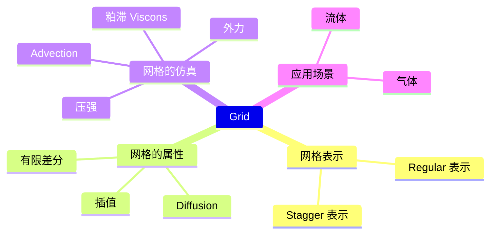

```mermaid
mindmap
Grid
    网格表示
        Regular 表示
        Stagger 表示
    网格的属性
        有限差分
        插值
        Diffusion
    网格的仿真
        外力
        Advection
        压强
        粕滞 Viscons
    应用场景
        气体
        流体
```

 
 
---------------------------------------
> 本文出自CaterpillarStudyGroup，转载请注明出处。
>
> https://caterpillarstudygroup.github.io/GAMES103_mdbook/