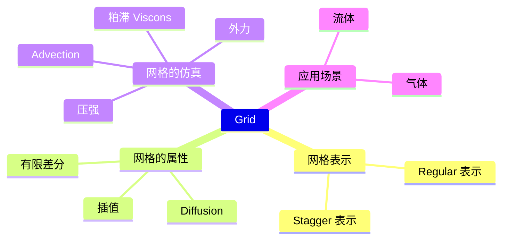

# Topics for the Day    

# Reference

|ID|Year|Name|解决了什么痛点|主要贡献是什么|Tags|Link|
|---|---|---|---|---|---|---|
||1996|Realistic animation of liquids|在固定网格上利用纳维-斯托克斯方程模拟流体运动|

 
 
---------------------------------------
> 本文出自CaterpillarStudyGroup，转载请注明出处。
>
> https://caterpillarstudygroup.github.io/GAMES103_mdbook/