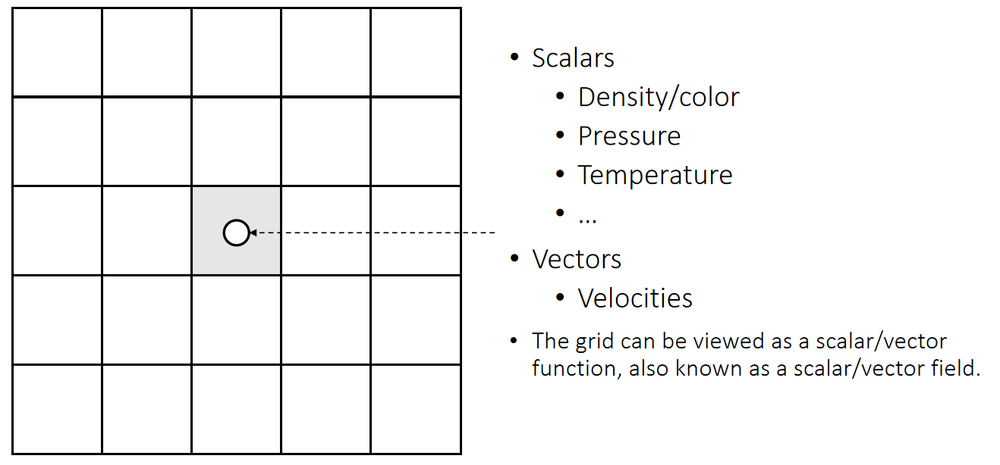
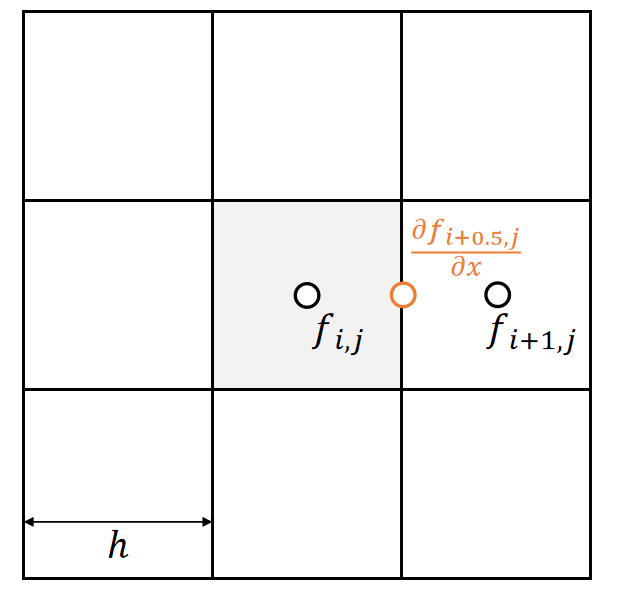
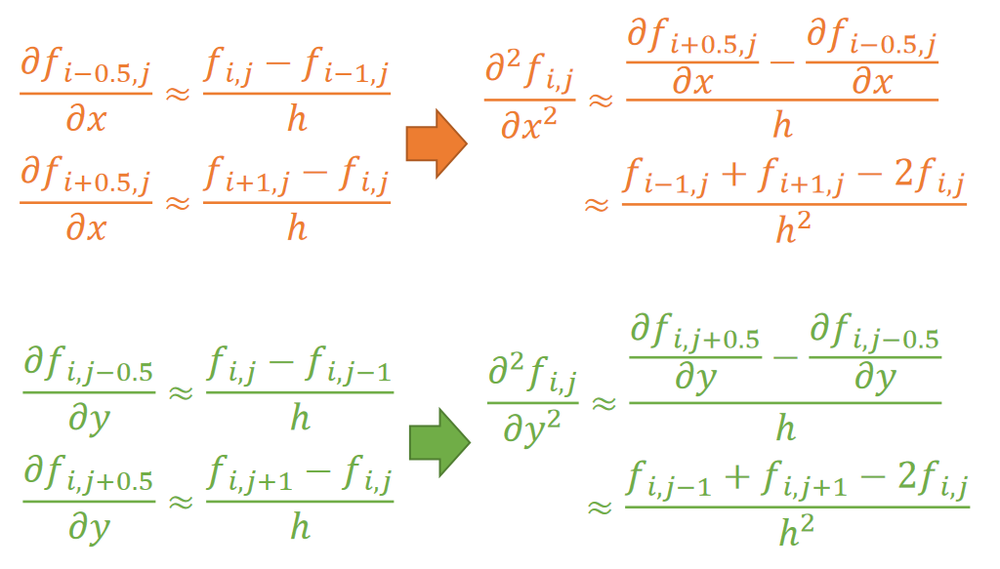

P3  
# A Grid Representation and Finite Differencing   

P4  
## A Regular Grid Representation    

   

> &#x2705; 把场定义在标准格子上的好处：(1)把物理量定义在格子的中心（2）计算导数或利用导数进行微分计算变得容易了。   
> &#x2705; 上节课grid用1D来表示2D，2D表示3D，不是真正的grid方法。   
> &#x1F50E; Central Differencing：L10.    
> &#x2705; 空间中任意位置的物理量由格子中心插值得出。   

P6   
### Finite Differencing on Grid   

P13  
# Staggered Grid 表示

### Problem with Regular Grid 表示   

Central differencing gives the derivative in the middle.    

   

 - The cell doesn’t exist at (i+0.5, j).   

 - To get \\( \frac{∂f_ {i,j}}{∂x} \\), we need \\(f_{i−1,j}\\) and \\(f_{i+1,j}\\).  But this is weird, because \\(f_{i,j}\\) is unused.    

> &#x2705; 前面假设所有物理量定义在格子的中间。但此处算出来的一阶微分量不在格子中间。 

P14  
## Solution: 把速度属性放在墙上   

> &#x2705; 不规定所有物理量都定义在格子中间，也可以定义在墙上。    
> &#x2705; 对照 Height Fleld 方法，也是把 \\(P\\) 和 \\(H\\) 定义在格子上，把速度定义在格子交界处。    

We define some physical quantities on faces, specifically **velocities**.    

   

 - The x-part of the velocity is defined on vertical faces.   

- The y-part of the velocity is defined on horizonal faces.   

> &#x2705; 把速度定义在墙上的好处量，速度是矢量、可以用不同方向的墙表达不同方向上的速度、直观。  

The grid is very friendly with central differencing.   

### 一阶导数

   

| $$\frac{∂f_{i+0.5,j}}{∂x}≈\frac{f_{i+1,j}−f_{i,j}}{ℎ}$$  |
|---|

P7   
### 二阶导数

   

P8  
### Discretized Laplacian

We can then obtain the discretized Laplacian operator on grid.   

   

$$
\frac{∂^2f_{i,j}}{∂x^2}≈\frac{\frac{∂f_{i−0.5,j}}{∂x}−\frac{∂f_{i+0.5,j}}{∂x}}{ℎ}≈\frac{f_{i−1,j}+f_{i+1,j}−2f_{i,j}}{ℎ^2}
$$

$$
\frac{∂^2f_{i,j}}{∂y^2}≈\frac{\frac{∂f_{i,j+0.5}}{∂y}−\frac{∂f_{i,j−0.5}}{∂y}}{ℎ} ≈\frac{f_{i,j−1}+f_{i,j+1}−2f_{i,j}}{ℎ^2} 
$$

|  $$∆f_{i,j}=\frac{∂^2f_{i,j}}{∂x^2}+\frac{∂^2f_{i,j}}{∂y^2}≈\frac{f_{i−1,j}+f_{i+1,j}+f_{i,j−1}+f_{i,j+1−4}f_{i,j}}{ℎ^2} $$  |
|---| 

> &#x2705; 网格上的Laplace算子。   

P9   
### Boundary Conditions    

The boundary condition specifies \\(f_{i−1,j}\\) if it’s outside.

   

A **Dirichlet** boundary: \\(f_{i−1,j}=C\\)   

|$$ ∆f_{i,j}≈\frac{C+f_{i+1,j}+f_{i,j−1}+f_{i,j+1}−4f_{i,j}}{ℎ^2}$$|
|---|

A **Neumann** boundary: \\(f_{i−1,j}=f_{i,j}\\)  

|  $$∆f_ {i,j} ≈ \frac{f_ {i+1,j}+f_ {i,j−1}+f_ {i,j+1}−3f_{i,j}}{ℎ^2}$$ |
|----|

> &#x2705; 至少有一个边界使用Dirithlet．否则会全部收缩为0．   
> &#x2705; Neumann是约束相对关系，没有绝对数值，会有无穷多解。   

---------------------------------------
> 本文出自CaterpillarStudyGroup，转载请注明出处。
>
> https://caterpillarstudygroup.github.io/GAMES103_mdbook/

