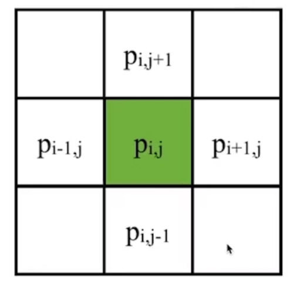

P18   
# Incompressible, Viscous  Navier-Stokes Equations

## 材料导数

**材料导数就是“流体微团所经历的真实变化率”**，它是将牛顿第二定律应用于流动流体时自然出现的关键算子，是连接流体力学中欧拉描述与拉格朗日描述的桥梁。

$$
\frac{D\phi}{Dt} = \underbrace{\frac{\partial \phi}{\partial t}} _ {\text{局部导数}} + \underbrace{(\mathbf{u} \cdot \nabla) \phi} _ {\text{对流导数}}
$$

*   **∂φ/∂t**：**局部导数**。固定点，随时间的变化。
*   **(u · ∇)φ**：**对流导数**。固定时间，随空间运动的变化。速度 **u** 越大，或者物理量梯度 ∇φ 越大，这项贡献就越大。
*   

### **局部导数**

在**空间某个固定点**上，物理量随时间的变化率。它只反映流场在**该点**的不定常性。数学上就是偏导数 ∂/∂t。
    
**例子**：你坐在河岸边一个固定的岩石上，测量河水温度。如果温度计读数随时间增加，那是因为流经该点的水本身在变热（比如太阳照射），这就是局部温度变化。

### **对流导数**

由于流体微团**运动到流场中不同位置**，而该位置物理量的空间分布不均匀，导致微团自身属性发生的变化。它反映了流场的**空间不均匀性**和微团的**运动速度**。

**例子**：你坐在一艘随河水漂流的小船上，手里拿着温度计。即使河水在每一点的温度不随时间变化（定常流），但如果你从冰冷的山区漂到温暖的下游，你测得的温度也会上升。这个变化就是因为你（流体微团）移动到了温度不同的地方。

**材料导数就是这两种变化的总和**。

P19  
[TODO] 补充材料导数

## Equation Fomulation   

   

> &#x2705; 这是一个描述了速度场的公式，它可以告许你速度如何更新。   
> &#x2705; 第一项代表重力。有时也把所有的外力统一表达为 \\(g\\).      
> &#x2705; 第二项 advection 描述速度的流动。    
> &#x2705; 第三项 diffusion 的目的是粘滞。\\(\Delta\\) 不是指增量，而是指 Laplace.   
> &#x2705; 第四项限制流体不可压。       

Method of Characteristics: solving a long partial differential equation (PDE) in steps
 - Step 1: Update \\(\mathbf{u}\\) by solving \\(∂\mathbf{u}∕∂t=\mathbf{g}\\)   
 - Step 2: Update \\(\mathbf{u}\\) by solving \\(∂\mathbf{u}∕∂t=−(\mathbf{u}\cdot ∇)\mathbf{u}\\)  
 - Step 3: Update \\(\mathbf{u}\\) by solving \\(∂\mathbf{u}∕∂t=υ∆\mathbf{u}\\)  
 - Step 4: Update \\(\mathbf{u}\\) by solving \\(∂\mathbf{u}∕∂t=−∇\mathbf{p}\\)   
 


> &#x2705; 把偏微分方程分解几个小块，依次轮流优化每一小块。    
> &#x2753; 这种方法为什么可行？   


P20   
## Step 1: External Acceleration


The Update of \\(\mathbf{u}\\) by \\(∂\mathbf{u}∕∂t=\mathbf{g}\\) is straightforward, just add acceleration to \\(u\\) and \\(v\\).    

   


> &#x2705; \\(v_{i,j}\\)代表向下的速度，对所有格子更新\\(v_{i,j}\\).    
> &#x2705; 其它外部速度同理。   


P21  
## Step 2: Advection   

> &#x2705;  Advection,代表流动。即速度会跟着粒子移动，基于欧拉的方法才需要考虑这个问题。因为固定的格子无法描述水的流动。       
> &#x2705; 基于拉格朗日的方法，变量定义在粒子上，天然满足这个特点。    

### 方法一：数学模型

Next we need to update \\(\mathbf{u}\\) by solving \\(∂\mathbf{u}∕∂t=−(\mathbf{u}\cdot ∇)\mathbf{u}\\).   

   

| $$(\mathbf{u} \cdot ∇)\mathbf{u} =u\cdot \frac{∂u}{∂x} +v\cdot \frac{∂v}{∂\mathbf{y}} $$ |
|---|  

Solving this in an Eulerian way can be a source of instability.   

> &#x2705; Eulerian way： \\(\mathbf{u}^{\mathrm{new} }=\frac{\partial u}{\partial t} ·Δt＋\mathbf{u}\\) 不稳定    
> &#x2705; 由当前状态计算下一刻的速度，显式积分。    

To solve this problem, we come to realize that advection means to carry physical quantities by velocity.   

P22  
### 方法二: Semi-Lagrangian Method   


The solution is to trace a virtual particle backward over time.    
特点：非常稳定，但数值粘性非常高。  

> &#x2705; 例如要求\\(\mathbf{x}_0\\)的速度，倒推哪个粒子会运动到\\(\mathbf{x}_0\\)处；因此找到\\(\mathbf{x}_1\\)，用\\(\mathbf{x}_1\\)的速度来更新\\(\mathbf{x}_0\\)的速度。    


   

 - Define \\(\mathbf{x}_0←(i−0.5, j)\\)   
 - Compute \\(\mathbf{u}(\mathbf{x}_0)\\)   
 - \\(\mathbf{x}_1←\mathbf{x}_0−∆t \mathbf{u}(\mathbf{x}_0)\\)   
> &#x2705; 假设短时间内速度不变，根据当前速度猜测上一帧的位置。   
> &#x2705; 在求 Advection 时认为每个粒子的速度不变。   
 - Compute \\(\mathbf{u}(\mathbf{x}_1)\\) 双线性插值    
 - \\(u_{i,j}^{new}←u(\mathbf{x}_1)\\)   

\\(\mathbf{u}\\) 和 \\(u\\) 都是表达某个点的速度，它们的区别在于：    
\\(\mathbf{u}\\) 描述空间点 \\(\mathbf{x}\\) 的速度，是 2D 速度，是通过相邻格子插值得来的。    
\\(u\\) 描述空间点 \\(\mathbf{x}\\) 在水平方向上的速度，是 1D 的。向左或向右，由于 \\(\mathbf{x}_0\\) 定义在竖直墙上，所以只取水平方向的速度。    

Note that if the velocities are staggered, we need to do staggered bilinear interpolation.   


P23  
> &#x2705; 对每个墙上的速度都以相同的方式更新。    

直接向前推一个时间步来取 \\(\mathbf{x}_1\\) 的位置，可能是非常不准的。   

   


实际上这种方法也是欧拉法    

Initial value problem (ODE): simply use explicit time integration schemes, e.g.,
 
- Forward Euler ("RK1")
```c++
p -= dt * velocity(p)
```

- Explicit Midpoint ("RK2")
```c++
p_mid = p - 0.5 * dt * velocity(p)
p -= dt * velocity(p_mid)
```

- RK3
```c++
v1 = velocity(p)
p1 = p - 0.5 * dt * v1
v2 = velocity(p1)
p2 = p - 0.75 * dt * v2
v3 = velocity(p2)
p -= dt * (2 / 9 * v1 + 1 / 3 * v2 + 4 / 9 * v3)
```

一般RK2就够用了。    
P24   

We could also subdivided the time step for better tracing.   

   


> &#x2705; 反推找\\(\mathbf{x}_1\\)时 step 细一点，这样能找得准一点    
> &#x2705; 怎么计算每个\\(\mathbf{x}\\)的\\(\mathbf{u}\\)?答：双线性插值方法、   
> &#x2705; 做模拟通常更在乎稳定而不是误差，此方法更稳定，但会有模糊的 artifacts.   
> &#x2705; 这一步不可导。   

### 方法三：BFECC   

方法二中多次使用双线性插值，导致结果变糊(表现在流体上就是看上去很粘)     

BFECC: Back and Forth Error Compensation and Correction
 
- \\(\mathbf{x}^* = \text{SL}(\mathbf{x}, \Delta t)\\)
- \\( \mathbf{x}^{** }= \text{SL} ( \mathbf{x} ^ {*}, -\Delta t) \\)
- Estimate the error \\(\mathbf{x}^{\text{error}} = \frac{1}{2}(\mathbf{x}^{**} - \mathbf{x})\\)
- Apply the error \\(x^{\text{final}} = \mathbf{x}^* + \mathbf{x}^{\text{error}}\\)
 
Be careful: need to prevent overshooting.

公式中的 SL 代表方法二    
这种方法之后要接 error 的截断保护     

### 其它方法    
BFECC    
BiMocq    
结合粒子的方法    

P25   
## Step 3: Diffusion  

Next we need to update \\(\mathbf{u}\\) by solving \\(∂\mathbf{u}∕∂t=\upsilon ∆\mathbf{u}\\).   

根据公式更新即可。    

   


> &#x2705; 分别对\\(u\\)和 \\(v\\) 做 laplacian.   
> &#x2705; 注意公式中\\(v\\)和\\(\nu \\)的不同，后者为粘滞系数。   
  

The process of applying Laplacian smoothing is called **diffusion**.     

> &#x2705; Laplace的本质是与邻居做平均。   

We could also use even smaller sub-steps…   


P27  
## Step 4: Pressure Projection    

通过压强实现散度为0(流体不可压)的效果。   

Finally, we need to update \\(\mathbf{u}\\) by solving \\(∂\mathbf{u}∕∂t=−∇\mathbf{p}\\). 

### 公式推导法

$$
u^{new} = u - \Delta t \nabla p
$$

两边同时应用\\(\nabla\\)算子，得：    

$$
\nabla \cdot u^{new} = \nabla \cdot u - \Delta t \nabla \cdot \nabla p
$$

考虑不可压约束 \\(\nabla \cdot u^{new}=0\\)，得：    

$$
\nabla \cdot \nabla p = \frac{1}{\Delta t} \nabla \cdot u
$$

即Poisson's Equation.     
离散化得：    

$$
4p_{i,j}−p_{i−1,j}−p_{i+1,j}−p_{i,j−1}−p_{i,j+1}= \\\\
\\\\
ℎ(−u_{i+1,j}−v_{i,j+1}+u_{i,j}+v_{i,j})
$$

### 直观理解法   

   

同样在墙上定义带方向的压强

Staggering makes this very straightforward:

$$
u_{i,j}^{new}←u_{i,j}−\frac{∆t}{ℎ}(p_{i,j}−p_{i−1,j})
$$

$$
v_{i,j}^{new}←v_{i,j}−\frac{∆t}{ℎ}(p_{i,j}−p_{i,j−1})
$$

  
> &#x2705; \\(u\\)和\\(v\\)分别为两个方向上的速度。   

But what is \\(\mathbf{p}\\)?

P28   
### 压强的来源：流体不可压

The pressure is caused by incompressibility.     

> &#x2705; 压强的原因：由于流体不可压缩、对于流体的压力会传导到每个点上。   
> &#x2705; 每个点都有压强，虽然压强未知，但可以根据不可压条件构造方程组。   
> &#x2705; 不可压的表现为有压强，产生的效果是散度为0．   
 

In other words, after this update by pressure, we should achieve:   

|$$∇\cdot \mathbf{u}^{new}=0$$|  
|-------|

which means

| $$u_{i+,j}^{new}+v_{i,j+1}^{new}−u_{i,j}^{new}−v_{i,j}^{new}=0$$  |
|----|

$$
\Downarrow
$$

| $$ \begin{matrix}u_{i+1,j}−\frac{(p_{i+1,j} − p_{i,j})}{ℎ}+v_{i,j+1}−\frac{(p_{i,j+1}−p_{i,j})}{ℎ} \\\\−u_{i,j}−\frac{(p_{i,j} − p_{i−1,j})}{ℎ} −v_{i,j}−\frac{(p_{i,j}−p_{i,j−1})}{ℎ}=0 \end{matrix}$$ |
|---|


P29  

The pressure is caused by incompressibility. Eventually, we get a Poisson equation:  

$$
4p_{i,j}−p_{i−1,j}−p_{i+1,j}−p_{i,j−1}−p_{i,j+1}= \\\\
\\\\
ℎ(−u_{i+1,j}−v_{i,j+1}+u_{i,j}+v_{i,j})
$$

with boundary conditions:   

$$ \text{Dirichlet boundary (open) } p_{i−1,j}=P \\\\
\text{Neumann boundary (close) } p_{i−1,j}=p_{i,j}$$

Once we solve \\(\mathbf{p}\\), we update \\(\mathbf{u}\\) and done.   


P30    
## After-Class Reading    


Jos Stam. 1999. *Stable Fluids. TOG (SIGGRAPH)*.   

> &#x2705; 这篇论文主要讨论了step2，但也包含了全部过程

### 求解压强 \\(p\\)   

Poisson's Equation 构成了一个巨大的线性系统    

$$
A_x = b
$$

其中 \\(A\\) 为 \\(p\\) 的系数构成的矩阵，\\(x\\) 为未知量 \\(p\\)，\\(b\\) 为已知量 \\(u\\)     
 
### 压强 Laplacian 算子的离散化   

   

$$
(\nabla \cdot \nabla p) _ {i,j} = \frac{1}{\Delta x^2}(-4p _ {i,j} + p _ {i+1,j} + p _ {i-1,j} + p_{i,j-1} + p_{i,j+1})
$$

 
### 解泊松方程    

\\(A\\) 的特点：稀疏、对称、正定    
Krylov-Subspace solvers：conjugate gradients + damped Jacobi smoothing + PARDISO    


$$
\mathbf{r}_0 = \mathbf{b} - \mathbf{A} \mathbf{x}_0
$$

$$
\mathbf{p}_0 = \mathbf{r}_0
$$

$$
\mathbf{k} = 0
$$

while True:   
$$
\alpha_k = \frac{\mathbf{r}_k^T \mathbf{r}_k}{\mathbf{p}_k^T \mathbf{A} \mathbf{p}_k}
$$

$$
\mathbf{x}_{k+1} = \mathbf{x}_k + \alpha_k \mathbf{p}_k
$$

$$
\mathbf{r}_{k+1} = \mathbf{r}_k - \alpha_k \mathbf{A} \mathbf{p}_k
$$

if \\(||\mathbf{r}_{k+1}||\\) is sufficiently small, break    

$$
\beta_k = \frac{\mathbf{r} _ {k+1}^T \mathbf{r} _ {k+1}}{\mathbf{r} _ k ^ T \mathbf{r} _ k}
$$

$$
\mathbf{p} _ {k+1} = \mathbf{r} _ {k+1} + \beta_k \mathbf{p} _ k
$$

$$
k = k + 1
$$ 


return \\(\mathbf{x}_{k+1}\\)     

 
\\(A\\) 的 condition 数越大，迭代法收敛越慢     
让 condition 更小的方法：把问题变为    

$$
M^{-1}Ax = M^{-1}b
$$

\\(M\\) 是一个与 \\(A\\) 近似但易于求逆的矩阵
 
#### Multigrid 求 M    

   

 

---------------------------------------
> 本文出自CaterpillarStudyGroup，转载请注明出处。
>
> https://caterpillarstudygroup.github.io/GAMES103_mdbook/