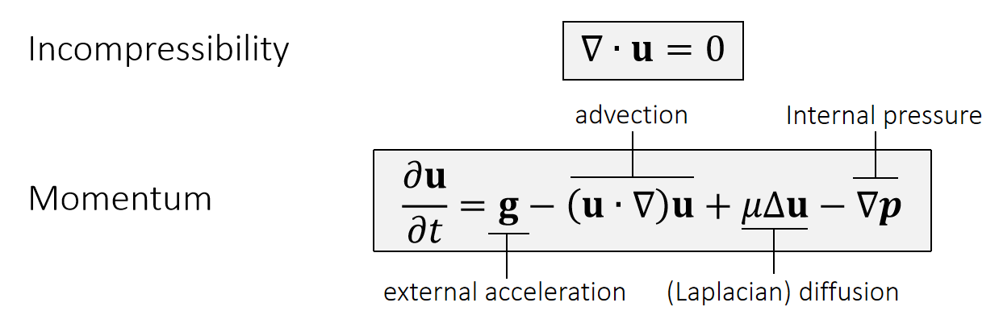
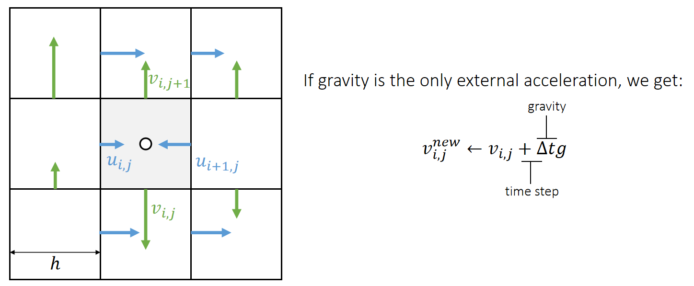
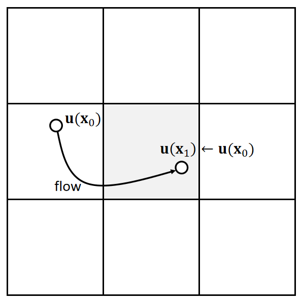
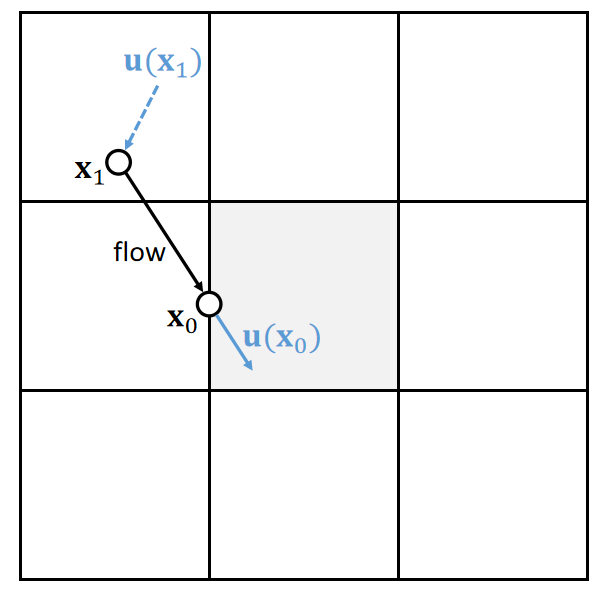
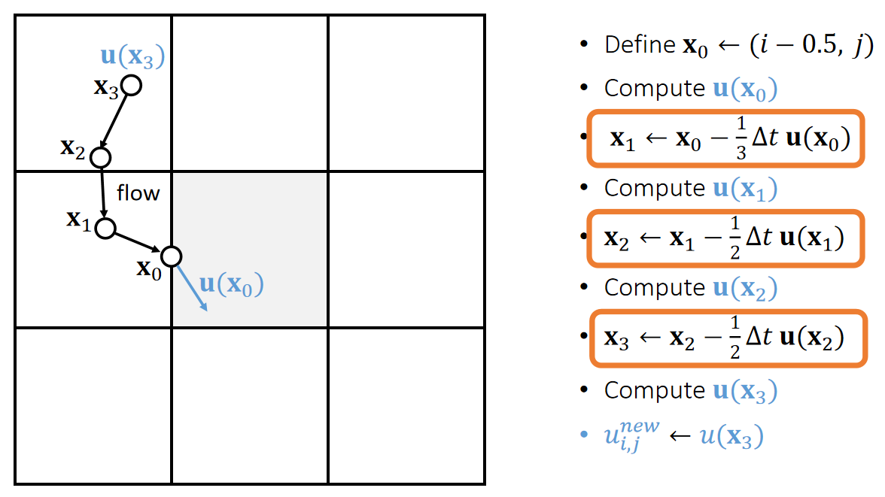
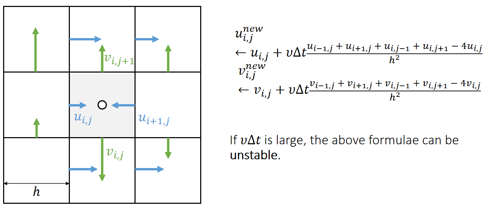
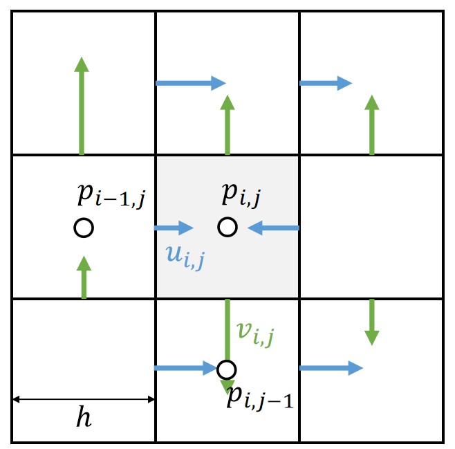

P18   
# Incompressible, Viscous  Navier-Stokes Equations

P19  
## Equation Fomulation   

   

> &#x2705; 这是一个描述了速度场的公式，它可以告许你速度如何更新。第二项 advection 描述速度的流动。    
第三项 diffusion 的目的是粘滞。\\(\Delta\\) 不是指增量，而是指 Laplace.   
第四项限制流体不可压。       

Method of Characteristics: solving a long partial differential equation (PDE) in steps
 - Step 1: Update \\(\mathbf{u}\\) by solving \\(∂\mathbf{u}∕∂t=\mathbf{g}\\)   
 - Step 2: Update \\(\mathbf{u}\\) by solving \\(∂\mathbf{u}∕∂t=−(\mathbf{u}\cdot ∇)\mathbf{u}\\)  
 - Step 3: Update \\(\mathbf{u}\\) by solving \\(∂\mathbf{u}∕∂t=υ∆\mathbf{u}\\)  
 - Step 4: Update \\(\mathbf{u}\\) by solving \\(∂\mathbf{u}∕∂t=−∇\mathbf{p}\\)   
 

> &#x2705; 把偏微分方程分解几个小块，依次轮流优化每一小块。    
> &#x2753; 这种方法为什么可行？   

P20   
## Step 1: External Acceleration

The Update of \\(\mathbf{u}\\) by \\(∂\mathbf{u}∕∂t=\mathbf{g}\\) is straightforward, just add acceleration to \\(u\\) and \\(v\\).    

   

> &#x2705; \\(v_{i,j}\\)代表向下的速度，对所有格子更新\\(v_{i,j}\\).    
> &#x2705; 其它外部速度同理。   

P21  
## Step 2: Advection   

> &#x2705;  Advection,代表流动。即速度会跟着粒子移动，基于欧拉的方法才需要考虑这个问题。因为固定的格子无法描述水的流动。       
> &#x2705; 基于拉格朗日的方法，变量定义在粒子上，天然满足这个特点。    
> &#x2753; 不可压和流动有什么关系？    

### 数学模型

Next we need to update \\(\mathbf{u}\\) by solving \\(∂\mathbf{u}∕∂t=−(\mathbf{u}\cdot ∇)\mathbf{u}\\).   

   

| $$(\mathbf{u} \cdot ∇)\mathbf{u} =u\cdot \frac{∂u}{∂x} +v\cdot \frac{∂v}{∂\mathbf{y}} $$ |
|---|  

Solving this in an Eulerian way can be a source of instability.   

> &#x2705; Eulerian way： \\(\mathbf{u}^{\mathrm{new} }=\frac{\partial u}{\partial t} ·Δt＋\mathbf{u}\\) 不稳定    
> &#x2705; 由当前状态计算下一刻的速度，显式积分。    

To solve this problem, we come to realize that advection means to carry physical quantities by velocity.   

P22  
### Solution: Semi-Lagrangian Method   

The solution is to trace a virtual particle backward over time.   

> &#x2705; 例如要求\\(\mathbf{x}_0\\)的速度，倒推哪个粒子会运动到\\(\mathbf{x}_0\\)处;因此找到\\(\mathbf{x}_1\\)，从\\(\mathbf{x}_1\\)的下一刻速度来更新\\(\mathbf{x}_0\\)的速度。    
> &#x2753; 是用 \\(\mathbf{x}_1\\) 的速度还是 \\(\mathbf{x}_1\\) 下一时刻的速度？    

   

 - Define \\(\mathbf{x}_0←(i−0.5, j)\\)   
 - Compute \\(\mathbf{u}(\mathbf{x}_0)\\)   
 - \\(\mathbf{x}_1←\mathbf{x}_0−∆t \mathbf{u}(\mathbf{x}_0)\\)   
> &#x2705; 假设短时间内速度不变，根据当前速度猜测上一帧的位置。   
 - Compute \\(\mathbf{u}(\mathbf{x}_1)\\)
 - \\(u_{i,j}^{new}←u(\mathbf{x}_1)\\)   

\\(\mathbf{u}\\) 和 \\(u\\) 都是表达某个点的速度，它们的区别在于：    
\\(\mathbf{u}\\) 描述空间点 \\(\mathbf{x}\\) 的速度，是 2D 速度，是通过相邻格子插值得来的。    
\\(u\\) 描述空间点 \\(\mathbf{x}\\) 在水平方向上的速度，是 1D 的。向左或向右，由于 \\(\mathbf{x}_0\\) 定义在竖直墙上，所以只取水平方向的速度。    

Note that if the velocities are staggered, we need to do staggered bilinear interpolation.   

P23  
> &#x2705; 对每个墙上的速度都以相同的方式更新。    

P24   

We could also subdivided the time step for better tracing.   

   

> &#x2705; 反推找\\(\mathbf{x}_1\\)时 step 细一点，这样能找得准一点    
> &#x2705; 怎么计算每个\\(\mathbf{x}\\)的\\(\mathbf{u}\\)?答：双线性插值方法、   
> &#x2705; 做模拟通常更在乎稳定而不是误差，此方法更稳定，但会有模糊的 artifacts.   
> &#x2705; 这一步不可导。   

P25   
## Step 3: Diffusion  

Next we need to update \\(\mathbf{u}\\) by solving \\(∂\mathbf{u}∕∂t=\upsilon ∆\mathbf{u}\\).   

根据公式更新即可。    

   

> &#x2705; 分别对\\(u\\)和 \\(v\\) 做 laplacian.   
> &#x2705; 注意公式中\\(v\\)和\\(\nu \\)的不同，后者为粘滞系数。   

We could also use even smaller sub-steps…   

P27  
## Step 4: Pressure Projection    

Finally, we need to update \\(\mathbf{u}\\) by solving \\(∂\mathbf{u}∕∂t=−∇\mathbf{p}\\). 

   

Staggering makes this very straightforward:

$$
u_{i,j}^{new}←u_{i,j}−\frac{∆t}{ℎ}(p_{i,j}−p_{i−1,j})
$$

$$
v_{i,j}^{new}←v_{i,j}−\frac{∆t}{ℎ}(p_{i,j}−p_{i,j−1})
$$

> &#x2705; 公式第二项离散化后在特定方向上的压强。   
> &#x2705; \\(u\\)和\\(v\\)分别为两个方向上的速度。   

But what is \\(\mathbf{p}\\)?

P28   
### 压强的来源

The pressure is caused by incompressibility.     

> &#x2705; 压强的原因：由于流体不可压缩、对于流体的压力会传导到每个点上。   
> &#x2705; 每个点都有压强，虽然压强未知，但可以根据不可压条件构造方程组。   
> &#x2705; 不可压的表现为有压强，产生的效果是散度为0．   
 

In other words, after this update by pressure, we should achieve:   

|$$∇\cdot \mathbf{u}^{new}=0$$|  
|-------|

which means

| $$u_{i+,j}^{new}+v_{i,j+1}^{new}−u_{i,j}^{new}−v_{i,j}^{new}=0$$  |
|----|

$$
\Downarrow
$$

| $$ \begin{matrix}u_{i+1,j}−\frac{(p_{i+1,j} − p_{i,j})}{ℎ}+v_{i,j+1}−\frac{(p_{i,j+1}−p_{i,j})}{ℎ} \\\\−u_{i,j}−\frac{(p_{i,j} − p_{i−1,j})}{ℎ} −v_{i,j}−\frac{(p_{i,j}−p_{i,j−1})}{ℎ}=0 \end{matrix}$$ |
|---|

P29  
### 压强的数学模型

The pressure is caused by incompressibility. Eventually, we get a Poisson equation:  

  

Eventually, we get a Poisson equation:   

$$
4p_{i,j}−p_{i−1,j}−p_{i+1,j}−p_{i,j−1}−p_{i,j+1}= \\\\
\\\\
ℎ(−u_{i+1,j}−v_{i,j+1}+u_{i,j}+v_{i,j})
$$

with boundary conditions:   

$$ \text{Dirichlet boundary (open) } p_{i−1,j}=P \\\\
\text{Neumann boundary (close) } p_{i−1,j}=p_{i,j}$$

Once we solve \\(\mathbf{p}\\), we update \\(\mathbf{u}\\) and done.   

P30    
## After-Class Reading    

Jos Stam. 1999. *Stable Fluids. TOG (SIGGRAPH)*.   

> &#x2705; 这篇论文主要讨论了step2，但也包含了全部过程

---------------------------------------
> 本文出自CaterpillarStudyGroup，转载请注明出处。
>
> https://caterpillarstudygroup.github.io/GAMES103_mdbook/