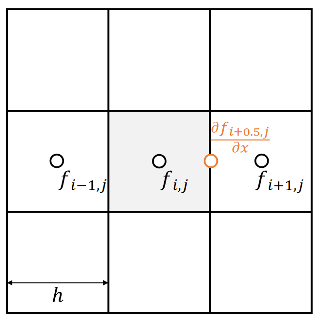

P13  
# Problem with Central Differencing   

Central differencing gives the derivative in the middle.    

   

 - The cell doesn’t exist at (i+0.5, j).   

 - To get \\( \frac{∂f_ {i,j}}{∂x} \\), we need \\(f_{i−1,j}\\) and \\(f_{i+1,j}\\).  But this is weird, because \\(f_{i,j}\\) is unused.    

> &#x2705; 前面假设所有物理量定义在格子的中间。但此处算出来的一阶微分量不在格子中间。 

P14  
## Solution: Staggered Grid   

> &#x2705; 不规定所有物理量都定义在格子中间，也可以定义在墙上。   

We define some physical quantities on faces, specifically **velocities**.    

   

 - The x-part of the velocity is defined on vertical faces.   

- The y-part of the velocity is defined on horizonal faces.   

> &#x2705; 把速度定义在墙上的好处量，速度是矢量、可以用不同方向的墙表达不同方向上的速度、直观。  

- **Intuitively**, they represent the flow speed between two cells. For example, we write the volume changing speed at cell (i,j) as:   

|  $$u_{i+1,j}+v_{i,j+1}−u_{i,j}−v_{i,j}$$  |
|---|  

> &#x2705; 通过四面墙上的速度计算当前格子的净流出（注意正负号）   

P15  
## Divergence-Free Condition

No volume change is equal to say the fluid is incompressible. This can be formally written as a divergence-free velocity field.   

   

> &#x2753; 这一页没听懂、净流入流出为0，水面还怎么动呢？   
> &#x2705; 由于格子不可压，每个格子的净流出（入）应该为0．    
> &#x2705; \\(\nabla\\)为散度符号，见前面课程。   
> &#x2705; 公式1为直观理解，公式2为数学推导，本质上是一致的。    

P16   
## Bilinear Interpolation   

> &#x1F50E; 双线性插值：见GAMES 101    

P17   

We use bilinear interpolation to interpolate staggered velocities as well.    

 

