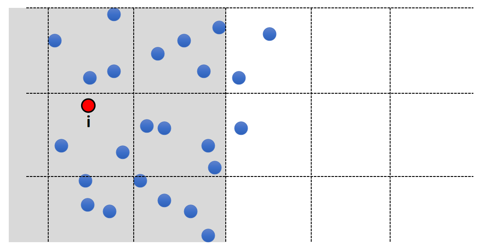

  
## Spatial Partition加速求最近邻

## 补充 1：

P25   
### Exhaustive Neighborhood Search   

 - Search over every particle pair? O(\\(N^2\\))
 - 10M particles means: 100 Trillion pairs…      

P26   
### Solution: Spatial Partition   

 - Separate the space into cells    
 - Each cell stores the particles in it   
 - To find the neighborhood of i, just look at the surrounding
cells   

   

P27   
### 遗留问题：   

 - What if particles are not uniformly distributed?   
> &#x2705; 例如水花喷溅的效果，通常靠近水面的粒子小一点，更利于表现细节。  
 - **Solution**: Octree, Binary Spatial Partitioning tree…    

   

P28 
## 补充 2：流体粒子渲染       

• Need to reconstruct the water surface from particles!    

   

> &#x2705; 点云转成三角面片用于渲染也是一个比较复杂的问题。    
> &#x2705;（1）平滑方法：bias kemal（见GAMES 102）    
> &#x2705;（2）把球转为SDF，SDF转为Mesh    

P29   
## 补充 3：Ongoing Research    

 - How to make the simulation more efficient?   
 
 - How to make fluids incompressible?    
 
 - When simulating water, only use water particles, no air particles. So particles are sparse on the water-air boundary. How to avoid artifacts there?    
 
 - Using AI, not physics, to predict particle movement?    

---------------------------------------
> 本文出自CaterpillarStudyGroup，转载请注明出处。
>
> https://caterpillarstudygroup.github.io/GAMES103_mdbook/