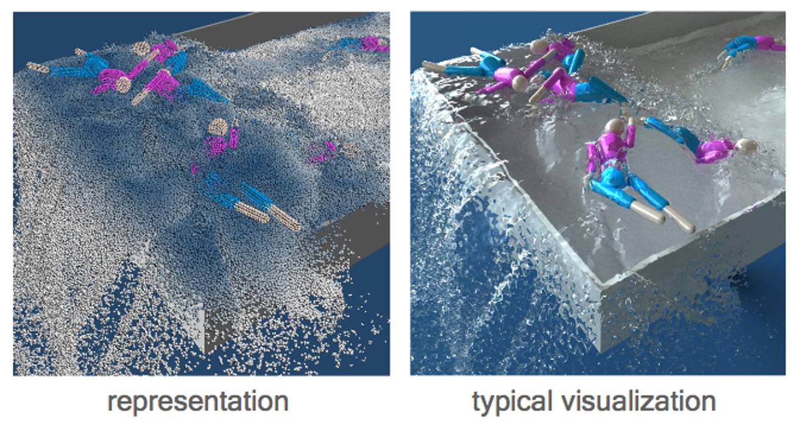
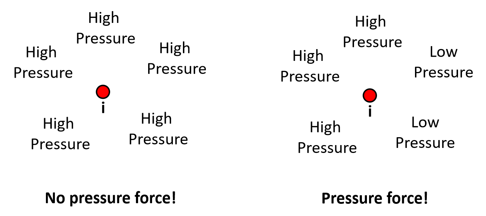
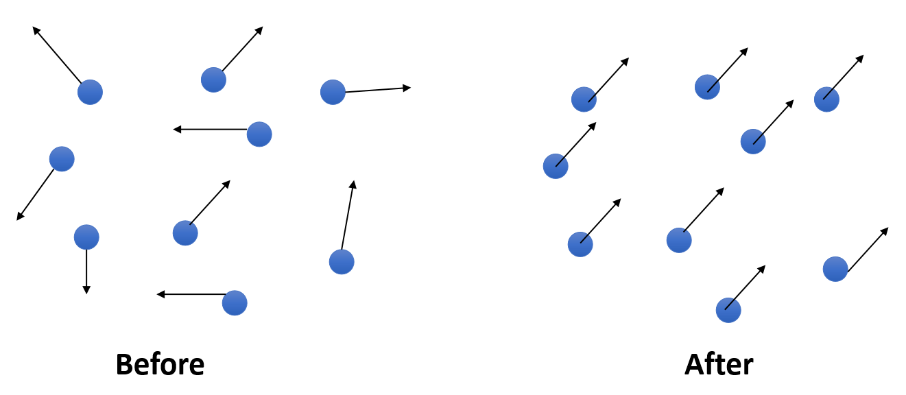
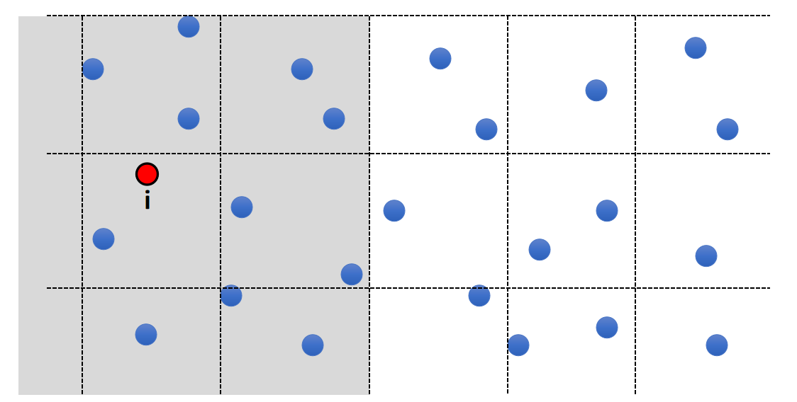
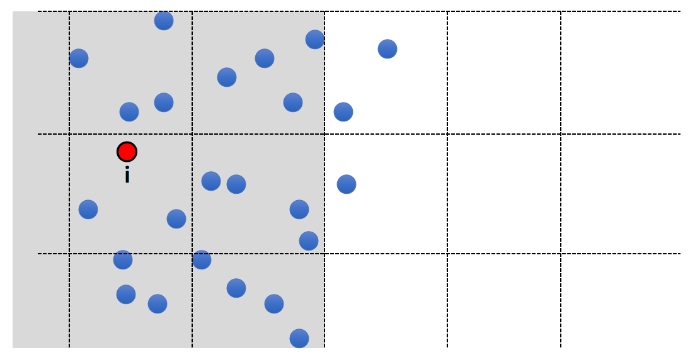

P16   
# SPH-Based Fluids   

P17  
   
## A SPH Model  

Consider a (**Lagrangian**) particle system: each water molecule is a particle with physical quantities attached, such as position \\(\mathbf{x}_i\\), velocity \\(\mathbf{v}_i\\), and mass \\(m_i\\).   

    

> &#x2705; 用粒子来表达流体，物理变量附着在粒子上。先通过粒子系统的方式独立计算每个粒子。粒子转化为三角网格再渲染，或直接渲染带透明贴图的粒子(游戏)。   

关键在于怎样构造粒子所受到的力，使粒子的运动效果看上去像水分子的运动。   

- We model fluid dynamics by applying three forces on particle i.     
    - Gravity
    - Fluid Pressure
    - Fluid Viscosity   

P18   
## Gravity Force   

 - Gravity Force is:

$$
\mathbf{F} _ \mathbf{i}^ \mathbf{gravity}  = m _i \mathbf{g} 
$$

P19   
## Pressure Force   

计算密度 → 计算压强 → 计算压力    

### 怎么计算压强

 - Pressure is related to the density
    - First compute the density of Particle i:

    $$
    \rho _ i = \sum _ j m _ j W _ {ij}
    $$

    - Convert it into pressure (some empirical function):   

    $$
    P_i=k((\frac{\rho _i}{\rho _\mathrm{constant } } )^7-1)
    $$

> &#x2705; 密度到压强的计算是一个经验公式。    

### 压强转化为力

P20   

 - Pressure force depends on the **difference** of pressure:   

   

P21   
 - Mathematically, the difference of pressure => Gradient of pressure.    

$$
\mathbf{F} _i^{pressure}=-V_i\nabla _iP^{smooth}
$$

> &#x2705; 体积为粒子在空间中占有的体积，体积越大受到的压力越大、\\(\nabla\\)代表压强的差。   

- To compute this pressure gradient, we assume that the  pressure is also smoothly represented:  

$$
P_i^{smooth}=  \sum _ j V_jP_j W_{ij}
$$

> &#x2705; 假设空间是一个压强场、粒子是空间中的采样。\\(P^{smooth}\\)是通过周粒子\\(P\\)的插值得到的采样点压强。   

- So:   

$$
\mathbf{F} _ i^{pressure} = - V _ i \sum _ j V _ j P _ j \nabla _ i W _ {ij}
$$

P22   
## Viscosity Force   

### 粘滞所产生的效果

 - Viscosity effect means: *particles should move together in the same velocity*.     
 - In other words, minimize the difference between the particle velocity and the velocities of its neighbors.    

   

> &#x2705;  Viscosity (粘滞)类似于 damping (阻尼)，但有些区别，后者的目标是让粒子的运动停下来，前者的目的是让所有粒子的运动整齐划一，即速度差趋于0. 

P23   
### 粘滞力 Viscosity Force   

- Mathematically, it means:   
$$
\mathbf{F} _i^{vis \cos  ity}=-\nu m_i\Delta  _i\mathbf{V} ^{smooth}
$$ 

> &#x2705; \\(V\\)：粘滞系数， \\(\nabla V\\)：速度的 Laplacian.注意速度是3D矢量。   

- To compute this Laplacian, we assume that the velocity is also smoothly represented:  

$$
\mathbf{V} _i^{smooth}= \sum_jV_j \mathbf{v} _ j W _ {ij}
$$ 

- So:   

$$
\mathbf{F} _i^{vis \cos  ity}=-\nu m_i\sum _jV_j\mathbf{v} _j\Delta  _iW _{ij}
$$

> &#x2705; smooth会产生粘滞的效果。    

P24  
## Algorithm   

 - For every particle i  
    - Compute its neighborhood set   
    - Using the neighborhood, compute:   
      - Force = 0   
      - Force + = The gravity force   
      - Force + = The pressure force   
      - Force + = The viscosity force   
 - Update \\(v_i = v_i + t * \text{ Force } / m_i\\);   
 - Update \\(x_i = x_i + t * v_i\\);   

|  $$ \color{Red}{ \text{ What is the bottleneck of the performance here?}} $$  |
|---|

> &#x2705; 性能瓶颈：计算邻居，因为总粒子数为百万级。   

## Spatial Partition加速求最近邻

P25   
### Exhaustive Neighborhood Search   

 - Search over every particle pair? O(\\(N^2\\))
 - 10M particles means: 100 Trillion pairs…    

P26   
### Solution: Spatial Partition   

 - Separate the space into cells    
 - Each cell stores the particles in it   
 - To find the neighborhood of i, just look at the surrounding
cells   

   

P27   
### Spatial Partition   

 - What if particles are not uniformly distributed?   
> &#x2705; 例如水花喷溅的效果，通常靠近水面的粒子小一点，更利于表现细节。  
 - **Solution**: Octree, Binary Spatial Partitioning tree…    

   

---------------------------------------
> 本文出自CaterpillarStudyGroup，转载请注明出处。
>
> https://caterpillarstudygroup.github.io/GAMES103_mdbook/

