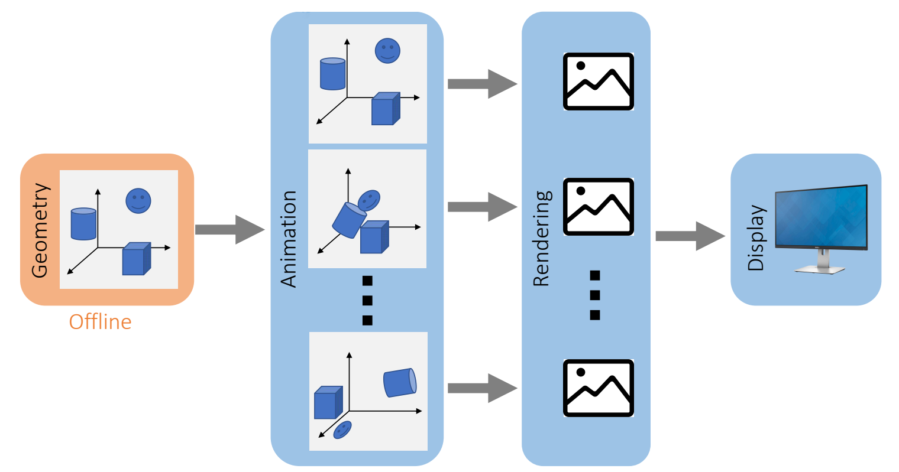
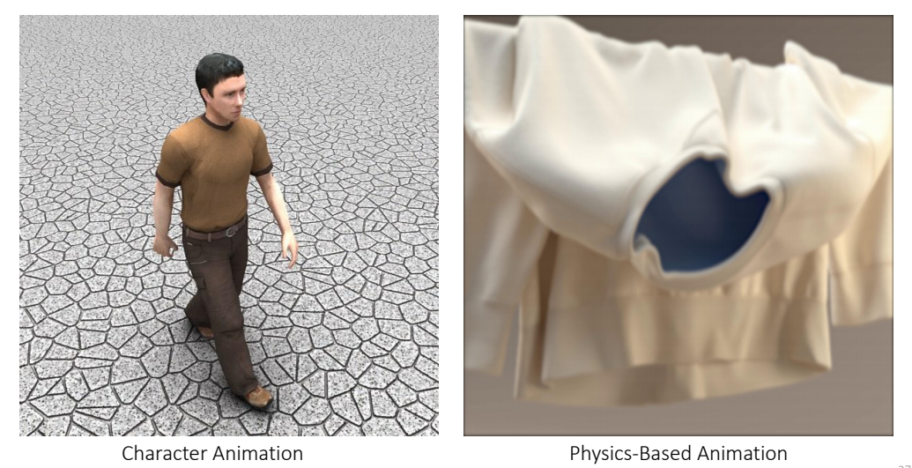

P3    
# Prerequisites

 - The course is designed for    
    - Undergraduates in the 3rd or 4th year, or fresh graduates.     

> &#x2705; 建议：读 paper 而不是教材，只读重点不读全文学知识而不是学用 Unity. 多读多写多想  

P14    

[数学基础](https://caterpillarstudygroup.github.io/mathematics_basic_for_ML/index.html)          

# Graphics Pipeline   

[Animation](https://caterpillarstudygroup.github.io/GAMES105_mdbook/)     
[Geometry](https://caterpillarstudygroup.github.io/GAMES102_mdbook/)       
[Rendering](https://caterpillarstudygroup.github.io/GAMES101_mdbook/)          

## Real-Time Graphics Pipeline     

   

P15  
The number of frames sent to display in a second is called the *frame rate*.    
For example, 24 FPS, 30 FPS, 60 FPS, …     

> &#x2705; 帧率要求主要取决于交互性，因此游戏要求比电­影高。  

P17
## Animation Playback

 

> &#x2705; 由于实时比较难，可以把不需要交互的动画，例如过场动画做成离线    
> &#x2705; 同理，不需要交互的场景。 

P18
## Movie  

> &#x2705; Geometry: 离线：构造离线的3D也界      
> &#x2705; 动画：渲染，实时，需要与3D世界或玩家互动    
> &#x2705; 电影：离线，不需要交互，提前录下来，例如游戏中的过场动画     

P27
# Animation

## Character and Physics-Based Animation      

 

> &#x2705; 本课程主要是后者，但通常二者是结合的。

    

 
P38 
# Physics-Based Animation
## Animation Paradigm

   

 - The goal of animation is to **update the state in every time step**.    
 - The state can be:    
    - Position/orientation     
    - Velocity     
    - Appearance     
    - Density    
    - …     
 - The time step doesn’t have to match the frame rate.    
    - It’s common to animate multiple time steps then render one frame.    
    
    
P39
## Physics-Based Animation Topics    

    

> &#x2705; Cloth and Hair：细的窄的一类物体   
> &#x2705; Soft Bodys：包括软体，弹性体   
> &#x2705; Fluids：流体，包括液体和气体   

P56

    

> &#x2705; 
> 刚体：常用Mesh，因为Mesh 适用于形态固定、不会剧烈拉扯或断裂的物体。用粒子模拟会破碎的刚体    
> 衣服头发：也可以用 Grid 模拟衣服和头发可以减少碰撞处理。但计算量大，且难以处理细节   
> 流体：烟通常使用粒子法或网格法。水波可以看作是整体，因此能用 mesh，用 mesh的好处是可以做到实时，Grid 的好处是更真实。Splashes(水花)的问题是多变，因此不能实时，通常使用粒子和网格。   
> Hybrid 方法：MPM = Particle + Grid,兼容二者优点，常用于模拟雪或粘滞物体   
Coupling: 场景中同时有不同类别的物体，怎样模拟它们的交互。   
> &#x2705; SPA 与弹性体模拟结合，可用于模拟物体破碎， 粒子法与网格法相结合，称为 MPM. 用于模拟雪、沙子。 

P59
## Topics in This Class    

   

> &#x2705;   
> Fracture 有大量的 remesh。游戏引擎中的 Fracture 通常通过预计算而不是模拟得到。     
Rigid 还是Soft,看有没有形变。   
Mesh 定义在物体上， Grid 定义在场景上   
水波 Mesh 也会讲，图上漏掉了。     

P60

---------------------------------------
> 本文出自CaterpillarStudyGroup，转载请注明出处。
>
> https://caterpillarstudygroup.github.io/GAMES103_mdbook/
