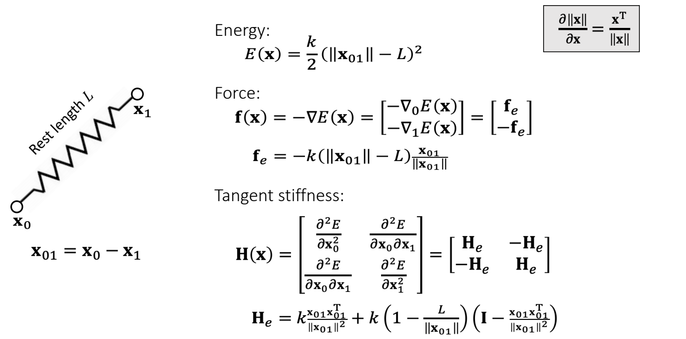

P26
# Matrix: Basics
## Matrix: Definition

A real matrix is a set of real elements arranged in rows and columns.    

$$
A=\begin{bmatrix}
 a_{00} & a_{01} & a_{02} \\\\
 a_{10}& a_{11} & a_{12} \\\\
 a_{20}& a_{21} & a_{22}
\end{bmatrix}=[a_{0} \quad a_{1} \quad  a_{2}]\in \mathbf{R}   ^{3\times 3}
$$

$$
\mathbf{A^T=A}    \quad  \mathrm{Symmetric} 
$$

P27
## Matrix: Multiplication    

How to do matrix-vector and matrix-matrix multiplication? (Omitted)    

 - \\(\mathbf{AB≠BA} 	 \quad \quad \quad \quad  	\quad  \quad \quad \quad \mathbf{(AB)x=A(Bx)} \\)     
 - \\(\mathbf{(AB)^T=B^TA^T}	 \quad \quad	\quad \quad \quad \quad \mathbf{(A^TA)^T=A^TA}\\)    
 - \\(\mathbf{Ix=x}		 \quad 	\quad \quad   \quad \quad \quad \quad \quad \quad \mathbf{AI=IA=A}\\)    
  \\(\quad\\) 	
 - \\(\mathbf{A^{−1}:  AA^{−1}=A^{−1}A=I}	 \quad \quad \mathrm{inverse}\\)     
 - \\(\mathbf{(AB)^{−1}=B^{−1}A^{−1}}\\)
 - Not every matrix is invertible, e.g., \\(\mathbf{A} =\begin{bmatrix}
 0 & 0 & 0\\\\
 0 & 0 & 0\\\\
 0 & 0 & 0
\end{bmatrix}\\)    

P28
## Matrix: Orthogonality

An orthogonal matrix is a matrix made of orthogonal **unit** vectors. 

$$
\mathbf{A} =[\mathbf{a} _0\quad \mathbf{a} _1\quad \mathbf{a} _2]\quad\mathrm{such \quad that
} \quad \mathbf{a}_i^\mathbf{T}\mathbf{a}_j =\begin{cases}
  1，& \text{ if } i= j \text{(unit)}\\\\
  0.& \text{ if } i\ne j \text{(orthogonal)}
\end{cases}
$$

$$
\mathbf{A^TA}=\begin{bmatrix}
\mathbf{a}_0^\mathbf{T} \\\\
\mathbf{a}_1^\mathbf{T} \\\\
\mathbf{a}_2^\mathbf{T}
\end{bmatrix}\begin{bmatrix}
 \mathbf{a}_0 & \mathbf{a}_1 &\mathbf{a}_2
\end{bmatrix}=\begin{bmatrix}
 \mathbf{a}_0^\mathbf{T} \mathbf{a}_0 &  \mathbf{a}_0^\mathbf{T} \mathbf{a}_1 &  \mathbf{a}_0^\mathbf{T} \mathbf{a}_2\\\\
 \mathbf{a}_1^\mathbf{T} \mathbf{a}_0 &  \mathbf{a}_1^\mathbf{T} \mathbf{a}_1 &  \mathbf{a}_1^\mathbf{T} \mathbf{a}_2\\\\
  \mathbf{a}_2^\mathbf{T} \mathbf{a}_0 &  \mathbf{a}_2^\mathbf{T} \mathbf{a}_1 &  \mathbf{a}_2^\mathbf{T} \mathbf{a}_2
\end{bmatrix}=I
$$

$$
\mathbf{A^T=A^{-1}}
$$

P29   
## Matrix Transformation

A rotation can be represented by an orthogonal matrix.    

> &#x2705; \\(\mathbf{x、y、z}\\) 是世界坐标系、 \\(\mathbf{u、v、w}\\) 是局部坐标系，**旋转矩阵是局部坐标系在世界坐标系中的状态的描述**。 

P30    
A scaling can be represented by a diagonal matrix.  

 

P31   
# 矩阵分解   

## Singular Value Decomposition   

A matrix can be decomposed into:     
\\(\mathbf{A=UDV^T} \quad\\)such that \\(\mathbf {D}\\) is diagonal,and \\(\mathbf {U}\\) and \\(\mathbf {V}\\) are orthogonal.     
 \\(\quad \quad \quad  \quad\quad\\) D 的对角线元素是**singular values（奇异值）**   

Any **linear deformation** can be decomposed into three steps: rotation, scaling and rotation:    

> &#x2705; rotation \\(\longrightarrow\\) scaling \\(\longrightarrow\\) rotation 分别对应 \\(\mathbf{V}_2^\mathbf{T},\mathbf{D}, \mathbf{U}\\). 注意顺序！！！   
所有 \\(\mathbf{A}\\) 都能做 \\(\mathbf{SVD} \\)   

P32   
## Eigenvalue Decomposition
A **symmetric** matrix can be decomposed into:     
\\(\mathbf{A=UDU^{-1}}\quad\\)such that \\(\mathbf {D}\\) is diagonal,and \\(\mathbf {U}\\) is orthogonal.     
\\(\quad \quad \quad  \quad\quad\\) D 的对角线元素是**eigenvalues（特征值）**    

> &#x2705; \\(\mathbf{ED}\\) 看作是\\(\mathbf{SVD}\\)的特例，仅应用于对称矩阵，此时 \\(\mathbf{U=V}\\)    
\\(\mathbf{U}\\) 是正交矩阵，因此也可写成 \\(\mathbf{A = UVU^T}\\)  

>**As in the textbook**     
Let \\(\mathbf{U} =\begin{bmatrix}
 \cdots  & \mathbf{u} _i &\cdots
\end{bmatrix}\\), we have:    
$$
\mathbf{Au} _i= \mathbf{UDU^T} \mathbf{u} _i=\mathbf{UD} \begin{bmatrix}
 \vdots \\\\
 0\\\\
 1\\\\
 0\\\\
\vdots 
\end{bmatrix}=\mathbf{U} \begin{bmatrix}
 \vdots \\\\
 0\\\\
 d_i\\\\
 0\\\\
\vdots 
\end{bmatrix}=d_i\mathbf{u} _i
$$
\\(\mathbf{U}\\): 是 the eigenvector of \\(d_i\\)     
\\(d_i\\): 是 eigenualue    

We can apply eigenvalue decomposition to <u>asymmetric</u> matrices too, if we allow eigenvalues and eigenvectors to be **complex**. **Not considered here**.

> &#x2705; complex：复数    
图形学不考虑虚数，因此也不考虑非对称矩阵的 \\(\mathbf{ED}\\)  

P33   
## Symmetric Positive Definiteness (s.p.d.)   

### 定义

\\(\mathbf{A}\\)  is s.p.d. if only if: 		\\(\quad\quad\quad\quad\quad\quad\quad\quad	\\)	\\(\mathbf{v^TAv}>0\\), for any \\(\mathbf{v} ≠ 0. \\)

\\(\mathbf{A}\\) is symmetric semi-definite if only if: 	\\(\quad\quad	\\)	\\(\mathbf{v^TAv}≥0\\), for any \\(\mathbf{v}≠ 0\\). 

> &#x2705; 计算矩阵的有限元或 Hession 时会用到正定性   

|  What does this even mean???   | 
|:----- |

### 怎么理解SPD

\\(d>0   \quad\quad\quad\quad\Leftrightarrow \quad  \mathbf{v^T} d\mathbf{v} >0\\), for any \\(\mathbf{v} ≠ 0. \\)      

\\(d_0, d_1,…>0     \quad\Leftrightarrow \quad     \mathbf{v^TDv=v^T} \begin{bmatrix}
 \ddots  & \Box  & \Box\\\\
\Box  & d_i & \Box\\\\
\Box  &\Box  &\ddots 
\end{bmatrix}\mathbf{v} >0\\), for any \\(\mathbf{v} ≠0.\\)     

> &#x2705; 一堆大于零的实数组成一个对角矩阵, 公式1的扩展   

\\(d_0, d_1,…>0    \quad\Leftrightarrow \quad     \mathbf{v^T(UDU^T)v=v^TUU^T(UDU^T)UU^Tv}\\)   

\\(\mathbf{U}\\) **orthogonal** \\(\quad\quad\quad\quad\quad\quad\quad\quad=\mathbf{(U^Tv)^T(D)(U^Tv)>0 } \\), for any \\(\mathbf{v} ≠0 \\)     

> &#x2705; 公式3是公式2的扩展  

P34   

### 怎么判断SPD

- **A** is s.p.d. if only if all of its eigenvalues are positive:     
\\(\mathbf{A=UDU^T}\\)  and \\(d_o,d_1,\cdots > 0.\\)    

- But eigenvalue decomposition is a stupid idea most of the time, since it takes lotsof time to compute.     

> &#x2705; 实际上不会通过 \\(\mathbf{ED}\\) 来判断矩阵的正定性。因为ED的计算量很大。    

- In practice, people often choose other ways to check  if **A** is sp.d. For example,    

> \\(a_{ii}>∑_{i≠j}|a_{ij}|\\) for all \\(i\\)          
 A diagonally dominant matrix is p.d.    

$$
\begin{bmatrix}
  4&3  & 0\\\\
  -1& 5 &3 \\\\
  -8& 0 &9
\end{bmatrix}\begin{matrix}\quad\quad
 \quad4>3+0\\\\
\quad\quad\quad 5>1+3 \\\\
 \quad\quad9>8
\end{matrix}
$$

> &#x2705; 对角占优矩阵必定正定，正定不一定对角占优    

- Finally, a s.p.d.matrix must be invertible:   
$$
 \mathbf{A^{-1} =(U^T)^{-1}D^{-1}U^{-1} = UD^{-1}U^T}.
$$.

P35
### 例子

Prove that if **A** is s.p.d., then \\(\mathbf{B} =\begin{bmatrix}
 \mathbf{A} &\mathbf{-A} \\\\
\mathbf{-A}  &\mathbf{A}
\end{bmatrix}\\)is symmetric semi-definite.     

For any \\( \mathbf{x}\\) and \\(\mathbf{y}\\), we know:

$$
\begin{bmatrix}
\mathbf{ x^T}&\mathbf{ y^T}
\end{bmatrix}\mathbf{B}\begin{bmatrix}
\mathbf{x} \\\\
\mathbf{y}
\end{bmatrix}=\begin{bmatrix}
\mathbf{ x^T}&\mathbf{ y^T}
\end{bmatrix}\begin{bmatrix}
 \mathbf{A} &\mathbf{-A} \\\\
\mathbf{-A}  &\mathbf{A}
\end{bmatrix}\begin{bmatrix}
\mathbf{x} \\\\
\mathbf{y}
\end{bmatrix}
$$

$$
\quad\quad\quad\quad\quad\quad\quad\quad\quad\quad\mathbf{=x^TA(x-y)-y^TA(x-y)=(x-y)^TA(x-y)} 
$$

Since **A** is sp.d., we must have:    

$$
\begin{bmatrix}
 \mathbf{ x^T} & \mathbf{y^T} 
\end{bmatrix}\mathbf{B} \begin{bmatrix}
 \mathbf{x} \\\\
\mathbf{y} 
\end{bmatrix}\ge 0
$$

P36
# Linear Solver    

Many numerical problems are ended up with solving a linear system:   

It's expensive to compute \\(\mathbf{A^{-1}} \\), especially if \\(\mathbf{A} \\) is large and sparse. So we cannot simply do:\\(\mathbf{x = A^{-1}b}\\).     

There are two popular linear solver approaches: direct and iterative.   

> &#x2705; 当 \\(\mathbf{A}\\) 是稀疏时. \\(\mathbf{A}^{-1}\\)通常不是稀疏。 如果 \\(\mathbf{A}\\) 很大，
\\(\mathbf{A}^{-1}\\)会占用大量空间  

P37   
## Direct Linear Solver    

### 方法

A direct solver is typically based LU factorization, or its variant: Cholesky, \\(\mathrm{LDL^\top } \\), etc…    

> &#x2705; \\(\mathbf{LU}\\) 可用于非对称矩阵。  
Cholesky 和 \\( \mathbf{LDL^\top}\\) 仅用于对称矩阵，但内存消耗更少。  
这里不介绍如何做\\(\mathbf{LU}\\)分解   

$$
\mathbf{A=LU=} \begin{bmatrix}
 l_{00} & \Box  & \Box \\\\
  l_{10} &  l_{11} & \Box \\\\
  \vdots & \cdots  &\ddots 
\end{bmatrix}\begin{bmatrix}
 \ddots  & \cdots  &\vdots  \\\\
  \Box&u_{n−1,n−1}  &u_{n−1,n} \\\\
 \Box & \Box &u_{n,n}
\end{bmatrix}
$$
\\(\quad\quad\quad\quad\quad\quad\quad\\)lower triangular   \\(\quad\quad\\) upper triangular

P38
### 分析 

 - When \\(\mathbf{A}\\)  is sparse, \\(\mathbf{L}\\) and \\(\mathbf{U}\\) are not so sparse. Their sparsity depends on the permutation.(See matlab)     

> &#x2705; \\(\mathbf{L}、\mathbf{U}\\) 和稀疏性与行列顺序有关，因此通常在\\(\mathbf{LU}\\) 分解之前做 permutation,使得到比较好的顺序。

 - lt contains two steps: factorization and solving. lf we must solve many linear systems with the same \\(\mathbf{A}\\) , we can factorize it only once.        

> &#x2705; \\(\mathbf{LU}\\) 分解是计算量的大头，只做一次 \\(\mathbf{LU}\\) 分解，能省去大量计算。 

 - Cannot be easily parallelized:Intel MKL PARDISO     

P39
## Iterative Linear Solver    

An iterative solver has the form:   

Why does it work?    

$$
\begin{matrix}
 \mathbf{b−Ax} ^{[k+1]} =\mathbf{b−Ax} ^{[k]}−\mathbf{αAM} ^{−1}(\mathbf{b−Ax} ^{[k]}) \\\\
\quad\quad\quad\quad\quad\quad\quad\quad\quad\quad=(\mathbf{I−αAM} ^{−1})(\mathbf{b−Ax} ^{[k]}) =(\mathbf{I−αAM} ^{−1})^{k+1}(\mathbf{b−Ax} ^ {[0]})
\end{matrix}
$$

So,

\\(\mathbf{b−Ax} ^{[k+1]}→0\\), if \\(ρ(\mathbf{I−αAM} ^{−1})<1.\\)    

> &#x2705;\\(\mathbf{b-Ax}^{[k＋1]}\\) 代表下一时的残差，迭代要想收敛。   
\\(\mathbf{b-Ax}^{[k+1]}\\) 应趋于0    

\\(\rho\\):矩阵的spectral radius (the largest absolute value of the eigenvalues)     

> &#x2705; 不会真的去算 \\(\rho\\),而是调\\(\partial \\),试错。 因为求特征值的代价比较大   

 
P40     
\\(\mathbf{M}\\) must be easier to solve:    

| \\(\mathbf{M} =\mathrm{diag} (\mathbf{A} )\\)    Jacobi Method |
|---|    

\\(\quad\\)

| \\(\mathbf{M} =\mathrm{lower} (\mathbf{A} )\\)  Gauss-Seidel Method  |        
|---|    

The convergence can be accelerated: Chebyshev, Conjugate Gradient, … (Omitted here.)    

优点：

缺点：

> &#x2705;Curl：旋度

P41
# Tensor Calculus   

P42
## Basic Concepts: 1st-Order Derivatives   

If  \\(f(\mathbf{x} )\in \mathbf{R} \\), then \\(df=\frac{∂f}{∂x}dx+\frac{∂f}{∂y}dy+\frac{∂f}{∂z}dz=\begin{bmatrix}
 \frac{∂f}{∂x} & \frac{∂f}{∂y} &\frac{∂f}{∂z}
\end{bmatrix}\begin{bmatrix}
dx \\\\
 dy\\\\
dz
\end{bmatrix}\\).

$$
\frac{∂f}{∂x}=\begin{bmatrix}
 \frac{∂f}{∂x} & \frac{∂f}{∂y} &\frac{∂f}{∂z}
\end{bmatrix}  
$$

$$
\mathrm{ or  }
$$

|  \\(\nabla f(\mathbf{x} )=\begin{bmatrix}\frac{∂f}{∂x} \\\\ \frac{∂f}{∂y}\\\\\frac{∂f}{∂z}\end{bmatrix}\\)    gradient  |    
|----|   

   

Gradient is the steepest direction for increasing  \\(f\\). It’s perpendicular to the isosurface.

P43    
## Basic Concepts: 1st-Order Derivatives    

If \\(f(\mathbf{x} )=\begin{bmatrix}
f(\mathbf{x} ) \\\\
 g(\mathbf{x} )\\\\
h(\mathbf{x} )
\end{bmatrix}\in \mathbf{R} ^3\\),then:

> &#x2705; 变量是矢量，值也是矢量   
Divergence:散度，也是\\(\mathbf{J}(\mathbf{x})\\)的 trace   
怎么理解 curl?把微分算子\\(\nabla \\)看作是个向量，让它与 \\(\mathbf{f}\\) 做叉乘、在流体模拟中常用。 

> &#x2705; \\(\nabla f(x)=(\frac{\partial f}{\partial x} )^T\\), 重要！！！   

P44   
## Basic Concepts: 2nd-Order Derivatives    

If \\(f\mathbf{(x)\in R} \\),then:   

秦勒展开    
①\\(x\in R,f(x)\in R\\)     
$$
f(x)=f(x_0)+{f}' (x_0)(x-x_0)+\frac{1}{2} {f}'' (x_0)(x-x_0)^2+\cdots 
$$

②\\(x\in R^n,f(x)\in R\\)

$$
f(x)=f(x_0)+\rhd {f}' (x_0)\cdot (x-x_0)+\frac{1}{2}(x-x_0)^TH(x-x_0)+\cdots 
$$

当\\(\mathbf{H}\\)正定时, \\(f(\mathbf{x})\\)满足一些特殊的性质    

> &#x2705; 求导顺序不影响求导结果，因此 \\(\mathbf{H}\\) 是对称的   

P45   
## Quiz:     

\\(\frac{∂||\mathbf{x}||}{∂\mathbf{x}} = ?\\)    

$$
\frac{∂||\mathbf{x}||}{∂\mathbf{x}  } =  \frac{∂(\mathbf{\mathbf{x^Tx} } )^{1/2}}{∂\mathbf{x} }=\frac{1}{2}(\mathbf{x^{T}x} )^{−1/2}
\frac{∂(\mathbf{x^Tx}  )}{∂\mathbf{x} }=\frac{1}{2||\mathbf{x} ||}2\mathbf{x^T} =\frac{\mathbf{x^T} }{||\mathbf{x} ||}
$$

| $$\frac{∂(\mathbf{\mathbf{x^Tx} } )}{∂\mathbf{x} }=\frac{∂(x^2+y^2+z^2)}{∂\mathbf{x} }= \begin{bmatrix}2x& 2y &2z \end{bmatrix}= 2\mathbf{x^T}$$|   
|----|   

> &#x2705; 向量梯度的物理意义：向量沿什么方向变化能最快地变短/长。答：沿它自己的当前方向。  

P46   
# Example  

## Example: A Spring    

Choi and Ko. 2002. Stable But Responive Cloth. TOG (SIGGRAPH)    

> &#x2705; Energy：物理上的弹性势能    
Force：物理上的力，是 Energy 的 gradient 的反方向;   
公式后面有个 T,来源于前面的\\(\nabla \\)，   
直观解释，前面是力的大小，后面是力的方向，推荐论文为以\\(\bot\\)公式推导的详细过程   

P47   
## Example: A Spring with Two Ends    

> &#x2705; \\(\nabla_0\\) 代表对\\(\mathbf{x}_0\\)的求导    

---------------------------------------
> 本文出自CaterpillarStudyGroup，转载请注明出处。
>
> https://caterpillarstudygroup.github.io/GAMES103_mdbook/