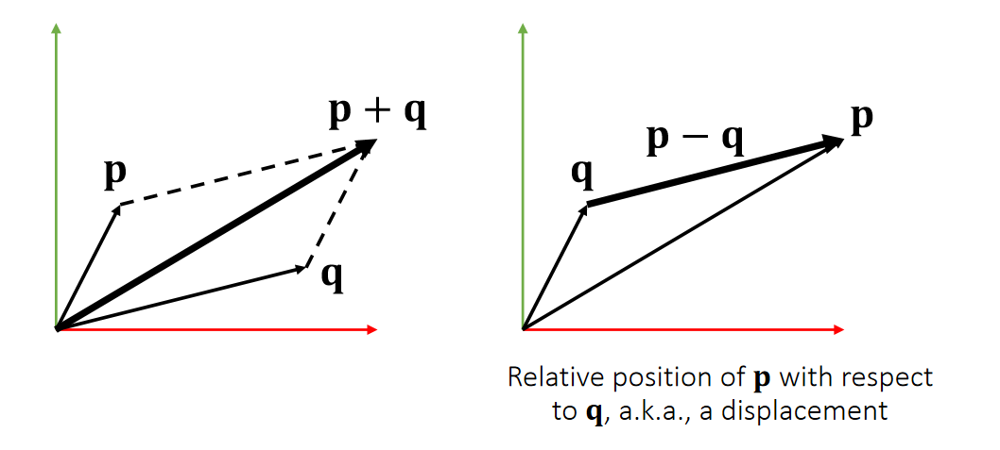
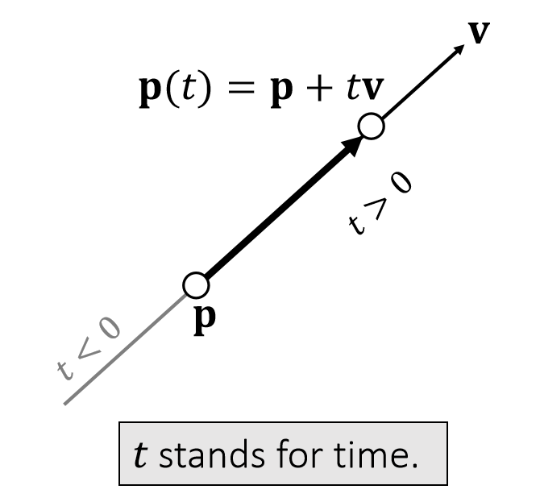
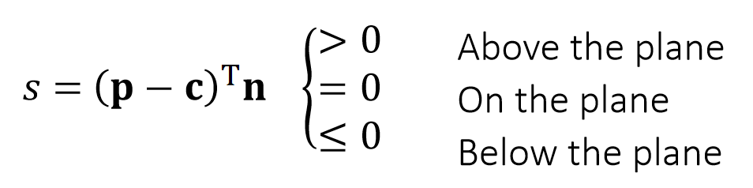
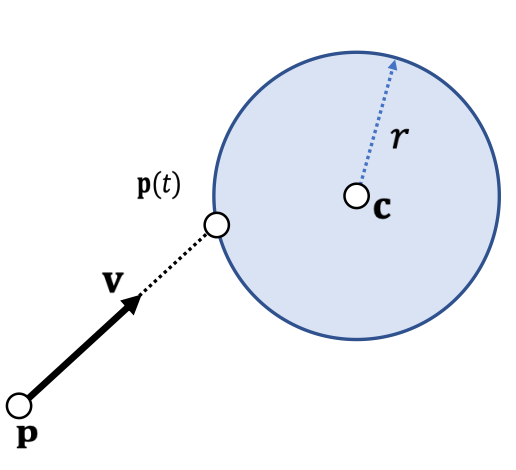
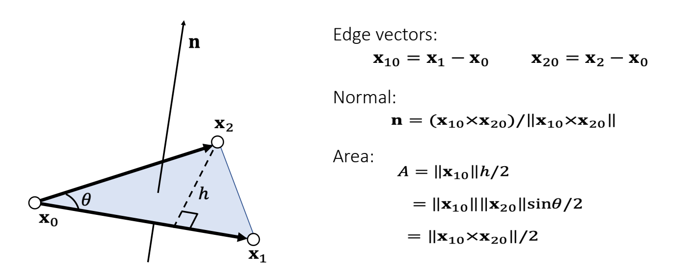

P3
# Vector: Basics    

## 定义  

An (Euclidean) vector: *A geometric entity endowed with magnitude and direction*.

$$
\mathbf{P} =\begin{bmatrix}
 p_x\\\\ 
 p_y\\\\ 
p_z\\\\
\end{bmatrix}\in \mathbf{R} ^3
$$

$$
\mathbf{o} =\begin{bmatrix}
 0\\\\ 
 0\\\\ 
0\\\\
\end{bmatrix}
$$

The vector **p** is defined with respect to the origin **o**.    

## 坐标系   

     

> &#x2705; 用黑来区分，矢量：黑体小写；标量：斜体；矩阵：黑体大写；      

P4  

The choice of a right-hand or left-hand system is largely due to:    
**the convention of the screen space**.    

    

> &#x2705; 左手坐标系，E轴正方向朝屏幕内，好处是物体坐标 x、y、z 都是正值。右手系统的物体都在E轴负方向。   

P5
## Stacked Vector   

Vectors can be stacked up to form a high-dimensional vector, commonly used for describing the state of an object.     

    

Not a geometric vector,but a **stacked vector**.    

P6   

# Vector Arithematic: Addition and Subtraction     

$$
\mathbf{p\pm q=} \begin{bmatrix}
 p_x\pm q_x\\\\
 p_y\pm q_y\\\\
p_z\pm q_z\\\\
\end{bmatrix}
$$

$$
\mathbf{p+q=q+p} 
$$

| Addition is commutative.|  
|----|

    

| Geometric Meanings|  
|----|

P7
## Example 1: Linear Representation     

A (geometric) vector can represent a position, a velocity, a force, or a line/ray/segment.    

    

    

> &#x2705; 图2。同一个公式，对\\(t\\)做不同的约束，可以定义不同的东西。    
\\(\mathbf{P}(t)\\) 是 \\(\mathbf{P}\\) 和 \\(\mathbf{q}\\) 的 blend 

P8
# Vector Norm   

A vector norm measures the magnitude of a vector: its length. 

> &#x2705; L1-Norm 又称为曼哈顿的距离。没写下标一般默认L2-Norm   

P9
## Vector Norm: Usage  

Distance between **q** and **p**：
$$
\mathbf{||q-p||} 
$$

A unit vector：

$$
\mathbf{||p||} =1
$$

Normalization：
$$
\mathbf{\bar{p} =p/||p||} 
$$

P10
# Vector Arithematic: Dot Product     

A dot product, also called inner product, is:

 

|  Geometric Meanings |  
|----|

$$
\begin{array}{c} 
  \mathbf{p\cdot q}=p_xq_x+p_yq_y+p_zq_z=\mathbf{p^Tq}   \\\\
 =||\mathbf{p} ||||\mathbf{q} ||\cos \theta 
\end{array}
$$

 - \\(\mathbf{p\cdot q=q\cdot p} \\)    
 - \\(\mathbf{p\cdot (q+r)=p\cdot q+p\cdot r} \\)    
 - \\(\mathbf{p \cdot p = ||p||^2_2} \\), a different way to write norm.     
 - If \\(\mathbf{p·q} = 0\\) and  \\(\mathbf{p,q}\ne 0\\)  then  \\(\cos \theta = 0\\),then \\(\mathbf{p}\\) and \\(\mathbf{q}\\) are orthogonal.    

P11
## Example 2: Particle-Line Projection

 
> &#x2705;\\(X\\)为物体中心点的位置，为物体上所有点的整体位移，是前面说的\\(T\\).   
速度是加速度的积分，表示为\\(V\\)或\\(\dot{X} \\)    
加速度为\\(F／M\\)，但\\(F\\)比较复杂，与时间、位置、速度都可能有关系。   
位置是速度的积分。  

P12
## Example 3: Plane Representation     

S: The <u>signed</u> distance to the plane     

Quiz: How to test if a point is within a box?    

P13
## Example 4: Particle-Sphere Collision    

If collision does happen, then:

$$
||\mathbf p(t) - \mathbf{c}||^2= r^2
$$

$$
(\mathbf p-\mathbf c+t\mathbf v)·(\mathbf p-\mathbf c +t\mathbf v) =r^2
$$

$$
(\mathbf v·\mathbf v)t^2+2(\mathbf p-\mathbf c)·\mathbf vt+ (\mathbf p-\mathbf c)·(\mathbf p-\mathbf c)-r^2=0
$$

 - Three possiblities:    
    - No root、无碰撞    
    - One root、擦边 if \\(t > 0\\)   
    - Two roots:自碰撞 if \\(t > 0 \\)   

P14
# Vector Arithematic: Cross Product

The result of a cross product is a vector:

$$
\mathbf{r=p\times q} =\begin{bmatrix}
p_yq_z-p_zq_y \\\\
 p_zq_x-p_xq_z\\\\
p_xq_y-p_yq_x\\\\
\end{bmatrix}
$$

 - \\(\mathbf r·\mathbf p = 0; \mathbf r·\mathbf q = 0; ||\mathbf r|| = ||\mathbf p||||\mathbf q||   \sin \theta\\)          
 - \\(\mathbf p\times \mathbf q =-\mathbf q\times \mathbf p\\)   
 - \\(\mathbf p\times (\mathbf q +\mathbf r) = \mathbf p\times \mathbf q +\mathbf p\times \mathbf r\\)   
 - If \\( \mathbf p \times  \mathbf q =\mathbf 0\\) and \\(\mathbf p,\mathbf q\ne 0 \\) then \\(\sin \theta= 0\\), then \\(\mathbf p\\) and \\(\mathbf q \\) are parallel (in the same or opposite direction).      

P15
## Example 5: Triangle Normal and Area   

 - Cross product gives both the normal and the area.    
 - The normal depends on the triangle index order, also known as topological order.      

P16    
Quiz: How to test if three points are on the same line (co-linear)?     

P17   
## Example 6: Triangle Inside/Outside Test    

 

P18

  

Otherwise, outside.   

> &#x2705; 假设P点在三角形所在平面上     
三个点的顺序很重要，不能搞反。

P19
## Example 7: Barycentric Coordinates

     

Note that:    

$$
\frac{1}{2} \mathbf{(x_0−p)×(x_1−p)\cdot n} =\begin{cases} 
  \frac{1}{2}||\mathbf{(x_0−p)×(x_1−p)} ||& \mathrm{inside}  \\\\  
  \frac{1}{2}||\mathbf{(x_0−p)×(x_1−p)} || & \mathrm{outside} 
  \end{cases} 
$$

Signed areas:   

$$
\mathbf{A_2=\frac{1}{2} (x_0−p)×(x_1−p)\cdot n}
$$

$$
\mathbf{A_0=\frac{1}{2} (x_1−p)×(x_2−p)\cdot n}
$$

$$
\mathbf{A_1=\frac{1}{2} (x_2−p)×(x_0−p)\cdot n}
$$

$$
\mathbf{A_0+A_1+A_2=A}
$$

Barycentric weights of **p** :    

$$
b_0=A_0/A   \quad  b_1=A_1/A   \quad  b_2=A_2/A 
$$

$$
b_0+b_1+b_2=1
$$

Barycentric Interpolation

$$
\mathbf{p} =b_0\mathbf{x} _0+b_1\mathbf{x} _1+b_2\mathbf{x} _2
$$

> &#x2705; 当 \\(\mathbf{p}\\) 在三角形外面时，面积为负，但面积总和不变
\\(b_0,b_1,b_2\\) 为 \\(\mathbf{p}\\) 在三角形重心坐标系下的坐标 

> &#x2705; \\(\mathbf{p}\\) 在三角形外部、重心坐标同样适用，不过权重有负数。  

P20
### Gouraud Shading    

 - Barycentric weights allows the interior points of a triangle to be interpolated.     
 - In a traditional graphics pipeline, pixel colors are calculated at triangle vertices first, and then interpolated within. This is known as *Gouraud shading*.    

 - It is hardware accelerated.    

 - It is no longer popular.     
 

> &#x2705; 由于硬件能力提升，已经可以做到逐像素。  
shading,不再需要此方法   
通常也不是逐像素计算重心坐标，而是扫描线算法  
例如要计算某一行，可以 ：  
(1) 插值出行起点像素；  
(2) 插值出行终点像素；   
(3) 起点与终点间批量插值； 

 
P21
## Example 9: Tetrahedral Volume    

Edge vectors:    

$$
\mathbf{X_{10}=X_1-X_0  \quad \quad X_{20}=X_2-X_0   \quad \quad X_{30}=X_3-X_0} 
$$

Base triangle area:   

$$
A=\frac{1}{2} ||\mathbf{X} _{10}\times \mathbf{X} _{20}||
$$

Height:    
$$
h=\mathbf{x} _{30}\cdot\mathbf{n} =\mathbf{x} _{30}\cdot \frac{\mathbf{x} _{10}\times \mathbf{x} _{20}}{||\mathbf{x} _{10}\times \mathbf{x} _{20}||} 
$$

Volume:    

$$
\begin{align*}
 V&=\frac{1}{3} ℎA=\frac{1}{6} \mathbf{x} _{30}\cdot \mathbf{x} _{10}\times \mathbf{x} _{20}\\\\
&=\frac{1}{6}\begin{vmatrix}
 \mathbf{x} _1 & \mathbf{x} _2 & \mathbf{x} _3 &\mathbf{x} _0 \\\\
  1& 1 & 1 &1
\end{vmatrix}
\end{align*}
$$

> &#x2705; 四面体    
\\(h\\)是\\(\mathbf{x}_{30}\\)在 normal 上的投影   
行列式是上面叉乘的另一种马法。

P22

Note that the volume \\(V =\frac{1}{3}h\mathit{A} =\frac{1}{6} \mathbf{x} _ {30}\cdot (\mathbf{x} _ {10}\times \mathbf{x}_{20})\\) is **signed**.

> &#x2705; \\(\mathbf{x}_{3}\\)的后面法线的同方向上，也正四面体，反之为负四面体，四点共面为零体积。

P23
## Example 10: Barycentric Weights (cont.)

   

 - **p** splits the tetrahedron into four sub-tetrahedra:    

$$
\begin{matrix}
V_0=\mathrm{Vol} (\mathbf{x}_3,\mathbf{x}_2, \mathbf{x}_1, \mathbf{p} )\\\\
V_1=\mathrm{Vol} (\mathbf{x}_2,\mathbf{x}_3, \mathbf{x}_0, \mathbf{p} )\\\\
V_2=\mathrm{Vol} (\mathbf{x}_1,\mathbf{x}_0, \mathbf{x}_3, \mathbf{p} )\\\\ 
V_3=\mathrm{Vol} (\mathbf{x}_0,\mathbf{x}_1, \mathbf{x}_2, \mathbf{p} )
\end{matrix} 
$$

 - **p** is inside if and only if: \\(V_0,V_1,V_2, V_3 > 0\\).    

 - Barycentric weights:    
$$
b_0=V_0/V   \quad   b_1=V_1/V   \quad b_2=V_2/V   \quad   b_3=V_3/V
$$

$$
b_0+b_1+b_2+b_3=1
$$

$$
\mathbf{p} =b_0\mathbf{x} _0+b_1\mathbf{x} _1+b_2\mathbf{x} _2+b_3\mathbf{x} _3
$$

P24
## Example 11: Particle-triangle Intersection

 - First, we find t when the particle hits the plane:   

$$
(\mathbf{p} (t)−\mathbf{x} _0)\cdot  \mathbf{x} _{10}\times \mathbf{x} _{20}=0
$$

$$
(\mathbf{p}-\mathbf{x} _0+t\mathbf{v})\cdot  \mathbf{x} _{10}\times \mathbf{x} _{20}=0
$$

$$
t=\frac{(\mathbf{p}−\mathbf{x}_0)\cdot  \mathbf{x} _{10}\times \mathbf{x} _{20}}{\mathbf{v}\cdot \mathbf{x} _{10}\times \mathbf{x} _{20}} 
$$

 
 - We then check if \\(\mathbf{p}(t)\\) is inside or not.   
    - See Example 6.    

> &#x2705; 代入体积公式，体积为0时发生碰撞

---------------------------------------
> 本文出自CaterpillarStudyGroup，转载请注明出处。
>
> https://caterpillarstudygroup.github.io/GAMES103_mdbook/