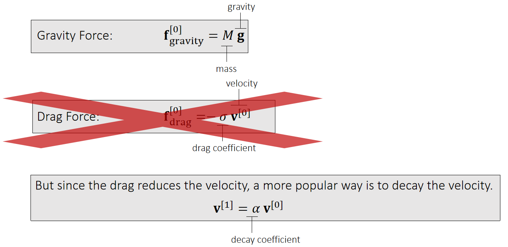
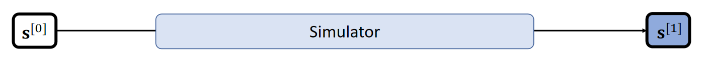
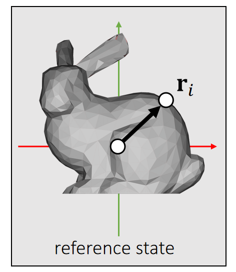
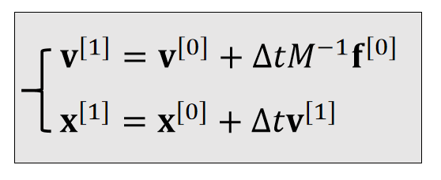
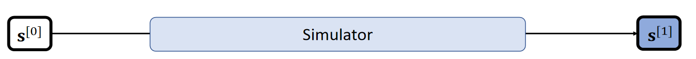
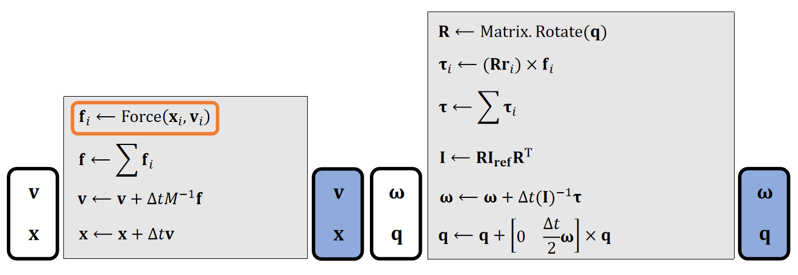
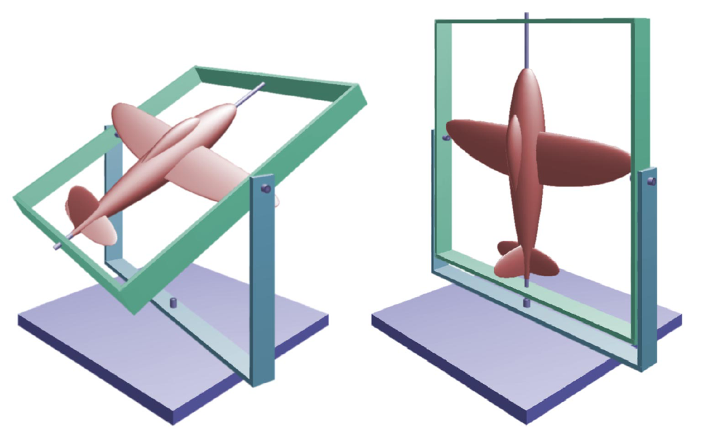

# Basic

## Rigid Bodies    

Our living environment is stuffed with rigid objects.

> &#x2705; rigid：物体很硬，因此不考虑形变。  

P6  
## Rigid Body Simulation   

The goal of simulation is to update the state variable \\(\mathbf{s} ^{[k]}\\) over time.     

     

P7   
# Rigid Body Motion  

If a rigid body cannot deform, its motion consists of two parts: translation and rotation.   

     

> &#x2705;reference：参考状态,无平移,无旋转此时物体中心点在原点上，\\(\mathbf{x}\\) 轴向左，\\(\mathbf{y}\\) 轴用上\\(\mathbf{z}\\) 轴向前。   
当前状态：旋转为\\(\mathbf{R}\\)，平移为\\(\mathbf{T}\\). 那么物体上任意点的位置为：   
\\(\mathbf{{x}}' = \mathbf{Rx} + \mathbf{T}\\)    
刚体模拟：已知当前时刻的状态和受到的力，求下一时刻的状态。     

P10
## Translational Motion   

### 积分

     

For translational motion, the state variablecontains the position \\(\mathbf{x}\\) and the velocity \\(\mathbf{v}\\).     

 

$$
\begin{cases}
 \mathbf{v} (t^{[1]})=\mathbf{v} (t^{[0]})+\mathbf{M} ^{−1}\int_{t^{[0]}}^{t^{[1]}} \mathbf{f} (\mathbf{x} (t), \mathbf{v} (t), t)dt\\\\
\mathbf{x} (t^{[1]})=\mathbf{x} (t^{[0]})+\int_{t^{[0]}}^{t^{[1]}} \mathbf{v} (t)dt
\end{cases}
$$

> &#x2705; 也可以用\\(\mathbf{\dot{x}} \\)表示速度\\(\mathbf{v} \\)    
速度是加速度的积分，因此\\( \Delta t=\int a=\int \frac{F}{M} =M^{-1}\int F\\).   
位置是速度的积分   
本质上是解积分   
> &#x1F4A1; 积分的过程比较独立，单独放在最后，避免破坏整体的结构性。最后结论是混合式的积分方法。
>     

P17  
### Types of Forces  

    

> &#x2705; 在做模拟时，如果不要求能量守衡，出于问题简化的目的，直接对速度做衰减，代替引入阻力  

P18  
### Rigid Body Simulation  Pipeline (Translation Only)    

    

    

The mass \\(M\\) and the time step \\(\Delta t\\) are user-specified variables.     

> &#x2705; 实际应用中，\\(\Delta t\\) 要跟帧率匹配   
质量 \\(M\\) 可以是个对角矩阵或实数    

P19  
## Rotational Motion

> &#x1F4A1; 旋转的表示比较独立，单独放在最后，避免破坏整体的结构性。最后结论是混合式的积分方法。

P27   
### 符号定义

#### 角度

Now we choose quaternion \\(\mathbf{q}\\) to represent theorientation, i.e., the rotation from the *reference* to the *current*.

    

#### 角速度

We use a 3D vector \\(\mathbf{\omega}\\) to denote angular velocity.    

$$ 
\begin{cases} \text{The direction of } \mathbf{\omega} \text{ is the axis.} \\\\    
\text{The magnitude of }  \mathbf{\omega} \text{ is the speed.}   
\end{cases}
$$ 

     

P3   
#### 力矩 torque

A torque is the rotational equivalent of a force. It describes the rotational <u>tendency</u> caused by a force.    

> &#x2705; Torque：力矩，造成物体旋转的趋势。类比于Force：力，造成物体运动的趋势。   

     

> &#x2705; \\(\mathbf{Rr} _i\\)：当前状态下质心到作用点的向量 

\\(\mathbf{τ} _i\\) is perpendicular to both vectors: \\(\mathbf{Rr} _i\\) and \\(\mathbf{f} _i\\).    

> &#x2705; 因此力矩的方向决定了旋转轴的方向，因此由叉差乘得到   

\\(\mathbf{τ} _i\\) is porportional to ||\\(\mathbf{Rr} _i\\)|| and ||\\(\mathbf{f} _i\\)||.    

\\(\mathbf{τ} _i\\) is porportional to \\(\sin \theta\\).     
(\\(\theta\\)  is the angle between two vectors.)

> &#x2705; 力矩的大小决定旋转的快慢。 

|\\(\mathbf{τ} _i\longleftarrow (\mathbf{Rr} _i)\times \mathbf{f} _i\\)|   
|----|

P6   

#### inertia tensor

Similar to mass, an inertia tensor describes the resistance to rotational tendency caused by torque. But different from mass, it’s not a constant.    

> &#x2705; inertia 也与自身的状态相关

     

Which side receives greater resistance?     

> &#x2705; 两图的力矩大小相同，但产生的旋转不同   
inertia 看作是对运动的抵抗，其效果与力矩的方向有关，因此不是常数  

P7   

It’s a matrix! The mass inverse is the resistance (just like mass).    

> &#x2705; 用于旋转的质量不再是实数，而是矩阵，称为 Inertia 矩阵，用 \\(\mathbf{I}\\) 来标记 Inertia 矩阵，其中 \\(\mathbf{I}_{ref}\\)为参考状态，\\(\mathbf{I}\\) 为当前状态，\\(\mathbf{I}\\) 是 \\(3\times 3\\) 矩阵。  

|reference state|current state|
|---|---|
||    |
|\\(\mathbf{I} _{\mathbf{ref} }=\sum m_i(\mathbf{r} _i^\mathbf{T} \mathbf{r} _i\mathbf{1} −\mathbf{r} _i\mathbf{r} _i^\mathbf{T} )\\) \\(\mathbf{1}\\)  is the 3-by-3 identity.|\\(\mathbf{I} =\sum m_i(\mathbf{r} _i^\mathbf{T}\mathbf{R}  ^\mathbf{T}\mathbf{Rr}  _i\mathbf{1} −\mathbf{Rr} _i\mathbf{r} _i^\mathbf{T} \mathbf{R^T} )\\)    \\(\quad=\sum m_i(\mathbf{Rr} _i^\mathbf{T}\mathbf{r}  _i\mathbf{1R}  ^\mathbf{T} −\mathbf{Rr} _i\mathbf{r} _i^\mathbf{T} \mathbf{R^T} )\\)   \\(\quad=\sum m_i\mathbf{R}(\mathbf{r}_i^\mathbf{T}\mathbf{r}_i\mathbf{1}−\mathbf{r}_i\mathbf{r}_i^\mathbf{T} ) \mathbf{R^T}\\)     \\(\quad=\mathbf{RI _{ref}R^T}\\)|

> &#x2705; 不需要每次都根据当前状态计算，而是基于一个已经算好的ref状态的 inertia快速得出。  

P29     

### 更新法则

  

|    |Translational (linear)|Rotational (Angular)|
|---|---|---|
|Updafe|   |   |
|states| Velocity \\(\mathbf{v}\\)   Position \\(\mathbf{x}\\)|Angular velocity \\(\mathbf{ω} \\)    Quaternion \\(\mathbf{q}\\) |
| Physical Quantities |Mass \\(\mathbf{M}\\)   Force \\(\mathbf{f}\\) | Inertia \\(\mathbf{I} \\)   Torque \\(\mathbf{τ} \\) |

> &#x2705;  平移： \\(加速度 = \frac{力}{质量}\\) ，旋转： \\(加速度 =\frac{力矩}{\text{Inertia}}\\)   
> &#x2705;  \\(q\\)是四元数，代表物体的旋转状态   
> &#x2705;  \\(q_1\times q_2\\)不是叉乘，而是四元数普通乘法    
> &#x2705;  \\(\begin{bmatrix}
  0 & \frac{\bigtriangleup t}{2}  & w^{(1)}
\end{bmatrix}\\)是一个四元数，0为实部，后面为虚部   
> &#x2757;  算完\\(q^{[1]}\\)的之后要对它 Normalize     
> &#x1F50E; 由\\(q^{[0]}\\)到\\(q^{[1]}\\)的更新公式的推导过程见Affer Class Reading（Appendix B）   
> &#x2753; 四元数相加有什么含义？  

P30 
### Rigid Body Simulation Piplene     

 

In practice, we update the same state variable \\(\mathbf{s} =\\){\\(\mathbf{v,x,\omega ,q}\\)} over time.     

  
     

> &#x2757; Gravity doesn't cause any torque! lf your simulator does not contain any other force, there is no need to update \\(\mathbf{\omega}\\).    

P33
## After-Class Reading (Before Collision)

P35  

<https://graphics.pixar.com/pbm2001>     

> &#x2753; 建议读其中的Rigid Body Dynamics部分    

P11   
# 补充1：Integration Methods Explained    

## Explicit Euler  

By definition, the integral \\(\mathbf{x} (t) = \int \mathbf{v}  (t) dt\\) is the area. Many methods estimate the area as a box.   

 

> &#x2705; 假设\\(\mathbf{x} \\)和\\(\mathbf{v} \\)都是一维的。速度的积分就是阴影区域的面积。 

 

> &#x2705; 近似到一阶项，因此称为一阶方法。漏掉的高阶项就是误差。  

P12   
## Implicit Euler      

 

 

> &#x2705; 使用 \\(t_0\\) 时刻的速度：显式积分  
使用 \\(t_1\\) 时刻的速度：隐式积分  
两种方法都只能一阶近似   

P13  
## Mid-Point     

 

 

P14
## 比较与混合  

By definition, the integral \\(\mathbf{x} (t)=∫\mathbf{v} (t) dt\\) is the area.  Many methods estimate the area as a box.    

|Explicit Euler (1st-order accurate) sets the height at \\(t^{[0]}\\).   \\(\int_{t^{[0]}}^{t^{[1]}} \mathbf{v} (t)dt≈∆t  \mathbf{v} (t^{[0]})\\)|   
|---|      
  

\\(\quad\\)

|  Implicit Euler (1st-order accurate) sets the height at \\(t^{[0]}\\).   \\(\int_{t^{[0]}}^{t^{[1]}} \mathbf{v} (t)dt≈∆t  \mathbf{v} (t^{[1]})\\) |  
|----|  
      
\\(\quad\\)

|  Mid-point (2nd-order accurate) sets the height at \\(t^{[0]}\\).   \\(\int_{t^{[0]}}^{t^{[1]}} \mathbf{v} (t)dt≈∆t  \mathbf{v} (t^{[0.5]})\\) |     
|----|

    

P15   
    

$$
\begin{cases}
 \mathbf{v} (t^{[1]})=\mathbf{v} (t^{[0]})+\mathbf{M} ^{−1}\int_{t^{[0]}}^{t^{[1]}} \mathbf{f} (\mathbf{x} (t), \mathbf{v} (t), t)dt\\\\
\mathbf{x} (t^{[1]})=\mathbf{x} (t^{[0]})+\int_{t^{[0]}}^{t^{[1]}} \mathbf{v} (t)dt
\end{cases}
$$

> &#x2705; 在当前应用场景中，使用前面方法的混合   

P16 
## Leapfrog Integration    

    

> &#x2705; 速度和位置是错开的。上下两种写法，在计算上是一样的。  

In some literature, such a approach is called *semi-implicit*.  

It has a funnier name: the *leapfrog method*.

    

P20   
# 补充2：Rotation Representation   

## Rotation Represented by Matrix     

- The matrix representation is widely used for rotational motion.    
- It’s friendly for applying rotation to each vertex (by <u>matrix-vector multiplication</u>).    

- But it is not suitable for dynamics:   
  - It has too much redundancy: 9 elements but only 3 DoFs.    
  - It is non-intuitive.     
  - Defining its time derivative (*rotational velocity*) is also difficult.   
    

P21  
## Rotation Represented by Euler Angles    

 - The Euler Angles representation is also popular, often in design and control.    
 - It is intuitive. It uses three axial rotations to represent one general rotation. Each axial rotation uses an angle.     
 - In Unity, the order is rotation-by-Z, rotation-by-X, then rotation-by-Y.     

 - But it is not suitable for dynamics either:    
    - It can lose DoFs in certain statuses: gimbal lock.    
    - Defining its time derivative (rotational velocity) is difficult.    
    

P22  
### Gimbal Lock   

The alignment of two or more axes results in a loss of rotational DoFs.     

    

> &#x2705; 在某些特定的情况下，自由度降低了

P23  
## Rotation Represented by Quaternion    

### Introduction

    

In the complex system, two numbers represent a 2D point.   

>  What about a “complex” system for 3D point? **Quaternion**! Four numbers represent a 3D point (with multiplication and division).    

P24   
### Quaternion Arithematic    

Let \\(\mathbf{q}  = \begin{bmatrix}
\mathbf{s}   &\mathbf{v} 
\end{bmatrix} \\) be a quaternion made of two parts: a scalar part \\(s\\) and a 3D vector part \\(\mathbf{v}\\), accounting for \\(\mathbf{ijk}\\).

> &#x2705; 在有些库里面写作： \\(q = \begin{bmatrix}
 w & x & y &z
\end{bmatrix}\\)，w为实数部分  

\\(a\mathbf{q} =\begin{bmatrix}
 as  &a\mathbf{v} 
\end{bmatrix}\quad\\) Scalar-quaternion Multiplication    

\\(\mathbf{q} _1±\mathbf{q} _2 =\begin{bmatrix}
 \mathbf{s}_1±\mathbf{s}_2  & \mathbf{v} _1 ± \mathbf{v} _2
\end{bmatrix}\quad\quad\\) Addition/Subtraction    

\\(\mathbf{q} _1×\mathbf{q} _2= \begin{bmatrix}
 \mathbf{s} _1\mathbf{s} _2−\mathbf{v} _1\cdot \mathbf{v} _2 & \mathbf{s} _1\mathbf{v} _2+\mathbf{s} _2\mathbf{v} _1+\mathbf{v} _1×\mathbf{v} _2
\end{bmatrix}\quad\quad\\) Multiplication   

\\(||\mathbf{q} ||=\sqrt{\mathbf{s^2+v\cdot v} } \quad\quad\\)Magnitude    

\\(\quad\\)    

P25   
### Rotation Represented by Quaternion    

 - To represent a rotation around \\(\mathbf{v}\\) by angle \\(0\\), we set the quaternion as:    

       

 - lt's very intuitive. lt's the built-in representation in Unity.     
 - Convertible to the matrix:   

$$
\mathbf{R}=\begin{bmatrix}
s^2+x^2-y^2-z^2  & 2(xy-sz) & 2(xz+sy)\\\\
 2(xy+sz) & s^2-x^2+y^2-z^2 & 2(yz-sx) \\\\
 2(xz-sy) & 2(yz+sx) & s^2-x^2-y^2+z^2  
\end{bmatrix}
$$

---------------------------------------
> 本文出自CaterpillarStudyGroup，转载请注明出处。
>
> https://caterpillarstudygroup.github.io/GAMES103_mdbook/
