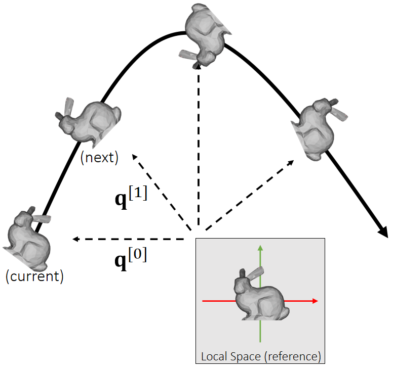
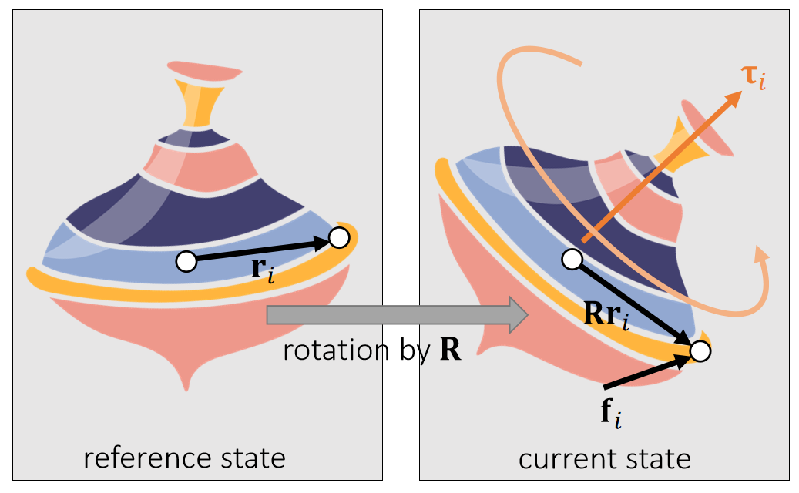
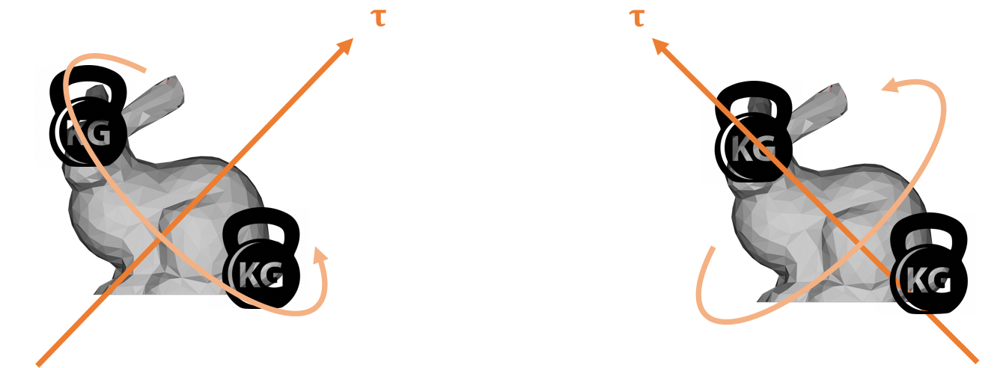
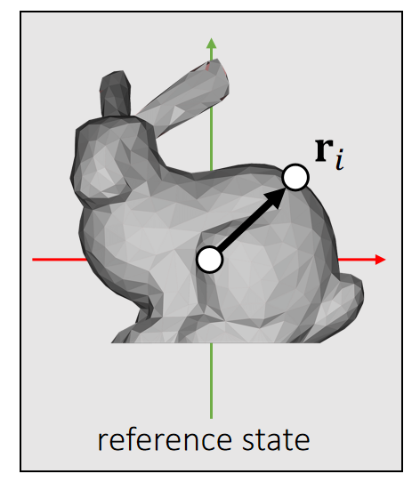
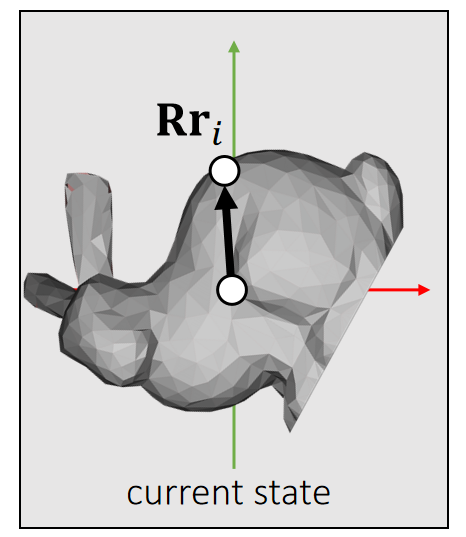
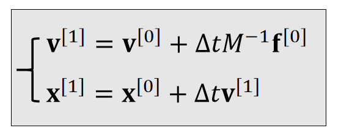
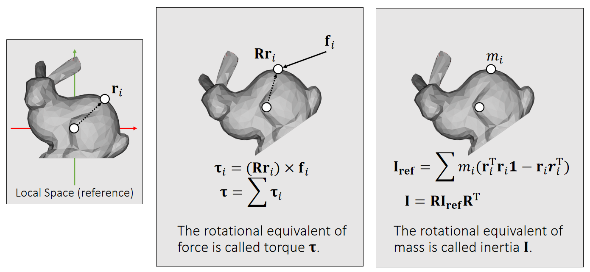
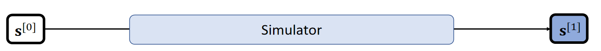
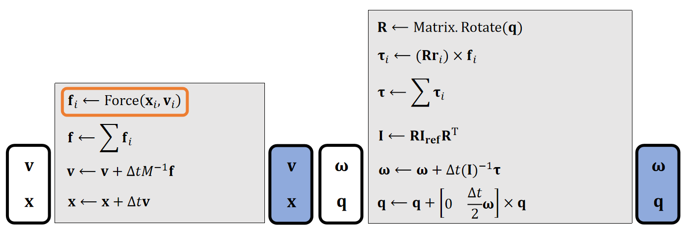

> &#x1F4A1; 旋转的表示比较独立，单独放在最后，避免破坏整体的结构性。最后结论是混合式的积分方法。

P27   
# 符号定义

## 角度

Now we choose quaternion \\(\mathbf{q}\\) to represent theorientation, i.e., the rotation from the *reference* to the *current*.

    

## 角速度

We use a 3D vector \\(\mathbf{\omega}\\) to denote angular velocity.    

$$ 
\begin{cases} \text{The direction of } \mathbf{\omega} \text{ is the axis.} \\\\    
\text{The magnitude of }  \mathbf{\omega} \text{ is the speed.}   
\end{cases}
$$ 

     

P3   
## 力矩 torque

A torque is the rotational equivalent of a force. It describes the rotational <u>tendency</u> caused by a force.    

> &#x2705; Torque：力矩，造成物体旋转的趋势。类比于Force：力，造成物体运动的趋势。   

     

> &#x2705; \\(\mathbf{Rr} _i\\)：当前状态下质心到作用点的向量 

\\(\mathbf{τ} _i\\) is perpendicular to both vectors: \\(\mathbf{Rr} _i\\) and \\(\mathbf{f} _i\\).    

> &#x2705; 因此力矩的方向决定了旋转轴的方向，因此由叉差乘得到   

\\(\mathbf{τ} _i\\) is porportional to ||\\(\mathbf{Rr} _i\\)|| and ||\\(\mathbf{f} _i\\)||.    

\\(\mathbf{τ} _i\\) is porportional to \\(\sin \theta\\).     
(\\(\theta\\)  is the angle between two vectors.)

> &#x2705; 力矩的大小决定旋转的快慢。 

|\\(\mathbf{τ} _i\longleftarrow (\mathbf{Rr} _i)\times \mathbf{f} _i\\)|   
|----|

P6   

## inertia tensor

Similar to mass, an inertia tensor describes the resistance to rotational tendency caused by torque. But different from mass, it’s not a constant.    

> &#x2705; inertia 也与自身的状态相关

     

Which side receives greater resistance?     

> &#x2705; 两图的力矩大小相同，但产生的旋转不同   
inertia 看作是对运动的抵抗，其效果与力矩的方向有关，因此不是常数  

P7   

It’s a matrix! The mass inverse is the resistance (just like mass).    

> &#x2705; 用于旋转的质量不再是实数，而是矩阵，称为 Inertia 矩阵，用 \\(\mathbf{I}\\) 来标记 Inertia 矩阵，其中 \\(\mathbf{I}_{ref}\\)为参考状态，\\(\mathbf{I}\\) 为当前状态，\\(\mathbf{I}\\) 是 \\(3\times 3\\) 矩阵。  

|reference state|current state|
|---|---|
||    |
|\\(\mathbf{I} _{\mathbf{ref} }=\sum m_i(\mathbf{r} _i^\mathbf{T} \mathbf{r} _i\mathbf{1} −\mathbf{r} _i\mathbf{r} _i^\mathbf{T} )\\) \\(\mathbf{1}\\)  is the 3-by-3 identity.|\\(\mathbf{I} =\sum m_i(\mathbf{r} _i^\mathbf{T}\mathbf{R}  ^\mathbf{T}\mathbf{Rr}  _i\mathbf{1} −\mathbf{Rr} _i\mathbf{r} _i^\mathbf{T} \mathbf{R^T} )\\)    \\(\quad=\sum m_i(\mathbf{Rr} _i^\mathbf{T}\mathbf{r}  _i\mathbf{1R}  ^\mathbf{T} −\mathbf{Rr} _i\mathbf{r} _i^\mathbf{T} \mathbf{R^T} )\\)   \\(\quad=\sum m_i\mathbf{R}(\mathbf{r}_i^\mathbf{T}\mathbf{r}_i\mathbf{1}−\mathbf{r}_i\mathbf{r}_i^\mathbf{T} ) \mathbf{R^T}\\)     \\(\quad=\mathbf{RI _{ref}R^T}\\)|

> &#x2705; 不需要每次都根据当前状态计算，而是基于一个已经算好的ref状态的 inertia快速得出。  

P29     

# 更新法则

  

|    |Translational (linear)|Rotational (Angular)|
|---|---|---|
|Updafe|   |   |
|states| Velocity \\(\mathbf{v}\\)   Position \\(\mathbf{x}\\)|Angular velocity \\(\mathbf{ω} \\)    Quaternion \\(\mathbf{q}\\) |
| Physical Quantities |Mass \\(\mathbf{M}\\)   Force \\(\mathbf{f}\\) | Inertia \\(\mathbf{I} \\)   Torque \\(\mathbf{τ} \\) |

> &#x2705;  平移： \\(加速度 = \frac{力}{质量}\\) ，旋转： \\(加速度 =\frac{力矩}{\text{Inertia}}\\)   
> &#x2705;  \\(q\\)是四元数，代表物体的旋转状态   
> &#x2705;  \\(q_1\times q_2\\)不是叉乘，而是四元数普通乘法    
> &#x2705;  \\(\begin{bmatrix}
  0 & \frac{\bigtriangleup t}{2}  & w^{(1)}
\end{bmatrix}\\)是一个四元数，0为实部，后面为虚部   
> &#x2757;  算完\\(q^{[1]}\\)的之后要对它 Normalize     
> &#x1F50E; 由\\(q^{[0]}\\)到\\(q^{[1]}\\)的更新公式的推导过程见Affer Class Reading（Appendix B）   
> &#x2753; 四元数相加有什么含义？  

P30 
# Rigid Body Simulation Piplene     

 

In practice, we update the same state variable \\(\mathbf{s} =\\){\\(\mathbf{v,x,\omega ,q}\\)} over time.     

  
     

> &#x2757; Gravity doesn't cause any torque! lf your simulator does not contain any other force, there is no need to update \\(\mathbf{\omega}\\).    

P33
# After-Class Reading (Before Collision)

P35  

<https://graphics.pixar.com/pbm2001>     

> &#x2753; 建议读其中的Rigid Body Dynamics部分    

---------------------------------------
> 本文出自CaterpillarStudyGroup，转载请注明出处。
>
> https://caterpillarstudygroup.github.io/GAMES103_mdbook/
