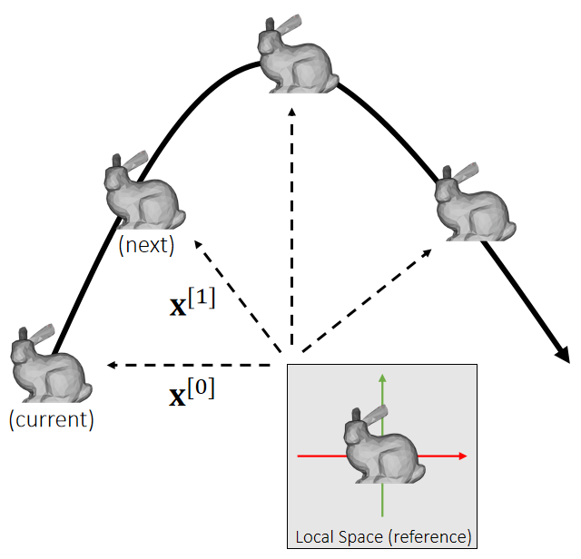
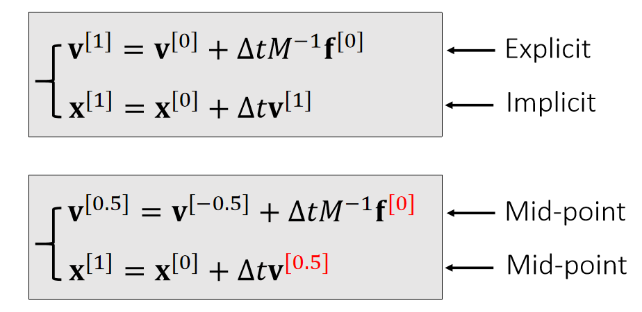
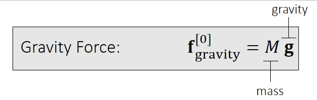
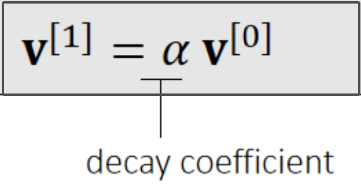
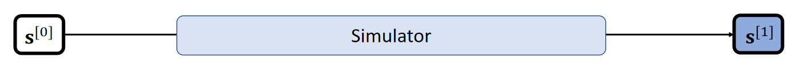
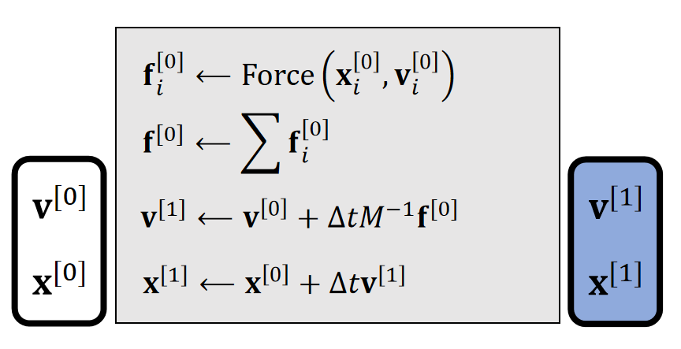

# 基于物理的数学模型

     

For translational motion, the state variable contains the position \\(\mathbf{x}\\) and the velocity \\(\mathbf{v}\\).     

 

$$
\begin{cases}
 \mathbf{v} (t^{[1]})=\mathbf{v} (t^{[0]})+\mathbf{M} ^{−1}\int_{t^{[0]}}^{t^{[1]}} \mathbf{f} (\mathbf{x} (t), \mathbf{v} (t), t)dt\\\\
\mathbf{x} (t^{[1]})=\mathbf{x} (t^{[0]})+\int_{t^{[0]}}^{t^{[1]}} \mathbf{v} (t)dt
\end{cases}
$$

> &#x2705; 也可以用\\(\mathbf{\dot{x}} \\)表示速度\\(\mathbf{v} \\)    
速度是加速度的积分，因此\\( \Delta 0=\int a=\int \frac{F}{M} =M^{-1}\int F\\).   
位置是速度的积分   
本质上是解积分   
> &#x1F4A1; 积分的过程比较独立，单独放在最后[link](./3_rigid_supplementary.md)，避免破坏整体的结构性。最后结论是混合式的积分方法。
>     

P17  
# Types of Forces  

- 重力：    

    

> &#x2705; 在做模拟时，如果不要求能量守衡，出于问题简化的目的，直接对速度做衰减，代替引入阻力  

  

P18  
# Rigid Body Simulation  Pipeline (Translation Only)    

    

    

The mass \\(M\\) and the time step \\(\Delta t\\) are user-specified variables.     

> &#x2705; 实际应用中，\\(\Delta t\\) 要跟帧率匹配   
质量 \\(M\\) 可以是个对角矩阵或实数    

---------------------------------------
> 本文出自CaterpillarStudyGroup，转载请注明出处。
>
> https://caterpillarstudygroup.github.io/GAMES103_mdbook/
