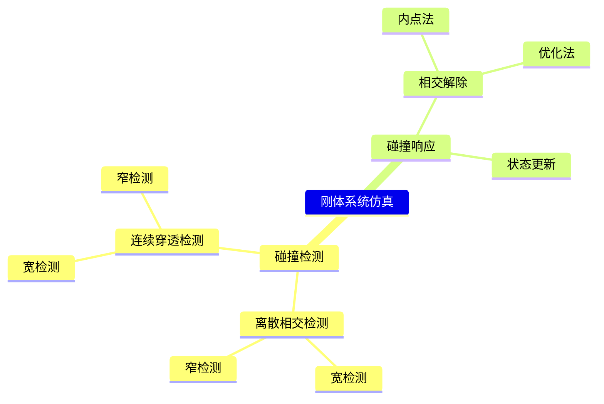

P9   

# Topics for the Day   

- Collision Detection    
   - Broad Phase
   - Narrow Phase
- Interior Point Methods    
- Impact Zone Optimization    

---------------------------------------
> 本文出自CaterpillarStudyGroup，转载请注明出处。
>
> https://caterpillarstudygroup.github.io/GAMES103_mdbook/