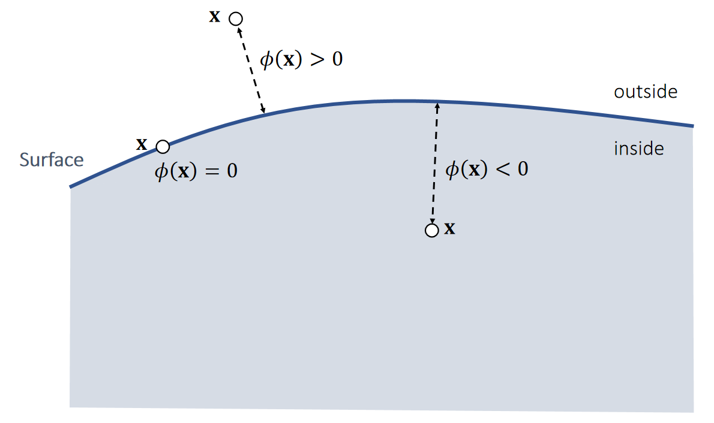
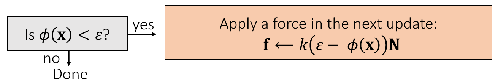
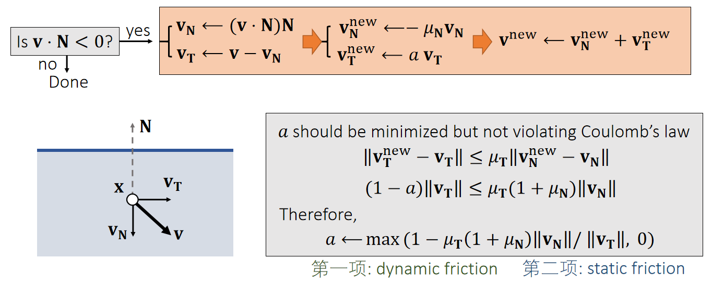
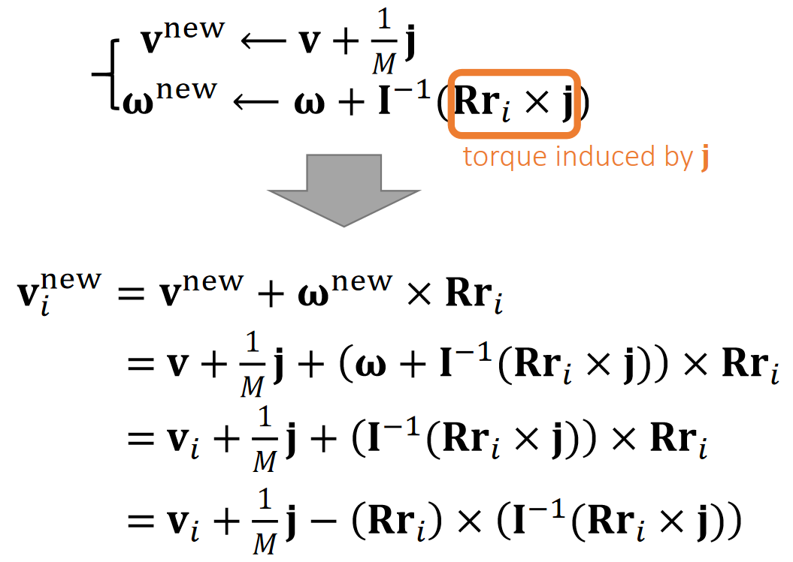
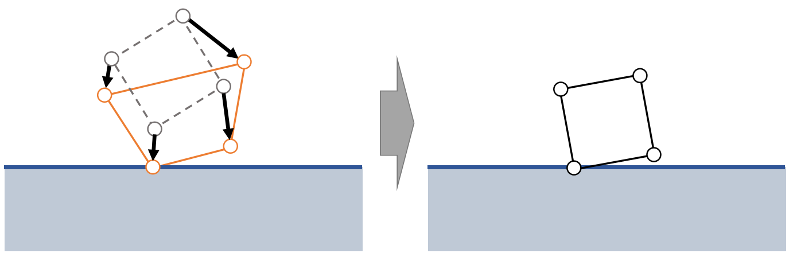
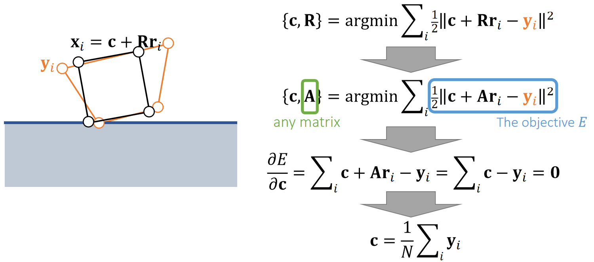
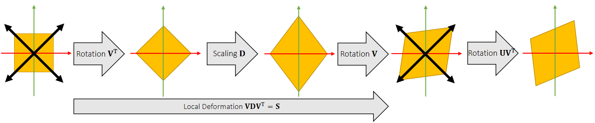

P9   

# Topics for the Day   

 - Particle Collision Detection and Response   
    - Penalty methods   
    - Impulse methods   

 - Rigid Collision Detection and Response by Impulse   
 - Shape Matching   

   

P10  
# Particle Collision Detection and Response    

P11  
## Particle Collision Detection --- SDF   

### Signed Distance Function   

A <u>signed</u> distance function \\(\phi (\mathbf{x} )\\) defines the distance from \\(\mathbf{x}\\) to a surface with a sign. The sign indicates on which side \\(\mathbf{x}\\) is located.     

     

P12   
#### Signed Distance Function Examples    

     

> &#x2705; 圆柱SDF基于勾股定理，\\(\sqrt{\cdot }\\) 内第一项为斜边长，
第二项为底边长，得出点到中轴的距离。  

P13   
### Intersection of Signed Distance Functions    

     

> If \\(\phi _0(\mathbf{x} )<0\\) and \\(\phi_1(\mathbf{x} )<0\\) and \\(\phi_2(\mathbf{x} )<0\\)      
then inside    
\\(\quad \phi (\mathbf{x} )\\)=max \\(⁡(\phi_0(\mathbf{x}),\phi_1(\mathbf{x}),\phi_2(\mathbf{x}))\\)     
Else outside    
\\(\quad \phi (\mathbf{x})=?\\)   

P14  
### Union of Signed Distance Functions   

     

> &#x2705; 有时候此公式不成立，例如图中\\(\mathbf{x}\\) 点  

Intuitively, we can consider collision detection with the union of two objects as **collision detection with two separate objects**.    

P15   
## Particle Collision Response ——Penalty Method  

### Quadratic Penalty Method    

A penalty method applies a penalty force in the next update. When the penalty potential is quadratic, the force is linear.     

     

     

> &#x2705; 力的大小与距离有关，方向为normal  
> &#x2705; 存在的问题：只有\\(\mathbf{x}\\) 进入 mesh 内部了，才会有力，但此时穿透的 artifacts 已经产生了。解决方法：使用buffor  

P16   
### Quadratic Penalty Method with a Buffer   

A buffer helps lessen the penetration issue. But it cannot strictly prevent penetration, no matter how large \\(k\\) is.      

     
     

> &#x2705; 存在的问题：  
> 如果 \\(k\\) 太小，快速的碰撞仍会产生 artifacts   
如果 \\(k\\) 太大，碰撞的反弹过于强烈(overshooting)  
解决方法：不用常数 \\(k\\) ，而是 \\(k\\) 与距离相关  

P17   
### Log-Barrier Penalty Method     

A log-barrier penalty potential ensures that the force can be large enough. But it assumes \\(\phi (\mathbf{x} ) < 0\\) will never happen!!! To achieve that, it needs to adjust \\(\Delta t\\).     

     

> &#x2705; 用倒数关系代替线性关系。  
> &#x2705; 存在的问题：  
> 1.当\\(\mathbf{x}\\) 靠近物体表面时，仍然会 overshooting   
 2.\\(\mathbf{x}\\) 穿透表面后，会越陷越深。  
 3.本算法要求保证穿透永远不会发生，因此要仔细调节 \\(\Delta t\\).  

P18  
### A Short Summary of Penalty Methods    

 - The use of step size adjustment is a must.     
    - To avoid overshooting.    
    - To avoid penetration in log-barrier methods.    

 - Log-barrier method can be limited within a buffer as well.    
    - Li et al. 2020. *Incremental Potential Contact: Intersection- and Inversion-free Large Deformation Dynamics*. TOG.    
    - Wu et al. 2020. *A Safe and Fast Repulsion Method for GPU-based Cloth Self Collisions*. TOG.   

 - Frictional contacts are difficult to handle.    
 
> &#x2705; 缺点：（1）难以模拟摩擦。（2）碰撞->施加力->调整，因此效果是滞后的。 优点：易实现  
> &#x2705; 隐式积分比显式积分好，因为显式不稳定。  

 
P19   
## Particle Collision Response —— Impulse Method    

An impulse method assumes that collision changes the position and the velocity all of sudden.      

> &#x2705; Penalty 方法是碰撞 → 力 → 下一时刻的速度和位置，效果滞后。   
Impulse方法碰撞时立即更新速度和位置   

    

    

> &#x2705; lmpulse 省去了力这一步，直接更新刚体状态。方法要求已经有一个比较好的\\(\phi (x)\\)   
> &#x2705; 更新方法：N方向。更新距离：穿入的距离。

P20    
Changing the position is not enough, we must change the velocity as well.      

    

> &#x2705; \\(\mathbf{v}\cdot \mathbf{N}\ge 0\\)：当前速度想要让物体越陷越深, 这种情况下才需要更新速度   
把\\(\mathbf{v}\\)分解为\\(\mathbf{v_T}\\)（切线方向的速度）和\\(\mathbf{v_N})\\)（法线方向的速度）.  
> &#x2705; \\(\mathbf{v_T}\\)方向速度反弹， \\(\mu _\mathbf{N}\\) 为反弹系数。\\(\mathbf{v_N}\\)方向不变或由于摩擦再衰减  
> &#x2705; a的约束：（1）越小越好，尽量把速度衰减掉（2）满足库仑定律（切方向的速度改变不应大于法线方向的速度改变）（3）切方向速度不能反转，即a不能为负   
> &#x2705; 优点：可以精确控制摩擦力和反弹位置。缺点：计算比 Penalty 复杂   
> &#x2705; 刚体常见于 Impulse； 弹性体常见于Pealty.   

P21   
# Rigid Body Collision Detection and Response   

P23   
## Rigid Body Collision Detection   

When the body is made of many vertices, we can detect its collision by testing each vertex

> &#x2705; 遍历 mesh 上的每个点，依次做碰撞检测。  

No a perfect solution, but acceptable (will come back to this weeks later…)     

P24   
## Rigid Body Collision Response

### 刚体碰撞响应与粒子碰撞响应的区别

    

以Vertex i为例，先分析i当前的位置和速度:    

    

Problem: **we cannot directly modif**y \\(\mathbf{x}_i\\) or \\(\mathbf{v}_i\\) **isince they not state variables**. They areindirectly determined.     

> &#x2705;\\(x\\)和\\(v\\)分别是刚体质心点的位置和速度,第二项为刚体上的特定点相对于质心点的位置和速度   
对于粒子，可以直接用Impulse修改\\(x\\)和\\(v\\)   
对于刚体，impulse只能修改\\(x\\)和\\(v\\)，不能修改\\(x_i\\)和\\(v_i\\)；其中\\(x\\)可以通过直接修改更新，也可以通过修改\\(v\\)来更新，这里选择后者。  

Solution: we will find a way to modify \\(\mathbf{v}\\) and \\(\mathbf{\omega}\\).     

> &#x2705; 解决方法：通过修改\\(\mathbf{v}\\)和\\(\mathbf{\omega}\\)实现修改\\(x_i\\)和\\(v_i\\)    

P25   
### 反向思考

What happens to \\(\mathbf{v}_i\\) when an impulse \\(\mathbf{j}\\) is appliedat vertex \\(i\\)?      

> &#x2705; \\(\mathbf{j}\\) 是一个未知的冲量。\\(\mathbf{v}_i\\) 是点速度、\\(\mathbf{v}\\)是线速度     
> &#x2705;假设：此时对\\(x_i\\)点施加冲量\\(j\\)，会发生什么？   

    

> &#x2705; 冲量 = \\(Ft\\) = \\(m\Delta v \Rightarrow \Delta v\\) = 冲量/\\(m\\)，由此得到\\(v^{new}\\)  
> &#x2705; 冲量=时间 \\(\cdot\\)力  = 质量矩阵 * 时间 = 力矩 * t，省略公式中的时间，可得：
\\(Rr_i \times j\\) = 冲量造成的力矩 ＝ 质量矩阵 · \\(\Delta \omega \Rightarrow \Delta \omega\\) ＝ 质量矩阵\\(^{-1}\\) · 力矩 ，由此得到\\(\omega^{new}\\)   
> &#x2753; 为什么质量矩阵是单位阵？   
> &#x2705; 由线速度\\(v^{new}\\)得到点速度\\(\mathbf{v}_i^{new}\\)  

P27    

$$
\mathbf{v_i^{new}} = \mathbf{v} _i+\frac{1}{M}\mathbf{j} −(\mathbf{Rr} _i)×(\mathbf{I} ^{−1}(\mathbf{Rr} _\mathbf{i}\times \mathbf{j} ))
$$

$$
\mathbf{v_i^{new}} = \mathbf{v} _i+\frac{1}{M} \mathbf{j} −(\mathbf{Rr} _i)^∗\mathbf{I} ^{−1} (\mathbf{Rr} _i)^∗\mathbf{j} 
$$

> &#x2705; 向量之间的点乘可以转化为矩阵与向量的乘法，方便化简。具体内容见页面最后的**补充1**

化简得：  

>$$
>\mathbf{v_i^{new}}-\mathbf{v}_i=\mathbf{Kj}
>$$
>$$
>\mathbf{K} \longleftarrow \frac{1}{M} \mathbf{1} −(\mathbf{Rr} _i)^{∗}\mathbf{I} ^{−1}(\mathbf{Rr} _i)^{∗}
>$$
> 

> &#x2705; 结论，当碰撞点\\(i\\)确定时，冲量\\(j\\)和其造成的速度改变量\\(Δv\\)是确定的，这样，可以通过施加\\(j\\)，精确修改\\(v_i\\)   
> &#x2705; 已知 \\(\mathbf{v}_i^{new},\mathbf{v}_i,\mathbf{K}\\),可求得 \\(\mathbf{j}\\)     

P28  
### Rigid Body Collision Response by Impulse    

    

> &#x2705; i点发生碰撞 -> 算出i点碰撞后的速度 -> 算出给i点什么样的冲量能让i出现碰撞后的效果 -> 真的施加这样一个冲量 -> 更新刚体状态  

P29  
### Some Implementation Details    

 - If there are many vertices in collision, we use their position average.     

> &#x2705; 如果有多个顶点发生碰撞呢？
> 答：方法1，问题简化，用平均值。方法2，解线性系统，见下一页  

 - We can decrease the restitution \\(\mathbf{\mu_N} \\) to reduce oscillation（抖动）.     

> &#x2705; 抖动原因：重力让它往下，冲量让它往上，导致在地面上反复振荡      
解决方法：接近静止时衰减 \\(\mathbf{\mu_N} \\)   

 - We don't update the position here. Why?      
    - Because the problem is nonlinear.     
    - We will come back to this later when we talk about constraints.      

P30   
### 多碰撞点场景    

    

Relative velocity at joints     

$$
\begin{cases}
 \mathbf{v} _0 ^{\mathbf{new} }− \mathbf{v} _0=\mathbf{K} _{a00 }\mathbf{j} _0+\mathbf{K} _{a01 }\mathbf{j} _1 −(−\mathbf{K} _{b00 }\mathbf{j} _0 +\mathbf{K} _{b02}\mathbf{j} _2 )\\\\
 \mathbf{v} _1 ^{\mathbf{new} }− \mathbf{v} _1=\mathbf{K} _{a10 }\mathbf{j} _0+\mathbf{K} _{a11 }\mathbf{j} _1 −(−\mathbf{K} _{c11 }\mathbf{j} _0 +\mathbf{K} _{c13 }\mathbf{j} _3 )\\\\
 \mathbf{v} _2 ^{\mathbf{new} }− \mathbf{v} _2=\mathbf{K} _{b20 }\mathbf{j} _0+\mathbf{K} _{b22 }\mathbf{j} _2\\\\
\mathbf{v} _3 ^{\mathbf{new} }− \mathbf{v} _3=\mathbf{K} _{c31 }\mathbf{j} _1+\mathbf{K} _{c33 }\mathbf{j} _3
\end{cases}
$$

$$
\Downarrow
$$

$$
\begin{bmatrix}
 \mathbf{K} _{a00 }+\mathbf{K} _{b00 } & \mathbf{K} _{a01 } & -\mathbf{K} _{b02 } & \Box \\\\
 \mathbf{K} _{a10 } & \mathbf{K} _{a11 }+\mathbf{K} _{c11 } & \Box  & -\mathbf{K} _{c13 }\\\\
 -\mathbf{K} _{b20 } & \Box  & \mathbf{K} _{b22} & \Box \\\\
 \Box  & -\mathbf{K} _{c31 } & \Box  & \mathbf{K} _{c33 } 
\end{bmatrix}\begin{bmatrix}
 \mathbf{j} _{0 }\\\\
 \mathbf{j} _{1}\\\\
 \mathbf{j} _{2}\\\\
\mathbf{j} _{3}
\end{bmatrix}=\begin{bmatrix}
 \bigtriangleup \mathbf{v} _{0}\\\\
 \bigtriangleup \mathbf{v} _{1}\\\\
 \bigtriangleup \mathbf{v} _{2}\\\\
\bigtriangleup \mathbf{v} _{3}
\end{bmatrix}
$$

\\(\mathbf{K} _{a01}\mathbf{j} _1\\) stands for the velocity change of bunny \\(a\\) at joint 0, caused by impulse \\(\mathbf{j}_1\\).

P31  
## After-Class Reading (Before Collision)    

<https://graphics.pixar.com/pbm2001>     
Rigid Body Dynamics

P32    
# Shape Matching    

> &#x2705; 用粒子的方法来解决刚体的问题

P33  
## Basic Idea    

We allow each vertex to have its own velocity, so it can move by itself.     

    

First, move vertices **independently** by its velocity, with collision and friction being handled.     

Second, enforce the **rigidity** constraint to become a rigid body again.      

> &#x2705; 第二步是 Shape Matching 的关键   

## Rigidity

P34  
### 更新质心位置    

Now \\(\mathbf{c}\\) and \\(\mathbf{R}\\) are unknowns we want to find out from:

    

> &#x2705; \\(\mathbf{c}\\) 代表质心，即前面的 \\(\mathbf{x}\\)    
> &#x2705; 约束：新的顶点位置与原顶点位置的距离尽量接近。  
> &#x2705;问题简化：用任意矩阵A代替需要满足旋转矩阵约束的\\(R\\)。因此\\(\sum Ar_i = A \sum r_i = 0\\)      
> &#x2705;结论：约束前后质心位置不变    
> &#x2753; 优化之后的刚体可能还是与地面穿透的。   

P35  

### 更新质量速度

    

> &#x2705; 先假设 \\(\mathbf{R}\\) 是任意矩阵 \\(\mathbf{A}\\),再从中提取旋转成分   
> &#x2705; Polar Decomposition：极性分解，把任意矩阵分解旋转部分和形变部分。  

P36   
### 极性分解

Singular value decomposition says any matrix can be decomposed into: rotation,scaling and rotation: \\(\mathbf{A = UDV} ^T\\).    

    

We can rotate the object back before the final rotation: \\(\mathbf{A}  = (\mathbf{UV} ^T)(\mathbf{VDV} ^T)\\).    

    

> &#x2705; \\(\mathbf{A} = （\mathbf{UV}^T）(\mathbf{VDV}^T) =\mathbf{RS}\\)   
\\(\mathbf{R}\\) 代表全局旋转，\\(\mathbf{S}\\)代表本地形变，扔掉S保留R。    

    

$$
\mathbf{A=RS} 
$$

$$
\mathbf{A} ^T\mathbf{A}  = \mathbf{S} ^T\mathbf{S}  = \mathbf{S} ^2
$$

分解结果:unique   

P39  
## Shape Matching Pipeline   

 

 

 

Physical quantities are attached to each vertex, not to the entire body.   

P40  
## 算法分析    

 - 优点：Easy to implement and compatible with other nodal systems, i.e., cloth, soft bodies and even particle fluids.    

 - 局限性：Difficult to strictly enforce friction and other goals. The rigidification process will destroy them.    

 - 适用场景：More suitable when the friction accuracy is unimportant, i.e., buttons on clothes.    
 
 
 P41   
## After-Class Reading    

Muller et al. 2005.    
*Meshless Deformations Based on Shape Matching*. TOG (SIGGRAPH).     

# 补充： Cross Product as a Matrix Product    

We can convert the cross product \\(\mathbf{r}\times\\) into a matrix product \\(\mathbf{r}^*\\).    

    

> &#x2705; \\(\mathbf{r}^*\\) 是 \\(\mathbf{r}\\) 的 cross matrix.   
目的：用矩阵形式代替叉乘形式，方便公式化简   

---------------------------------------
> 本文出自CaterpillarStudyGroup，转载请注明出处。
>
> https://caterpillarstudygroup.github.io/GAMES103_mdbook/