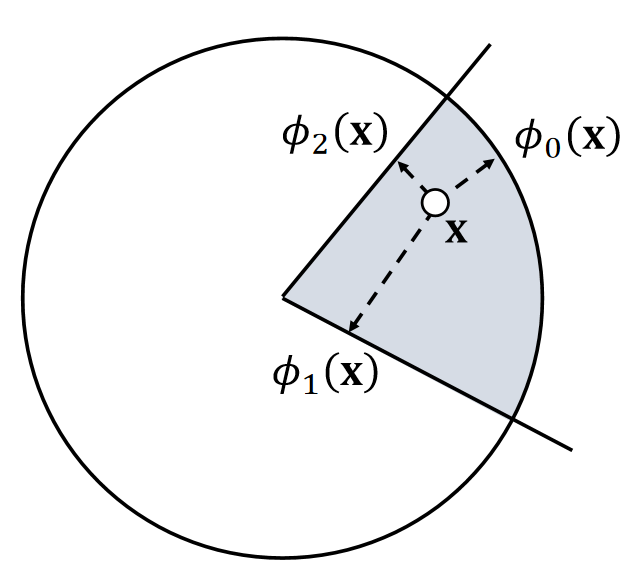
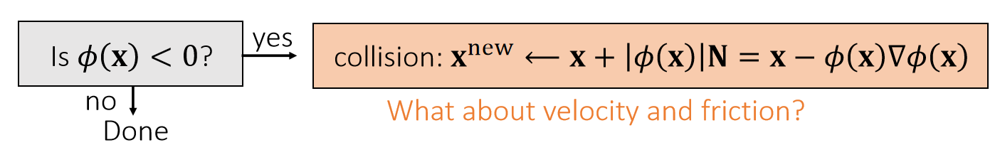
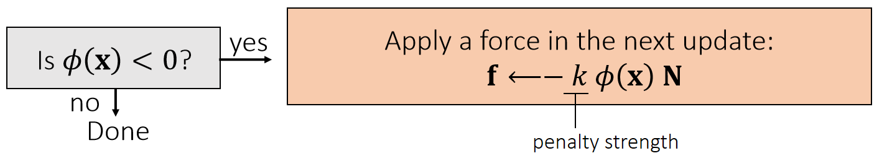
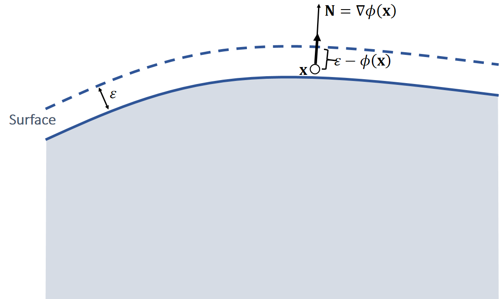

P11  
# 粒子碰撞检测 --- SDF 

## Signed Distance Function   

A <u>signed</u> distance function \\(\phi (\mathbf{x} )\\) defines the distance from \\(\mathbf{x}\\) to a surface with a sign. The sign indicates on which side \\(\mathbf{x}\\) is located.     

     

P12   
### Signed Distance Function Examples    

     

> &#x2705; 圆柱SDF基于勾股定理，\\(\sqrt{\cdot }\\) 内第一项为斜边长，
第二项为底边长，得出点到中轴的距离。  

P13   
## Intersection of Signed Distance Functions    

     

> If \\(\phi _0(\mathbf{x} )<0\\) and \\(\phi_1(\mathbf{x} )<0\\) and \\(\phi_2(\mathbf{x} )<0\\)      
then inside    
\\(\quad \phi (\mathbf{x} )\\)=max \\(⁡(\phi_0(\mathbf{x}),\phi_1(\mathbf{x}),\phi_2(\mathbf{x}))\\)     
Else outside    
\\(\quad \phi (\mathbf{x})=?\\)   

P14  
### Union of Signed Distance Functions   

     

> &#x2705; 有时候此公式不成立，例如图中\\(\mathbf{x}\\) 点  

Intuitively, we can consider collision detection with the union of two objects as **collision detection with two separate objects**.    

P15   
### 穿透检测  

$$ \phi (x(t))=0 $$    
解出 \\(t\\)   
如果 \\(t\\) 在所检测的时间范内有解，则说明存在穿透\\(t\\)为穿透时刻。   

## 粒子碰撞响应 —— Penalty Method  

### 碰撞解除   

SDF 常用于代表静态物体，这种物体不响应力和碰撞，所以所有的碰撞响应都发生在粒子上。    

    

> &#x2705; 更新方向：N方向。更新距离：穿入的距离。

### 状态更新

## Quadratic Penalty Method    

A penalty method applies a penalty force in the next update. When the penalty potential is quadratic, the force is linear.     

     

     

当粒子进入物体内部后，就会产生一个向外的推力。     
> &#x2705; 力的大小与距离有关，方向为normal  
> &#x2705; 存在的问题：只有\\(\mathbf{x}\\) 进入 mesh 内部了，才会有力，但此时穿透的 artifacts 已经产生了。解决方法：使用buffer  

P16   

粒子的运动状态发生变化确实是由于力的作用。但对力的大小的假设均不合理。    
力的大小确实与穿透深度有关，因为：    

穿透深 → 相对速度大 → 碰撞速度和反弹速度都大 → 速度改变大 → 力大

## Quadratic Penalty Method with a Buffer   

A buffer helps lessen the penetration issue. But it cannot strictly prevent penetration, no matter how large \\(k\\) is.      

     
     

> &#x2705; 存在的问题：  
> 如果 \\(k\\) 太小，快速的碰撞仍会产生 artifacts   
如果 \\(k\\) 太大，碰撞的反弹过于强烈(overshooting)  
解决方法：不用常数 \\(k\\) ，而是 \\(k\\) 与距离相关  

P17   
## Log-Barrier Penalty Method     

A log-barrier penalty potential ensures that the force can be large enough. But it assumes \\(\phi (\mathbf{x} ) < 0\\) will never happen!!! To achieve that, it needs to adjust \\(\Delta t\\).     

     

> &#x2705; 用倒数关系代替线性关系。  
> &#x2705; 存在的问题：  
> 1.当\\(\mathbf{x}\\) 靠近物体表面时，仍然会 overshooting   
 2.\\(\mathbf{x}\\) 穿透表面后，会越陷越深。  
 3.本算法如果要求保证穿透永远不会发生，因此要仔细调节 \\(\Delta t\\).  

P18  
## A Short Summary of Penalty Methods    

 - The use of step size adjustment is a must.     
    - To avoid overshooting.    
    - To avoid penetration in log-barrier methods.    

 - Log-barrier method can be limited within a buffer as well.    
    - Li et al. 2020. *Incremental Potential Contact: Intersection- and Inversion-free Large Deformation Dynamics*. TOG.    
    - Wu et al. 2020. *A Safe and Fast Repulsion Method for GPU-based Cloth Self Collisions*. TOG.   

 - Frictional contacts are difficult to handle.    
 
> &#x2705; 缺点：   
(1) 难以模拟摩擦。   
(2) 碰撞 → 施加力 → 调整，因此效果是滞后的。    
优点：易实现  
 
P19   
# Particle Collision Response —— Impulse Method    

An impulse method assumes that collision changes the position and the velocity all of sudden.      

> &#x2705; Penalty 方法是碰撞 → 力 → 下一时刻的速度和位置，效果滞后。   
> &#x2705; Impulse方法碰撞时立即更新速度和位置   

    

> &#x2705; lmpulse 省去了力这一步，直接更新刚体状态。方法要求已经有一个比较好的\\(\phi (x)\\)   
> &#x2705; 关键区别不在于是否使用力，而是位置是怎样计算出来的，前者的位置由力和速度，这个计算出来的(不管是作为下一时刻还是这一时刻)的位置，都不能保证一定能以物体内部推出来，但后者直接求出当前置对应的表面位置的点，并更新上去，因此能立即生效。    

## 更新速度

P20    
Changing the position is not enough, we must change the velocity as well.      

> &#x2705; \\(\mathbf{v}\cdot \mathbf{N}\ge 0\\)：当前速度想要让物体越陷越深, 这种情况下才需要更新速度   

    

> &#x2705; 把\\(\mathbf{v}\\)分解为\\(\mathbf{v_T}\\)（切线方向的速度）和\\(\mathbf{v_N}\\)（法线方向的速度）.  
> &#x2705; \\(\mathbf{v_N}\\)方向速度反弹， \\(\mu _\mathbf{N}\\) 为反弹系数。\\(\mathbf{v_N}\\)方向不变或由于摩擦而衰减  
> &#x2705; a的约束：（1）越小越好，尽量把速度衰减掉（2）满足库仑定律（切方向的速度改变不应大于法线方向的速度改变）（3）切方向速度不能反转，即a不能为负   

## Impulse方法总结

> &#x2705; 优点：可以精确控制摩擦力和反弹位置。缺点：计算比 Penalty 复杂   
> &#x2705; 刚体常见于 Impulse； 弹性体常见于Penalty.   

# 粒子与 Mesh     

## 相交检测     

检测粒子是否在 Mesh 的内部   
射线法：粒子从自身出发，发出一条射线，判断射线是与 Mesh 上的面片相交。    
相交次数为奇数，则在 Mesh 内    
相交次数为偶数，则在 Mesh 外    

### 穿透检测    

## 碰撞响应    

粒子与 SDF 的碰撞响应在此处同样适用     

---------------------------------------
> 本文出自CaterpillarStudyGroup，转载请注明出处。
>
> https://caterpillarstudygroup.github.io/GAMES103_mdbook/