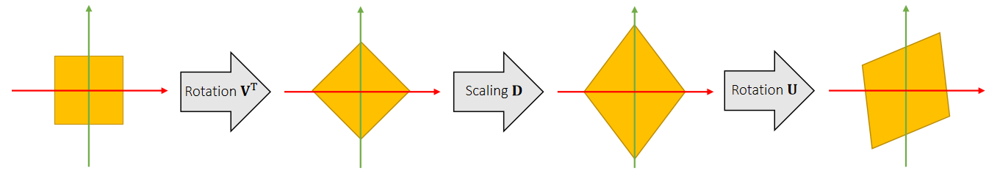

# 补充： Cross Product as a Matrix Product    

We can convert the cross product \\(\mathbf{r}\times\\) into a matrix product \\(\mathbf{r}^*\\).    

    

> &#x2705; \\(\mathbf{r}^*\\) 是 \\(\mathbf{r}\\) 的 cross matrix.   
目的：用矩阵形式代替叉乘形式，方便公式化简   

补充2：极性分解   

### 极性分解

Singular value decomposition says any matrix can be decomposed into: rotation,scaling and rotation: \\(\mathbf{A = UDV} ^T\\).    

    

We can rotate the object back before the final rotation: \\(\mathbf{A}  = (\mathbf{UV} ^T)(\mathbf{VDV} ^T)\\).    

    

> &#x2705; \\(\mathbf{A} = （\mathbf{UV}^T）(\mathbf{VDV}^T) =\mathbf{RS}\\)   
\\(\mathbf{R}\\) 代表全局旋转，\\(\mathbf{S}\\)代表本地形变，扔掉S保留R。    

    

$$
\mathbf{A=RS} 
$$

$$
\mathbf{A} ^T\mathbf{A}  = \mathbf{S} ^T\mathbf{S}  = \mathbf{S} ^2
$$

分解结果:unique   

---------------------------------------
> 本文出自CaterpillarStudyGroup，转载请注明出处。
>
> https://caterpillarstudygroup.github.io/GAMES103_mdbook/