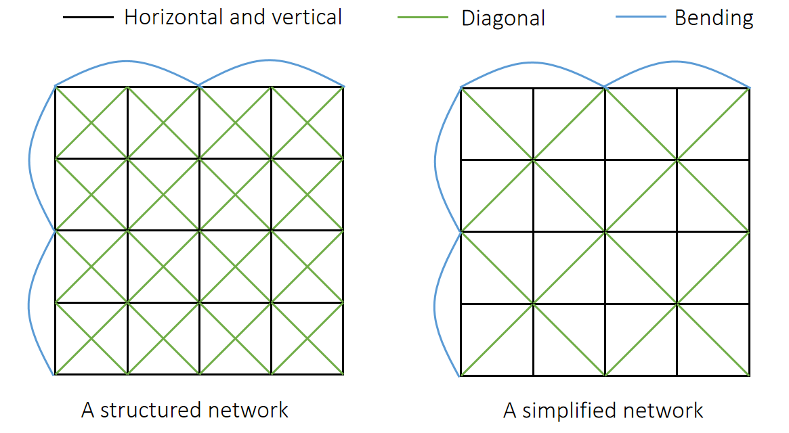
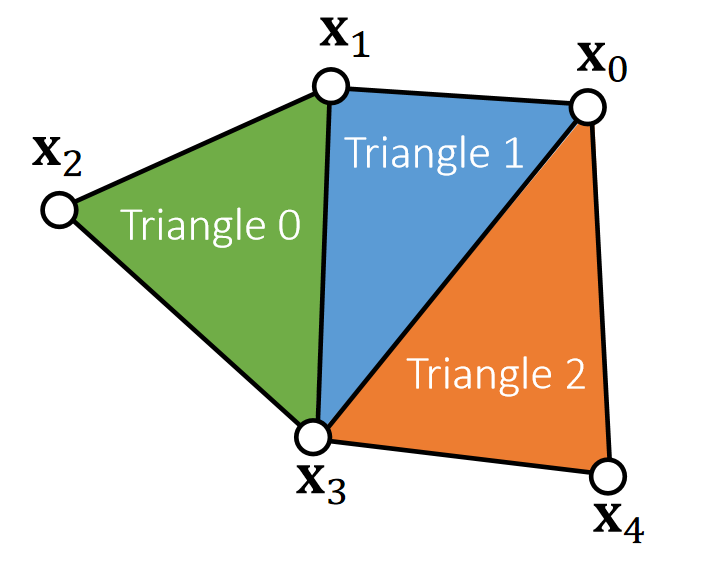
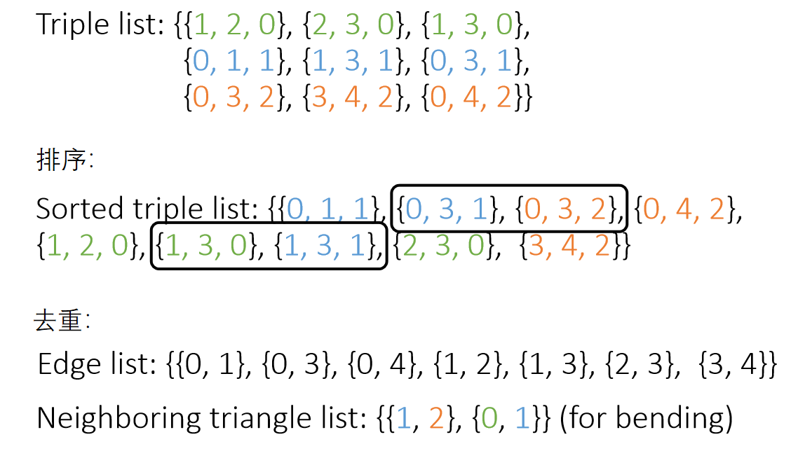

P2   

 
# 构建弹簧网络

P6  
## Structured Spring Networks   

    

> &#x2705; 绿线：防止斜方向的拉伸。蓝线：防止翻折。

P7  
## Unstructured Spring Networks   

We can also turn an unstructured triangle mesh into a spring network for simulation.    

  

> &#x2705; 蓝线：抵抗弯曲。对每条内部边，加这样一根弹簧。

P8   
### 怎样基于三角形Mesh增加蓝线弹簧

The basic representation of a triangle mesh uses vertex and triangle lists. 

    

> &#x2705; 已知边的信息，需找出内部边，例如\\(\mathbf{x}_0\mathbf{x}_3\\)，因此要基于此构造边：\\(\mathbf{x}_1x 4\\)   
> &#x2705; Each triangle has three edges. But there are repeated ones. Repeated edges就是内部边。  
> &#x2705; 1. 找出内部边。2. 找出内部边所属于的两个三角形。3.  找出两个三角形上不在这条内部边上的点。4. 连续一根弹簧。  

Vertex list: {\\(\mathbf{x} _0, \mathbf{x}_1, \mathbf{x}_2, \mathbf{x}_3, \mathbf{x}_4\\)}    (3D vectors)    

Triangle list: {1, 2, 3, 0, 1, 3, 0, 3, 4}    (index triples)     

The key to topological construction is to sort triangle edge triples.    

Each triple contains: edge vertex index 0, edge vertex index 1 and triangle index (index 0<index). 

    

> &#x2705; 排序：基于边排序，排序后相同边会靠在一起

---------------------------------------
> 本文出自CaterpillarStudyGroup，转载请注明出处。
>
> https://caterpillarstudygroup.github.io/GAMES103_mdbook/