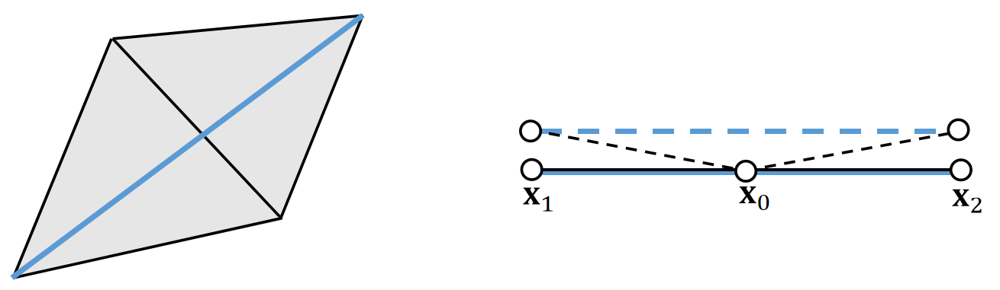
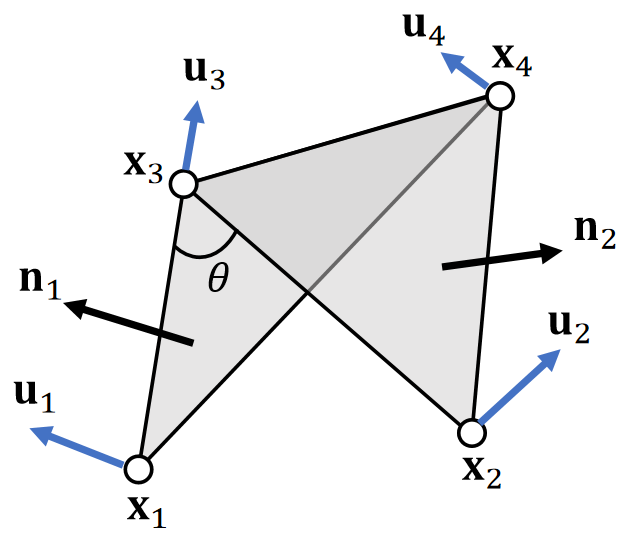
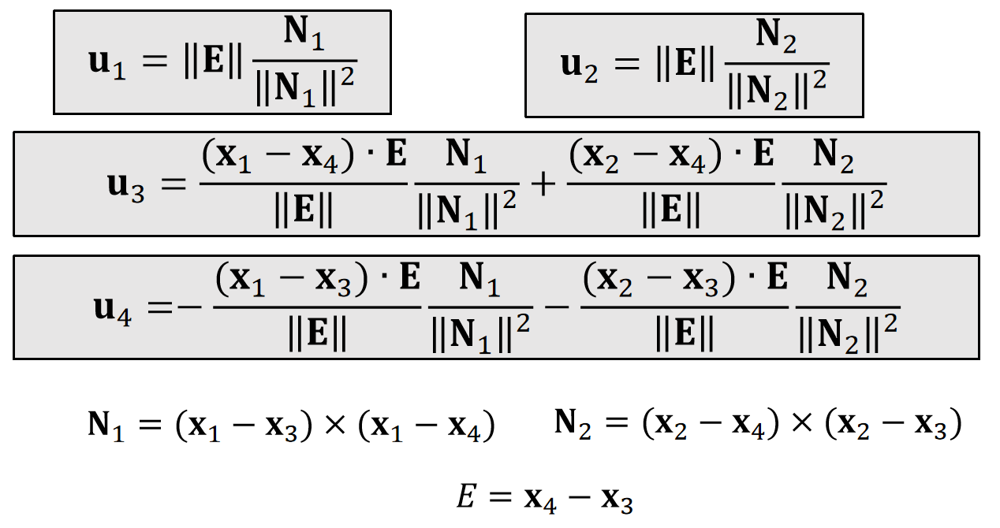
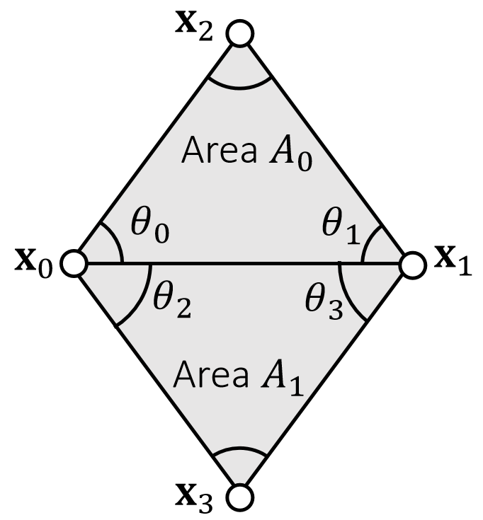

P29   
# The Bending Spring Issue    

A **bending** spring offers **little resistance** when cloth is nearly planar, since its length barely changes.     

    

> &#x2705;黑线为三角形面片，每条边一根弹簧，并增加一根蓝线弹簧，构成弯曲弹簧，阻止两个面片弯折。   
存在的问题：小的弯折，弹簧长度几乎不变，抵抗弯曲的力量非常弱。（不适用于类似于纸的弯折效果）。   

P30   
## A Dihedral Angle Model

A dihedral angle model defines bending forces as a function of \\(\theta : \mathbf{f} _i=f (\theta )\mathbf{u} _i\\).    

> &#x2705; Dihedarl Angel:二面角   
> &#x2705; 把弯曲的力写成关于二面角的函数    

    

   
> &#x2705; \\(x_1, x_2, x_3, x_4\\) 都会受到 bending force. 力的大小相同但方向不同，但都是关于二面角的函数。   
> &#x2705;\\(u_i\\)：描述力的方向，与\\(\theta\\)大小无关。\\(f(\theta)\\)：描述力的大小，是关于\\(\theta\\)的函数。   

 - First, \\(\mathbf{u}_1\\) and \\(\mathbf{u}_2\\) should be in the normal directions \\(\mathbf{n}_1\\) and \\(\mathbf{n}_2\\).     

 - Second, bending **doesn’t stretch the edge**, so \\(\mathbf{u}_4\\)−\\(\mathbf{u}_3\\) should be orthogonal to the edge, i.e., in the span of \\(\mathbf{n}_1\\) and \\(\mathbf{n}_2\\).    

 - Finally, \\(\mathbf{u}_1+\mathbf{u}_2+\mathbf{u}_3+\mathbf{u}_4=\mathbf{0}\\), which means \\(\mathbf{u}_3\\) and \\(\mathbf{u}_4\\) are in the span of \\(\mathbf{n}_1\\) and \\(\mathbf{n}_2\\).     

> &#x2705; 合力为0。   

P31    
Conclusion:

    

> &#x2705; N是未归一化的 normal. N 的方向与 normal 相同。大小为三角形的面积。   
> &#x2705; 重要的不是结果，而是根据观察进行合理假设的思考过程。  

P32   

Planar case:    

$$
\mathbf{f} _i=k\frac{||\mathbf{E}||^2}{||\mathbf{N}_1||+||\mathbf{N}_2||} \sin(\frac{π−\theta}{2})\mathbf{u} _i
$$

Non-planar case:    

$$
 \mathbf{f} _i=k\frac{||\mathbf{E} ||^2}{||\mathbf{N} _1||+||\mathbf{N} _2||}(\sin(\frac{π−\theta}{2})-\sin(\frac{π−\theta_0}{2}))\mathbf{u}_i
$$

> &#x2705; Non-planar case：不是指弯曲时的力，而是指静止状态(reference state)为非平面的场景下，弯曲为\\(\theta\\)时的力。\\(\theta_0\\)表示 reference state.     
> &#x2705; 老师没解释公式怎么来的      
> &#x1F50E;  Bridson et al. 2003. *Simulation of Clothing with Folds and Wrinkles*. SCA.      
> &#x2705; 此论文适合读完。除了弯曲模型，还有一些有意思的设计。     

Explicit integration.     
Derivative is difficult to compute.    

> &#x2705; 由于完全基于力而不考虑能量，适合用显式积分。

P34    
## A Quadratic Bending Model     

> &#x2705;二面角方法是纯分析力的方法，比较复杂。此处是Bending issue的另一个方法。   

A quadratic bending model has two assumptions: 1) planar case; 2) little stretching.      

    

$$
E(\mathbf{x} )=\frac{1}{2} \begin{bmatrix}
 \mathbf{x}_0 & \mathbf{x}_1 & \mathbf{x}_2 & \mathbf{x}_3
\end{bmatrix}\mathbf{Q} \begin{bmatrix}
\mathbf{x}_0 \\\\
\mathbf{x}_1 \\\\
 \mathbf{x}_2\\\\
\mathbf{x}_3
\end{bmatrix}
$$

$$
\mathbf{Q} =\frac{3}{\mathbf{A} _0+\mathbf{A} _1}\mathbf{qq^T}
$$

> &#x2705; \\({\mathbf{A} _0}\\)和\\({\mathbf{A} _1}\\)是两个三角形在reference状态下的面积。  

$$
\mathbf{q} = \begin{bmatrix}
 (\cot\theta _1+ \cot\theta _3)\mathbf{I} \\\\
 (\cot\theta _0+ \cot\theta _2)\mathbf{I} \\\\
 (-\cot\theta _0- \cot\theta _1)\mathbf{I} \\\\
(-\cot\theta _2- \cot\theta _3)\mathbf{I}
\end{bmatrix}
$$

\\(\mathbf{I}\\) is 3-by-3 identity.    

> &#x2705; \\(\mathbf{Q}\\)只与\\(\mathbf{\theta}\\)有关，因此是一个定值。  

It’s not hard to see that: \\(E (\mathbf{x} )=\frac{3||\mathbf{q} ^\mathbf{T}\mathbf{x} ||^2}{2(A_0+A_1)}\\).  Also, \\(E (\mathbf{x} )=0\\) when the triangles are flat.    

> &#x2705; \\(\mathbf{q^T}\mathbf{x}\\)在估算两个三角形的拉普拉斯，即两个三角的曲率、当两个三角形共面时， \\(E(\mathbf{x})=0\\)    
> &#x1F50E; 离散曲面的拉普拉斯，见GAMES102    
> &#x2705; \\(E(\mathbf{x})\\) 来自数学上曲率的推导，而不是来自物理意义的推导。  
> &#x2705; 问题：能量的思想能用在刚体上吗？    
答：这里的能量是弹性能量、刚体无弹性，因此也无所谓能量。   

### Pros of The Quadratic Bending Model

 - Easy to implement:   

> &#x2705; \\(E(\mathbf{x})\\)是关于\\(\mathbf{x}\\)的二次函数，很容易计算\\(E(\mathbf{x})\\)的一阶导（力）和二阶导\\(\mathbf{H} \\)   

$$
\mathbf{f} (\mathbf{x} )=−\nabla \mathbf{E} (x)= −\mathbf{Q} \begin{bmatrix}
\mathbf{x} _0\\\\
\mathbf{x} _1\\\\
\mathbf{x} _2 \\\\
\mathbf{x} _3
\end{bmatrix}
$$

$$
\mathbf{H} (\mathbf{x} )=\frac{∂^2E(\mathbf{x} )}{∂\mathbf{x} ^2}=\mathbf{Q} 
$$

 - Compatible with implicit integration.     
### Cons of The Quadratic Bending Model

 - No longer valid if cloth stretches much.    
 
> &#x2705;方法假设面料拉伸比较小，当面料拉伸太大，\\(\mathbf{\theta}\\)就会改变，\\(\mathbf{Q}\\)就不准了。  

 - Not suitable if the rest configuration is not planar.   
     - Cubic shell model.    
     - Projective dynamics model.    

### After Class Reading

> &#x1F50E; Bergou et al. 2006. *A Quadratic Bending Model for Inextensible Surfaces*. SCA.    
> &#x2705; 这篇论文是在本算法上的进一步工作。  

P37   
# The Locking Issue    

So far we talked about the mass-spring model and other bending models, **assuming cloth planar deformation and cloth bending deformation are independent**.     

Is it true? Think about a zero bending case. Can a simulator fold cloth freely?     

> &#x2705; 正常来讲拉伸和弯曲是两件独立的事情。但在弹簧模型系统中，把它们耦合了。  
> 例如纸这种无弹性的面料，会把它的弹性系数调得很大，达到无弹性的效果。但导致了它无法弯折的artifacts。    
> &#x2705; 在K很大或网格分辨率低时， locking issue 会特别明显。   

P38    

The fundamental reason is due to a short of degrees of freedoms (DoFs).    
For a <u>manifold</u> mesh, Euler’s formula says:#edges=3#vertices-3-#boundary_edges.     
So if edges are all hard constraints, the DoFs are only: 3+ #boundary_edges.    

> &#x2705; 自由度 = 变量数 - 约束数。  
> 每个顶点有3个自由度、每条边是一个约束，因此单纯加点不会改善，但让点变密可以改善     
> &#x2705; 实操套路：1. 弹簧压缩时让k比较小；2. 假设弹簧在一定长度范围内可自由活动，不受力，以上方法都不解决根本问题；3. 把自由度定义在边上不­是顶点上，但把问题搞得更复杂了。   

P43   
# A Summary For the Day    

 - A mass-spring system          
     - Planar springs against stretching/compression	\\(\quad\\)- replaceable by co-rotational model
     - Bending springs				\\(\quad\\)- replaceable by dihedral or quadratic bending
     - Regardless of the models, as long as we have \\(E (\mathbf{x})\\), we can calculate force \\(\mathbf{f} (\mathbf{x} )=−∇ \mathbf{E} (\mathbf{x})\\) and Hessian \\(\mathbf{H} (\mathbf{x} )=∂E^2(\mathbf{x} )/∂\mathbf{x} ^2\\).  Forces and Hessians are stackable.    

 - Two integration approaches    
     - Explicit integration, just need force.  Instability
     - Implicit integration, as a nonlinear optimization problem      
     - One way is to use Newton’s method, which solves a linear system in every iteration:    

$$
(\frac{1}{∆t^2}\mathbf{M} +\mathbf{H} (\mathbf{x} ^{(k)}))∆\mathbf{x} =− \frac{1}{∆t^2} \mathbf{M} (\mathbf{x} ^{(k)}−\mathbf{x} ^{[0]}−∆t\mathbf{v} ^{[0]})+\mathbf{f} (\mathbf{x} ^{(k)})
$$

 - There are a variety of linear solvers (beyond the scope of this class).    
 - Some simulators choose to solve only one Newton iteration, i.e., one linear system per time step.    

---------------------------------------
> 本文出自CaterpillarStudyGroup，转载请注明出处。
>
> https://caterpillarstudygroup.github.io/GAMES103_mdbook/