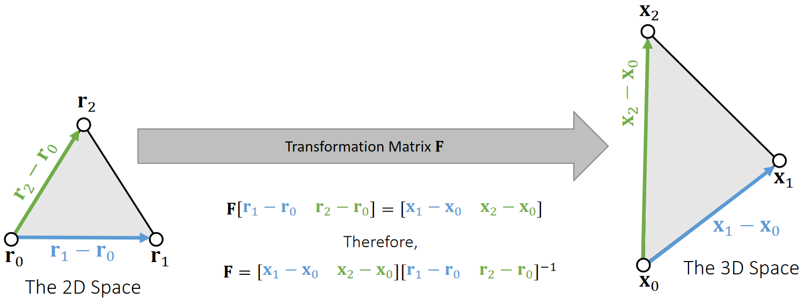
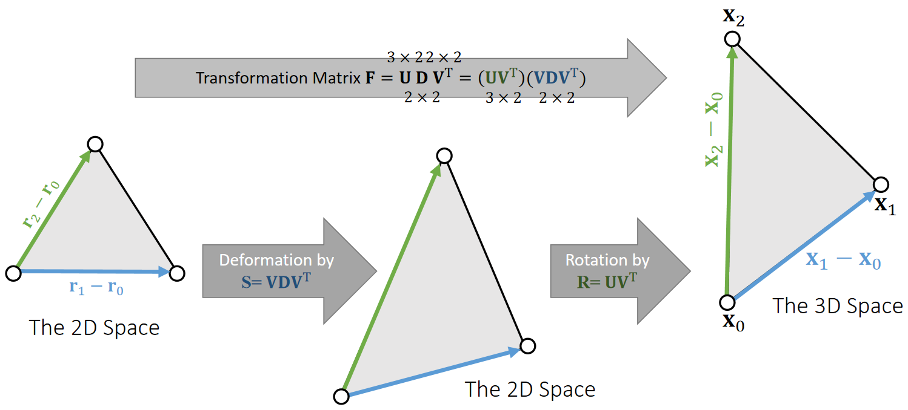

P39   
# Shape Matching    

先让每个粒子独立仿真，也不需要考虑弹簧力。   
将每个面片的变形程度构建为能量，通过优化能量的方式使 Mesh 减少形变，所有面片以统一的方式进行优化，因此是一种全局优化方法。   

所有方法最后都归结为一个分式：   

$$
\psi(x)=k\||x-y\||_m^2+E(x)
$$

关键是如何定义，以及非线性方程如何求解    

P40   
## 量化形变   

The basic idea is to define a quadratic energy based on the rotated reference element. To do so, we split transformation into deformation + rotation.     

    

P41   

    

P42   
## 计算能量   

We can then define the quadratic energy as:   

$$
E (\mathbf{x} )=\frac{1}{2}||\mathbf{F−R} ||^2
$$

(\\(\mathbf{R}\\) is the rotation inside of \\(\mathbf{F}\\).  This energy tries to penalize the existence of \\(\mathbf{S}\\)).     

Assuming that \\(\mathbf{R}\\) is constant, this \\(E(\mathbf{x})\\) becomes a quadratic function.  We can then derive the force and the Hessian.    

$$
E(\mathbf{x} ) =\frac{1}{2} ||\begin{bmatrix}
 \mathbf{x} _1-\mathbf{x} _0 &\mathbf{x} _2-\mathbf{x} _0
\end{bmatrix}\begin{bmatrix}
 \mathbf{r} _1-\mathbf{r} _0 &\mathbf{r} _2-\mathbf{r} _0
\end{bmatrix}^{−1}−\mathbf{R}||^2
$$
 

---------------------------------------
> 本文出自CaterpillarStudyGroup，转载请注明出处。
>
> https://caterpillarstudygroup.github.io/GAMES103_mdbook/