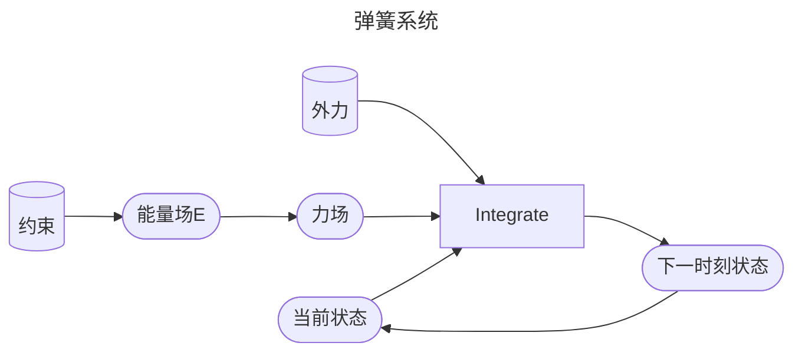

P4   
# 弹簧系统   

原理：对每个粒子独立仿真，类似于粒子系统，但通过构造粒子间的弹簧力来保证 Mesh 边长尽量不变的约束。通过构造网状的弹簧系统来保证 Mesh 面片不发生形变。通过增加对角顶点的弹簧来约束 Mesh 体积上的形变。    

> &#x2705; 本节课所讲的套路：分析力 → 隐式积分 → 通过优化解积分 → 更新，对弹簧系统、有限元、弹性体等各种物理模拟同样适用   
> &#x2705; 在求解隐式积分的过程中，把解非线性方程转化为优化问题，有的地方也会把优化目标称为能量函数\\(\Phi\\)。这个能量函数与上图中的能量E不同。E=0代表系统中没有存储的势能。而\\(\Phi=0\\)代表到达下一时刻的状态。  

## 构建弹簧系统    

### An Ideal Spring —— 一个端点     

An ideal spring satisfies Hooke’s law: the spring force tries to restore the rest length.    

 

### An Ideal Spring —— 两个端点     

    

\\(E(\mathbf{x})=\frac{1}{2}k (||\mathbf{x}_i −\mathbf{x}_j||−\mathbf{L} )^2\\)

胡克定律：    

\\(\mathbf{f} _i(\mathbf{x} )=−∇_i\mathbf{E} =−k(||\mathbf{x}_i −\mathbf{x}_j||−L)\frac{\mathbf{x}_i −\mathbf{x}_j}{||\mathbf{x}_i −\mathbf{x}_j ||}\\)

\\(\mathbf{f} _j(\mathbf{x})=−∇_jE=−k (||\mathbf{x}_j −\mathbf{x}_i ||−L)\frac {\mathbf{x}_j −\mathbf{x}_i}{||\mathbf{x}_j −\mathbf{x}_i||}\\)

P5  
### Multiple Springs   

When there are many springs, the energies and the forces can be simply summed up.     

    

$$
E= {\textstyle \sum_{e=0}^{3}}E_e= {\textstyle \sum_{e=0}^{3}} (\frac{1}{2} k(||\mathbf{x} _i −\mathbf{x}_e ||−L_e)^2)
$$

$$
f_i=−\nabla_iE = \textstyle \sum_{e=0}^{3}(−k(||\mathbf{x}_i−\mathbf{x}_e||−L_e)\frac{\mathbf{x}_i−\mathbf{x}_e}{||\mathbf{x}_i−\mathbf{x}_e||})
$$

> &#x2705; 能量和力都是可以叠加的

P11   
## 仿真流程    

    

> &#x2705; \\( E [e] [0] ：e\\)代表弹簧 ID:0或1代表弹簧两个端点     
> &#x2757; 图画得不对，先提前把所有的力都算出来，再遍历所有顶点    
> &#x2705; 整体流程就像是对 Mesh 上的每个顶点独立地进行粒子仿真，只是力变得复杂，每个弹簧端点上受到的力都要考虑，且力的大小和方向与顶点的位置关系有关。  

## 积分系统——显式积分  

P12   
与粒子仿真相同。每个 Mesh 顶点根据受力更新位置的过程涉及积分。积分离散化也可以是显式、隐式、半隐式。    
   
Explicit integration suffers from **numerical instability** caused by <u>overshooting</U>, when the stiffness \\(k\\) and/or the time step \\(∆t\\) is too large.     

> &#x2705; Explicit：当前力 → 当前速度 → 当前位置   
显式积分不稳定，如果 \\(Δt\\) 或 \\(k\\) 太大，会导致 overshooting。   

   

A naive solution is to use a small \\(∆t\\) . But that slows down the simulation.    

> &#x2705; 解决方法：减小\\(\Delta t\\)。但这个方法不解决本质问题，且会降低整个模拟系统的效率   
> &#x2705; 本质上是\\(Δt\\)太大导致积分近似的结果与实际积分的结果有很大误差，\\(k\\)太大或\\(Δt\\)只是让这个问题更明显，减小\\(k\\)或\\(Δt\\)问题仍然存在。   

P13  
## 积分系统——隐式积分   

Implicit integration is a better solution to numerical instability.  The idea is to integrate both **x** and **v** implicitly.   

> &#x2705; Explicit和Implicit都是用某个时刻的力代表整个 \\(Δt\\) 时间的力，就都会出现上述误差。   
> &#x2705; 区别在于，Explicit用当前力，往往使结果变大，产生爆炸，Implicit用未来力，往往使结果变小，产生消失。  
> &#x2705; 消失只是结果不对。但爆炸会让结果崩溃，这是最不可接受的问题。因此用隐式代替显式。  

隐式积分相对稳定，可以使用稍大的 \\(Δt\\)，但也存在以下问题：    
1. 实现复杂，因此难以优化。    
2. 每个 \\(Δt\\) 的求解更耗时，因此不一定会更快。     
3. 可能出现数值振荡。     

隐式积分用未来力计算未来速度，用未来速度计算未来位置。未来力，未来速度，未来位置都是未知量，不能直接求解。   

> &#x2705; 粒子和刚体的仿真中使用了半隐式积分(现在的力，未来的速度)，这里使用了隐式积分(未来的力，未来的速度)。力和速度都是未知的，需要解方程。    

    

### 解积分方法一：线性近似法求解积分    

> &#x2705; 近似成线性问题后直接解方程组。这种方法相当于每一个Step做了一次牛顿法。  

公式 2 代入公式 1 并消元，得：    
\\(\mathbf{v} ^{[1]}=\mathbf{v}^{[0]}+∆t\mathbf{M} ^{−1}\mathbf{f} (\mathbf{x}^{[0]}+∆t\mathbf{v} ^{[1]})\\)     
\\(\mathbf{f}\\) 在 \\(\mathbf{x}^{[0]}\\) 处泰勒展开，得：     

Linearize:   

$$ 
\mathbf{v} _{t+1}=\mathbf{v}_t+∆t\mathbf{M} ^{−1}[\mathbf{f} (\mathbf{x}_t)+\frac{\partial \mathbf{f} }{\partial \mathbf{x} }(\mathbf{x} _t) ∆t\mathbf{v} _{t+1}] 
$$

Clean up:     

$$
[\mathbf{I}-∆t^2\mathbf{M} ^{−1}\frac{\partial \mathbf{f} }{\partial \mathbf{x} }(\mathbf{x} _t)  ]\mathbf{v} _{t+1}=\mathbf{v}_t+∆t\mathbf{M} ^{−1}\mathbf{f} (\mathbf{x}_t)
$$

A nice *linear* system!      

$$
[\mathbf{I} -\beta \Delta t^2\mathbf{M} ^{-1}\frac{\partial \mathbf{f} }{\partial \mathbf{x} }(\mathbf{x} _t )]\mathbf{v} _{t+1}=\mathbf{v} _t+\Delta t\mathbf{M} ^{-1}\mathbf{f} (\mathbf{x} _t)
$$

@β=0: forward/semi-implicit Euler (explicit)    
@β=1/2: middle-point (implicit)      
B=1: backward Euler (implicit)       

解线性系统见补充材料       
问：为什么不直接求逆？    
答：求逆太贵     

### 解积分方法二：积分求解转为优化问题

> &#x2705; 把公式1代入公式2并消元，得：

消元得：    
    

Assuming that \\(\mathbf{f}\\) is *holonomic*, i.e., depending on \\(\mathbf{x}\\) only, our question is how to solve:    

$$
\mathbf{x} ^{[1]}=\mathbf{x}^{[0]}+∆t\mathbf{v} ^{[0]}+∆t^2\mathbf{M} ^{−1}\mathbf{f} (\mathbf{x}^{[1]})
$$

> &#x2705; holonomic：力的大小和方向只跟位置有关，跟速度无关。例如重力，弹力。那么 \\(f\\)可以写成关于位置的函数\\(f(x)\\)。  
> &#x2705; 但\\(f(x)\\)不一定是线性的。因此最后转化为解非线性方程的问题。未知量为\\({x} ^{[1]}\\)    

P14   

\\(\mathbf{x} ^{[1]} =\\) argmin \\(F(\mathbf{x})\quad\\)  for   \\(\quad F(\mathbf{x}) = \frac{1}{2∆t^2}||\mathbf{x} −\mathbf{x} ^{[0]}−∆t\mathbf{v} ^{[0]}||_M^2+E(\mathbf{x} )\\)    

> &#x2705; 前面方程解\\({x} ^{[1]}\\)等价于F(x)函数极小点。等价转换的推导在**补充1**。非线性方程问题为转化为优化问题。  
> &#x2705; 其中：\\(\mathbf{M}\\)对角矩阵，描述质量，\\(3N \times 3N\\)。\\(\mathbf{x}\\)为 \\(3N\times 1\\)矢量,描述顶点信息。\\(E\\) 为所有的力的能量。\\(\mathbf{||x||_M^2=x^TMx} \\)。  
> &#x2705; 只有保守力能用能量描述、非保守力（例如摩擦力）则不行。       

定义 \\(\mathbf{g(x)} =\mathbf{x} ^{[0]}+\Delta t\mathbf{v}^{[0]}+\Delta t^2M^{-1}+(\mathbf{x}^{[1]})-\mathbf{x} ^{[1]}\\)     
也可以得出：\\(x^{[1]}=\mathrm{argmin} (g(\mathbf{x} ))^2\\) 或     

$$ \mathbf{x}^{[1]}=\mathrm{argmin} |\mathbf{g(x)}|$$

只是这样构造出的优化问题，求导比较难计算。    

P18  
### Simulation by Newton’s Method    

> &#x1F50E; Newton-Raphson Method见补充2. 这里直接开始Newton方向本当前场景的应用。  

Specifically to simulation, we have:   

$$
F (\mathbf{x} )=\frac{1}{2∆t^2}||\mathbf{x} −\mathbf{x} ^{[0]}−∆t\mathbf{v} ^{[0]}||_\mathbf{M} ^2+\mathbf{E} (\mathbf{x} )
$$

$$
∇F(\mathbf{x}^{(k)})=\frac{1}{∆t^2}\mathbf{M} (\mathbf{x} ^{(k)}−\mathbf{x} ^{[0]}−∆t\mathbf{v} ^{[0]})−\mathbf{f}(\mathbf{x}^{(k)})
$$

$$
\frac{∂^2F (\mathbf{x} ^{(k)})}{∂\mathbf{x} ^2} =\frac{1}{∆t^2} \mathbf{M} +\mathbf{H} (x^{(k)})
$$

    

P19  
#### Solve Spring Hessian

According to Lecture 2, Page 48,      

> &#x2705; 弹簧系统的H是由所有弹簧的H构成的。  

    

> &#x2705; \\(H(x)\\)的维度是\\(3N \times 3N\\)，N 是弹簧数。每个\\(H_e\\)的维度是\\(3 \times 3\\)。  
> &#x2705; 课后答疑：质点的质量可以不同吗？   
答：可以不同。先根据三角形的面积计算三角的质量，再把质量分配到各个顶点上。   

## Positive Definiteness of Hessian    

以上方法解出的 \\(x\\) 不是应是 \\(\mathrm{argmin}\\) \\(\mathbf{F}(x)\\)，也有可能是\\(\mathrm{argmax}\\) \\(\mathbf{F}(x)\\)，这取决于“\\((x)\\)”的正负。     

    

> &#x2705; \\(H(x)\\) 的正定性由 \\(H_e\\) 的正定性决定。    

下面分析\\(H_e\\)的正定性：  
For any \\(\mathbf{x} _{ij}, \mathbf{v} ≠0\\),    

$$
\mathbf{V}^\mathbf{T}\frac{{\mathbf{x} _{ij}\mathbf{x} _{ij}}^\mathbf{T} }{||\mathbf{x} _{ij}||^2}\mathbf{V}=||\frac{{\mathbf{x} _{ij}}^\mathbf{T} \mathbf{v} }{||\mathbf{x} _{ij}||}||^2> 0
$$

$$
\mathbf{V} ^\mathbf{T} (\mathbf{I} -\frac{{\mathbf{x} _{ij}\mathbf{x} _{ij}}^\mathbf{T} }{||\mathbf{x} _{ij}||^2}) \mathbf{V} =\frac{||\mathbf{x} _{ij}||^2||\mathbf{v} ||^2-||{\mathbf{x} _{ij}}^\mathbf{T} \mathbf{v} ||^2}{||\mathbf{x} _{ij}||^2}\ge 0 
$$

> &#x2705; \\( \mathbf{x}_ {ij}\\) 代表顶点\\( \mathbf{x}_ {i}\\)和顶点\\( \mathbf{x}_ {j}\\)的位置的差。   
> &#x2705; 最后一个公式分子满足柯西不等式   
> &#x2705; 结论：\\(||x_{ij}||< Le\\). 代表弹簧处于压缩状态。此时 He 有可能非正定，但拉伸时一定正定。  
> &#x2705; He 正定则\\(H(x)\\)半正定，此时弹簧系统有唯一解。  

P20   
When a spring is stretched, \\(\mathbf{H} _e\\) is s.p.d.; but when it’s compressed, \\(\mathbf{H} _e\\) may not be s.p.d.     

As a result, \\(\mathbf{H}(\mathbf{x})\\) may not be s.p.d. (Lecture 2, Page 36).    

\\(\mathbf{A}\\) may not be s.p.d. either.    

> &#x2705; \\(\Delta t\\)越小，A越容易正定、弹簧系统越稳定。   
> &#x2705; 为什么要讨论\\(H\\)矩阵是否正定？答：\\(H\\)矩阵相当于二阶导，正定代表开口向上，有唯一最小值。  
> &#x2705; 但是A不正定，不代表没有唯一解。   

P22 

When a spring is compressed, the spring Hessian may not be positive definite. This means there can be multiple local minima (outcomes).    

    

|  Note: This issue occurs only in 2D and 3D. In 1D, \\(E(x)=\frac{1}{2} k(x−L)^2\\) and \\({E}''(x)=k>0\\).|  
|---|

P23   
## Enforcement of Positive Definiteness   

 - Nevertheless, some linear solvers can fail to work if the matrix \\(\mathbf{A}\\) in \\(\mathbf{A}\Delta \mathbf{x}=\mathbf{b}\\) is not positive definite.    

> &#x2705; 不正定最大的问题不是解不唯一，因为解出任意一个解都能让模拟系统进行下去。  
> &#x2705; 非正定的主要问题，是数学计算上的不稳定，可能导致解不出来； 

 - One solution is to simply drop the ending term, when \\({\color{Orange}{ ||\mathbf{x} _{ij}||<\mathbf{L} _e}}:\\)       

     
 
> &#x2705; 简单粗爆的解决方法就是把后面这项删掉。  

 - Other solutions exist. For example,     
> &#x1F50E; Choi and Ko. 2002. Stable But Responive Cloth. TOG (SIGGRAPH)      

P27   
# After-Class Reading   

Baraff and Witkin. 1998. Large Step in Cloth Simulation. SIGGRAPH.    

One of the first papers using implicit integration.     

The paper proposes to **use only one Newton iteration**, i.e., solving only one linear system. This practice is fast, but can fail to converge.    

> &#x2705;这篇论文是衣服模拟的经典论文，第一个用隐式积分做衣服模型的论文。  
> &#x2705; 论文没有用弹簧系统，而是另一套模型。  
> &#x2705; 没有做非线性优化或解非线性方程，而是把非线性方程线性化，等价于做一次牛顿迭代。   
> &#x1F50E; Fast mass - spring system solver    

# 补充1：非线性方程求解转化为优化问题

求解的非线性方程如下，其中\\({x} ^{[1]}\\)是未知量。  
$$
\mathbf{x} ^{[1]}=\mathbf{x}^{[0]}+∆t\mathbf{v} ^{[0]}+∆t^2\mathbf{M} ^{−1}\mathbf{f} (\mathbf{x}^{[1]})
$$

P14   

$$
\mathbf{||x||_M^2=x^TMx} 
$$

> &#x2705; Note that this is applicable to every system, not just a mass-spring system.    

把公式处理一下得，  
$$
x^{[0]}+Δtv^{[0]}+Δt^2M^{-1}f(x^{[1]})-x^{[1]}=0
$$
左右两边同时乘以\\(\frac{M}{Δt^2}\\)得   
$$
\frac{1}{Δt^2} M(x^{[1]}-x^{[0]}-Δtv^{[0]})-f(x^{[1]})=0
$$  
这里面唯一的未知量是\\(x^{[1]}\\)，定义函数
$$
y=\frac{1}{Δt^2} M(x-x^{[0]}-Δtv^{[0]})-f(x)
$$    
当\\(x = x^{[1]}\\) 时，\\(y = 0\\), 即 \\(y(x^{[1]}) = 0\\)   
从另一个角度讲， 
$$
\begin{eqnarray}
x^{[1]} & =  \mathrm{argmin}& F(x)\Rightarrow {F}' (x^{[1]}) & = & 0
\end{eqnarray}
$$   
因此, \\({F}' (x) = y. \quad F(x) = \int ydx \\)       
反之则不一定成立，\\({F}' (x) = 0\\) 解出的 \\(x\\) 有可能是极大值点，所以还要看 \\({F}' (x)\\) 的正负。

# 补充2：Newton-Raphson Method   

## x是值的F(x)函数

The Newton-Raphson method, commonly known as Newton’s method, solves the optimization problem: \\(x^{[1]}\\) = argmin \\(F(x)\\).   

    

Given a current \\(x^{(k)}\\), we approximate our goal by: 

$$
0={F}' (x)≈{F}'(x^{(k)})+{F}'' (x^{(k)})(x−x^{(k)})
$$

> &#x2705; \\(a = \min F(x)⇒ F'(a)= 0\\)，\\({F}' (x)\\) 是非线性函数，直接解\\({F}' (x)=0\\) 很难解    
> &#x2705; 对\\({F}'(x)\\) 做一阶泰勒展开，保留到二阶项。   
> &#x2705; 假设\\(x^{[k]}\\)为任意已知值，就变成了解线性方程，很容易解出\\(x\\).   
> &#x2705; 因为\\({F}'(x)\\) 是一个近似的，\\(x\\) 也是一个近似解。但\\(x^{[k]}\\) 越接近真实解，\\(x\\) 也会越接近真实解。因此，选代是\\(x^{[k]}\\)和\\(x\\) 都不断逼近真实解的过程。  
> &#x2705; 普通的梯度下降是把\\({F}' (x)\\) 近似到一阶，牛顿法是近似到二阶，因此下降更快。    

    

> &#x2705; Overshooting 的本质：误差会积累和放大   

P16    
Newton’s method finds an extremum, but it can be a minimum or maximum.    

    

 - At a minimum \\(x^∗, {F}'' (x^∗)>0\\).     
 - At a maximum \\(x^∗, {F}''(x^∗)<0\\). 
 - If \\({F}''(x)>0\\) is everywhere, \\(F(x)\\) has no maximum.  \\(=> F(x)\\) has only one minimum.     

> &#x2705; \\(F'(a)= 0,a\\)  有可能是最大值或最小值，因此要判定解是否合理。判定方法： \\({F}''(x)\\)  

P17  
## x是向量的F(x)函数    

Now we can apply Newton’s method to: \\(x^{[1]} \\)= argmin \\(F(x)\\).
Given a current \\(x^{(k)}\\), we approximate our goal by: 

$$
0=\nabla F( \mathbf{x}) ≈\nabla F (\mathbf{x} ^{(k)})+\frac{∂F ^2(\mathbf{x} ^{(k)})}{∂\mathbf{x} ^2} (\mathbf{x−x} ^{(k)}) 
$$

    

> &#x2705; 按照 \\(\Delta x\\) 的更新公式，只需要用到\\(F'(x)\\) 和 \\({F}''(x)\\)， 不需要知道 \\(F(x)\\).   
> &#x2705; 此处\\(x\\)是向量，因此\\(F'(x)\\)是向量，\\({F}''(x)\\)是 Hession 矩阵  

---------------------------------------
> 本文出自CaterpillarStudyGroup，转载请注明出处。
>
> https://caterpillarstudygroup.github.io/GAMES103_mdbook/