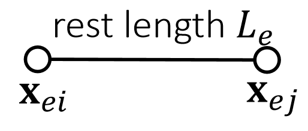

P30   
# Constrained Dynamics   

## 要解决的问题

A critical problem exists: what if constraints/forces are **very very stiff**? Or infinitely stiff?    

> &#x2705; 此算法用于处理 very very stiff 的场景即约束必须严格满足，而前面算法需要做很多次迭代才能产生这种效果（计算量大）。   
> &#x2705; 此算法常用于衣服、刚体、人体。比如人体的关节联结，是一种非常stiff的约束。  

## 根据约束建立模型  

    

Compliant constraint    

$$
\mathbf{ϕ} _e(\mathbf{x} )=||\mathbf{x} _{ei}− \mathbf{x} _{ej}||−L_e
$$

$$
E(\mathbf{x} )={\textstyle \sum_e}\frac{1}{2} k(||\mathbf{x} _{ei} −\mathbf{x} _{ej}||−L_e)^2=\frac{1}{2} \mathbf{\mathbf{ϕ}^T(x)C} ^{−1}\mathbf{ϕ} (\mathbf{x} )
$$

> &#x2705; \\(E(X)=\sum _ {e} \frac{1}{2}k( \phi _ e(x))^2\\)  

$$
\mathbf{f} (\mathbf{x} )=−∇E=-\begin{pmatrix}
 \frac{∂E}{∂\mathbf{ϕ}}  & \frac{∂\mathbf{ϕ}}{∂x}
\end{pmatrix}^\mathbf{T} =−\mathbf{J^TC} ^{−1}\mathbf{ϕ} =\mathbf{J^Tλ} 
$$

Let \\(N\\) be the number of vertices and E be the number of constraints,    

||||
|---|---|---|
|约束|$$ \phi (\mathbf{x} )\in \mathbf{R} ^E $$ |&#x2705; \\( \phi_e = \begin{bmatrix} \phi _ 0\\\\ \phi _ 1 \\\\ \vdots  \\\\ \phi _ E  \end{bmatrix}\\)    |
|Compliant matrix|$$ \mathbf{C} =\begin{bmatrix} 1/k & \Box  & \Box\\\\ \Box & 1/k & \Box \\\\ \Box  & \Box &\ddots \end{bmatrix}\in \mathbf{R} ^{E×E} $$|&#x2705; C称为软度矩阵、 stiffness:挺度，compliant:软度|
| Jacobian  |\\(\mathbf{J} =\frac{∂\phi}{∂\mathbf{x} } \in \mathbf{R} ^{E×3N}\\) |  
| Dual variables (Lagrangian multipliers)  | \\(\mathbf{λ} =−\mathbf{C} ^{−1}\phi \in \mathbf{R} ^E\\)|&#x2705; \\(\lambda \\) 是人为引入的变量，称为拉格朗日算子。   |

> &#x2705; \\(E\\) 和 \\(f\\) 变成了关于两个变量\\((x、\lambda )\\)的函数。   
> &#x2705;把能量写成约束的形式    
$$
E(x)=\frac{1}{2}\phi ^T (x)C^{-1}\lambda 
\\\\
f(x)=J^T \lambda  
$$
根据\\(E(x)\\)和\\(f(x)\\)做隐式积分    

## 转化为隐式积分问题

P31  

By implicit integration, we get:   

$$
\mathbf{Mv} ^{\mathrm{new} }−∆t\mathbf{J^Tλ} ^{\mathrm{new} }=\mathbf{Mv} 
$$

> &#x2705; 动量守衡公式：\\(Mv'- Mv = Ft = \\)冲量   
> &#x2705; 此处新 \\(\lambda^{\mathrm{new}} \\)来计算 F. 说明是 Implicit    

Meanwhile,
$$
\mathbf{Cλ} ^{\mathrm{new} }=−\mathbf{ϕ} ^{\mathrm{new} }≈−\mathbf{ϕ} −\mathbf{J} (\mathbf{x} ^{\mathrm{new} }−\mathbf{x} )≈−\mathbf{ϕ} −∆t\mathbf{Jv} ^{\mathrm{new} }
$$

> &#x2705; 对\\(-\phi ^{\mathrm{new}}\\) 的泰勒展开    
> &#x2705;\\(J\\)是上页中的Jacobian.   

$$
\begin{bmatrix}
 \mathbf{M}  & −∆t\mathbf{J^T} \\\\
 ∆t\mathbf{J}  & \mathbf{C} 
\end{bmatrix}\begin{bmatrix}
\mathbf{v} ^{\mathrm{new} } \\\\
\mathbf{λ} ^{\mathrm{new} }
\end{bmatrix}\begin{bmatrix}
\mathbf{Mv}  \\\\
-\mathbf{ϕ} 
\end{bmatrix}
$$

> &#x2705; 最后的矩阵公式由上面两个公式整理合并得到。   
\\(x ^{\mathrm{new}}-x =\bigtriangleup t\cdot v \\)    

## 解隐式积分

P32    
Now we have a system with two sets of variables: the primal variable \\(\mathbf {x}\\) (or \\(\mathbf {v=x}\\) ̇) and the dual variable \\(\mathbf {λ}\\).   

> &#x2705; 之前的隐式积分只有一个变量，此处的隐式积分有两个变量。需要同时解出两个变量。  

 - Method 1: We can solve the two variables by a **direct solver** together, in a <u>primal-dual</u> fashion:   

$$
\begin{bmatrix}
\mathbf{M}  & −∆t\mathbf{J^T} \\\\
∆t\mathbf{J}  & \mathbf{C} 
\end{bmatrix}\begin{bmatrix}
\mathbf{v} ^{\mathrm{new} } \\\\
\mathbf{λ} ^{\mathrm{new} }
\end{bmatrix} = \begin{bmatrix}
\mathbf{Mv}  \\\\
-\mathbf{ϕ} 
\end{bmatrix}
$$ 

> &#x2705; 注意：Method 1 中的矩阵有可能不正定、因此很多数学方法用不了。 

 - Method 2: We can **reduce the system** by Schur complement and solve \\(\mathbf {λ}^{\mathrm{new} }\\) first.  

> &#x2705; Method 2 的消元过程不容易构造、尤其是当矩阵比较复杂时。   

$$
(∆t^2\mathbf{JM} ^{−1}\mathbf{J} ^\mathbf{T} +\mathbf{C} )\mathbf{λ} ^{\mathrm{new} } =−\mathbf{ϕ} −∆t\mathbf{Jv} 
$$

$$
\mathbf{v} ^{\mathrm{new}}\longleftarrow \mathbf{v} +−∆t\mathbf{M} ^{−1}\mathbf{J^Tλ} ^{\mathrm{new}}
$$

> &#x2705; 用哪种方法取决于应用场景    

## 优点

Infinite stiffness? \\(\mathbf{C \longrightarrow 0}\\).    

> &#x2705; 此方法将软硬度量解耦出来，并用矩阵C来表示，使得可以方便控制软硬度，例如让\\(c=0\\) 来表示 infinite stiffness.   

## 应用
   
 Articulated Rigid Bodies (ragdoll animation)    

P34  
# Stable Constrained Dynamics    

> &#x2705; 没有展开讲，见after reading中的论文  

From a mass-spring system, we know spring Hessian (tangent stiffness) is:    

$$
\mathbf{H} (\mathbf{x} )=∑_{e=(i,j)}\begin{bmatrix}
 \Box  & \Box  & \Box  & \Box  \\\\
 \Box  & \mathbf{H} _e & -\mathbf{H} _e & \Box   \\\\
  \Box & -\mathbf{H} _e &\mathbf{H} _e  & \Box   \\\\
  \Box &  \Box & \Box  & \Box  
\end{bmatrix}
$$

    

According to constrained dynamics:\\(\mathbf{f} (\mathbf{x} )=\mathbf{J^Tλ}\\)  and \\(\mathbf{λ} =−\mathbf{C} ^{−1}\\mathbf{ϕ} \\), so: 

   

$$
\mathbf{J}_e=\frac{∂\phi _e}{∂\mathbf{x} }=\begin{bmatrix}
\frac{\mathbf{x} _{ij}^\mathbf{T} }{||\mathbf{x} _{ij}||}   & -\frac{\mathbf{x} _{ij}^\mathbf{T} }{||\mathbf{x} _{ij}||}
\end{bmatrix}
$$

P35   
## Stable Constrained Dynamics

According Lecture 5, Page 16, implicit integration is:    

$$
(\frac{1}{∆t^2}\mathbf{M+H} (\mathbf{x} ^{[0]}))∆\mathbf{x} = \frac{1}{∆t^2}\mathbf{M} (∆t\mathbf{v} ^{[0]})+\mathbf{f} (\mathbf{x} ^{[0]})
$$

$$
\Downarrow 
$$

$$
(\mathbf{M} +∆t^2\mathbf{H} (\mathbf{x} ^{[0]}))\mathbf{v} ^{\mathrm{new} }= \mathbf{Mv} ^{[0]}+∆t\mathbf{f} (\mathbf{x} ^{[0]})
$$

    

Missing geometric stiffness matrix here…

P36  
## After-Class Reading (optional)   

    

Tournier et al. 2015. *Stable Constrained Dynamics. TOG (SIGGRAPH)*.    

> &#x2705; Method 2 Gauss 消元，如果把\\(\lambda\\)消掉，会得到一个基本上与隐式积分相似的公式，唯一的区别是\\(\mathbf{H}\\)上略有不同 —— 隐式积分多了一项。如果把用这一项加回去，会使constrain dynamic 变得稳定。   

