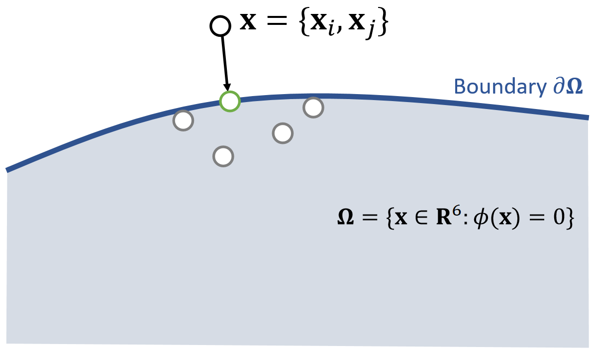

# 投影函数 Projection Function

P5   
## A Single Spring   

If a spring is infinitely stiff, we can treat the length as a constraint and define a projection function.      

    

\\(\mathbf{ϕ} (\mathbf{x} )=||\mathbf{x} _i− \mathbf{x} _j||−L=0\\)      
> &#x2705; projection function.投影函数、会移动端点使弹簧满足约束。   
  

    

P6   

    

> &#x2705; 把\\(\mathbf{x}_ i\\)和\\(\mathbf{x}_ j\\)拼成6维空间中的点\\(\mathbf{x}\\)，满足约束的\\(\mathbf{x}\\)构成6D空间中的一块区域；  

{\\(\mathbf{x} _i^{\mathbf{new}},\mathbf{x} _j^{\mathbf{new} }\\)}= argmin \\( \frac{1}{2}\\){\\(m_i||\mathbf{x} _i^{\mathbf{new} }−\mathbf{x} _i||^2+m_j||\mathbf{x} _j^{\mathbf{new}} −\mathbf{x} _j||^2\\)}    

such that  \\(\mathbf{ϕ} (\mathbf{x} )=0\\)

> &#x2705; 投影函数的目标：(1)把\\(\mathbf{x}\\)移到区域内。 (2)移动距离最短，因此构成优化问题。    
> &#x2705;优化问题，但不是通过选代解决，而是数值求解，直接算出最优的\\(\mathbf{x}_i\\)和\\(\mathbf{x}_j\\).    

P7   

 
$$
\mathbf{x} ^{\mathbf{new} } \longleftarrow  \mathrm{Projection} (\mathbf{x})
$$   

$$
\mathbf{x} _i^{\mathbf{new} }\longleftarrow \mathbf{x} _i−\frac{m_j}{m_i+m_j} (||\mathbf{x} _i−\mathbf{x} _j||−L)\frac{\mathbf{x} _i−\mathbf{x}_j}{||\mathbf{x} _i−\mathbf{x} _j||} 
$$
   
$$
\mathbf{x} _j^{\mathbf{new} }\longleftarrow \mathbf{x} _j+\frac{m_i}{m_i+m_j} (||\mathbf{x} _i−\mathbf{x} _j||−L)\frac{\mathbf{x} _i−\mathbf{x}_j}{||\mathbf{x} _i−\mathbf{x} _j||} 
$$

$$
\quad
$$

$$
\mathbf{ϕ} (\mathbf{x} ^{\mathbf{new} })=||\mathbf{x} _i^{\mathbf{new} }− \mathbf{x} _j^{\mathrm{new} }||−L=||\mathbf{x} _i−\mathbf{x} _j−\mathbf{x} _i+\mathbf{x} _j+L||−L=0
$$

> &#x2705; 对推导结果的合理性解释：(1) 移到前后质心不变。(2) 移到方向为沿着或远离质心。(3) 移到距离与自身重量有关。   

By default, \\(m_i=m_j\\), but we can also set \\(m_i=\infty\\) for stationary nodes.   

> &#x2705; 对于固定点，不更新就好了。    

P8   
## Multiple Springs – A Gauss-Seidel Approach    

What about multiple springs? The Gauss-Seidel approach **projects each spring sequentially in a certain order**. Imagine two springs with unit rest lengths…

    

P9   

  

 - We cannot ensure the satisfaction of every constraint. But the more iterations we use, the better those constraints are satisfied.    

 - Although the name is related to Gauss-Seidel, it differs from Gauss-Seidel. It is more relevant to stochastic gradient descent (in machine learning).    

 - The order matters. The order can cause bias and affect convergence behavior.     

> &#x2705;顺序影响结果的偏向性和收敛速度。   

P10  
## Multiple Springs – A Jacobi Approach   

 - To avoid bias, the Jacobi approach projects all of the edges **simultaneously** and then linearly blend the results.    

 - The problem is an even lower convergence rate. 

 - Again, the more iterations it uses, the better the constraints are enforced.    

     
> &#x2705; 基于每条边计算\\(\mathbf{x}\\)的更新但不真的更新、每个点会得到多种更新方案，最后取更新方案的均值。   

---------------------------------------
> 本文出自CaterpillarStudyGroup，转载请注明出处。
>
> https://caterpillarstudygroup.github.io/GAMES103_mdbook/