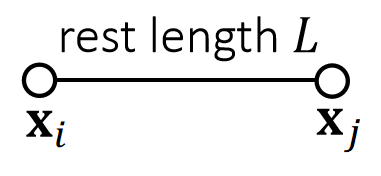
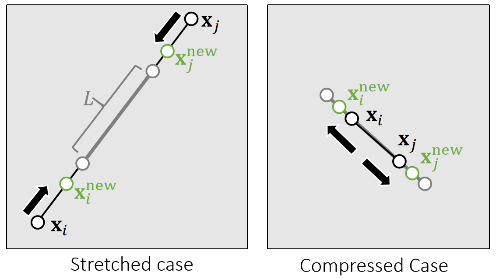

P14  
# Strain Limiting    

PBD 是一个让仿真结果变得满足约束的方法，可以认为是仿真的后处理。由此产生了其它的用法。   

## 原理
Strain limiting aims at using the projection function for **correction** only. 

    

> &#x2705; 投影函数作为模拟过程的后处理，防止模拟后产生大的形变，使模拟结果更稳定。    

|  | PBD | Strain Limiting | 
|----|----|----|
| 第一步  | 只考虑粒子运动，不考虑约束|模拟粒子运动、同时考虑约束|
| 第二步  |使粒子状态满足约束 | 校正，但约束较宽 |  

P15   
## 例一： Spring Strain Limit   

We can set the spring strain, i.e., the stretching ratio σ, to be within a limit.

> &#x2705; 这一页以弹簧为例子说明 Strain Limit   
> &#x2705; Strain：物理上描述形变的量，即本页的\\(\sigma \\)   

    

$$
\sigma ^\mathrm{{min}}≤\frac{1}{L}||\mathbf{x} _i− \mathbf{x} _j||≤\sigma^\mathrm{{max}}
$$

> &#x2705; 仅要求弹簧长度满足某不比例，不要求一定到达某个位置。  

Constraint

    

 

P16  

$$
\quad
$$

$$
\mathbf{x}^{\mathbf{new}}\longleftarrow \mathrm{Projection}  (\mathbf{x} )
$$

$$
\sigma\longleftarrow \frac{1}{L}||\mathbf{x}_i− \mathbf{x}_j||
$$

> &#x2705; 计算当前拉伸比

$$
\sigma _0\longleftarrow \mathrm{min} (\mathrm{max} (\sigma,\sigma^{\mathrm{min} }),\sigma^{\mathrm{max} })
$$

> &#x2705; 计算期望的拉伸比

$$
\mathbf{x} _i^{\mathrm {new} }⟵\mathbf{x} _i−\frac{m_j}{m_i+m_j}(||\mathbf{x} _i− \mathbf{x} _j||−σ_0L)\frac{\mathbf{x} _i− \mathbf{x} _j}{||\mathbf{x} _i− \mathbf{x} _j||}
$$

$$
\mathbf{x} _j^{\mathrm {new} }⟵\mathbf{x} _j+\frac{m_j}{m_i+m_j}(||\mathbf{x} _i− \mathbf{x} _j||−σ_0L)\frac{\mathbf{x} _i− \mathbf{x} _j}{||\mathbf{x} _i− \mathbf{x} _j||}
$$

> &#x2705; 用\\(\sigma _0L\\)代替原长\\(L\\)．   

\\(\mathrm{PBD}: \sigma _0≡1;\quad\quad\\)

> &#x2705; PBD可以看作是Strain Limit的特例。  

No limit: \\(\sigma ^{\mathrm{min} } = 0, σ^{\mathrm{max} } = \infty\\)   

> &#x2705; Strain Limit 的应用场景：(1) 模拟布料：“拉伸到一定范围后变得非常 stiff” 的效果 (2) 防止“形变大发生数值不稳定”。    

P17  
## 例二：Triangle Area Limit    

We can limit the triangle area as well. To do so, we define a scaling factor.     

> &#x2705;这是另一个例子。希望顶点移动尽量少，因此定义约束：三角形面积变化在一定范围内。   

{\\(\mathbf{x}_i^{\mathrm{new} },\mathbf{x}_i^{\mathrm{new} },\mathbf{x}_k^{\mathrm{new} }\\)}  = \\(\mathrm{argmin} \frac{1}{2} \\){\\(m_i||\mathbf{x}_i^{\mathrm{new} }−\mathbf{x}_i||^2+m_j||\mathbf{x}_j^{\mathrm{new} }−\mathbf{x}_j||^2+m_j||\mathbf{x}_k^{\mathrm{new} }−\mathbf{x}_k||^2\\)} 

such that the constraint is satisfied.   

    

> &#x2705; strain s为面积的缩放量
 

P18   

$$
\quad
$$

$$
\mathbf{x} ^{\mathbf{new}} ⟵\mathrm{Projection} (\mathbf{x} )
$$

$$
\mathbf{A}\longleftarrow \frac{1}{2} ||(\mathbf{x} _j− \mathbf{x} _i)\mathbf{×} (\mathbf{x}_k− \mathbf{x} _i)||
$$

> &#x2705; 计算当前三角形的面积

$$
\mathbf{s} \longleftarrow \sqrt{\mathrm{\mathrm{min}} (\mathrm{\mathrm{max}} (A,A^{\mathrm{min}}),A^{\mathrm{max}})/A}
$$

> &#x2705; 计算期望的面积缩放比

$$
\mathbf{c} \longleftarrow \frac{1}{m_i+m_j+m_k} (m_i\mathbf{x} _i+m_j\mathbf{x} _j+m_k\mathbf{x} _k)
$$

> &#x2705; C为质心，要求缩放前后质心不变。数学上、质心不变，点的移动最少；物理上，质心变了代表物体运动了，scale 不应该导致物理运动。   

$$
\mathbf{x} _i^{\mathrm{new}}\longleftarrow \mathbf{c} +s(\mathbf{x} _i−\mathbf{c} )
$$

$$
\mathbf{x} _j^{\mathrm{new}}\longleftarrow \mathbf{c} +s(\mathbf{x} _j−\mathbf{c} )
$$

$$
\mathbf{x} _k^{\mathrm{new}}\longleftarrow \mathbf{c} +s(\mathbf{x} _k−\mathbf{c} )
$$

> &#x2705; 通过对顶点到质心的距离的缩放，得到顶点的新的位置

P19   
## Strain Limiting在Simulation中的作用   

 - Strain limiting is widely used in physics- based simulation, typically for avoiding instability and artifacts due to large deformation.     

 - Strain limiting is useful for nonlinear effects, in a biphasic way.     
  
    

> &#x2705; 例如布料一般一开始抵抗比较小，拉到一定程度后抵抗迅速变大。对这种非线性的表现，可以把模拟分布两个阶段，前面用普通模拟，后面用strain limiting。  

 - Strain limiting also helps address the **locking issue**.   
 
> &#x2705;两个阶段有不同的算法，针对两个阶段的不同特点，可以分别解决两个阶段的问题。    

---------------------------------------
> 本文出自CaterpillarStudyGroup，转载请注明出处。
>
> https://caterpillarstudygroup.github.io/GAMES103_mdbook/