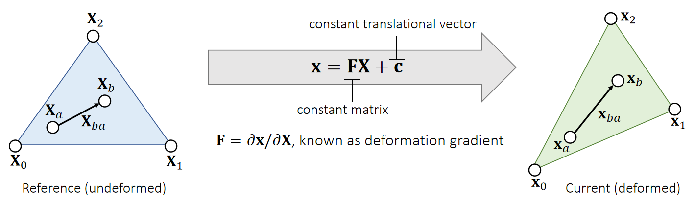

P3   
# Linear Finite Element Method    

P4  
## The Linear FEM Assumption   

> &#x2705; 假设：三角形的形变是均匀的    

In a nutshell, linear FEM assumes that for any point \\(\mathbf{X}\\) in the reference triangle, its deformed correspondence is: \\(\mathbf{x=FX+c}\\).    

> &#x2705; reference triangle：三角形处于没有发生形变的静止的状态。   
> &#x2705; \\(\mathbf{X}\\)和\\(\mathbf{x}\\)可以分别是 reference 和 deformed 三角形的顶点或内部点，公式都同样适用。  

    

For any vector between two points, we can use F to convert it from reference to deformed:    
$$
\mathbf{x} _{ba}=\mathbf{x} _b−\mathbf{x} _a=\mathbf{FX} _b+\mathbf{c} −\mathbf{FX} _a−\mathbf{c} =\mathbf{FX} _{ba}.
$$

P5   
## 计算Deformation Gradient    

Therefore, we can calculate the deformation gradient by edge vectors.      

    

**Problem:** \\(\mathbf{F}\\) **is related to deformation, but it contains rotation**.     

> &#x2705; 期望\\(\mathbf{F}\\)只包含形变量、不包含平移和旋转、因为刚体运动不应该有形变，所以要把形变提取出来。    
> &#x2705;平移已经在\\(\mathbf{c}\\)里面了，所以只需考虑旋转。   

P6  
## 从F中去除旋转

### 回顾SVD分解

Ideally, we need a tensor to describe shape deformation only.  Recall that SVD gives \\(\mathbf{F=UDV^T}\\), where only \\(\mathbf{V^T}\\) and \\(\mathbf{D}\\) are relevant to deformation.     

    

> &#x2705; \\(\mathbf{V^T}\\) 看上去是旋转、实际上是为了确定形变的方向、 \\(\mathbf{U}\\) 才是真正的旋转    
> &#x2705; 目的：把\\(\mathbf{F}\\)中的\\(\mathbf{U}\\)去掉、可以先做 \\(\mathbf{SVD}\\) 分解再把\\(\mathbf{U}\\)去掉。但本文使用了更简单的方法     

### Green Strain    

So we get rid of \\(\mathbf{U}\\) as: \\(\mathbf{G} =\frac{1}{2} (\mathbf{F^TF−I} )=\frac{1}{2} (\mathbf{VD} ^2\mathbf{V} ^\mathbf{T} −\mathbf{I} )=\begin{bmatrix}
 \varepsilon _{uu} & \varepsilon _{uv}\\\\
\varepsilon _{uv} & \varepsilon _{vv}
\end{bmatrix}\\), *Green strain*.
 
> &#x2705; \\(\mathbf{G}\\) 是一个描述物体形变的有无和大小矩阵，且与关旋转     

 - If no deformation, \\(\mathbf{G=0}\\); if deformation increases,  ||\\(\mathbf{G}\\)|| increases.    
 - Three deformation modes: \\(\varepsilon _{uu}\\), \\(\varepsilon _{vv}\\) and \\(\varepsilon _{uv}\\).
 - \\(\mathbf{G}\\) is <u>rotation invariant</u>: if additional rotation \\(\mathbf{R}\\), then deformation gradient is \\(\mathbf{RF}\\) but green strain is the same: \\(\mathbf{G} =\frac{1}{2} (\mathbf{F^TR^TRF−I} )=\frac{1}{2} (\mathbf{VD} ^2\mathbf{V} ^\mathbf{T} −\mathbf{I} )\\).    

P7   
## 计算能量    

Let \\(\mathbf{G}\\) be the the green strain describing deformation. We consider the **energy density** per reference area as: \\(W (\mathbf{G})\\).    

    

    

> &#x2705;用形变程度来定义能量。\\(W\\)代表单位面积上的能量，因此称为能量密度。总能量为单位能量\\(\mathbf{X}\\)面积.    
> &#x2705;  \\(A^{ref}\\) 为 reference status 下三角形的面积     
> &#x2705;  StVK是一种经典的能量密度函数（Strain Energy Density Function）， 在力学中不常用，但在图形学中很常用、原因是简单    

    

> &#x2705;  S 是一个与力有关的物理量。会在FVM内容中进一步解释。   
> &#x2705;  能量对位移求导是力。形变是一种位移。能量密度对位移求导是一种类似于力的密度的量。

P8  
## 计算Forces   

Given everything we have, we can now calculate the forces.    

> &#x2705; 力是形变施加到顶点上的力   

    

> &#x2705; 绿色部分是上一页S中的内容、灰色部分将在下一页推导。  

P9   
### 方法一

Recall that,    

    

> &#x2757; \\(\mathbf{F}\\)不是力，是deformation gradient．   
> &#x2705; 假设a,b,c,d是形变后的顶点。  

By definition,    
$$
\mathbf{G} =\frac{1}{2} (\mathbf{F^TF−I} )=\begin{bmatrix}
 \frac{1}{2}(a\mathbf{x} _{10}+c\mathbf{x} _{20})^\mathbf{T} (a\mathbf{x} _{10}+c\mathbf{x} _{20})−\frac{1}{2}  & \frac{1}{2}(a\mathbf{x} _{10}+c\mathbf{x} _{20})^\mathbf{T} (b\mathbf{x} _{10}+d\mathbf{x} _{20})\\\\
 \frac{1}{2}(a\mathbf{x} _{10}+c\mathbf{x} _{20})^\mathbf{T} (b\mathbf{x} _{10}+d\mathbf{x} _{20})  & \frac{1}{2}(b\mathbf{x} _{10}+d\mathbf{x} _{20})^\mathbf{T} (b\mathbf{x} _{10}+d\mathbf{x} _{20})−\frac{1}{2}
\end{bmatrix}
$$

So:

$$
\frac{∂\varepsilon _{uu}}{∂\mathbf{x} _1}=a(a\mathbf{x} _{10}+c\mathbf{x} _{20})^\mathbf{T} 
\quad\quad
\frac{∂\varepsilon _{vv}}{∂\mathbf{x} _1}=b(b\mathbf{x} _{10}+d\mathbf{x} _{20})^\mathbf{T} 
\quad\quad
\frac{∂\varepsilon _{uv}}{∂\mathbf{x} _1}=\frac{1}{2} a(b\mathbf{x} _{10}+d\mathbf{x} _{20})^\mathbf{T} +\frac{1}{2}  b(a\mathbf{x} _{10}+c\mathbf{x} _{20})^\mathbf{T} 
$$

$$
\frac{∂\varepsilon _{uu}}{∂\mathbf{x} _2}=c(a\mathbf{x} _{10}+c\mathbf{x} _{20})^\mathbf{T} 
\quad\quad
\frac{∂\varepsilon _{vv}}{∂\mathbf{x} _2}=d(b\mathbf{x} _{10}+d\mathbf{x} _{20})^\mathbf{T} 
\quad\quad
\frac{∂\varepsilon _{uv}}{∂\mathbf{x} _2}=\frac{1}{2} c(b\mathbf{x} _{10}+d\mathbf{x} _{20})^\mathbf{T} +\frac{1}{2}  d(a\mathbf{x} _{10}+c\mathbf{x} _{20})^\mathbf{T} 
$$

  
> &#x2705; \\(\mathbf{x}\\)为current边的矩阵，\\(\mathbf{r}\\)为reference边的矩阵。  

P10     

### 方法二
    

> &#x2705; 把 P9 代入 P8 得到 P10       
> &#x2705; 上一页推导方法从定义出来，过程简单，但很容易出错。这里用矩阵来简化计算，得到同样的结果。   

P11     
### 结论
In conclusion, we have:   

$$
\mathbf{f} _1=−A^{\mathrm{ref} }\mathbf{FS} \begin{bmatrix}
 a\\\\
b
\end{bmatrix}  \quad\quad \mathbf{f} _2=−A^{\mathrm{ref} }\mathbf{FS} \begin{bmatrix}
 c\\\\
d
\end{bmatrix}
$$

$$
\begin{bmatrix}
 \mathbf{f} _1 &\mathbf{f} _2
\end{bmatrix}= − A ^{\mathrm{ref} }\mathbf{FS} \begin{bmatrix}
 \mathbf{X} _{10} & \mathbf{X} _{20}
\end{bmatrix}^\mathbf{−T} 
$$

> &#x2705; \\(f_0=-f_1-f_2\\)   

P12   
## Implementations   

> &#x1F50E; Volino et al. 2009. *A simple approach to nonlinear tensile stiffness for accurate cloth simulation*. TOG    

Only talks about cloth (2D reference -> 3D deformation)    

 - What about tetrahedron (3D reference -> 3D deformation)?   
    - Same idea, but everything is now in 3D.   
    - Deformation gradient \\(\mathbf{F} \in \mathbf{R} ^{3×3}\\)   
    - Green strain \\(\mathbf{G} \in \mathbf{R} ^{3×3}\\)   
    - Stress tensor \\(\mathbf{S} \in \mathbf{R} ^{3×3}\\)   
    - Forces \\(\mathbf{F}_i \in \mathbf{R} ^3\\)    

---------------------------------------
> 本文出自CaterpillarStudyGroup，转载请注明出处。
>
> https://caterpillarstudygroup.github.io/GAMES103_mdbook/