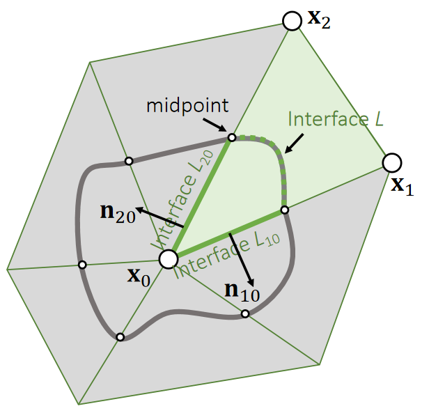
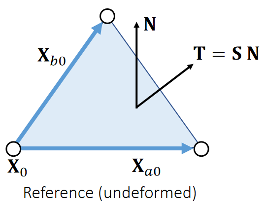
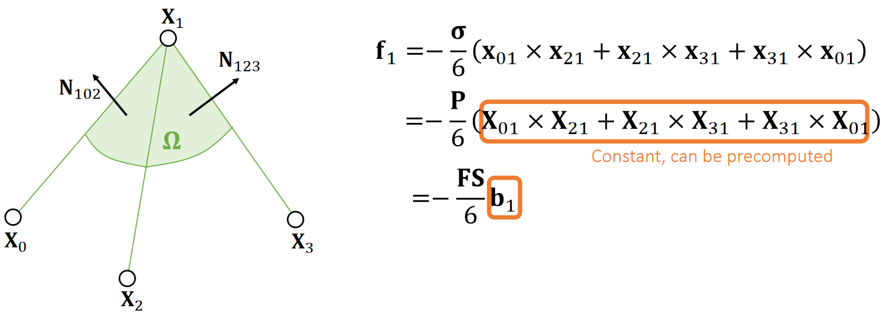

P13   
# Finite Volume Method    

> &#x2705; FEM求导，FVM积分。在线性场景下，FEM和FVM本质上等价的。    
> &#x2705; FVM基于力从何而来的思想。  

## 符号定义

P14   
### Traction    

First, let’s consider traction **t**: the internal force per unit length (area).

    

> &#x2705; 两个弹性体被界面 \\(L\\) 分开、求 \\(L\\) 上的力、   

Total interface force:    

$$
f\mathbf{} =\oint _L \mathbf{t} dl
$$

> &#x2705; \\(\mathbf{t}\\)是\\(L\\) 上的单位面积/长度上的力。那么总的力是t的积分。     

### Stress    

Stress tensor \\(\mathbf{σ} \\) (interface normal -> traction):

$$
\mathbf{t=σn} 
$$

So,    

$$
\mathbf{f} =\oint_{L}  \mathbf{σn} dl
$$

> &#x2705; \\(\mathbf{σ}\\) 一个矩阵    

P15   
## 计算FVM中的力   

### 2D

FVM considers force calculation in an integration perspective, not a differentiation perspective.     

    

> &#x2705;  \\(\mathbf{X}_0\\)是顶点\\(\mathbf{X}_0\\)附近邻域面积上的力。  

Force contributed by an element:    

$$
\mathbf{f}_0 =\oint _L \mathbf{σn} dl
$$

> &#x2705;  \\(\mathbf{X}_0\\)上的力是邻域面边界\\(L\\)上的力的积分、不考虑边界内部的力，因为认为内力为0。   
> &#x2705;  仅看其中一个三角形、假设曲线经过 \\(\mathbf{X}_0\mathbf{X}_1\\)和 \\(\mathbf{X}_0\mathbf{X}_2\\)的中点。因为三角形的力对三个顶点是平均的。    

Since \\(\mathbf{σ}\\) is constant within the element,     

$$
\oint_L \mathbf{σn} dl + \oint_{L_{20}} \mathbf{σn} dl+\oint_{L_{10}}\mathbf{σn} dl=0
$$

> &#x2705;  对于封闭曲线L+L10+L20做积分，\\(\int _n=0\\)，因此 \\(\sigma \int _n=0\\)    

(Divergence Theorem)   

We know the force is:   

$$
\mathbf{f}_0 = - \oint _ {L _{20}} \mathbf{σn} _ {20} dl -  \oint _ {L _{10}} \mathbf{σn} _ {10} dl = - \mathbf{σ}(\frac{||\mathbf{X} _ {20}||}{2}\mathbf{n} _ {20}+ \frac{||\mathbf{X} _ {20}||}{2}\mathbf{n} _ {10})
$$

P16   
### 3D   

> &#x2705;  三维场景是对四面体的四个面积分。  
> &#x2705;  每个三角形的 stress 都不同、同一个三角形内部 stress 是常数。  

In 3D, FVM works in the same way.    

    

Force:

$$
\begin{array}{l} 
 \mathbf{f} _ 0 = −\oint _ Ω \mathbf{σn} dA=−\mathbf{σ} (\frac{A _ {012}}{3}\mathbf{n} _ {012} + \frac{A _ {023}}{3}\mathbf{n} _ {023} + \frac{A _ {031}}{3}\mathbf{n} _ {031})\\\\
 =−\frac{σ}{3}(\frac{||\mathbf{x} _ {10} \times \mathbf{x} _ {20}||}{2} \frac{\mathbf{x} _ {10} × \mathbf{x} _ {20}}{||\mathbf{x} _ {10} × \mathbf{x} _ {20}||} + \frac{||\mathbf{x} _ {20} × \mathbf{x} _ {30}||}{2}\frac{\mathbf{x} _ {20} × \mathbf{x} _ {30}}{||\mathbf{x} _ {20} × \mathbf{x} _ {30}||}
+\frac{||\mathbf{x} _ {30} × \mathbf{x} _ {10}||}{2}\frac{\mathbf{x} _ {30} × \mathbf{x} _ {10}}{||\mathbf{x} _ {30} × \mathbf{x} _ {10}||})\\\\
=−\frac{\mathbf{σ}}{6} (\mathbf{x} _ {10} × \mathbf{x} _ {20} + \mathbf{x} _ {20} × \mathbf{x} _ {30} + \mathbf{x} _ {30} × \mathbf{x} _ {10})
\end{array}
$$

> &#x2753;  遗留问题， stress 如何计算？  

> &#x2705;\\(f_0\\)是\\(\sigma n\\)在绿色体截面上的积分。   
> &#x2705;类似于上一页合力为零的原理，\\( \oint 截面＋\oint 表面=0\\)   
> &#x2705;“面积／3”是因为面上的贡献均匀地分布到三个点上。  

P17     
## 计算FVM中的stress    

Although the use of stress tensor is the same: **mapping from the interface normal to the traction**, it can be defined by different configurations.      

|      |       |  
|----|----|
|  In FEM, we define the energy density \\(W\\) in the **reference** state.  Therefore, this stress \\(\mathbf{S}\\)  is a mapping from the normal \\(\mathbf{N}\\) to the traction \\(\mathbf{T}\\), both in the **reference** state.   | In FVM, we need \\(\mathbf{σ}\\) to convert the normal into \\(\mathbf{t}\\) for force calculation. Therefore, this stress assumes the normal \\(\mathbf{n}\\) and the traction \\(\mathbf{t}\\) are in the **deformed** state.    |  

> &#x2705;  在 reference 状态下有 normal. traction 和 stress.在形变状态下也有 normal traction 和 stress.FEM 使用的是 reference 空间下的量。    

P18   
### Different Stresses   

We can now have different stresses, serving the same purpose but in different forms.     

   

> &#x2705;  FVM 需要的是 Cauchy Stress.（\\(\sigma \\)）、上节课讲了(S)的 计算方法，需要根据(S)求(\\(\sigma \\)).    
\\(P → \sigma \\) 的过程没有展开讲，结论在P21     

P19  
### P与\\(\sigma \\)的关系：Area Weighted Normals   

  

Now let’s figure out the relationship between \\(A^{\mathrm{ref} }\mathbf{N}\\) and \\(A\mathbf{n}\\), the two area weighted normals.    

$$
2A^{\mathrm{ref} }\mathbf{N} =\mathbf{X} _ {a0}×\mathbf{X} _ {b0}
$$

$$
\begin{array}{l} 
 2A\mathbf{n} =\mathbf{x} _ {a0}×\mathbf{x} _ {b0}=\mathbf{FX} _{a0} × \mathbf{FX} _ {b0} = (\mathbf{UDV^TX} _ {a0}) × (\mathbf{UDV^TX} _ {b0}) \\\\
\quad\quad=\mathbf{U} ((\mathbf{DV^TX} _ {a0}) × (\mathbf{DV^TX} _ {b0})) \\\\
\quad\quad=\mathbf{U} \begin{bmatrix}
  d_1d_2& \Box  & \Box \\\\
 \Box  & d_0d_2 & \Box \\\\
  \Box & \Box  &d_0d_1
\end{bmatrix} ((\mathbf{V^TX} _ {a0})×(\mathbf{V^TX} _ {b0}))\\\\
\quad\quad=\mathbf{U} \begin{bmatrix}
  d_1d_2& \Box  & \Box \\\\
 \Box  & d_0d_2 & \Box \\\\
  \Box & \Box  &d_0d_1
\end{bmatrix} \mathbf{V^T} (\mathbf{X} _ {a0} × \mathbf{X} _ {b0})\quad=d_0d_1d_2\mathbf{U} \begin{bmatrix}
  1/d_0& \Box  & \Box  \\\\
 \Box  & 1/d_1 & \Box  \\\\
  \Box & \Box  &1/d_2
\end{bmatrix} \mathbf{V^T} (\mathbf{X} _ {a0}×\mathbf{X} _ {b0}) \\\\
\quad\quad=\mathrm{det} (\mathbf{F} )\mathbf{F} ^{−\mathbf{T}}(\mathbf{X} _ {a0}×\mathbf{X} _ {b0})=\mathrm{det} (\mathbf{F} )\mathbf{F} ^{−\mathbf{T}}(2A^\mathrm{ref}\mathbf{N})
\end{array}
$$

P20   

Now we know: \\(A\mathbf{n} =\mathrm{det} (\mathbf{F})\mathbf{F^{−T}} (A^{\mathrm{ref}}\mathbf{N} )\\).     

We also know the force can be calculated using two different stresses:    

$$
\mathbf{f} =−\frac{1}{3}  {\textstyle \sum {A^{\mathrm{ref} }}}\mathbf{PN} =−\frac{1}{3}\sum A\mathbf{σn} 
$$

Therefore, we get:

$$
\mathbf{P} (A^{\mathrm{ref} }\mathbf{N} )=\mathbf{σ} \mathrm{det} (\mathbf{F} )\mathbf{F^{−T}} (A^{\mathrm{ref} }\mathbf{N} )
$$

$$
\mathrm{det} ^{−1}(\mathbf{F} )\mathbf{PF^T=σ} 
$$

P21  
### 结论

We can now have different stresses, serving the same purpose but in different forms.     

  

P22 
## 根据stress算出力   

The previous analysis suggests we can use reference normals instead.     

  

Second Piola–Kirchhoff stress:    
\\(\mathbf{S} =\frac{∂W}{∂\mathbf{G}}\\), as in previous FEM formulation    

> &#x2705; 第一行公式：用 deformed position 计算 deformed position. 第二行公式：用 ref position 计算 deformed position, 因此直接把\\(\sigma \\)换成 \\(\mathbf{P} \\) 就可以。   
> &#x2705; 好处：ref position 是常数，可以做预计算、并存储为\\(b_1\\).   
> &#x2705; F：deformation gradient.见P5     
> &#x2705; 用三种不同定义的 stress 来算力、目的是得到计­算最友好的公式    
> &#x2705; 此处内容涉及材料力学、    

P23   
### The Finite Volume Method   

  

> &#x2753;  \\(\mathbf{X}_ {20}^\mathbf{T} b_1\\)的计算公式中、绿色的\\(\mathbf{X}_ {01}×\mathbf{X} _ {21}\\)怎么变成了\\(\mathbf{X}_ {20}\times \mathbf{X}_ {10}\\)？下面的\\(\mathbf{X}_ {30}^\mathbf{T} b_1\\),也一样。   

> &#x2705;因为\\(\mathbf{X}_o，\mathbf{X}_1，\mathbf{X}_2\\)是同一个三角形上的顶点，任意两条边做cross都是一样的，处理好正负就好了。   
也可以用cross的乘法分配律得出相同的结论    

P24   
### Therefore,   

We get:

$$
\begin{bmatrix}
 \mathbf{X} _{10} & \mathbf{X} _{20} &\mathbf{X} _{30}
\end{bmatrix}^\mathbf{T} \mathbf{b} _1=\begin{bmatrix}
 \mathbf{X} _{10} & \mathbf{X} _{20} &\mathbf{X} _{30}
\end{bmatrix}^\mathbf{T}(\mathbf{X} _{01}×\mathbf{X} _{21}+\mathbf{X} _{21}×\mathbf{X} _{31}+\mathbf{X} _{31}×\mathbf{X} _{01})=\begin{bmatrix}
 6Vol\\\\
 0\\\\
0
\end{bmatrix}
$$

$$
\begin{bmatrix}
 \mathbf{X} _{10} & \mathbf{X} _{20} &\mathbf{X} _{30}
\end{bmatrix}^\mathbf{T} \mathbf{b} _2=\begin{bmatrix}
 0\\\\
 6Vol\\\\
0
\end{bmatrix}
$$

$$
\begin{bmatrix}
 \mathbf{X} _{10} & \mathbf{X} _{20} &\mathbf{X} _{30}
\end{bmatrix}^\mathbf{T} \mathbf{b} _3=\begin{bmatrix}
 0\\\\
 0\\\\
6Vol
\end{bmatrix}
$$

$$
\begin{bmatrix}
 \mathbf{b} _{1} & \mathbf{b} _{2} &\mathbf{b} _{3}
\end{bmatrix}^\mathbf{T} =6Vol\begin{bmatrix}
 \mathbf{X} _{10} & \mathbf{X} _{20} &\mathbf{X} _{30}
\end{bmatrix}^{-\mathbf{T}}\\\\
\quad\quad=\frac{1}{\mathrm{det}( \begin{bmatrix}
 \mathbf{X} _{10} & \mathbf{X} _{20} &\mathbf{X} _{30}
\end{bmatrix}^{-1})} \begin{bmatrix}
 \mathbf{X} _{10} & \mathbf{X} _{20} &\mathbf{X} _{30}
\end{bmatrix}^{-\mathbf{T}}
$$

P25   
## A Quick Summary    

  

P26   
## After-Class Reading   

重点推荐：   
Teran et al. 2003. *Finite Volume Methods for the
Simulation of Skeleton Muscles*. SCA.     

> &#x2705; 这篇论文重点推荐，但论文中的公式与 PPT 中的不完全一样. PPT 上的又进一步简化。    

P27   
## After-Class Reading (Optional)   

Volino et al. 2009. *A Simple Approach to Nonlinear Tensile
Stiffness for Accurate Cloth Simulation*. TOG.    

> &#x2705;2D有限元   

P28   
# Hyperelastic Models   

> &#x2705; 前面的内容，都假设使用 StVK 材料、优点是简单；缺点是无法处理反转。因此在材料力学中不常用。  
Hyperplasia 利用能量密度(W)、提供一个从 Strain (G) 到 Stress (S)的映射   
 

P29   
## First Piola–Kirchhoff stress    

We treat the first Piola–Kirchhoff stress tensor \\(\mathbf{P}\\) as a function of deformation gradient \\(\mathbf{F}\\):     

$$
\mathbf{f} _0= −\frac{\mathbf{P} (\mathbf{F} )}{6}(\mathbf{X} _{10}×\mathbf{X} _{20}+\mathbf{X} _{20}×\mathbf{X} _{30}+\mathbf{X} _{30}×\mathbf{X} _{10})
$$

It converts an interface normal \\(\mathbf{N}\\) in the reference state to a traction \\(\mathbf{t}\\) in the deformed state. 

$$
\mathbf{t}=\mathbf{P} (\mathbf{UDV^T} )\mathbf{N} 
$$

  

> &#x2705;   没讲，

P30  
## Rotation-Invariance    

The stress tensor \\(\mathbf{P}\\) is rotation-invariant to \\(\mathbf{U}\\):    

  

$$
\mathbf{P} (\mathbf{UDV^T} )=\mathbf{UP} (\mathbf{DV^T} )
$$

> &#x2705;   没讲，

P31  
## Isotropic Materials     

The stress tensor \\(\mathbf{P}\\) is rotation-invariant to \\(\mathbf{U}\\):    

  

$$
\mathbf{P} (\mathbf{DV^T} )=\mathbf{P} \mathbf{(D)V^T} 
$$

P32   
### Isotropic Materials    

   

In many literatures, people parameterize \\(\mathbf{P} (I_\mathbf{C},II_\mathbf{C},III_\mathbf{C} )\\) by principal invariants, for:    

$$
I_\mathbf{C} =\mathrm{trace} (\mathbf{C} )=λ_0^2+λ_1^2+λ_2^2
$$

$$
III_\mathbf{C} =\mathrm{det} (\mathbf{C} ^2)=λ_0^4+λ_1^4+λ_2^4
$$

$$
II_\mathbf{C} =\frac{1}{2} (\mathrm{trace} ^2(\mathbf{C} )−\mathrm{trace} (\mathbf{C} ^2))=λ_0^2λ_1^2+λ_0^2λ_2^2+λ_1^2λ_2^2
$$

\\(\mathbf{C=U^TU}\\) is the right Cauchy-Green deformation tensor.    

> &#x2705; 符号解释：\\(\mathbf{P}\\)：First… Stress、 \\(\mathbf{F}\\)：Deformation Gradient、各向同性公式认为：\\(\mathbf{P}\\) 是关于 \\(\mathbf{F}\\) 的函数、对F做 \\(\mathbf{SVD}\\) 分解可得到 \\(\mathbf{UDV^T}\\)，其中\\(D\\)是对角矩阵、其对角元素描述了三个方向的拉伸的量、把公式中的旋转分量剔除掉、 \\(\mathbf{P}\\) 只与 Principal stretches 有关。    
\\(Ic、 IIc. IIIc\\) 的定义是基于材料学、数学的先验知识     

P33   
### Isotropic Models    

   

> &#x2705; 材料力学中更常用 neo-Hookean    

> &#x2705;Fung常用来模拟人体组织。  

P34   
### Isotropic Materials   

Anyway, we still use the principal stretches for computation:   

$$
\mathbf{P} (λ_0,λ_1,λ_2)=\begin{bmatrix}
 \frac{∂W}{∂λ_0}  & \Box  &\Box  \\\\
 \Box  & \frac{∂W}{∂λ_1}  & \Box \\\\
 \Box  & \Box  &\frac{∂W}{∂λ_2} 
\end{bmatrix}
$$

And we compute the first Piola-Kirchhoff stress as:   

$$
\mathbf{P} = \mathbf{UP} (λ_0,λ_1,λ_2)\mathbf{V} ^\mathbf{T} 
$$

P35   
## A Quick Summary (cont.)   

   

P36    
## The Limitation of StVK    

   

Irving et al. 2004. *Invertible Finite Elements For Robust Simulation of Large Deformation*. SCA    

> &#x2705; 纵轴是力、横轴长度为弹簧长度、参考长度是1， 因此横轴为1时纵轴为0. 横轴 > 1 代表拉伸、拉伸越大代表力越大。但压缩时， \\(StVK\\) 表现出的力不对，且当弹簧（四面体）反转以后，力也会反转，这种表现也不对，因为最后会停在横轴-1的状态上。    

P37  

   

> &#x2705; Poison Effect： 弹性体往上拉时两边会凹进去，本质原因是保体积。   

P39   
# A Summary For the Day    

 - FEM uses the **derivates** of the strain energy function to obtain the force.    

 - FVM uses the **integral** of the interface traction to obtain the force.    

 - The two approaches lead to the **identical outcome**, in **different formulations**   

 - Hyperelastic models define the strain energy function by principal stretches, i.e., the singular values of the deformation gradient.    

- For isotropic materials, we can calculate the stress through diagonalization.   

> &#x2705; Level：1. 了解，会用；2. 理解、举一反三；3. 跳出图形学；   
图形学关注的不是数学模型，而是快。   

---------------------------------------
> 本文出自CaterpillarStudyGroup，转载请注明出处。
>
> https://caterpillarstudygroup.github.io/GAMES103_mdbook/