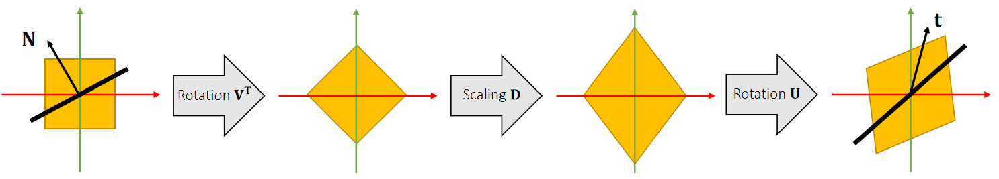
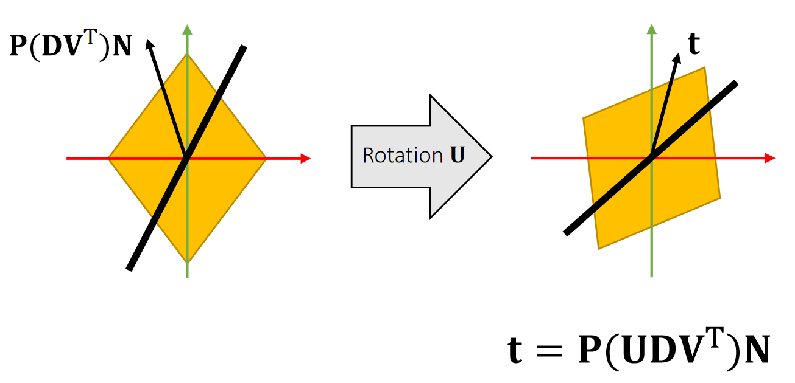
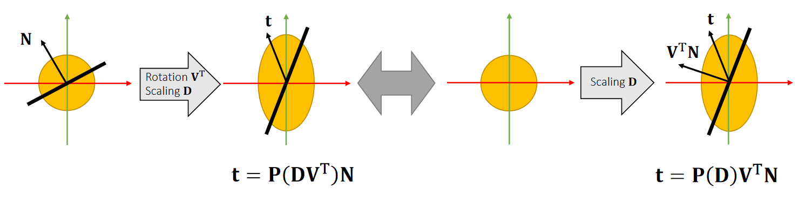
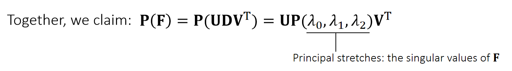
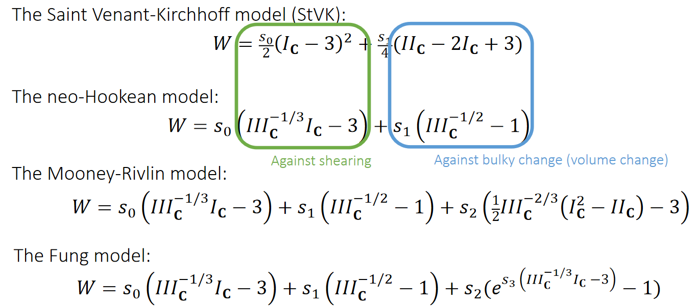
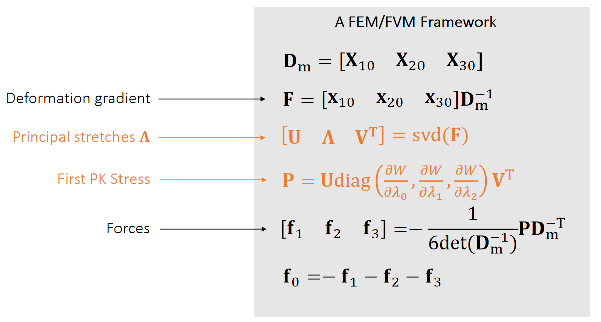
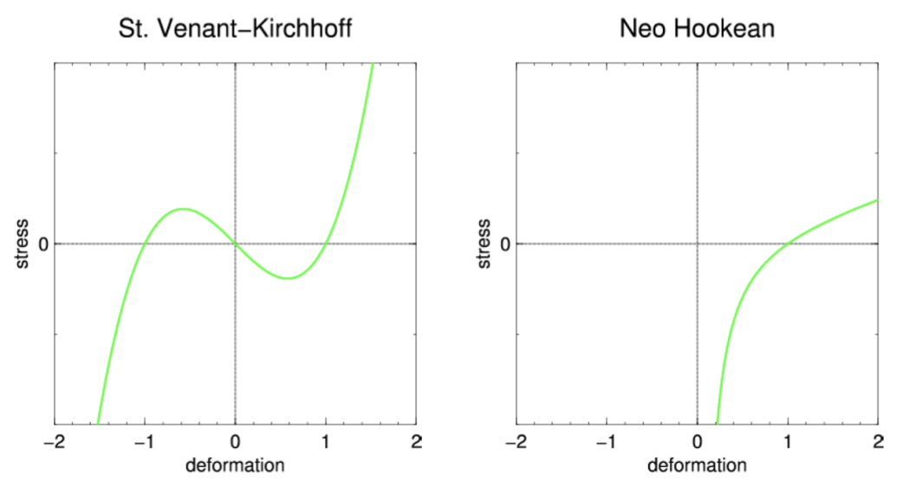
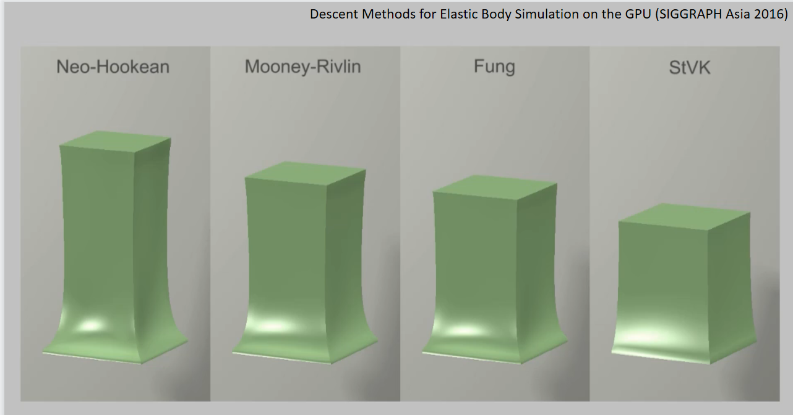

P28   
# Hyperelastic Models   

> &#x2705; 前面的内容，都假设使用 StVK 材料、优点是简单；缺点是无法处理反转。因此在材料力学中不常用。  
> &#x2705; Hyperplasia 利用能量密度(W)、提供一个从 Strain (G) 到 Stress (S)的映射   
 
Lecture 3 [17:18]     
Stress：材料恢复自身形状的内力，应力。     
Strain：应变。     

P29   
### 材料参数和超弹性模型     

定义：     
We treat the first Piola–Kirchhoff stress tensor \\(\mathbf{P}\\) as a function of deformation gradient \\(\mathbf{F}\\):     

函数 \\(\mathbf{P(F)}\\) 中除了变量 \\(\mathbf{F}\\)，还包其它超量，这些参数就是材料系数。Lecture 3 [22:17]  

不同的 \\(\mathbf{P}\\) 的定义方式称为超弹性模型     
Lecture 3 [25:45]     
  

$$
\mathbf{f} _0= −\frac{\mathbf{P} (\mathbf{F} )}{6}(\mathbf{X} _{10}×\mathbf{X} _{20}+\mathbf{X} _{20}×\mathbf{X} _{30}+\mathbf{X} _{30}×\mathbf{X} _{10})
$$

It converts an interface normal \\(\mathbf{N}\\) in the reference state to a traction \\(\mathbf{t}\\) in the deformed state. 

$$
\mathbf{t}=\mathbf{P} (\mathbf{UDV^T} )\mathbf{N} 
$$

  

P30  
### Rotation-Invariance    

The stress tensor \\(\mathbf{P}\\) is rotation-invariant to \\(\mathbf{U}\\):    

  

$$
\mathbf{P} (\mathbf{UDV^T} )=\mathbf{UP} (\mathbf{DV^T} )
$$

> &#x2705; 没讲，

P31  
### Isotropic Materials     

The stress tensor \\(\mathbf{P}\\) is rotation-invariant to \\(\mathbf{U}\\):    

  

$$
\mathbf{P} (\mathbf{DV^T} )=\mathbf{P} \mathbf{(D)V^T} 
$$

> &#x2705; 没讲，

P32   
## Isotropic Materials    

> Isotropic Materials：各向同性材料

   

> &#x2705; 符号解释：\\(\mathbf{P}\\)：First Piola Stress、 \\(\mathbf{F}\\)：Deformation Gradient  
> &#x2705; 各向同性公式认为：\\(\mathbf{P}\\) 是关于 \\(\mathbf{F}\\) 的函数  
> &#x2705; 对F做 \\(\mathbf{SVD}\\) 分解可得到 \\(\mathbf{UDV^T}\\)，其中\\(D\\)是对角矩阵、其对角元素描述了三个方向的拉伸的量、把公式中的旋转分量剔除掉、 \\(\mathbf{P}\\) 只与 Principal stretches 有关。    

In many literatures, people parameterize \\(\mathbf{P} (I_\mathbf{C},II_\mathbf{C},III_\mathbf{C} )\\) by principal invariants, for:    

$$
I_\mathbf{C} =\mathrm{trace} (\mathbf{C} )=λ_0^2+λ_1^2+λ_2^2
$$

$$
III_\mathbf{C} =\mathrm{det} (\mathbf{C} ^2)=λ_0^4+λ_1^4+λ_2^4
$$

$$
II_\mathbf{C} =\frac{1}{2} (\mathrm{trace} ^2(\mathbf{C} )−\mathrm{trace} (\mathbf{C} ^2))=λ_0^2λ_1^2+λ_0^2λ_2^2+λ_1^2λ_2^2
$$

\\(\mathbf{C=U^TU}\\) is the right Cauchy-Green deformation tensor.    

> &#x2705; \\(I_c、 II_c、 III_c\\) 的定义是基于材料学、数学的先验知识     

P33   
## Isotropic Models    

   

> &#x2705; 材料力学中更常用 neo-Hookean    
> &#x2705; Fung常用来模拟人体组织。  

P34   
## 计算P   

Anyway, we still use the principal stretches for computation:   

$$
\mathbf{P} (λ_0,λ_1,λ_2)=\begin{bmatrix}
 \frac{∂W}{∂λ_0}  & \Box  &\Box  \\\\
 \Box  & \frac{∂W}{∂λ_1}  & \Box \\\\
 \Box  & \Box  &\frac{∂W}{∂λ_2} 
\end{bmatrix}
$$

And we compute the first Piola-Kirchhoff stress as:   

$$
\mathbf{P} = \mathbf{UP} (λ_0,λ_1,λ_2)\mathbf{V} ^\mathbf{T} 
$$

P35   
## A Quick Summary

   

> &#x2705; 主要是算P的方法不同

P36    
## The Limitation of StVK    

   

Irving et al. 2004. *Invertible Finite Elements For Robust Simulation of Large Deformation*. SCA    

> &#x2705; 纵轴是力、横轴长度为弹簧长度、参考长度是1， 因此横轴为1时纵轴为0. 横轴 > 1 代表拉伸、拉伸越大代表力越大。但压缩时， \\(StVK\\) 表现出的力不对，且当弹簧（四面体）反转以后，力也会反转，这种表现也不对，因为最后会停在横轴-1的状态上。    

P37  

   

> &#x2705; Poison Effect： 弹性体往上拉时两边会凹进去，本质原因是保体积。   

---------------------------------------
> 本文出自CaterpillarStudyGroup，转载请注明出处。
>
> https://caterpillarstudygroup.github.io/GAMES103_mdbook/