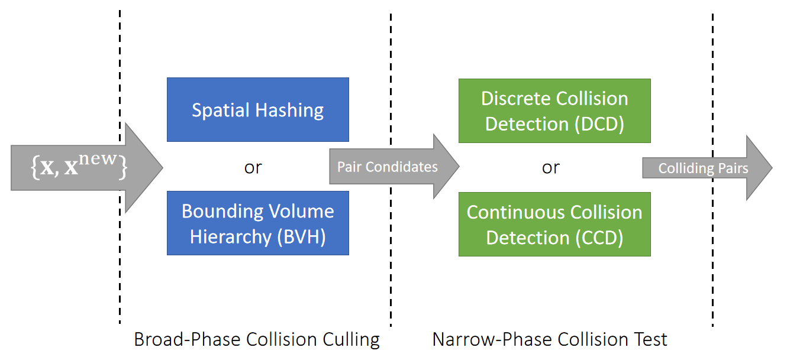
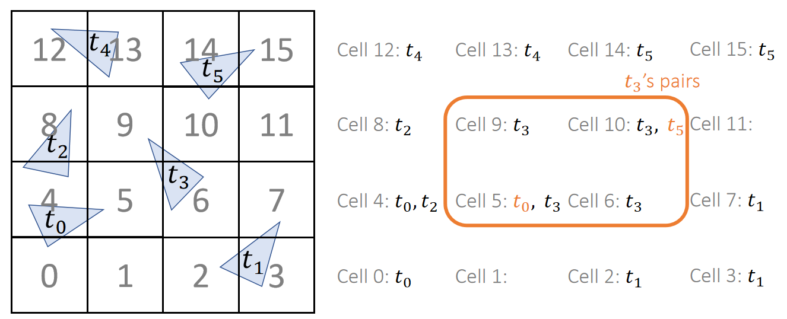
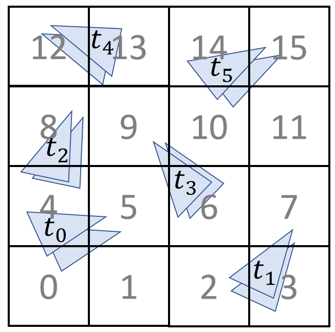
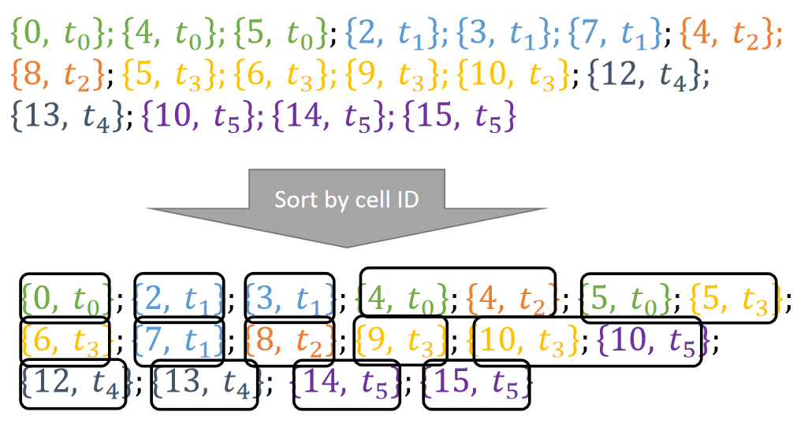
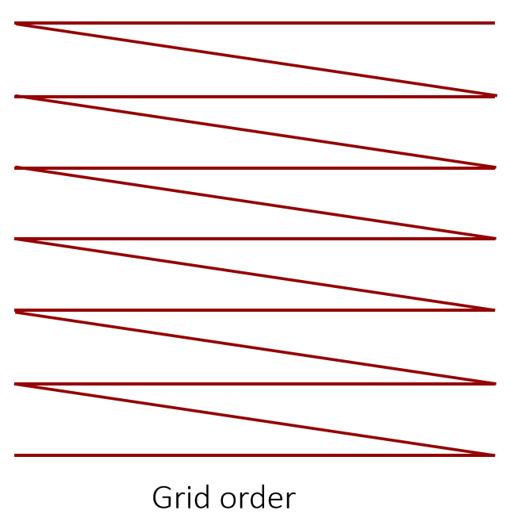
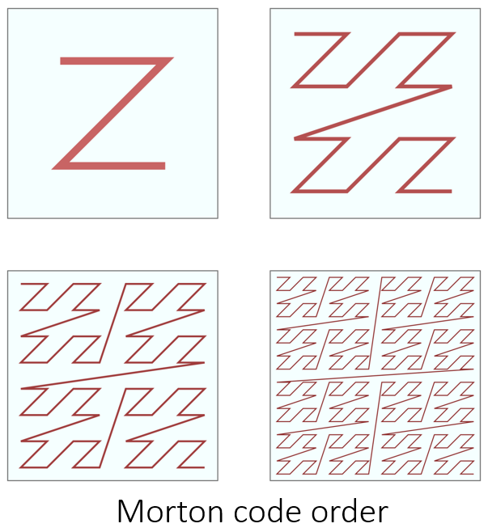
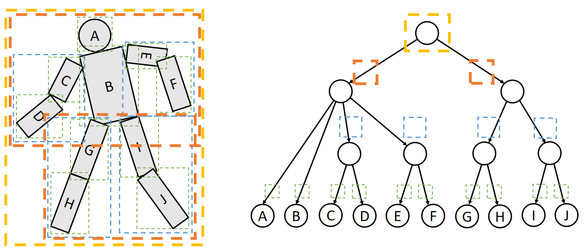
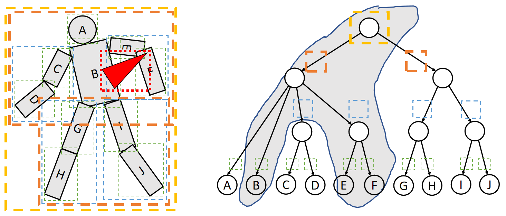
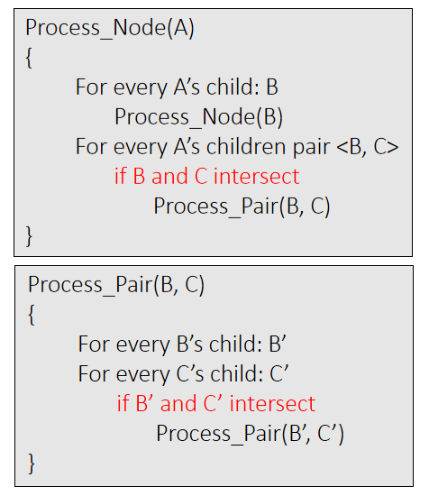
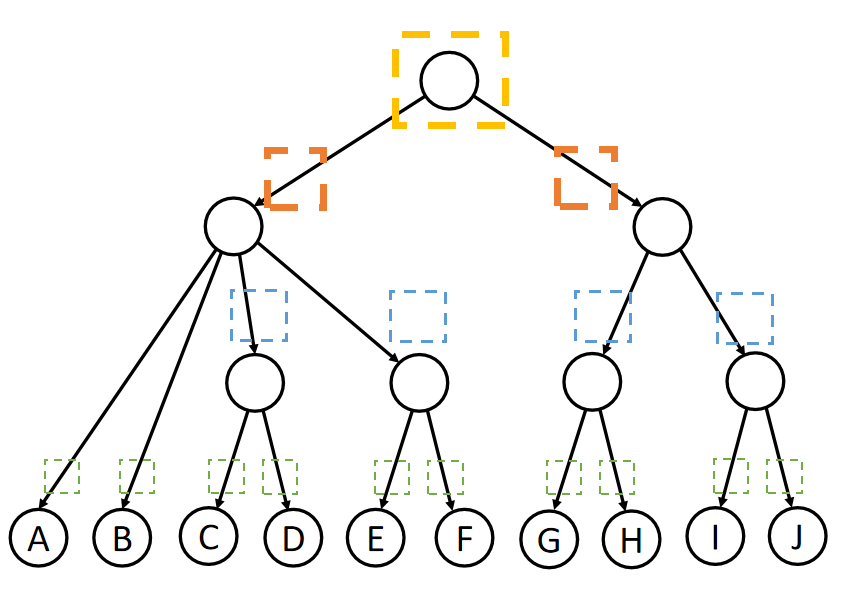

P4  
# Collision Detection Pipeline    

    

P5    
# Spatial Partitioning    

Spatial partitioning divides the space by a grid and stores objects into grid cells.     

P6   

## 静止场景
To find pair candidates for collision test, we just have to check the grid cells.      

    

P7   
## 运动场景    

If we need to consider moving objects, we just expand the object region.    

    

P8   
## 数据存储    

  
Instead of allocating **memories** to cells, we can build an object-cell list and then sort them. This avoids memories wasted in empty cells.     

    

> &#x2705; 用 hash 链表代替数组    
> &#x2705;要解决的问题：3D空间需要划分出大量的小格。有的格子可能包含很多object. 大多数格子可能没有object.    
> &#x2705;方法：3D数组转为list表示法。  
> &#x2705;缺点：内存访问不连续。   

P9   
## Morton Code   

One question is how to define the cell ID. Using the grid order is not optimal, since it cannot be easily extended and it is lack of locality. Morton code uses a Z-pattern instead.     

    

> &#x2705; 希望内存访问尽量连续。也就是下一次访问的内存地址在上次的附近    
> &#x2705; Giid Order：横向访问连续、纵向访问不连续、三维情况会更严重。   

    

> &#x2705; Morton Code：一种对格子编号的顺序。   

P10   
## After-Class Reading   

GPU Gems 3    

Chapter 32. Broad-Phase Collision Detectionwith CUDA    

P14   
# Bounding Volume Hierarchy

Bounding volume hierarchy is built on geometric/topological proximity of objects.     

> &#x2705;空间划分→物体划分   

## 构造BVH
    

P15   
## 外部物体与身体相交检测  

To find elements potentially in collision with an object, we just traverse the tree.    

    

P16  
## Bounding Box   

<u>Axis-aligned bounding box (AABB)</u> is the most popular bounding volume. Besides that, there are also <u>spheres</u> and <u>oriented bounding box (OBB)</u>.     

Two AABBs intersect if and only if they intersect in every axis.     

P17    
## 自相交检测    

To process **self collisions** by BVH, we define two procedures.     

   

   

P18   
## Bounding Volume Hierarchy   

The performance depends on the effectiveness of culling.    
 
Zheng and James. 2012. *Energy-based Self-Collision Culling for Arbitrary Mesh Deformations*. TOG (SIGGRAPH)

> &#x2705; 对每个区域计算能量，根据形变能量的大小来判断有没有可能相交，此方法不适用于衣服，因为在衣服模拟中大形变很常见、不代表有相交。   

Changxi Zheng, Doug L.James, Cornell University   

P19   
# Comparison between SH and BVH   

 - Spatial Hashing    
    - Easy to implement    
    - GPU friendly    
    - Needs to <u>recompute</u> after updating objects    

 - Bounding Volume Hierarchy    
    - More involved    
    - Not GPU friendly    
    - To update BVH, just update bounding volumes    
    
    
> &#x2705; CUDA 代码. INVIDI 代码通常使用SH。GPU 喜欢简单粗爆的数据结构，BVH相对于GPU过于复杂。   

---------------------------------------
> 本文出自CaterpillarStudyGroup，转载请注明出处。
>
> https://caterpillarstudygroup.github.io/GAMES103_mdbook/