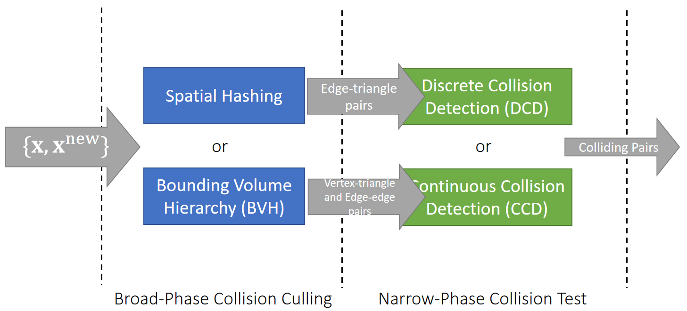

P20   
# Collision Detection Pipeline    

   

> &#x2705; 图画得不对。 DCD 和CCD对输入的需求不同，但SH和 BVH 跟这两种输入不是 一一 对应的关系。   
> &#x2705; 但DCD和CCD对输入的要求是不一样的。
> P20页所谓的 D 还是 C,是以时间角度说的。   

P21   
# Discrete Collision Detection (DCD)    

DCD tests if any intersection exists in each state at discrete time instant: \\(\mathbf{x}^{[0]}\\), \\(\mathbf{x}^{[1]}\\), …

> &#x2705; 准确来说。DCD检测的不是碰撞，而是相交    

## edge-triangle intersection

To a triangle mesh, the basic test is <u>edge-triangle intersection</u> test.     

   

   

> \\(t\\) 代表相交位置对应 \\(\mathbf{x}_a\\) 和\\(\mathbf{x}_b\\)的插值量     

> &#x2705;检测在特定状态下是否相交，每一帧都不相交就认为无碰撞。   
> &#x2705; 相交和碰撞的区别：相交分析的是运动前后的状态、碰撞检测的是运动的过程、未相交不一定无碰撞、

P22   
## Tunneling   

DCD is simple and robust, but it suffers from the tunneling problem: objects penetrating through each other without being detected.     

   

> tunneling problem：当物体运动特别快时，有可能的穿透另一物体而没有被检测到，常见于细薄物体、例如衣服     
> 这种情况无相交但是有碰撞  

P23   
# Continuous Collision Detection (CCD)    

CCD tests if any intersection exists between two states: \\(\mathbf{x} ^{[0]}\\) and \\(\mathbf{x} ^{[1]}\\).    

To a triangle mesh, there two basic tests: <u>vertex-triangle</u> and <u>edge-edge</u> tests.      

## vertex-triangle tests

   

   

> &#x2705; 当四点共面时，构成的四面体体积为0、利用四面体的体积公式，可求出四点共面的时间 \\(t\\) . **这里的**\\(\mathbf{t}\\)**是时间**    
> &#x2705; 假设运动是匀速的，\\( \mathbf{x}_ {30}(t)、 \mathbf{x}_ {10}(t)、\mathbf{x}_ {20}(t)\\)都是关于\\(t\\)的线性函数。   
> &#x2705; 一元三次方程有公式解，但用到\\(\sqrt[3]{\cdot}\\)，因此不建议使用，建议用牛顿法。因为\\(\sqrt[3]{\cdot }\\) 的误差非常大。    

P24   
## edge-edge tests.       

> &#x2705;为什么要检测边边相交，因为有可能三角形相交但点面没有相交。   

   

   

> &#x2705; 先求四点共面的 \\(t\\)       
> &#x2705; 解一元三次方程也不建议牛顿法，而是二分法，因为\\(t\\)的范围是[0,1]   

P25   
## Issues with CCD   

 - Floating-point errors, especially due to root finding of a cubic equation    
    - Buffering epsilons, but that causes **false positives**.     
    - Gaming GPUs often use single floating-point precision.   

> &#x2705; 游戏 GPU 以单精度为主，因此要注意浮点误差问题。     

 - Computational costs: more expensive than DCD.   
    - Some argue that broad-phase collision culling is the bottleneck.   

 - Difficulty in implementation.    
 

P26   
## After-Class Reading    

Bridson et al. 2002. *Robust Treatment of Collisions, Contact and Friction for Cloth Animation. TOG (SIGGRAPH)*.    

Relative simple explicit integration of cloth dynamics    
