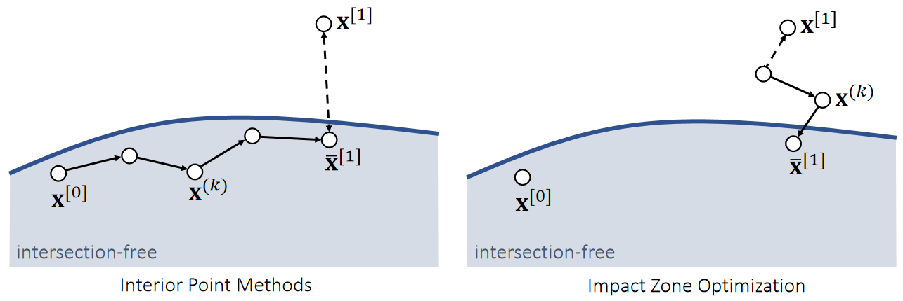
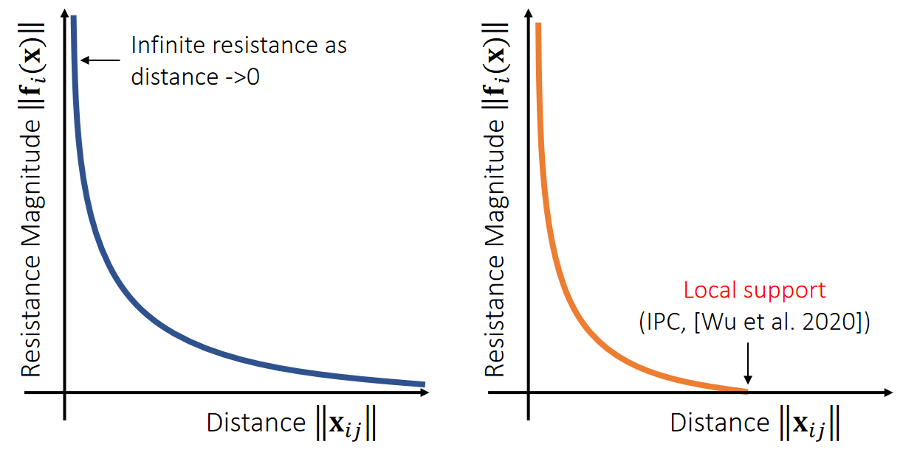
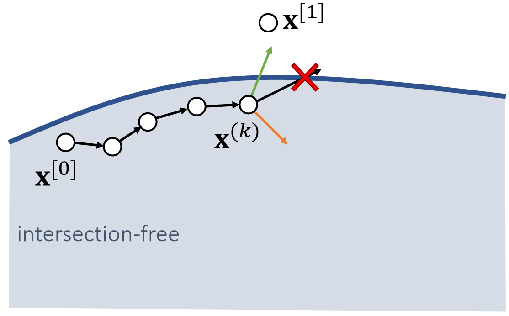
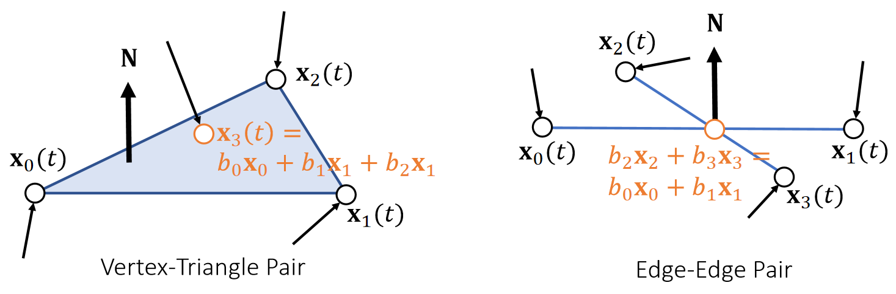
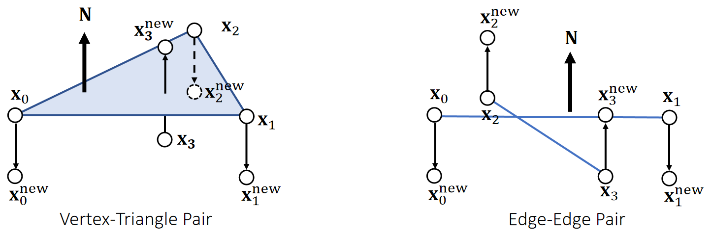
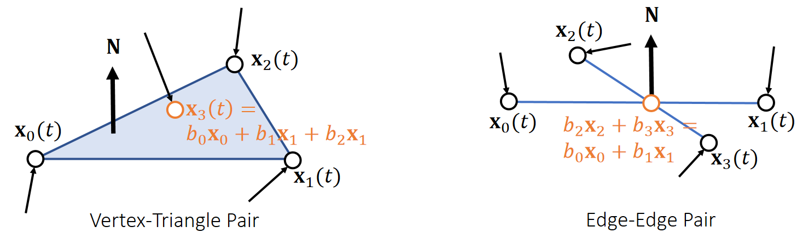
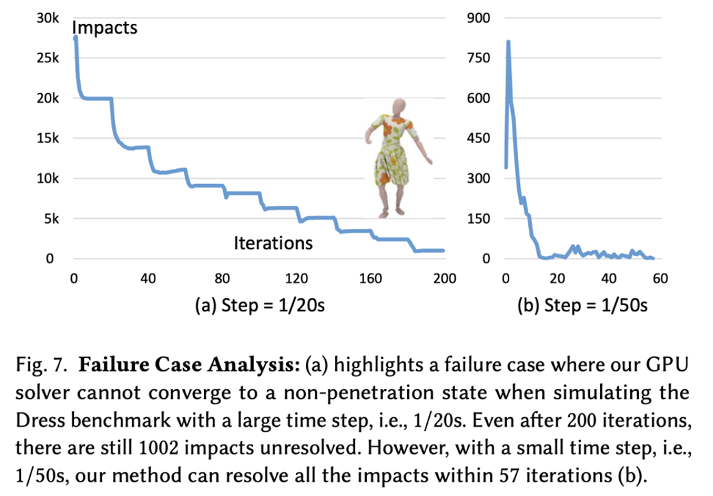
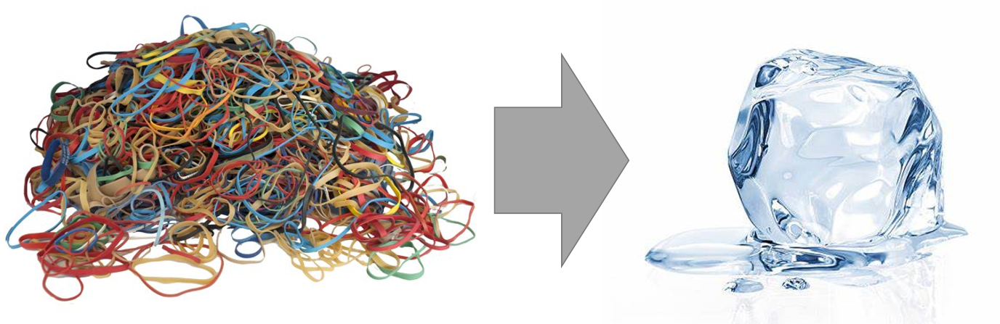
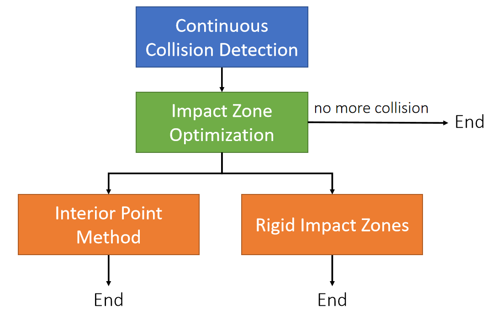

P27      
# Continuous Collision Response    

> &#x2705; 发现碰撞的pairs后如何处理。   

P28   
## Interior Point Methods and Impact Zone Optimization

> &#x2705; 这是两个大的套路，不是具体的方法。

Given the calculated next state \\(\mathbf{x} ^{[1]}\\), we want to update it into \\(\bar{\mathbf{x} } ^{[1]}\\), such that the path from \\(\mathbf{x} ^{[0]}\\) to \\(\bar{\mathbf{x} } ^{[1]}\\) is intersection-free.    

   

> &#x2705; 整个图代表刚体的状态空间而不是位置空间。    
> &#x2705; 每个小圆点代表一个刚体状态，而不是一个粒子。   
> &#x2705; \\(\mathbf{x} \\) 是刚体状态的表示符，至少包含质心的状态和旋转信息。   
       

||内点法|Impact Zone 法||
|---|---|---|---|
||&#x2705; 从\\(\mathbf{x}^{[0]}\\)出来，朝\\(\mathbf{x}^{[1]}\\)走，并永远保证只在安全区域走，直到不能走为止。|&#x2705; 从\\(\mathbf{x}^{[1]}\\)出发，反复优化结果（投影），直到回到安全区域为止。|&#x2705; 蓝色区域为安全区域|
|优点|Always succeed|Fast.   1. Close to solution.   2. Only vertices in collision (impact zones).   3. Can take large step sizes. | &#x2705; Impact Zone：1. \\(\mathbf{x}^{[1]}\\)通常离安全区域不太远，且优化时只针对 Impact Zone 优化，因此快。  2. 只有\\(\mathbf{x}\\)不在安全区域时才需要做。    &#x2705; 内点：哪怕\\(\mathbf{\bar{x}}^{[1]}\\)最终没有到最佳位置，但能保证一定在安全区域，因此一定成功。|
|局限性|Slow.    1. Cautiously by small step sizes.   2. Far from solution.   3. All of the vertices.  | May not succeed.| &#x2705; 内点：1. 为保证每一步安全，步长不能太大，因此慢。  2. \\(\mathbf{x}^{[0]}\\)和\\(\mathbf{x}^{[1]}\\)可能比较远，也导致慢。   3. 每一次都必须要做|   

P30   
## Log-Barrier Interior Point Methods   

### 算法过程

For simplicity, let’s consider the Log-barrier repulsion between two vertices.     

$$E(\mathbf{x} )=−\rho \text{ log} ||\mathbf{x} _{ij}||$$    

$$
\mathbf{f} _i(\mathbf{x} )=−∇_iE=ρ\frac{\mathbf{x} _ {ij}}{||\mathbf{x} _ {ij}||^2} \\\\
\mathbf{f} _j(\mathbf{x} )=−∇_jE=−ρ\frac{\mathbf{x} _ {ij}}{||\mathbf{x} _{ij}||^2}
$$

> &#x2705; 用 Log 定义能量、前面某一节课讲过。距离 → 能量 → 斥力    

   

> &#x2705; 不需要互斥力一直存在，因此做了一个截断（IPC）      

P31   
### 算法实现      

We can then formulate the problem as:   

$$
\bar{\mathbf{x} }^ {[1]}\longleftarrow \mathrm{argmin} _\mathbf{x} (\frac{1}{2} ||\mathbf{x} −\mathbf{x} ^{[1]}||^2−ρ\sum \mathrm{log} ||\mathbf{x} _{ij}||)
$$

> &#x2705; 优化目标：点的位置与目标位置（穿模）尽量接近，然后优化。   

Gradient Descent:    

>\\(\mathbf{x} ^{(0)}\longleftarrow \mathbf{x} ^{[0]}\\)   
For \\(k=0…K\\)    
$$\mathbf{x} ^{(k+1)}\longleftarrow \mathbf{x} ^{(k)}+α(\mathbf{x} ^{[1]}−\mathbf{x} ^{(k)}+ρ\sum \frac{\mathbf{x} _{ij}}{||\mathbf{x} _{ij}||^2})$$ 
\\(\bar{\mathbf{x} }^ {[1]}\longleftarrow \mathbf{x} ^{(k+1)}\\)

The step size \\({\color{Red} α}\\) must be adjusted to ensure that no collision happens on the way.  To find \\({\color{Red} α}\\), **we need collision tests**.    

   

> &#x2705; 绿色是来自\\(\mathbf{x}^{[1]}\\)的引力，黄色是来自边界的斥力、关键是步长\\(\alpha \\)， 每走一小步都需要反复的碰撞检测。   

P32    
## Impact Zone Optimization    

The goal of impact zone optimization is to optimize \\(\mathbf{x}^{[1]}\\) until it becomes intersection-free. (This potentially suffers from the tunneling issue, but it’s uncommon.)     

$$
\bar{\mathbf{x} }^{[1]}\longleftarrow \mathrm{argmin} _\mathbf{x}  \frac{1}{2} ||\bar{\mathbf{x} }-\mathbf{x}^{[1]}||^2
$$  

$$
\text{such that}
\begin{cases}
 C(\mathbf{x} )=−(\mathbf{x} _3−b_0\mathbf{x} _0−b_1\mathbf{x} _1−b_2\mathbf{x} _1)\cdot \mathbf{N} ≤0 & \text{ For each detected vertex-triangle pair }  \\\\
 C(\mathbf{x} )=−(b_2\mathbf{x} _2+b_3\mathbf{x} _3−b_0\mathbf{x} _0−b_1\mathbf{x} _1)\cdot \mathbf{N}≤0 & \text{ For each detected edge-edge pair }
\end{cases}
$$

   

> &#x2705; 利用 constrain（不是能量）转化成优化问题，具体没讲。  

P33   
### Geometric Impulse   

The goal of impact zone optimization is to optimize \\(\mathbf{x}^{[1]}\\) until it becomes intersection-free. (This potentially suffers from the tunneling issue, but it’s uncommon.)     

   

Every pair gives new positions to the involved vertices.  We can combine them together in a Jacobi, or Gauss-Seidel fashion, just like position-based dynamics.     

P34    
### After-Class Reading (Cont.)   

Bridson et al. 2002. *Robust Treatment of Collisions, Contact
and Friction for Cloth Animation. TOG (SIGGRAPH)*.     

Relative simple explicit integration of cloth dynamics     

P35   
### Augmented Lagrangian     

$$
\bar{\mathbf{x} }^{[1]}\longleftarrow \text{argmin} _\mathbf{x}  \frac{1}{2} ||{\mathbf{x} }-\mathbf{x}^{[1]}||^2
$$  

$$
\text{such that}
\begin{cases}
 C(\mathbf{x} )=−(\mathbf{x} _3−b_0\mathbf{x} _0−b_1\mathbf{x} _1−b_2\mathbf{x} _1)\cdot \mathbf{N} ≤0 & \text{ For each detected vertex-triangle pair }  \\\\
 C(\mathbf{x} )=−(b_2\mathbf{x} _2+b_3\mathbf{x} _3−b_0\mathbf{x} _0−b_1\mathbf{x} _1)\cdot \mathbf{N}≤0 & \text{ For each detected edge-edge pair }
\end{cases}
$$

  

P36   
### Augmented Lagrangian    

We can then convert it into an unconstrained form:   

$$\bar{\mathbf{x} } {[1]}\longleftarrow \text{argmin}_{x,λ}(\frac{1}{2} ||\mathbf{x} −\mathbf{x} ^{[1]}||^2+\frac{ρ}{2} ||\text{max}(\tilde{C}  (\mathbf{x} ))||^2−\frac{1}{2ρ}||\mathbf{λ} ||^2)
$$

$$
\tilde{C}  (\mathbf{x})= \text{max}(\mathbf{C} (\mathbf{x} )+\mathbf{λ} /ρ)
$$

Augmented Lagrangian:    

> \\(\mathbf{x} ^{(0)} \longleftarrow \mathbf{x} ^{[0]}\\)    
\\(\mathbf{λ \longleftarrow 0} \\)    
For \\(k=0…K\\)    
$$\mathbf{x} ^{(k+1)} \longleftarrow \mathbf{x} ^{(k)}−α∇(\frac{1}{2} ||\mathbf{x} −\mathbf{x} ^{[1]}||^2+\frac{ρ}{2} ||\text{max}(\tilde{C} (\mathbf{x} ))||^2−\frac{1}{2ρ}||\mathbf{λ} ||^2)$$  
\\(λ\longleftarrow ρ\tilde{C} (\mathbf{x} )\\)   
\\(\bar{\mathbf{x} } ^{[1]}\longleftarrow \mathbf{x} ^{(k+1)}\\)

Tang et al. 2018. I-Cloth: *Incremental Collision Handling for GPU-Based Interactive Cloth Simulation*. TOG. (SIGGRAPH Asia)    

P37   
### About Impact Zone Optimization   

 - Fast per iteration    
    - Only have to deal with vertices in collision.    

 - Convergence sensitive to \\(||\mathbf{x} ^{[0]}−\mathbf{x} ^{[1]}||^2\\), or the time step \\(∆t\\)      
    - Can take many iterations to, or never achieve *intersection-free*.   
    - Easy solution is to reduce \\(∆t\\), but that increases total costs.    

    

P38    
## Rigid Impact Zones    

The rigid impact zone method simply freezes vertices in collision from **moving in their pre-collision state**. It’s simple and safe, but has noticeable artifacts.     

    

> &#x2705; 检测到碰撞，则把这个区域退回到上一帧。   

P39   
# A Practical System   

    

> &#x2705; 有碰撞，先做 Impact Zone. 因为这个快、不能解决再用后面方法、计算量不允许则选择 Rigid Impact.   

---------------------------------------
> 本文出自CaterpillarStudyGroup，转载请注明出处。
>
> https://caterpillarstudygroup.github.io/GAMES103_mdbook/