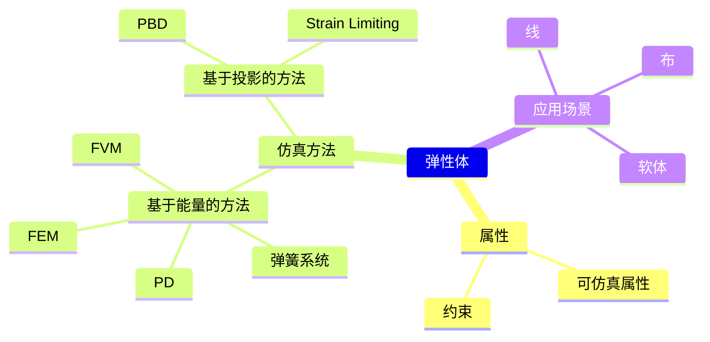

```mermaid
mindmap
弹性体
    属性
        可仿真属性
        约束
    仿真方法
        基于能量的方法
            弹簧系统
            PD
            FVM
            FEM
        基于投影的方法
            PBD
            Strain Limiting
    应用场景
        线
        布
        软体
```