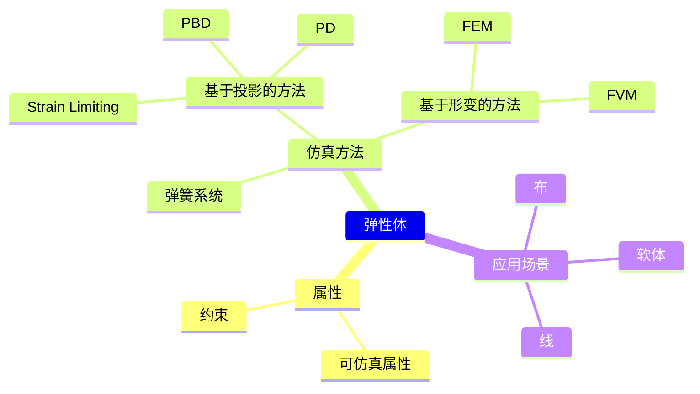

```mermaid
mindmap
弹性体
    属性
        可仿真属性
        约束
    仿真方法
        弹簧系统
        基于投影的方法
            PBD
            PD
            Strain Limiting
        基于形变的方法
            FEM
            FVM
    应用场景
        线
        布
        软体
```