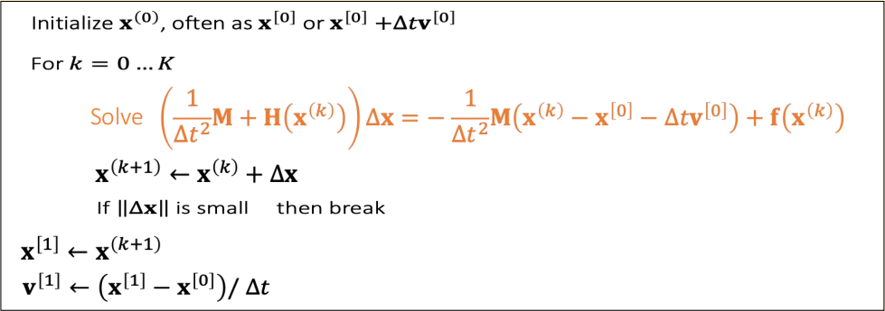

P4   
# 弹簧质点模型   

> &#x2705; 整体流程就像是对 Mesh 上的每个顶点独立地进行粒子仿真，只是力变得复杂，因为在粒子之间增加了弹簧。当弹簧发生形变，就产生了弹簧力（内力）。  
> &#x2705; 通过在粒子间构造弹簧来约束 Mesh 边长尽量不变。通过构造网状的弹簧系统来保证 Mesh 面片不发生形变。通过增加对角顶点的弹簧来约束 Mesh 体积上的形变。   

积分可以是显式积分或者隐式积分。如果是显式积分，由力得到速度，速度更新状态。  

但显式积分存在不稳定性问题，在图形学中更常用的是隐式积分。  

> &#x2705; 本节课所讲的套路：分析力/能量 → 隐式积分 → 通过优化解积分 → 更新，对弹簧系统、有限元、弹性体等各种物理模拟同样适用。区别在于如何构造能量和解优化问题。     

## 构建弹簧系统    

### An Ideal Spring —— 一个端点     

> &#x2705; Energy：物理上的弹性势能    
> &#x2705; Force：物理上的力，是 Energy 的 gradient 的反方向; 公式后面有个 T,来源于前面的\\(\nabla \\)，直观解释，前面是力的大小，后面是力的方向。   
> &#x1F50D; Choi and Ko. 2002. Stable But Responive Cloth. TOG (SIGGRAPH) --- 以上公式推导的详细过程   

### An Ideal Spring —— 两个端点     

$$
\mathbf{f} _ i(\mathbf{x} )=−∇ _ i\mathbf{E} =−k(||\mathbf{x} _ i −\mathbf{x} _ j||−L)\frac{\mathbf{x} _ i −\mathbf{x} _ j}{||\mathbf{x} _ i −\mathbf{x} _ j ||} \\\\
\mathbf{f} _ j(\mathbf{x})=−∇ _ jE=−k (||\mathbf{x} _ j −\mathbf{x} _ i ||−L)\frac {\mathbf{x} _ j −\mathbf{x} _ i}{||\mathbf{x} _ j −\mathbf{x} _ i||}
$$

P5  
### Multiple Springs   

When there are many springs, the energies and the forces can be simply summed up.     

    

$$
E= {\textstyle \sum_{e=0}^{3}}E_e= {\textstyle \sum_{e=0}^{3}} (\frac{1}{2} k(||\mathbf{x} _i −\mathbf{x}_e ||−L_e)^2)
$$

$$
f_i=−\nabla_iE = \textstyle \sum_{e=0}^{3}(−k(||\mathbf{x}_i−\mathbf{x}_e||−L_e)\frac{\mathbf{x}_i−\mathbf{x}_e}{||\mathbf{x}_i−\mathbf{x}_e||})
$$

> &#x2705; 能量和力都是可以叠加的

## 积分系统——显式积分  

P12   
与粒子仿真相同。每个 Mesh 顶点根据受力更新位置的过程涉及积分。积分离散化也可以是显式、隐式、半隐式。    
   
Explicit integration suffers from **numerical instability** caused by <u>overshooting</U>, when the stiffness \\(k\\) and/or the time step \\(∆t\\) is too large.     

> &#x2705; Explicit：当前力 → 当前速度 → 当前位置   
显式积分不稳定，如果 \\(Δt\\) 或 \\(k\\) 太大，会导致 overshooting。   

A naive solution is to use a small \\(∆t\\) . But that slows down the simulation.    

> &#x2705; 解决方法：减小\\(\Delta t\\)。但这个方法不解决本质问题，且会降低整个模拟系统的效率   
> &#x2705; 本质上是\\(Δt\\)太大导致积分近似的结果与实际积分的结果有很大误差，\\(k\\)太大或\\(Δt\\)只是让这个问题更明显，减小\\(k\\)或\\(Δt\\)问题仍然存在。   

P13  
## 积分系统——隐式积分   

Implicit integration is a better solution to numerical instability.  The idea is to integrate both **x** and **v** implicitly.   

> &#x2705; Explicit和Implicit都是用某个时刻的力代表整个 \\(Δt\\) 时间的力，就都会出现上述误差。   
> &#x2705; 区别在于，Explicit用当前力，往往使结果变大，产生爆炸，Implicit用未来力，往往使结果变小，产生消失。  
> &#x2705; 消失只是结果不对。但爆炸会让结果崩溃，这是最不可接受的问题。因此用隐式代替显式。  

隐式积分相对稳定，可以使用稍大的 \\(Δt\\)，但也存在以下问题：    
1. 实现复杂，因此难以优化。    
2. 每个 \\(Δt\\) 的求解更耗时，因此不一定会更快。     
3. 可能出现数值振荡。     

### 二元非线性方程组 -> 一元非线性方程

隐式积分用未来力计算未来速度，用未来速度计算未来位置。未来力，未来速度，未来位置都是未知量，不能直接求解，需要解方程。   

> &#x2705; 粒子和刚体的仿真中使用了半隐式积分(现在的力，未来的速度)。    

    

> &#x2705; 质点的质量可以不同吗？   
答：可以不同。先根据三角形的面积计算三角的质量，再把质量分配到各个顶点上。   
M是一个3n*3n的对角矩阵，具体形式为：  
$$
M = \begin{pmatrix}
m_1 I_3 & 0 & \cdots & 0 \\
0 & m_2 I_3 & \cdots & 0 \\
\vdots & \vdots & \ddots & \vdots \\
0 & 0 & \cdots & m_n I_3
\end{pmatrix}
$$

假设F是一个保守力，即F是只与x有关的非线性函数，那么公式中的f[1]不是一个新的未知量。  

> &#x2705; holonomic：力的大小和方向只跟位置有关，跟速度无关。例如重力，弹力。那么 \\(f\\)可以写成关于位置的函数\\(f(x)\\)。但\\(f(x)\\)不一定是线性的。

公式 2 代入公式 1 并消元，得：    

$$
\mathbf{v} ^{[1]}=\mathbf{v}^{[0]}+∆t\mathbf{M} ^{−1}\mathbf{f} (\mathbf{x}^{[0]}+∆t\mathbf{v} ^{[1]})
$$

或把公式1代入公式2并消元，得：

消元得：    
$$
\mathbf{x} ^{[1]}=\mathbf{x} ^{[0]}+\Delta t\mathbf{v} ^{[0]}+\Delta t^2\mathbf{M} ^{-1}\mathbf{f}(x^{[1]})
$$   

对x或v消元，解法都是类似的。最后都转化为解非线性方程的问题。

### 线性近似法：求解一元非线性方程->解线性系统    

> &#x2705; 近似成线性问题后直接解方程。这种方法相当于每一个Step做了一次牛顿法。  

以对x消元结果为例，\\(\mathbf{f}\\) 在 \\(\mathbf{x}^{[0]}\\) 处泰勒展开，得：     

$$ 
\mathbf{v} _{t+1}=\mathbf{v}_t+∆t\mathbf{M} ^{−1}[\mathbf{f} (\mathbf{x}_t)+\frac{\partial \mathbf{f} }{\partial \mathbf{x} }(\mathbf{x} _t) ∆t\mathbf{v} _{t+1}] 
$$

整理后得:     

$$
[\mathbf{I}-∆t^2\mathbf{M} ^{−1}\frac{\partial \mathbf{f} }{\partial \mathbf{x} }(\mathbf{x} _t)  ]\mathbf{v} _{t+1}=\mathbf{v}_t+∆t\mathbf{M} ^{−1}\mathbf{f} (\mathbf{x}_t)
$$

这就成了一个解线性系统的问题。解线性系统见[Linear Solver](../Math/LinearSolver.md)       

> 问：为什么不直接求逆？    
答：求逆太贵     

这个公式再泛化一下，引入一个beta，就可以把隐式积分与之前的显式积分、中点法积分统一起来。   

$$
[\mathbf{I} -\beta \Delta t^2\mathbf{M} ^{-1}\frac{\partial \mathbf{f} }{\partial \mathbf{x} }(\mathbf{x} _t )]\mathbf{v} _{t+1}=\mathbf{v} _t+\Delta t\mathbf{M} ^{-1}\mathbf{f} (\mathbf{x} _t)
$$

&#x2776; \\(\beta\\) = 0: forward/semi-implicit Euler (explicit)    
&#x2777; \\(\beta\\) = 1/2: middle-point (implicit)      
&#x2778; \\(\beta\\) = 1: backward Euler (implicit)       

### 方法二：求解一元非线性方程->优化问题

构造优化目标F(x)：

$$
F(\mathbf{x}) = \frac{1}{2∆t^2}||\mathbf{x} −\mathbf{x} ^{[0]}−∆t\mathbf{v} ^{[0]}||_\mathbf{M}^2+E(\mathbf{x} )
$$

有：
$$
\mathbf{x} ^{[1]} = \argmin F(\mathbf{x})
$$

> &#x2705; 前面方程解\\({x} ^{[1]}\\)等价于F(x)函数极小点。等价转换的推导在**补充1**。非线性方程问题为转化为优化问题。  
> &#x2705; 其中：\\(\mathbf{M}\\)对角矩阵，描述质量，\\(3N \times 3N\\)。\\(\mathbf{x}\\)为 \\(3N\times 1\\)矢量,描述顶点信息。\\(E\\) 为所有的力的能量。\\(\mathbf{||x||_M^2=x^TMx} \\)。  
> &#x2705; 只有保守力能用能量描述、非保守力（例如摩擦力）则不行。       

定义 \\(\mathbf{g(x)} =\mathbf{x} ^{[0]}+\Delta t\mathbf{v}^{[0]}+\Delta t^2M^{-1}f(\mathbf{x}^{[1]})-\mathbf{x} ^{[1]}\\)     
也可以得出：\\(x^{[1]}=\mathrm{argmin} (g(\mathbf{x} )^2)\\) 或 \\(\mathbf{x}^{[1]}=\mathrm{argmin} |\mathbf{g(x)}|\\)     

只是这样构造出的优化问题，求导比较难计算。    

P18  
### Newton’s Method：解优化问题->解线性系统    

> &#x1F50E; Newton-Raphson Method见补充2. 这里直接开始Newton方向在本当前场景的应用。  

Specifically to simulation, we have:   

$$
F (\mathbf{x} )=\frac{1}{2∆t^2} ||\mathbf{x} −\mathbf{x} ^{[0]}−∆t\mathbf{v} ^{[0]}||_\mathbf{M} ^2+\mathbf{E} (\mathbf{x} )
$$

$$
∇F(\mathbf{x}^{(k)})=\frac{1}{∆t^2}\mathbf{M} (\mathbf{x} ^{(k)}−\mathbf{x} ^{[0]}−∆t\mathbf{v} ^{[0]})−\mathbf{f}(\mathbf{x}^{(k)})=b
$$
b
$$
\frac{∂^2F (\mathbf{x} ^{(k)})}{∂\mathbf{x} ^2} =\frac{1}{∆t^2} \mathbf{M} +\mathbf{H} (x^{(k)})=\mathbf{A}
$$

解线性系统 \\(\Delta \mathbf{x} =b\\)      

    

### Positive Definiteness of Hessian    

为了让优化问题收敛，我们希望A是正定的，具体原因见补充材料。  

    

> &#x2705; 而A的正定性取决于\\(H(x)\\) 的正定性。
> &#x2705; \\(H(x)\\)的维度是\\(3N \times 3N\\)，N 是弹簧数。每个\\(H_e\\)的维度是\\(3 \times 3\\)。它是由所有弹簧的H构成的。  

    

> &#x2705; H(x)的正定性则是由 \\(H_e\\) 的正定性决定。    

下面分析\\(H_e\\)的正定性：  
For any \\(\mathbf{x} _{ij}, \mathbf{v} ≠0\\),    

$$
\mathbf{V}^\mathbf{T}\frac{{\mathbf{x} _{ij}\mathbf{x} _{ij}}^\mathbf{T} }{||\mathbf{x} _{ij}||^2}\mathbf{V}=||\frac{{\mathbf{x} _{ij}}^\mathbf{T} \mathbf{v} }{||\mathbf{x} _{ij}||}||^2> 0
$$

$$
\mathbf{V} ^\mathbf{T} (\mathbf{I} -\frac{{\mathbf{x} _{ij}\mathbf{x} _{ij}}^\mathbf{T} }{||\mathbf{x} _{ij}||^2}) \mathbf{V} =\frac{||\mathbf{x} _{ij}||^2||\mathbf{v} ||^2-||{\mathbf{x} _{ij}}^\mathbf{T} \mathbf{v} ||^2}{||\mathbf{x} _{ij}||^2}\ge 0 
$$

> &#x2705; \\( \mathbf{x}_ {ij}\\) 代表顶点\\( \mathbf{x}_ {i}\\)和顶点\\( \mathbf{x}_ {j}\\)的位置的差。   
> &#x2705; 最后一个公式分子满足柯西不等式   
> &#x2705; 结论：\\(||x_{ij}||< Le\\). 代表弹簧处于压缩状态。此时 He 有可能非正定(可能有多个极小值点)，但拉伸时一定正定。  
> &#x2705; He 正定则\\(H(x)\\)半正定，此时弹簧系统有唯一解。  
> &#x2705; \\(\Delta t\\)越小，A越容易正定、弹簧系统越稳定。   
> &#x2705; 但是A不正定，不代表没有唯一解。   

P23   
### Enforcement of Positive Definiteness   

> &#x2705; 不正定最大的问题不是解不唯一，因为解出任意一个解都能让模拟系统进行下去。  
> &#x2705; 非正定的主要问题，是数学计算上的不稳定，可能导致解不出来； 

 - One solution is to simply drop the ending term, when \\({\color{Orange}{ ||\mathbf{x} _{ij}||<\mathbf{L} _e}}:\\)       

     
 
> &#x2705; 简单粗爆的解决方法就是把后面这项删掉。  

> &#x1F50E; Choi and Ko. 2002. Stable But Responive Cloth. TOG (SIGGRAPH) --- 其它让He正定的方法     

P27   
# After-Class Reading   

> &#x1F50E; Baraff and Witkin. 1998. Large Step in Cloth Simulation. SIGGRAPH.    

> &#x2705;这篇论文是衣服模拟的经典论文，第一个用隐式积分做衣服模型的论文。论文没有用弹簧系统，而是另一套模型。  
> &#x2705; 关注其中解隐式积分的部分，没有做非线性优化或解非线性方程，而是把非线性方程线性化，等价于做一次牛顿迭代。   
> &#x1F50E; Fast mass - spring system solver    

---------------------------------------
> 本文出自CaterpillarStudyGroup，转载请注明出处。
>
> https://caterpillarstudygroup.github.io/GAMES103_mdbook/