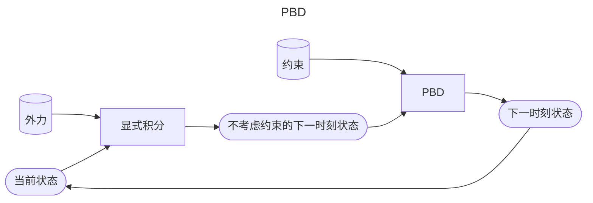

# Position Based Dynamics (PBD)   

## 算法过程

Position based dynamics (PBD) is based on the projection function.    

 - The stiffness behavior, i.e., how tightly constraints are enforced, is subject to **non-physical** factors. 
    - The number of iterations 
    - The mesh resolution
 - The velocity update following projection is important to dynamic effects. 
 
 - This method is applicable to other constraints as well, including triangle constraints, volume constraints, and collision constraints. 
    - To implement these constraints, simply define their
projection functions.    

A PBD Simulator     
//Do Simulation, update \\(\mathbf{x}\\) and \\(\mathbf{v}\\)     
$$
\mathbf{v}\longleftarrow\dots
$$

$$
\mathbf{x}\longleftarrow\dots   
$$   

> &#x2705; 第一步：不考虑约束，基于粒子运动方法更新 \\(\mathbf{v}\\) 和 \\(\mathbf{x}\\)；  

//Now PBD starts.    

$$
\mathbf{x} ^{\mathbf{new} } \longleftarrow \mathrm{Projection} (\mathbf{x} )
$$    

$$
\mathbf{v}\longleftarrow \mathbf{v} +(\mathbf{x} ^{\mathbf{new} }−\mathbf{x})/∆t
$$

$$
\mathbf{x}\longleftarrow \mathbf{x} ^{\mathbf{new}}
$$

> &#x2705; 第二步：基于约束和投影函数更新 \\(\mathbf{v}\\) 和 \\(t\\).    
> &#x2705;第二步中速度更新很重要，会影响dynamic模拟的效果。  
> &#x2705;\\(\mathbf{v}\\)的更新不是直接覆盖，而是叠加。    

P12   
## Pros and Cons of PBD 

 - Pros    
    - Parallelable on GPUs (PhysX)    
    - Easy to implement    
    - Fast in low resolutions    
    - Generic, can handle other coupling and constraints, including fluids  
> &#x2705; 一般来说，少于1000个点时能实时，多于1000个点时效率明显下降  
> &#x2705; PBD 适用于低分辨率场景、常见的低精度实时模拟的套路。    
> &#x2757; 模拟真正的时间开销不在计算 (虽然有很多计算公式) 而是在内存的访问上。   
PBD 的优点是内存访问少、因为它没有太多物理变量。    
因此，**对追求效率的场景，主要优化内存访问而不是计算。**   

 - Cons    
     - Not physically correct    
     - Low performance in high resolutions    
       - Hierarchical approaches (can cause oscillation and other issues…)     
       - Acceleration approaches, like Chebyshev    
       
> &#x2705; 问：PBD 非物理方法，怎么体现出弹性效果？  
答：迭代数多则弹性差、网格顶点少则弹性差。   
> &#x2705; 弹性表现受网格数量影响(难以控制)、没有所谓的精确解，哪怕迭代数足够多、迭代数过多会导致locking issue.   

P13   
## After-Class Reading    

Muller. 2008. *Hierarchical Position Based Dynamics*. VRIPHYS.

> &#x2705; NVIDIA的很多物理引擎都是基于PBD的  

---------------------------------------
> 本文出自CaterpillarStudyGroup，转载请注明出处。
>
> https://caterpillarstudygroup.github.io/GAMES103_mdbook/