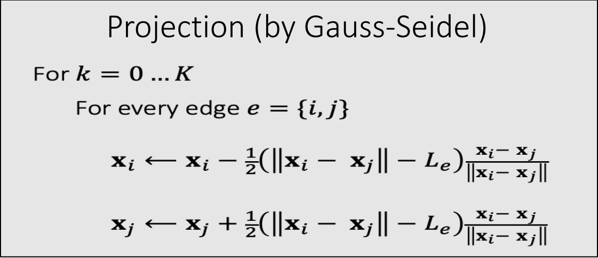

# Position Based Dynamics (PBD)   

每个顶点独立仿真，也不用考虑弹簧力。    
顶点独立运动后，约束被破坏。通过投影的方式保持约束。投影是指，直接当前的(不合理的)状态直接变成最近的合理的状态。难点在于怎么找到最近的合理的状态。 

## 基于投影函数（Projection Function）的顶点位置更新

$$
\mathbf{x} ^{\mathbf{new} } \longleftarrow \mathrm{Projection} (\mathbf{x} )
$$  

下面以长度约束为例，但该方法同样适用于其他约束类型，包括三角形约束、体积约束与碰撞约束，实现这些约束仅需定义其对应的投影函数即可。

P5   
### A Single 长度约束   

    

根据长度约束定义投影函数：

$$
\mathbf{ϕ} (\mathbf{x} )=||\mathbf{x} _i− \mathbf{x} _j||−L=0
$$      
  

    

P6   

> &#x2705; 把\\(\mathbf{x}_ i\\)和\\(\mathbf{x}_ j\\)拼成6维空间中的点\\(\mathbf{x}\\)，满足约束的\\(\mathbf{x}\\)构成6D空间中的一块区域；  
> &#x2705; 投影函数的目标：(1)把\\(\mathbf{x}\\)移到区域内。 (2)移动距离最短。

    

> x为不满足约束点的，边界为约束，绿点为投影后满足约束的点

因此构成优化问题：  

$$
\{\mathbf{x} _i^{\mathbf{new}},\mathbf{x} _j^{\mathbf{new} }\}= \argmin  \frac{1}{2}\{m_i||\mathbf{x} _i^{\mathbf{new} }−\mathbf{x} _i||^2+m_j||\mathbf{x} _j^{\mathbf{new}} −\mathbf{x} _j||^2\}    
$$

such that  \\(\mathbf{ϕ} (\mathbf{x} )=0\\)

 
> &#x2705;优化问题，但不是通过迭代解决，而是数值求解，直接算出最优的\\(\mathbf{x}_i\\)和\\(\mathbf{x}_j\\).    

解得：   

 
$$
\mathbf{x} ^{\mathbf{new} } \longleftarrow  \mathrm{Projection} (\mathbf{x})
$$   

$$
\mathbf{x} _i^{\mathbf{new} }\longleftarrow \mathbf{x} _i−\frac{m_j}{m_i+m_j} (||\mathbf{x} _i−\mathbf{x} _j||−L)\frac{\mathbf{x} _i−\mathbf{x}_j}{||\mathbf{x} _i−\mathbf{x} _j||} 
$$
   
$$
\mathbf{x} _j^{\mathbf{new} }\longleftarrow \mathbf{x} _j+\frac{m_i}{m_i+m_j} (||\mathbf{x} _i−\mathbf{x} _j||−L)\frac{\mathbf{x} _i−\mathbf{x}_j}{||\mathbf{x} _i−\mathbf{x} _j||} 
$$

$$
\quad
$$

$$
\mathbf{ϕ} (\mathbf{x} ^{\mathbf{new} })=||\mathbf{x} _i^{\mathbf{new} }− \mathbf{x} _j^{\mathrm{new} }||−L=||\mathbf{x} _i−\mathbf{x} _j−\mathbf{x} _i+\mathbf{x} _j+L||−L=0
$$

> &#x2705; 对推导结果的合理性解释：(1) 移到前后质心不变。(2) 移到方向为沿着或远离质心。(3) 移到距离与自身重量有关。   

> &#x2705; 对于固定点，将质量设置为无限大，且不做速度和位置的更新。    

P8   
### Multiple 约束 – A Gauss-Seidel Approach    

一次只针对一个约束作的投影，因此是局部优化方法。   

对于多个弹簧的情况呢？Gauss-Seidel解法会按特定顺序依次处理每个弹簧的投影。假设存在两个单位原长的弹簧……

    

P9   

  

- 无法保证所有约束条件都能被完全满足，但迭代次数越多，约束条件的满足度就越高。
- 处理顺序会影响结果：顺序可能导致偏差，并影响收敛表现。

P10  
### Multiple 约束 – A Jacobi Approach   

为消除偏差，雅可比法会**同步**计算所有边的投影，再线性融合结果。  

  

- 存在收敛速度更慢的问题。  

- 迭代次数越多，约束条件满足度越高。

## 速度更新

$$
\mathbf{v}\longleftarrow \mathbf{v} +(\mathbf{x} ^{\mathbf{new} }−\mathbf{x})/∆t
$$

> &#x2705;\\(\mathbf{v}\\)的更新不是直接覆盖，而是叠加。    

P12   
# Pros and Cons of PBD 

## 优势  

- 可在GPU上并行计算（如PhysX框架）  
- 实现难度低  
- 在低分辨率场景下运行速度快  

> &#x2705; 一般来说，少于1000个点时能实时，多于1000个点时效率明显下降  
> &#x2705; PBD 适用于低分辨率场景、常见的低精度实时模拟的套路。    
> &#x2757; 模拟真正的时间开销不在计算 (虽然有很多计算公式) 而是在内存的访问上。   
PBD 的优点是内存访问少、因为它没有太多物理变量。    
因此，**对追求效率的场景，主要优化内存访问而不是计算。**   

- 通用性强，能处理多种耦合效应及约束条件（包括流体模拟）

## 劣势  

- 物理准确性不足  

> &#x2705; 弹性表现受网格数量影响(迭代数多则弹性差、网格顶点少则弹性差。)
> 没有所谓的精确解(难以控制)
> 迭代数过多会导致locking issue.   

- 高分辨率场景下性能较差  
    - 分层处理方法（可能引发振荡等问题）  
    - 加速方案，如切比雪夫加速法
       

P13   
## After-Class Reading    

Muller. 2008. *Hierarchical Position Based Dynamics*. VRIPHYS.

> &#x2705; NVIDIA的很多物理引擎都是基于PBD的  

---------------------------------------
> 本文出自CaterpillarStudyGroup，转载请注明出处。
>
> https://caterpillarstudygroup.github.io/GAMES103_mdbook/