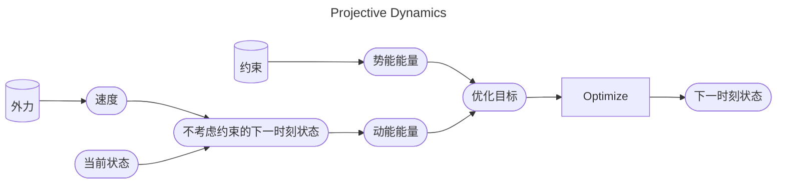

P22   
# 投影动力学 (Projective Dynamics)     

## 原理

### PD VS. 弹簧系统

PD由基于隐式积分弹簧系统演化而来，其基本流程是一致的。  

PD 与弹簧系统的区别在于，弹簧系统与PD计算能量的方式不同。弹簧系统使用弹簧的弹性势能计算能量，而PD使用约束计算能量。能量定义的不同也导致了解优化问题的方法不同。  

### PD VS. PBD

> &#x2705; PBD方法直接拿约束来修复顶点位置，没有物理含义。而Projective Dynatics把projection方法跟物拟模拟结合起来。     
> &#x2705; Projective Dynamics与PBD的差别主要体现在用约束来做什么。    

Projective Dynamics**将约束转化为能量**，通过最小化能量函数来求解系统的状态。因此是一种基于优化的物理仿真方法

## 优化目标

用隐式积分做弹簧系统，最终会转化为优化问题：

$$
\Psi(\mathbf{x}) = \frac{1}{2∆t^2}||\mathbf{x} −\mathbf{y}||_\mathbf{M}^2+E(\mathbf{x} )
$$

其中y为显式积分的结果，E(x)为系统的势能。  

目标是优化\\(\Psi\\)：

$$
x = \argmin \Psi(x)
$$

在弹簧系统中，这样定义E(x)

    

$$
E(x) = \sum _ {e=(i,j)}E _ e= \frac{1}{2} k\sum _ {e=(i,j)} (||\mathbf{x} _ {i} − \mathbf{x} _ {j} ||−L _ e)^2
$$

## 势能能量E(x)

### 1根弹簧，2个顶点

引入变量p为长度为\\(L_e\\)的向量：  

$$
p = \overrightarrow {\mathbf{x} _{i}'\mathbf{x}_{j}'}
$$

$$
\begin{aligned}
E(x) &= \frac{1}{2} k(||\mathbf{x} _{i} −\mathbf{x}_{j} ||−L_e)^2 \\
&= \min \frac{1}{2} k(||(\mathbf{x} _{i} −\mathbf{x}_{j}) - (\mathbf{x} _{i}' −\mathbf{x}_{j}') ||)^2\\
&= \min \frac{1}{2} k(||(\mathbf{x} _{i} −\mathbf{x}_{j}) - p ||)^2
\end{aligned}
$$

可以解得：  

$$
p = \argmin E(x) = L\frac{x_i-x_j}{||x_i-x_j||}
$$

代入p得：  

$$
\begin{aligned}
E(x) &= \frac{1}{2} k(||(\mathbf{x} _{i} −\mathbf{x}_{j}) - p ||)^2 \\
&= \frac{1}{2} k ( || \underbrace{\begin{bmatrix} I & -I \end{bmatrix}}_{3 \times 6} \underbrace{\begin{bmatrix} x_i \\ x_j \end{bmatrix}}_{6 \times 1} - \underbrace{p}_{3\times 1}||^2)
\end{aligned}
$$

根据牛顿法，需要根据E(x)的一阶导和二阶导来计算x的更新方向：  

$$
\begin{aligned}
\nabla E &= k \begin{bmatrix} I \\ -I \end{bmatrix} (\begin{bmatrix} I & -I \end{bmatrix} \begin{bmatrix} x_i \\ x_j \end{bmatrix} - p) && \nabla E \in R^{6\times1}\\
H &= k \begin{bmatrix} I \\ -I \end{bmatrix} \begin{bmatrix} I & -I \end{bmatrix} = k \begin{bmatrix} I & -I \\ -I & I \end{bmatrix} && H \in R^{6\times6}
\end{aligned}
$$

### n根弹簧，m个顶点

引入变量p，其中\\(p_e\\)为长度为\\(L_e\\)的向量：  

$$
p_{e=(i,j)} = \overrightarrow {\mathbf{x} _{i}'\mathbf{x}_{j}'}
$$

$$
\begin{aligned}
E(x) &= \frac{1}{2} k \sum_{e=(i,j)}(||\mathbf{x} _{i} −\mathbf{x}_{j} ||−L_e)^2 \\
&= \min \frac{1}{2} k\sum_{e=(i,j)}(||(\mathbf{x} _{i} −\mathbf{x}_{j}) - (\mathbf{x} _{i}' −\mathbf{x}_{j}') ||)^2\\
&= \min \frac{1}{2} k\sum_{e=(i,j)}(||(\mathbf{x} _{i} −\mathbf{x}_{j}) - p_e ||)^2
\end{aligned}
$$

可以解得：  

$$
p_e = \argmin E_{e=(i,j)}(x) = L\frac{x_i-x_j}{||x_i-x_j||}
$$

代入p得：  

$$
\begin{aligned}
E(x) &= \frac{1}{2} k\sum_{e=(i,j)}(||(\mathbf{x} _{i} −\mathbf{x}_{j}) - p_e ||)^2 \\
&= \frac{1}{2} k ( || \underbrace{A}_{3n \times 3m} \underbrace{\mathbf{x}}_{3m \times 1} - \underbrace{P}_{3n\times 1}||^2)
\end{aligned}
$$

其中，A是由弹簧连接关系构成的矩阵，只要弹簧结构不发生变化，整个仿真过程中A保持炒变。  

根据牛顿法，需要根据E(x)的一阶导和二阶导来计算x的更新方向：  

$$
\begin{aligned}
\nabla E &= k A^T (A \mathbf{x} - P) && \nabla E \in R^{3m\times1}\\
H &= k A^TA && H \in R^{3m\times3m}
\end{aligned}
$$

## 说明

### 引入的变化p是形变后的e的投影

$$
(\mathbf{x} _{e,i}^{\mathrm{new} },\mathbf{x} _{e,j}^{\mathrm{new} }) = \mathrm{Projection} _e(\mathbf{x}_i,\mathbf{x}_j)
$$

> &#x2705; 本文基于约束定义能量。{\\(\mathbf{x} _{e,i}^{\mathrm{new} },\mathbf{x} _{e,j}^{\mathrm{new} }\\)}为期望的顶点位置。不直接把顶点从当前位置移到期望位置。而是把当前位置和期望位置的距离转化为能量，通过能量推动顶点从当前位置移到目标位置。   

因此称为投影动力学

### 这个能量与弹簧能量有什么区别

$$
 E(\mathbf{x})=\sum _{e=(i,j)}\frac{k}{2}(||\mathbf{x}_i-\mathbf{x}_j||-L_e)^2 
$$  

$$
\mathbf{f} _i=−\nabla_iE(\mathbf{x} )=−{\textstyle \sum _{e:i\in e}}(\mathbf{x} _i−\mathbf{x} _j)−(\mathbf{x} _{e,i}^{\mathrm{new}} −\mathbf{x} _{e,j}^{\mathrm{new} })
$$

> &#x2705; 基于 \\(E(\mathbf{x})、\mathbf{x}_i^{\mathrm{new} } 、\mathbf{x}_j^{\mathrm{new} }\\) 计算力，此时假设\\(\mathbf{x}_i^{\mathrm{new} }\\)和 \\(\mathbf{x}_j^{\mathrm{new} }\\)都是定值，\\(\mathbf{x}_i\\)和 \\(\mathbf{x}_j\\)是变量。   
> &#x2705; 本文基于约束定义能量和力，得到的结果与基于弹簧能量计算的能量和力相同。   
> &#x2705; 既然 \\(E\\) 和 \\(F\\) 是一样的，何必多此一举? 答：H不同。   

P23   
### Hessian 矩阵   

Instead of blending projections in a Jacobi or Gauss-Seidel fashion as in PBD, <u>projective</u> dynamics uses projection to define a <u>quadratic</u> energy.     

    

    

> &#x2705; 同一个顶点在三个不同边上的投影是不同的。   
> &#x2705; **可以直接根据Mesh的拓扑关系构造H矩阵。**     
> &#x2705; 为什么能简化\\(\mathbf{H}\\)的计算？答：在计算某一个端点时，假设另一个端点不动（常量），那么能量就是只关于这个端点的二次函数     

### 为什么这样定义能量

以这种方式定义能量，得到的H是一个只与弹簧拓扑有关的定值。这个定值不光构造简单，也能简化计算。  

在以牛顿法的优化迭代方法中，需要解线性系统\\(Ax=b\\)。复杂的A使得线性系统难以求解。  

    

由A的定义可知，当H是定值时，A也是一个定值。那么可以对A做一些预计算，以加速线性系统\\(Ax=b\\)的求解。  

> 如果只是使用了PD的方法来构造能量和H，但没有对A做预计算，实际上没有发挥PD的核心优势。  

P28   
## After-Class Reading

|ID|Year|Name|Note|Tags|Link|
|---|---|---|---|---|---|
||2014|Projective Dynamics: Fusing Constraint Projections for Fast Simulation|

---------------------------------------
> 本文出自CaterpillarStudyGroup，转载请注明出处。
>
> https://caterpillarstudygroup.github.io/GAMES103_mdbook/

