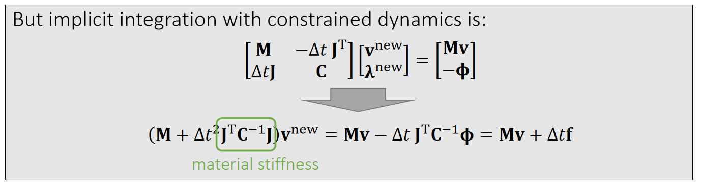

P34  
# Stable Constrained Dynamics    

> &#x2705; 没有展开讲，见after reading中的论文  

From a mass-spring system, we know spring Hessian (tangent stiffness) is:    

$$
\mathbf{H} (\mathbf{x} )=∑_{e=(i,j)}\begin{bmatrix}
 \Box  & \Box  & \Box  & \Box  \\\\
 \Box  & \mathbf{H} _e & -\mathbf{H} _e & \Box   \\\\
  \Box & -\mathbf{H} _e &\mathbf{H} _e  & \Box   \\\\
  \Box &  \Box & \Box  & \Box  
\end{bmatrix}
$$

    

According to constrained dynamics:\\(\mathbf{f} (\mathbf{x} )=\mathbf{J^Tλ}\\)  and \\(\mathbf{λ} =−\mathbf{C} ^{−1}\\mathbf{ϕ} \\), so: 

   

$$
\mathbf{J}_e=\frac{∂\phi _e}{∂\mathbf{x} }=\begin{bmatrix}
\frac{\mathbf{x} _{ij}^\mathbf{T} }{||\mathbf{x} _{ij}||}   & -\frac{\mathbf{x} _{ij}^\mathbf{T} }{||\mathbf{x} _{ij}||}
\end{bmatrix}
$$

P35   
## Stable Constrained Dynamics

According Lecture 5, Page 16, implicit integration is:    

$$
(\frac{1}{∆t^2}\mathbf{M+H} (\mathbf{x} ^{[0]}))∆\mathbf{x} = \frac{1}{∆t^2}\mathbf{M} (∆t\mathbf{v} ^{[0]})+\mathbf{f} (\mathbf{x} ^{[0]})
$$

$$
\Downarrow 
$$

$$
(\mathbf{M} +∆t^2\mathbf{H} (\mathbf{x} ^{[0]}))\mathbf{v} ^{\mathrm{new} }= \mathbf{Mv} ^{[0]}+∆t\mathbf{f} (\mathbf{x} ^{[0]})
$$

    

Missing geometric stiffness matrix here…

P36  
## After-Class Reading (optional)   

    

Tournier et al. 2015. *Stable Constrained Dynamics. TOG (SIGGRAPH)*.    

> &#x2705; Method 2 Gauss 消元，如果把\\(\lambda\\)消掉，会得到一个基本上与隐式积分相似的公式，唯一的区别是\\(\mathbf{H}\\)上略有不同 —— 隐式积分多了一项。如果把用这一项加回去，会使constrain dynamic 变得稳定。   

---------------------------------------
> 本文出自CaterpillarStudyGroup，转载请注明出处。
>
> https://caterpillarstudygroup.github.io/GAMES103_mdbook/
