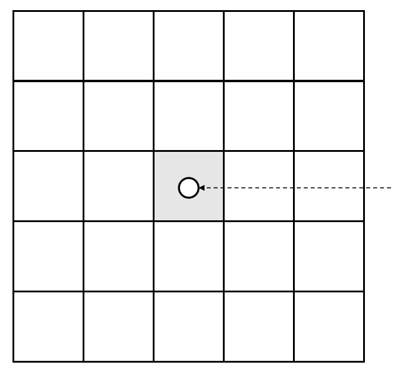

     - Scalars   
    - Density/color   
    - Pressure   
    - Temperature   
    - …
 - Vectors  
    - Velocities  
 - The grid can be viewed as a scalar/vector function, also known as a scalar/vector field.    