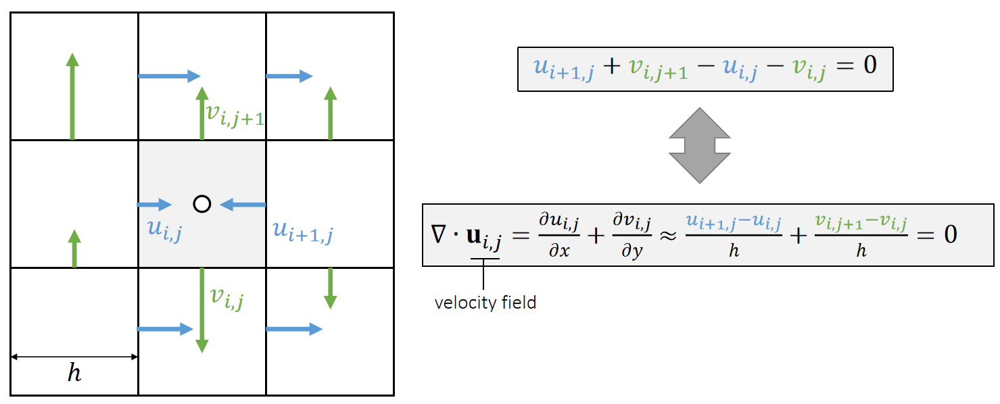
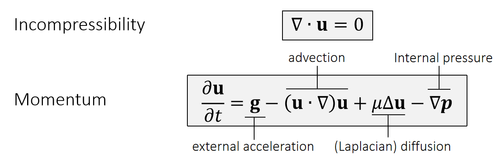
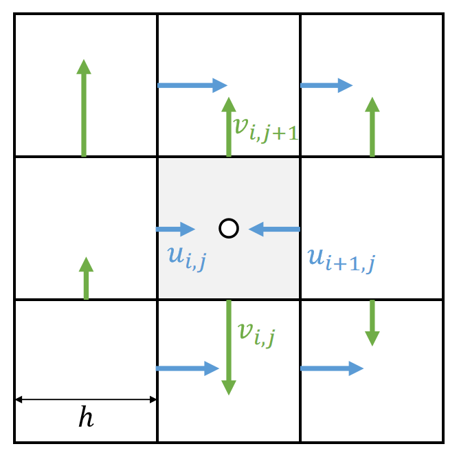
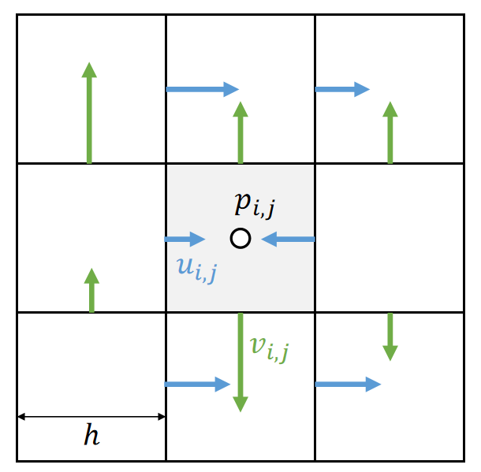
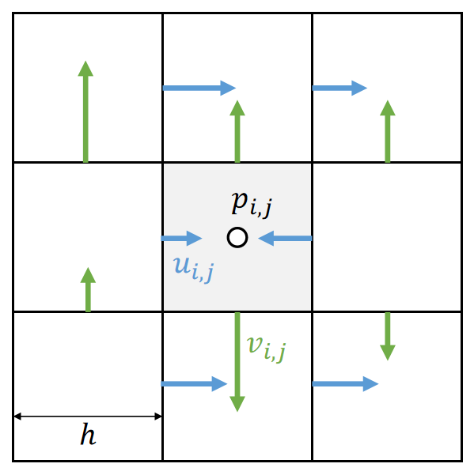
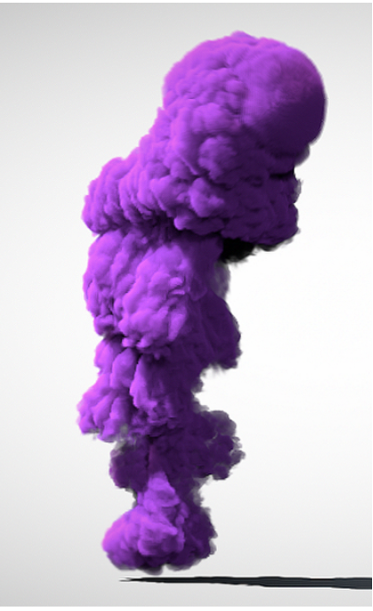
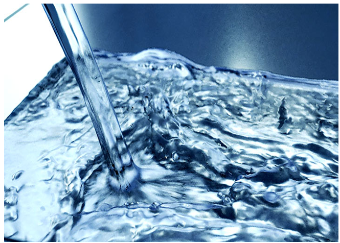
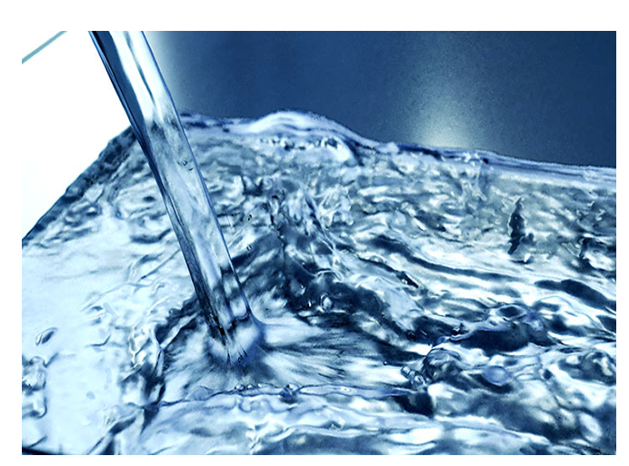

P1   
## GAMES103: Intro to Physics-Based Animation

#### Eulerian Fluids

#### Huamin Wang

##### Dec 2021

P2  
## Topics for the Day   

 - A Grid Representation and Finite Differencing  

 - Incompressible, Viscous Navier Stokes’ equations  

 - Air and liquid  
 
 
 
P3  
## A Grid Representation and Finite Differencing   

P4  
## A Regular Grid Representation    

   

> &#x2705; 把场定义在标准格子上的好处：计算导数或利用导数进行微分计算变得容易了。

P5  
## Central Differencing   

> &#x2705; 见 L10.   

P6   
## Finite Differencing on Grid   

The grid is very friendly with central differencing.   

   

| $$\frac{∂f_{i+0.5,j}}{∂x}≈\frac{f_{i+1,j}−f_{i,j}}{ℎ}$$  |
|---|

P7   
## Finite Differencing on Grid

The grid is very friendly with central differencing.    

   

P8  
## Discretized Laplacian

We can then obtain the discretized Laplacian operator on grid.   

   

$$
\frac{∂^2f_{i,j}}{∂x^2}≈\frac{\frac{∂f_{i−0.5,j}}{∂x}−\frac{∂f_{i+0.5,j}}{∂x}}{ℎ}≈\frac{f_{i−1,j}+f_{i+1,j}−2f_{i,j}}{ℎ^2}
$$

$$
\frac{∂^2f_{i,j}}{∂y^2}≈\frac{\frac{∂f_{i,j+0.5}}{∂y}−\frac{∂f_{i,j−0.5}}{∂y}}{ℎ} ≈\frac{f_{i,j−1}+f_{i,j+1}−2f_{i,j}}{ℎ^2} 
$$

|  $$∆f_{i,j}=\frac{∂^2f_{i,j}}{∂x^2}+\frac{∂^2f_{i,j}}{∂y^2}≈\frac{f_{i−1,j}+f_{i+1,j}+f_{i,j−1}+f_{i,j+1−4}f_{i,j}}{ℎ^2} $$  |
|---| 

P9   
## Boundary Conditions    

The boundary condition specifies \\(f_{i−1,j}\\) if it’s outside.

   

A Dirichlet boundary: \\(f_{i−1,j}=C\\)   

|$$ ∆f_{i,j}≈\frac{C+f_{i+1,j}+f_{i,j−1}+f_{i,j+1}−4f_{i,j}}{ℎ^2}$$|
|---|

A Neumann boundary: \\(f_{i−1,j}=f_{i,j}\\)  

|  $$∆f_ {i,j} ≈ \frac{f_ {i+1,j}+f_ {i,j−1}+f_ {i,j+1}−3f_{i,j}}{ℎ^2}$$ |
|----|

P12   
## Diffusion

The process of applying Laplacian smoothing is called **diffusion**.     

P13  
## Problem with Central Differencing   

Central differencing gives the derivative in the middle.    

   

 - The cell doesn’t exist at (i+0.5, j).   

 - To get \\( \frac{∂f_ {i,j}}{∂x} \\), we need \\(f_{i−1,j}\\) and \\(f_{i+1,j}\\).  But this is weird, because \\(f_{i,j}\\) is unused.    

> &#x2705; 前面假设所有物理量定义在格子的中间。但此处算出来的一阶微分量不在格子中间。 

P14  
## Solution: Staggered Grid   

We define some physical quantities on faces, specifically **velocities**.    

   

 - The x-part of the velocity is defined on vertical faces.   

- The y-part of the velocity is defined on horizonal faces.   

- **Intuitively**, they represent the flow speed between two cells. For example, we write the volume changing speed at cell (i,j) as:   

|  $$u_{i+1,j}+v_{i,j+1}−u_{i,j}−v_{i,j}$$  |
|---|  

> &#x2705; 把速度定义在墙上的好处量，速度是矢量、可以用不同方向的墙表达不同方向上的速度、直观。  

P15  
## Divergence-Free Condition

No volume change is equal to say the fluid is incompressible. This can be formally written as a divergence-free velocity field.   

   

> &#x2753; 这一页没听懂、净流入流出为0，水面还怎么动呢？   

P16   
## Bilinear Interpolation   

> &#x2705; 双线性插值、 GAMES 101讲过、跳过了    

P17   
## Bilinear Interpolation   

We use bilinear interpolation to interpolate staggered velocities as well.    

> &#x2705; 这是一个描述了速度场的公式，它可以告许你速度如何更新、公式2 diffusion 的目的是粘滞。   
把偏微分方程分解几个小块，依次轮流优化每一小块。    
[?] 这种方法为什么可行？    

P18   
## <u>Incompressible, Viscous</u>  Navier-Stokes Equations 

P19  
## Equation Fomulation   

   

 - Method of Characteristics: solving a long partial differential equation (PDE) in steps
 - Step 1: Update \\(\mathbf{u}\\) by solving \\(∂\mathbf{u}∕∂t=\mathbf{g}\\)   
 - Step 2: Update \\(\mathbf{u}\\) by solving \\(∂\mathbf{u}∕∂t=−(\mathbf{u}\cdot ∇)\mathbf{u}\\)  
 - Step 3: Update \\(\mathbf{u}\\) by solving \\(∂\mathbf{u}∕∂t=υ∆\mathbf{u}\\)  
 - Step 4: Update \\(\mathbf{u}\\) by solving \\(∂\mathbf{u}∕∂t=−∇\mathbf{p}\\)   
 

P20   
## Step 1: External Acceleration

The Update of \\(\mathbf{u}\\) by \\(∂\mathbf{u}∕∂t=\mathbf{g}\\) is straightforward, just add acceleration to \\(u\\) and \\(v\\).    

   

P21  
## Step 2: Advection   

Next we need to update \\(\mathbf{u}\\) by solving \\(∂\mathbf{u}∕∂t=−(\mathbf{u}\cdot ∇)\mathbf{u}\\).   

   

| $$(\mathbf{u} \cdot ∇)\mathbf{u} =u\cdot \frac{∂u}{∂x} +v\cdot \frac{∂v}{∂\mathbf{y}} $$ |
|---|  

Solving this in an Eulerian way can be a source of instability.   

To solve this problem, we come to realize that advection means to carry physical quantities by velocity.   

> &#x2705;  Advectim,代表流动。即速度会跟着粒子移动，基于欧拉的方法才需要考虑这个问题。   
基于拉格朗日的方法，变量定义在粒子上，天然满足这个特点。    

P22  
## Solution: Semi-Lagrangian Method   

The solution is to trace a virtual particle backward over time.   

   

 - Define \\(\mathbf{x}_0←(i−0.5, j)\\)   
 - Compute \\(\mathbf{u}(\mathbf{x}_0)\\)   
 - \\(\mathbf{x}_1←\mathbf{x}_0−∆t \mathbf{u}(\mathbf{x}_0)\\)   
 - Compute \\(\mathbf{u}(\mathbf{x}_1)\\)
 - \\(u_{i,j}^{new}←u(\mathbf{x}_1)\\)   

Note that if the velocities are staggered, we need to do staggered bilinear interpolation.   

> &#x2705; 例如要求\\(\mathbf{x}_0\\)的速度，倒推哪个粒子会运动到\\(\mathbf{x}_0\\)处;因此找到\\(\mathbf{x}_1\\)，以\\(\mathbf{x}_1\\)的下一刻速度来更新\\(\mathbf{x}_0\\)的速度。   

P23  
## Solution: Semi-Lagrangian Method

The solution is to trace a virtual particle backward over time.    

   

 - Define \\(\mathbf{x}_0←(i, j−0.5)\\)    
 - Compute \\(\mathbf{u}(\mathbf{x}_0)\\)   
 - \\(\mathbf{x}_1←\mathbf{x}_0−∆t \mathbf{u}(\mathbf{x}_0)\\)   
 - Compute \\(\mathbf{u}(\mathbf{x}_1)\\)   
 - \\(v_{i,j}^{new}←v(\mathbf{x}_1)\\)   

P24   
## Solution: Semi-Lagrangian Method   

We could also subdivided the time step for better tracing.   

   

> &#x2705; 反推找\\(\mathbf{x}_1\\)时 step 细一点，这样能找得准一点    
怎么计算每个\\(\mathbf{x}\\)的\\(\mathbf{u}\\)?答：双线性插值方法、   
做模拟通常更在乎稳定而不是误差，此方法更稳定，但会有模糊的 artifacts.   

P25   
## Step 3: Diffusion  

Next we need to update \\(\mathbf{u}\\) by solving \\(∂\mathbf{u}∕∂t=\upsilon ∆\mathbf{u}\\).   

   

$$
u_{i,j}^{new}←u_{i,j}+ \upsilon ∆t\frac{u_{i−1,j}+u_{i+1,j}+u_{i,j−1}+u_{i,j+1}−4u_{i,j}}{ℎ^2} 
$$

$$
v_{i,j}^{new}←v_{i,j}+ \upsilon ∆t\frac{v_{i−1,j}+v_{i+1,j}+v_{i,j−1}+v_{i,j+1}−4v_{i,j}}{ℎ^2}
$$

If \\(υ∆t\\) is large, the above formulae can be **unstable**.      

> &#x2705; 分别对\\(u\\)和 \\(v\\) 做 laplacian.   

P26   

We could also use even smaller sub-steps…   

P27  
## Step 4: Pressure Projection    

Finally, we need to update \\(\mathbf{u}\\) by solving \\(∂\mathbf{u}∕∂t=−∇\mathbf{p}\\). 

   

Staggering makes this very straightforward:

$$
u_{i,j}^{new}←u_{i,j}−\frac{∆t}{ℎ}(p_{i,j}−p_{i−1,j})
$$

$$
v_{i,j}^{new}←v_{i,j}−\frac{∆t}{ℎ}(p_{i,j}−p_{i,j−1})
$$

But what is \\(\mathbf{p}\\)?

> &#x2705; 公式写错了，\\(\frac{1}{h}\\)改成\\(∆t / h\\).   

P28   
## Step 3: Pressure Projection

The pressure is caused by incompressibility.     

   

In other words, after this update by pressure, we should achieve:   

|$$∇\cdot \mathbf{u}^{new}=0$$|  
|-------|

which means

> $$u_{i+,j}^{new}+v_{i,j+1}^{new}−u_{i,j}^{new}−v_{i,j}^{new}=0$$

$$
\Downarrow
$$

>$$ 
\begin{matrix}
u_{i+1,j}−\frac{(p_{i+1,j} − p_{i,j})}{ℎ}+v_{i,j+1}−\frac{(p_{i,j+1}−p_{i,j})}{ℎ} \\\\
−u_{i,j}−\frac{(p_{i,j} − p_{i−1,j})}{ℎ} −v_{i,j}−\frac{(p_{i,j}−p_{i,j−1})}{ℎ}=0
\end{matrix}$$

> &#x2705; 压强的原因：由于流体不可压缩、对于流体的压力会传导到每个点上。   
每个点都有压强，虽然压强未知，但可以根据不可压条件构造方程组。   

P29  
## Step 3: Pressure Projection   

The pressure is caused by incompressibility. Eventually, we get a Poisson equation:  

   

Eventually, we get a Poisson equation:   

$$
4p_{i,j}−p_{i−1,j}−p_{i+1,j}−p_{i,j−1}−p_{i,j+1}= \\\\
\\\\
ℎ(−u_{i+1,j}−v_{i,j+1}+u_{i,j}+v_{i,j})
$$

with boundary conditions:   

$$ \text{Dirichlet boundary (open) } p_{i−1,j}=P \\\\
\text{Neumann boundary (close) } p_{i−1,j}=p_{i,j}$$

Once we solve \\(\mathbf{p}\\), we update \\(\mathbf{u}\\) and done.   

P30    
## After-Class Reading    

Jos Stam. 1999. *Stable Fluids. TOG (SIGGRAPH)*.   

P31   
## Air and Smoke   

> &#x2705; 前面讲的是怎么更新速度；后面讲怎么利用速度做出效果。 

P32   
## Air Simulation   

 - Air simulation is done in two steps.   
 - In Step 1, we update the flow (the velocity field) \\(\mathbf{u}\\).   
 - In Step 2, we use semi-Lagrangian (page 22) advect all of the other physical quantities, i.e., density, temperature…   
 - Typically we use Dirichlet boundaries for an open space (or Neumann boundaries for a container.)   
 - We can use it to simulate underwater as well.   

   

P33   
## Water Simulation

 - Two representations   
    - Volume-of-fluid (as the name suggests…)   
    - A signed distance function defined over the grid.   

 - How to advect?    
    - Semi-Lagrangian (volume loss)   
    - Level set method (volume loss)   
    - Needs corrections.   

   

But what if there is an air-water boundary???    

> &#x2705; 表示1：例如一个格子存储水的体积的百分化。   
advert 表称2：专用于更新 SDF 的方法。   

P34   
## Water Simulation   

 - Two representations   
    - Volume-of-fluid (as the name suggests…)   
    - A signed distance function defined over the grid.   

 - How to advect?   
    - Semi-Lagrangian (volume loss)   
    - Level set method (volume loss)   
    - Needs corrections.   

   

But what if there is an air-water boundary???   

P35   
## After-Class Reading   

Osher and Fedkiw.    
Level Set Methods and Dynamic Implicit Surfaces.    

P36   
## A Summary For the Day   

 - The **Eulerian grid** presentation is very friendly with finite **differencing**. This makes calculus a lot easier.    
 - For **velocity** fields, we can use **staggered grid**.    

 - For low-speed, incompressible, viscous flow, we need to solve the Navier-Stokes equations.    
 - To solve the equations, we can do this in step-by-step (method of characteristics). 
 
 - To simulate air and water, we need to advect some physical quantities.   
    - Smoke (density); water (volume-of-fluid, or signed distance  function)    
    - **Volume loss** issue in water (how to fix it?)    
    - If you need to create a mesh from grid for rendering, you need something like <u>marching cube</u>.   