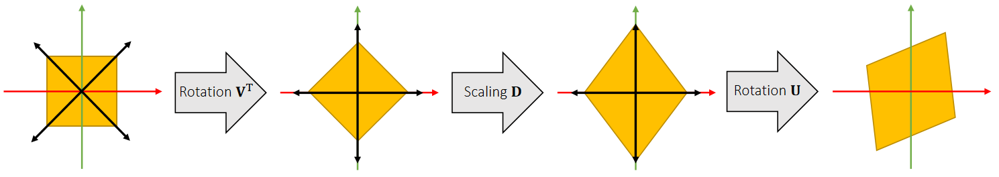
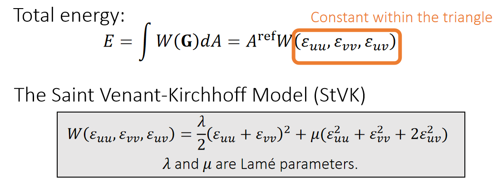
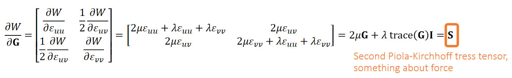
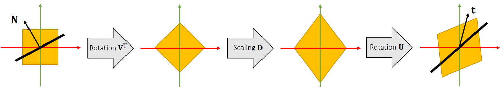
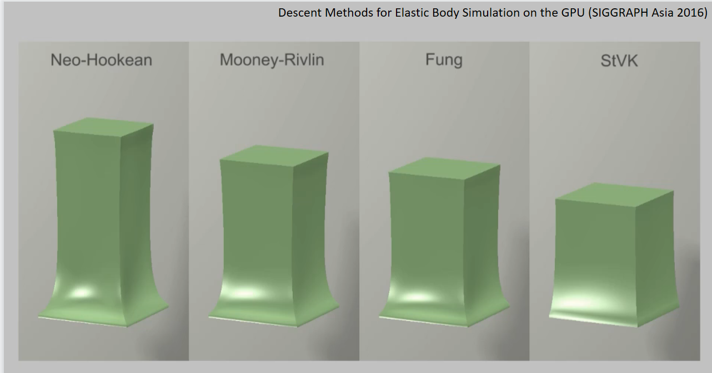

P3   
## Linear Finite Element Method    

P4  
## The Linear FEM Assumption   

In a nutshell, linear FEM assumes that for any point \\(\mathbf{X}\\) in the reference triangle, its deformed correspondence is: \\(\mathbf{x=FX+c}\\).    

    

For any vector between two points, we can use F to convert it from reference to deformed:    
$$
\mathbf{x} _{ba}=\mathbf{x} _b−\mathbf{x} _a=\mathbf{FX} _b+\mathbf{c} −\mathbf{FX} _a−\mathbf{c} =\mathbf{FX} _{ba}.
$$

P5   
## Deformation Gradient    

Therefore, we can calculate the deformation gradient by edge vectors.      

    

**Problem:** \\(\mathbf{F}\\) **is related to deformation, but it contains rotation**.     

P6  
## Green Strain    

Ideally, we need a tensor to describe shape deformation only.  Recall that SVD gives \\(\mathbf{F=UDV^T}\\), where only \\(\mathbf{V^T}\\) and \\(\mathbf{D}\\) are relevant to deformation.     

    

So we get rid of \\(\mathbf{U}\\) as: \\(\mathbf{G} =\frac{1}{2} (\mathbf{F^TF−I} )=\frac{1}{2} (\mathbf{VD} ^2\mathbf{V} ^\mathbf{T} −\mathbf{I} )=\begin{bmatrix}
 \varepsilon _{uu} & \varepsilon _{uv}\\\\
\varepsilon _{uv} & \varepsilon _{vv}
\end{bmatrix}\\), *Green strain*.

 - If no deformation, \\(\mathbf{G=0}\\); if deformation increases,  ||\\(\mathbf{G}\\)|| increases.    
 - Three deformation modes: \\(\varepsilon _{uu}\\), \\(\varepsilon _{vv}\\) and \\(\varepsilon _{uv}\\).
 - \\(\mathbf{G}\\) is <u>rotation invariant</u>: if additional rotation \\(\mathbf{R}\\), then deformation gradient is \\(\mathbf{RF}\\) but green strain is the same: \\(\mathbf{G} =\frac{1}{2} (\mathbf{F^TR^TRF−I} )=\frac{1}{2} (\mathbf{VD} ^2\mathbf{V} ^\mathbf{T} −\mathbf{I} )\\).    

P7   
## Strain Energy Density Function    

Let \\(\mathbf{G}\\) be the the green strain describing deformation. We consider the **energy density** per reference area as: \\(W (\mathbf{G})\\).    

    

    

    

P8  
## Forces   

Given everything we have, we can now calculate the forces.    
    

P9   
## Forces 

Recall that,    

    

By definition,    
$$
\mathbf{G} =\frac{1}{2} (\mathbf{F^TF−I} )=\begin{bmatrix}
 \frac{1}{2}(a\mathbf{x} _{10}+c\mathbf{x} _{20})^\mathbf{T} (a\mathbf{x} _{10}+c\mathbf{x} _{20})−\frac{1}{2}  & \frac{1}{2}(a\mathbf{x} _{10}+c\mathbf{x} _{20})^\mathbf{T} (b\mathbf{x} _{10}+d\mathbf{x} _{20})\\\\
 \frac{1}{2}(a\mathbf{x} _{10}+c\mathbf{x} _{20})^\mathbf{T} (b\mathbf{x} _{10}+d\mathbf{x} _{20})  & \frac{1}{2}(b\mathbf{x} _{10}+d\mathbf{x} _{20})^\mathbf{T} (b\mathbf{x} _{10}+d\mathbf{x} _{20})−\frac{1}{2}
\end{bmatrix}
$$

So:

$$
\frac{∂\varepsilon _{uu}}{∂\mathbf{x} _1}=a(a\mathbf{x} _{10}+c\mathbf{x} _{20})^\mathbf{T} 
\quad\quad
\frac{∂\varepsilon _{vv}}{∂\mathbf{x} _1}=b(b\mathbf{x} _{10}+d\mathbf{x} _{20})^\mathbf{T} 
\quad\quad
\frac{∂\varepsilon _{uv}}{∂\mathbf{x} _1}=\frac{1}{2} a(b\mathbf{x} _{10}+d\mathbf{x} _{20})^\mathbf{T} +\frac{1}{2}  b(a\mathbf{x} _{10}+c\mathbf{x} _{20})^\mathbf{T} 
$$

$$
\frac{∂\varepsilon _{uu}}{∂\mathbf{x} _2}=c(a\mathbf{x} _{10}+c\mathbf{x} _{20})^\mathbf{T} 
\quad\quad
\frac{∂\varepsilon _{vv}}{∂\mathbf{x} _2}=d(b\mathbf{x} _{10}+d\mathbf{x} _{20})^\mathbf{T} 
\quad\quad
\frac{∂\varepsilon _{uv}}{∂\mathbf{x} _2}=\frac{1}{2} c(b\mathbf{x} _{10}+d\mathbf{x} _{20})^\mathbf{T} +\frac{1}{2}  d(a\mathbf{x} _{10}+c\mathbf{x} _{20})^\mathbf{T} 
$$

P10     
## Forces 

    

P11     
## Forces 

In conclusion, we have:   

$$
\mathbf{f} _1=−A^{\mathrm{ref} }\mathbf{FS} \begin{bmatrix}
 a\\\\
b
\end{bmatrix}  \quad\quad \mathbf{f} _2=−A^{\mathrm{ref} }\mathbf{FS} \begin{bmatrix}
 c\\\\
d
\end{bmatrix}
$$

$$
\begin{bmatrix}
 \mathbf{f} _1 &\mathbf{f} _2
\end{bmatrix}= − A ^{\mathrm{ref} }\mathbf{FS} \begin{bmatrix}
 \mathbf{X} _{10} & \mathbf{X} _{20}
\end{bmatrix}^\mathbf{−T} 
$$

P12   
## Implementations   

 - More details?
    - Volino et al. 2009. *A simple approach to nonlinear tensile stiffness for accurate cloth simulation*. TOG    
    - Only talks about cloth (2D reference -> 3D deformation)    

 - What about tetrahedron (3D reference -> 3D deformation)?   
    - Same idea, but everything is now in 3D.   
    - Deformation gradient \\(\mathbf{F} \in \mathbf{R} ^{3×3}\\)   
    - Green strain \\(\mathbf{G} \in \mathbf{R} ^{3×3}\\)   
    - Stress tensor \\(\mathbf{S} \in \mathbf{R} ^{3×3}\\)   
    - Forces \\(\mathbf{F}_i \in \mathbf{R} ^3\\)    

P13   
## Finite Volume Method    

P14   
## Traction and Stress    

First, let’s consider traction **t**: the internal force per unit length (area).

    

Total interface force:    

$$
f\mathbf{} =\oint _L \mathbf{t} dl
$$

Stress tensor \\(\mathbf{σ} \\) (interface normal -> traction):

$$
\mathbf{t=σn} 
$$

So,    

$$
\mathbf{f} =\oint_{L}  \mathbf{σn} dl
$$

P15   
## The Finite Volume Method   

FVM considers force calculation in an integration perspective, not a differentiation perspective.     

    

Force contributed by an element:    

$$
\mathbf{f}_0 =\oint _L \mathbf{σn} dl
$$

Since \\(\mathbf{σ}\\) is constant within the element,     

$$
\oint_L \mathbf{σn} dl + \oint_{L_{20}} \mathbf{σn} dl+\oint_{L_{10}}\mathbf{σn} dl=0
$$

(Divergence Theorem)   

We know the force is:   

$$
\mathbf{f}_0 = - \oint _ {L _{20}} \mathbf{σn} _ {20} dl -  \oint _ {L _{10}} \mathbf{σn} _ {10} dl = - \mathbf{σ}(\frac{||\mathbf{X} _ {20}||}{2}\mathbf{n} _ {20}+ \frac{||\mathbf{X} _ {20}||}{2}\mathbf{n} _ {10})
$$

P16   
## The Finite Volume Method   

In 3D, FVM works in the same way.    

    

Force:

$$
\begin{array}{l} 
 \mathbf{f} _ 0 = −\oint _ Ω \mathbf{σn} dA=−\mathbf{σ} (\frac{A _ {012}}{3}\mathbf{n} _ {012} + \frac{A _ {023}}{3}\mathbf{n} _ {023} + \frac{A _ {031}}{3}\mathbf{n} _ {031})\\\\
 =−\frac{σ}{3}(\frac{||\mathbf{x} _ {10} \times \mathbf{x} _ {20}||}{2} \frac{\mathbf{x} _ {10} × \mathbf{x} _ {20}}{||\mathbf{x} _ {10} × \mathbf{x} _ {20}||} + \frac{||\mathbf{x} _ {20} × \mathbf{x} _ {30}||}{2}\frac{\mathbf{x} _ {20} × \mathbf{x} _ {30}}{||\mathbf{x} _ {20} × \mathbf{x} _ {30}||}
+\frac{||\mathbf{x} _ {30} × \mathbf{x} _ {10}||}{2}\frac{\mathbf{x} _ {30} × \mathbf{x} _ {10}}{||\mathbf{x} _ {30} × \mathbf{x} _ {10}||})\\\\
=−\frac{\mathbf{σ}}{6} (\mathbf{x} _ {10} × \mathbf{x} _ {20} + \mathbf{x} _ {20} × \mathbf{x} _ {30} + \mathbf{x} _ {30} × \mathbf{x} _ {10})
\end{array}
$$

P17     
## This stress is not that stress    

Although the use of stress tensor is the same: **mapping from the interface normal to the traction**, it can be defined by different configurations.      

|      |      |  
|----|----|
|  In FEM, we define the energy density \\(W\\) in the **reference** state.  Therefore, this stress \\(\mathbf{S}\\)  is a mapping from the normal \\(\mathbf{N}\\) to the traction \\(\mathbf{T}\\), both in the **reference** state.   | In FVM, we need \\(\mathbf{σ}\\) to convert the normal into \\(\mathbf{t}\\) for force calculation. Therefore, this stress assumes the normal \\(\mathbf{n}\\) and the traction \\(\mathbf{t}\\) are in the **deformed** state.    |  

P18   
## Different Stresses   

We can now have different stresses, serving the same purpose but in different forms.     

  

P19  
## Area Weighted Normals   

  

Now let’s figure out the relationship between \\(A^{\mathrm{ref} }\mathbf{N}\\) and \\(A\mathbf{n}\\), the two area weighted normals.    

$$
2A^{\mathrm{ref} }\mathbf{N} =\mathbf{X} _ {a0}×\mathbf{X} _ {b0}
$$

$$
\begin{array}{l} 
 2A\mathbf{n} =\mathbf{x} _ {a0}×\mathbf{x} _ {b0}=\mathbf{FX} _{a0} × \mathbf{FX} _ {b0} = (\mathbf{UDV^TX} _ {a0}) × (\mathbf{UDV^TX} _ {b0}) \\\\
\quad\quad=\mathbf{U} ((\mathbf{DV^TX} _ {a0}) × (\mathbf{DV^TX} _ {b0})) \\\\
\quad\quad=\mathbf{U} \begin{bmatrix}
  d_1d_2& \Box  & \Box \\\\
 \Box  & d_0d_2 & \Box \\\\
  \Box & \Box  &d_0d_1
\end{bmatrix} ((\mathbf{V^TX} _ {a0})×(\mathbf{V^TX} _ {b0}))\\\\
\quad\quad=\mathbf{U} \begin{bmatrix}
  d_1d_2& \Box  & \Box \\\\
 \Box  & d_0d_2 & \Box \\\\
  \Box & \Box  &d_0d_1
\end{bmatrix} \mathbf{V^T} (\mathbf{X} _ {a0} × \mathbf{X} _ {b0})\quad=d_0d_1d_2\mathbf{U} \begin{bmatrix}
  1/d_0& \Box  & \Box  \\\\
 \Box  & 1/d_1 & \Box  \\\\
  \Box & \Box  &1/d_2
\end{bmatrix} \mathbf{V^T} (\mathbf{X} _ {a0}×\mathbf{X} _ {b0}) \\\\
\quad\quad=\mathrm{det} (\mathbf{F} )\mathbf{F} ^{−\mathbf{T}}(\mathbf{X} _ {a0}×\mathbf{X} _ {b0})=\mathrm{det} (\mathbf{F} )\mathbf{F} ^{−\mathbf{T}}(2A^\mathrm{ref}\mathbf{N})
\end{array}
$$

P20   
## Different Stresses    

Now we know: \\(A\mathbf{n} =\mathrm{det} (\mathbf{F})\mathbf{F^{−T}} (A^{\mathrm{ref}}\mathbf{N} )\\).     

We also know the force can be calculated using two different stresses:    

$$
\mathbf{f} =−\frac{1}{3}  {\textstyle \sum {A^{\mathrm{ref} }}}\mathbf{PN} =−\frac{1}{3}\sum A\mathbf{σn} 
$$

Therefore, we get:

$$
\mathbf{P} (A^{\mathrm{ref} }\mathbf{N} )=\mathbf{σ} \mathrm{det} (\mathbf{F} )\mathbf{F^{−T}} (A^{\mathrm{ref} }\mathbf{N} )
$$

$$
\mathrm{det} ^{−1}(\mathbf{F} )\mathbf{PF^T=σ} 
$$

P21  
## Different Stresses

We can now have different stresses, serving the same purpose but in different forms.     

  

P22 
## The Finite Volume Method   

The previous analysis suggests we can use reference normals instead.     

  

Second Piola–Kirchhoff stress:    
\\(\mathbf{S} =\frac{∂W}{∂\mathbf{G}}\\), as in previous FEM formulation    

P23   
## The Finite Volume Method   

  

Think about more about \\(\mathbf{b}_1\\) …   

$$
\begin{array}{l} 
 \mathbf{X} _{10}^\mathbf{T} \mathbf{b} _1=\mathbf{X} _{10}^\mathbf{T} (\mathbf{X} _{01}×\mathbf{X} _{21}+\mathbf{X} _{21}×\mathbf{X} _{31}+\mathbf{X} _{31}×\mathbf{X} _{01})=\mathbf{X} _{10}^\mathbf{T} (\mathbf{X} _{21}×\mathbf{X} _{31}) \\\\
\quad\quad=\mathbf{X} _{01}^\mathbf{T} (\mathbf{X} _{31}×\mathbf{X} _{21})=6Vol 
\end{array}
$$

$$
\quad
$$

Meanwhile,   

$$
\begin{array}{l} 
 \mathbf{X} _{20}^\mathbf{T} \mathbf{b} _1=\mathbf{X} _{20}^\mathbf{T} (\mathbf{X} _{01}×\mathbf{X} _{21}+\mathbf{X} _{21}×\mathbf{X} _{31}+\mathbf{X} _{31}×\mathbf{X} _{01})\\\\
\quad\quad=\mathbf{X} _{20}^\mathbf{T} (\mathbf{X} _{20}×\mathbf{X} _{10}+\mathbf{X} _{20}×\mathbf{X} _{31})=0
\end{array}
$$

$$
\quad
$$

$$
\begin{array}{l} 
 \mathbf{X} _{30}^\mathbf{T} \mathbf{b} _1=\mathbf{X} _{30}^\mathbf{T} (\mathbf{X} _{01}×\mathbf{X} _{21}+\mathbf{X} _{21}×\mathbf{X} _{31}+\mathbf{X} _{31}×\mathbf{X} _{01})\\\\
\quad\quad=\mathbf{X} _{30}^\mathbf{T} (\mathbf{X} _{21}×\mathbf{X} _{30}+\mathbf{X} _{10}×\mathbf{X} _{30})=0
\end{array}
$$

P24   
## Therefore,   

We get:

$$
\begin{bmatrix}
 \mathbf{X} _{10} & \mathbf{X} _{20} &\mathbf{X} _{30}
\end{bmatrix}^\mathbf{T} \mathbf{b} _1=\begin{bmatrix}
 \mathbf{X} _{10} & \mathbf{X} _{20} &\mathbf{X} _{30}
\end{bmatrix}^\mathbf{T}(\mathbf{X} _{01}×\mathbf{X} _{21}+\mathbf{X} _{21}×\mathbf{X} _{31}+\mathbf{X} _{31}×\mathbf{X} _{01})=\begin{bmatrix}
 6Vol\\\\
 0\\\\
0
\end{bmatrix}
$$

$$
\begin{bmatrix}
 \mathbf{X} _{10} & \mathbf{X} _{20} &\mathbf{X} _{30}
\end{bmatrix}^\mathbf{T} \mathbf{b} _2=\begin{bmatrix}
 0\\\\
 6Vol\\\\
0
\end{bmatrix}
$$

$$
\begin{bmatrix}
 \mathbf{X} _{10} & \mathbf{X} _{20} &\mathbf{X} _{30}
\end{bmatrix}^\mathbf{T} \mathbf{b} _3=\begin{bmatrix}
 0\\\\
 0\\\\
6Vol
\end{bmatrix}
$$

$$
\begin{bmatrix}
 \mathbf{b} _{1} & \mathbf{b} _{2} &\mathbf{b} _{3}
\end{bmatrix}^\mathbf{T} =6Vol\begin{bmatrix}
 \mathbf{X} _{10} & \mathbf{X} _{20} &\mathbf{X} _{30}
\end{bmatrix}^{-\mathbf{T}}\\\\
\quad\quad=\frac{1}{\mathrm{det}( \begin{bmatrix}
 \mathbf{X} _{10} & \mathbf{X} _{20} &\mathbf{X} _{30}
\end{bmatrix}^{-1})} \begin{bmatrix}
 \mathbf{X} _{10} & \mathbf{X} _{20} &\mathbf{X} _{30}
\end{bmatrix}^{-\mathbf{T}}
$$

P25   
## A Quick Summary    

  

P26   
## After-Class Reading   

重点推荐：   
Teran et al. 2003. *Finite Volume Methods for the
Simulation of Skeleton Muscles*. SCA.     

P27   
## After-Class Reading (Optional)   

Volino et al. 2009. *A Simple Approach to Nonlinear Tensile
Stiffness for Accurate Cloth Simulation*. TOG.    

P28   
## Hyperelastic Models   

P29   
## First Piola–Kirchhoff stress    

We treat the first Piola–Kirchhoff stress tensor \\(\mathbf{P}\\) as a function of deformation gradient \\(\mathbf{F}\\):     

$$
\mathbf{f} _0= −\frac{\mathbf{P} (\mathbf{F} )}{6}(\mathbf{X} _{10}×\mathbf{X} _{20}+\mathbf{X} _{20}×\mathbf{X} _{30}+\mathbf{X} _{30}×\mathbf{X} _{10})
$$

It converts an interface normal \\(\mathbf{N}\\) in the reference state to a traction \\(\mathbf{t}\\) in the deformed state. 

$$
\mathbf{t}=\mathbf{P} (\mathbf{UDV^T} )\mathbf{N} 
$$

  

P30  
## Rotation-Invariance    

The stress tensor \\(\mathbf{P}\\) is rotation-invariant to \\(\mathbf{U}\\):    

  

$$
\mathbf{P} (\mathbf{UDV^T} )=\mathbf{UP} (\mathbf{DV^T} )
$$

P31  
## Isotropic Materials     

The stress tensor \\(\mathbf{P}\\) is rotation-invariant to \\(\mathbf{U}\\):    

  

$$
\mathbf{P} (\mathbf{DV^T} )=\mathbf{P} \mathbf{(D)V^T} 
$$

P32   
## Isotropic Materials    

   

In many literatures, people parameterize \\(\mathbf{P} (I_\mathbf{C},II_\mathbf{C},III_\mathbf{C} )\\) by principal invariants, for:    

$$
I_\mathbf{C} =\mathrm{trace} (\mathbf{C} )=λ_0^2+λ_1^2+λ_2^2
$$

$$
III_\mathbf{C} =\mathrm{det} (\mathbf{C} ^2)=λ_0^4+λ_1^4+λ_2^4
$$

$$
II_\mathbf{C} =\frac{1}{2} (\mathrm{trace} ^2(\mathbf{C} )−\mathrm{trace} (\mathbf{C} ^2))=λ_0^2λ_1^2+λ_0^2λ_2^2+λ_1^2λ_2^2
$$

\\(\mathbf{C=U^TU}\\) is the right Cauchy-Green deformation tensor.    

P33   
## Isotropic Models    

   

P34   
## Isotropic Materials   

Anyway, we still use the principal stretches for computation:   

$$
\mathbf{P} (λ_0,λ_1,λ_2)=\begin{bmatrix}
 \frac{∂W}{∂λ_0}  & \Box  &\Box  \\\\
 \Box  & \frac{∂W}{∂λ_1}  & \Box \\\\
 \Box  & \Box  &\frac{∂W}{∂λ_2} 
\end{bmatrix}
$$

And we compute the first Piola-Kirchhoff stress as:   

$$
\mathbf{P} = \mathbf{UP} (λ_0,λ_1,λ_2)\mathbf{V} ^\mathbf{T} 
$$

P35   
## A Quick Summary (cont.)   

   

P36    
## The Limitation of StVK    

   

Irving et al. 2004. *Invertible Finite Elements For Robust Simulation of Large Deformation*. SCA    

P37  

   

P39   
## A Summary For the Day    

 - FEM uses the **derivates** of the strain energy function to obtain the force.    

 - FVM uses the **integral** of the interface traction to obtain the force.    

 - The two approaches lead to the **identical outcome**, in **different formulations**   

 - Hyperelastic models define the strain energy function by principal stretches, i.e., the singular values of the deformation gradient.    

- For isotropic materials, we can calculate the stress through diagonalization.   