P2  
# Last Time…   

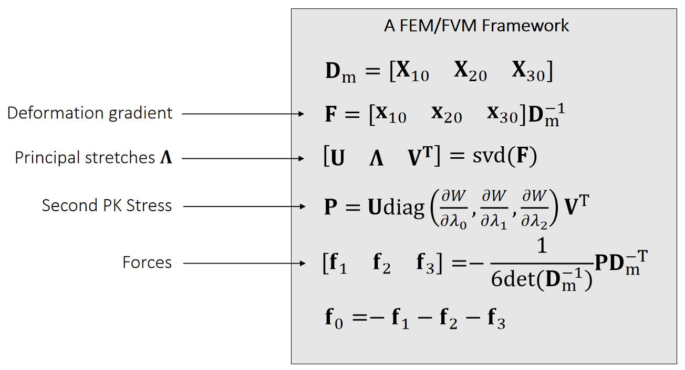  

P3  
# Topics for the Day   

 - Hessian of Elastic Energy    

 - Implicit Integration    

 - Nonlinear optimization.    
 

> &#x2705; 隐式积分不讲了。推荐P12页的论文    
直接跳到 P18、非线性优化。   

P4    
# Hessian of Elastic Energy

P5   
## Recall that…   

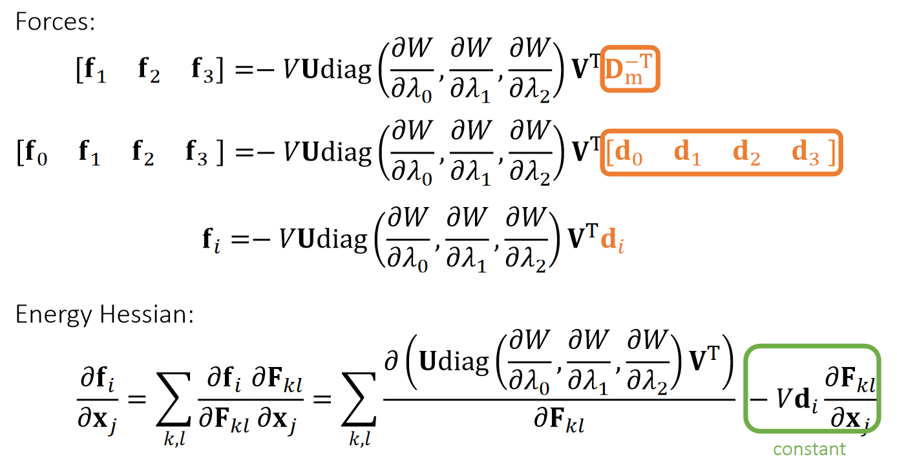   

P6   
## Energy Hessian:    

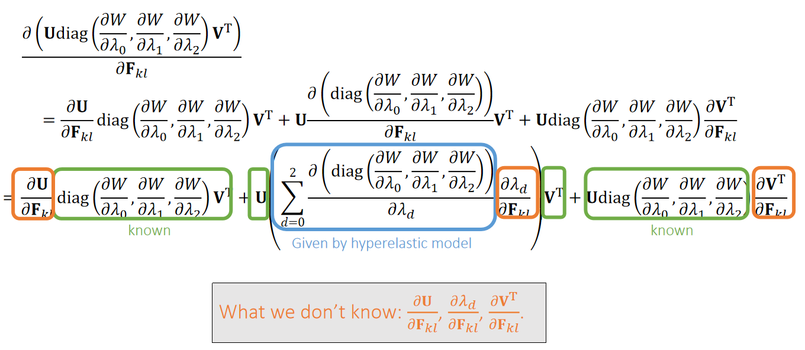   

P7   
## SVD Derivative    

Since \\(\mathbf{F=UΛV^T}\\)is singular value decomposition \\((\mathbf{Λ} =\mathrm{diag} (λ_0,λ_1,λ_2))\\), we can do:    

$$
\mathbf{U^T} \frac{∂\mathbf{F} }{∂\mathbf{F} _{kl}}\mathbf{V} =\mathbf{U^T} (\frac{∂\mathbf{U} }{∂\mathbf{F} _{kl}}\mathbf{ΛV^T} +\mathbf{U}\frac{∂\mathbf{Λ} }{∂\mathbf{F} _{kl}}\mathbf{V^T}+\mathbf{UΛ}\frac{∂\mathbf{V^T} }{∂\mathbf{F} _{kl}})\mathbf{V}
$$

$$
\mathbf{U^T} \frac{∂\mathbf{F} }{∂\mathbf{F} _{kl}}\mathbf{V} =(\mathbf{U^T} \frac{∂\mathbf{U} }{∂\mathbf{F} _{kl}})\mathbf{Λ} +\frac{∂\mathbf{Λ} }{∂\mathbf{F} _{kl}}+ \mathbf{Λ}(\frac{∂\mathbf{V^T} }{∂\mathbf{F} _{kl}}\mathbf{V})
$$

$$
\mathbf{U^T} \frac{∂\mathbf{F} }{∂\mathbf{F} _{kl}}\mathbf{V} = \mathbf{AΛ} +\frac{∂\mathbf{Λ} }{∂\mathbf{F} _{kl}}+ \mathbf{ΛB}
$$

P8   
## Skew-Symmetric Matrix    

Matrix \\(\mathbf{A}\\) is skew-symmetric (or anti-symmetric), if \\(\mathbf{A=−A^T}\\):    

$$
\mathbf{A} =\begin{bmatrix}
 0 & a & b \\\\
 -a & 0 & c \\\\
-b  & -c & 0
\end{bmatrix}
$$

If \\(\mathbf{D}\\) is diagonal, then:     

$$
\mathbf{AD} =\begin{bmatrix}
 0 & a & b \\\\
 -a & 0 & c \\\\
-b  & -c & 0
\end{bmatrix}\begin{bmatrix}
 d & 0 &0 \\\\
 0 & e & 0\\\\
 0 & 0 &f
\end{bmatrix}=\begin{bmatrix}
 0 & ? & ?\\\\
 ? & 0 &? \\\\
 ? & ? &0
\end{bmatrix} 
$$

$$ 
\mathbf{DA} = \begin{bmatrix}
d  & 0 & 0\\\\
 0 & e & 0\\\\
 0 & 0 &f
\end{bmatrix}\begin{bmatrix}
0  & a & b\\\\
 -a & 0 &c \\\\
 -b & -c &0
\end{bmatrix}=\begin{bmatrix}
 0 & ? &? \\\\
 ? &  0& ?\\\\
 ? & ? &0
\end{bmatrix}
$$

When \\(\mathbf{U}\\) is orthogonal, we have:     

$$
\mathbf{0} =\frac{∂(\mathbf{U^TU)}}{∂\mathbf{F} _{kl}} =\mathbf{U^T} \frac{ ∂\mathbf{U} }{∂\mathbf{F} _{kl}}+\frac{∂\mathbf{U^T}}{∂\mathbf{F} _{kl}}\mathbf{U} =\mathbf{U^T}\frac{∂\mathbf{U} }{∂\mathbf{F} _{kl}}+(\mathbf{U^T} \frac{∂\mathbf{U}}{∂\mathbf{F} _{kl}})^\mathbf{T} 
$$

Therefore, \\(\mathbf{A=U^T}\frac{∂\mathbf{U} }{∂\mathbf{F} _{kl}}\\) is skew-symmetric. So is \\(\mathbf{B} =\frac{∂\mathbf{V^T} }{∂\mathbf{F} _{kl}} \mathbf{V}\\).     

P9   
## SVD Derivative (cont.)    

Since \\(\mathbf{F=UΛV^T}\\) is singular value decomposition \\(\mathbf{Λ} =\mathrm{diag} (λ_0,λ_1,λ_2))\\), we can do:     

$$
\mathbf{U^T} \frac{∂\mathbf{F} }{∂\mathbf{F} _{kl}}\mathbf{V} = \mathbf{AΛ} +\frac{∂\mathbf{Λ} }{∂\mathbf{F} _{kl}}+\mathbf{ΛB} 
$$

After expansion, we get:     

$$
\mathbf{U^T} \frac{∂\mathbf{F}}{∂\mathbf{F} _{kl}} \mathbf{V} =  
\begin{bmatrix}
 0 & a_0 & a_1\\\\
 -a_0 & 0 & a_2\\\\
  -a_1& -a_2 &0
\end{bmatrix} \begin{bmatrix}
 λ_0 & \Box  & \Box\\\\
 \Box & λ_1 &\Box \\\\
 \Box & \Box &λ_2
\end{bmatrix} \begin{bmatrix}
 \frac{∂λ_0}{∂\mathbf{F} _{kl}} & \Box & \Box\\\\
 \Box & \frac{∂λ_1}{∂\mathbf{F} _{kl}} & \Box\\\\
 \Box & \Box &\frac{∂λ_2}{∂\mathbf{F} _{kl}}
\end{bmatrix} \begin{bmatrix}
λ_0  & \Box  & \Box \\\\
 \Box  & λ_1 &\Box  \\\\
  \Box & \Box  &λ_2
\end{bmatrix} \begin{bmatrix}
 0 &  b_0& b_1\\\\
 -b_0 & 0 &b_2 \\\\
 -b_1 & -b_2 &0
\end{bmatrix}
$$

P10  
## SVD Derivative (cont.)   

Since \\(\mathbf{F=UΛV^T}\\) is singular value decomposition \\(\mathbf{Λ}=\mathrm{diag} (λ_0,λ_1,λ_2)\\), we can do:     

$$
\mathbf{U^T} \frac{∂\mathbf{F} }{∂\mathbf{F} _{kl}}\mathbf{V} =\mathbf{AΛ} +\frac{∂\mathbf{Λ} }{∂\mathbf{F} _{kl}}+\mathbf{ΛB} 
$$

After expansion, we get:    

$$
\mathbf{U^T} \frac{∂\mathbf{F}}{∂\mathbf{F} _ {kl}}\mathbf{V}  
= \begin{bmatrix}
∂λ _ 0/∂\mathbf{F} _ {kl}  & λ _ 1 a _ 0 + λ _ 0 b _ 0 & λ _ 2 a_ 1 + λ _ 0 b _ 1 \\\\
 −λ _ 0 a_ 0 − λ _ 1 b _ 0 & ∂λ _ 1/∂ \mathbf{F} _ {kl} & λ _ 2 a _ 2 + λ _ 1 b _ 2\\\\
 −λ _ 0 a_ 1−λ_ 2b_ 1 & −λ_ 1a_ 0a_ 2−λ_ 2b_ 2 &∂λ_ 2/∂ \mathbf{F} _ {kl}
\end{bmatrix} 
$$

$$
\begin{bmatrix}
 m_ {00} & m_ {01} & m_ {02} \\\\
m_ {10} & m_ {11} & m_ {12}  \\\\
m_ {20} & m_ {21} & m_ {22} 
\end{bmatrix} = \begin{bmatrix}
∂λ_0/∂\mathbf{F} _{kl}  & λ_1a_0+λ_0b_0 & λ_2a_1+λ_0b_1\\\\
 −λ_0a_0−λ_1b_0 & ∂λ_1/∂ \mathbf{F} _{kl} & λ_2a_2+λ_1b_2\\\\
 −λ_0a_1−λ_2b_1 & −λ_1a_0a_2−λ_2b_2 &∂λ_2/∂ \mathbf{F} _ {kl}
\end{bmatrix} 
$$

Eventually, we get: \\(\mathbf{A=U^T} \frac{∂\mathbf{U} }{∂\mathbf{F} _{kl}}, \mathbf{B} = \frac{∂\mathbf{V^T} }{∂\mathbf{F} _{kl}}\mathbf{V} \\) and \\(∂λ_0/∂\mathbf{F} _{kl}, ∂λ_1/∂\mathbf{F} _{kl}, ∂λ_2/∂\mathbf{F} _{kl}\\).    

P11    
## A Quick Summary   

 - Step 1: By SVD derivatives, we get: \\(\frac{∂\mathbf{U} }{∂\mathbf{F} _{kl}},\frac{∂λ_d}{∂\mathbf{F} _{kl}},\frac{∂\mathbf{V^T} }{∂\mathbf{F} _{kl}}\\).    

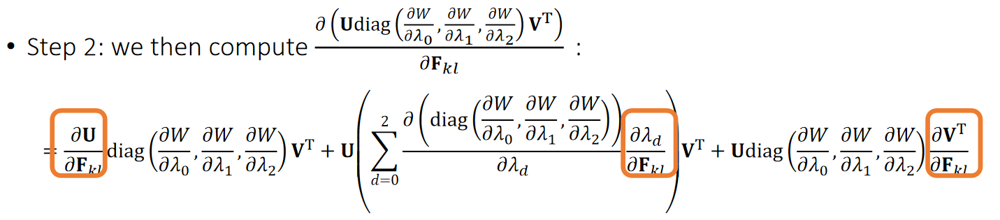   

 - Step 3: Finally, we reach our goal in Hessian matrix:    

$$
\frac{∂\mathbf{f} _i}{∂\mathbf{x} _j}=\sum _ {k,l}\frac{∂\mathbf{f} _i}{∂\mathbf{F} _{kl}} \frac{∂\mathbf{F} _{kl}}{∂\mathbf{x} _j}=\sum _ {k,l}
\frac{∂(\mathrm{Udiag} (\frac{∂W} {∂λ_0},\frac{∂W} {∂λ_1},\frac{∂W} {∂λ_2})\mathbf{V^T}) }{∂\mathbf{F} _{kl}}−V\mathbf{d} _i\frac{∂\mathbf{F} _{kl}}{∂\mathbf{x} _j}
$$

P12  
## After-Class Reading   

Xu et al. 2015. *Nonlinear Material Design Using Principal
Stretches*. TOG (SIGGRAPH).    

Definitely read this paper if you decide to implement it.    

  

P13   
## Implicit Integration    

P14   
# Implicit Integration   

Recall that we need implicit integration to avoid numerical instability (Class 5, page 13):   

$$
\begin{cases} 
  \mathbf{v} ^{[1]}=\mathbf{v} ^{[0]}+∆t\mathbf{M} ^{−1}\mathbf{f} ^{[1]} \\\\  
 \mathbf{x} ^{[1]}=\mathbf{x} ^{[0]}+∆t\mathbf{v} ^{[1]} 
  \end{cases}
$$

$$\mathrm{or} $$

$$
\begin{cases} 
\mathbf{x} ^{[1]}=\mathbf{x} ^{[0]}+∆t\mathbf{v} ^{[0]}+∆t^2\mathbf{M} ^{−1}\mathbf{f} ^{[1]}   \\\\  
 \mathbf{v} ^{[1]}=(\mathbf{x} ^{[1]}−\mathbf{x} ^{[0]})/∆t  
  \end{cases} 
$$

We also said that:   

$$
\mathbf{x} ^{[1]}=\mathbf{x} ^{[0]}+∆t\mathbf{v} ^{[0]}+∆t^2\mathbf{M} ^{−1}\mathbf{f}(\mathbf{x}^{[1]})
$$

$$
\Updownarrow
$$

$$
\mathbf{x} ^{[1]}=\mathrm{argmin } F (\mathbf{x} ) 	\quad  \mathrm{for} \quad\mathbf{F} (\mathbf{x} )=\frac{1}{2∆t^2}||\mathbf{x} −\mathbf{x} ^{[0]}−∆t\mathbf{v} ^{[0]}||_M^2+E(\mathbf{x} )
$$

P15    
## Newton-Raphson Method   

The Newton-Raphson method, commonly known as Newton’s method, solves the optimization problem: \\(x^{[1]}\\)=argmin \\(F(x)\\).  	\\(\quad\quad\\)		\\((F(x)\\) is Lipschitz continuous.)    

Given a current \\(x^{(k)}\\), we approximate our goal by:    

$$
0={F}'(x)≈{F}'(x^{(k)})+{F}'' (x^{(k)})(x−x^{(k)})
$$

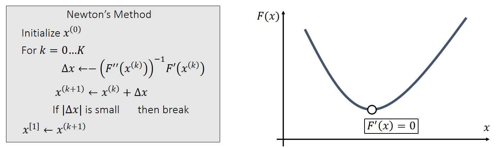   

P16   
### Newton-Raphson Method   

Now we can apply Newton’s method to: \\(\mathbf{x} ^{[1]}\\)= argmin \\( F (\mathbf{x} )\\).    
Given a current \\(\mathbf{x}^{(k)}\\), we approximate our goal by:    

$$
\mathbf{0} =∇F(\mathbf{x} )≈∇F(\mathbf{x} ^{(k)})+\frac{∂F^2(\mathbf{x} ^{(k)})}{∂\mathbf{x} ^2} (\mathbf{x} −\mathbf{x} ^{(k)}) 
$$

> Newton’s Method    
Initialize \\(x^{(0)}\\)    
For \\(k=0…K\\)    
$$
∆\mathbf{x} \longleftarrow −(\frac{∂F^2(\mathbf{x} ^{(k)})}{∂\mathbf{x} ^2})^{−1}∇F(\mathbf{x} ^{(k)})
$$
$$
\mathbf{x} ^{(k+1)}\longleftarrow \mathbf{x} ^{(k)}+∆\mathbf{x} 
$$
If \\(||∆\mathbf{x}||\\) is small	\\(\quad\quad\\)then break     
$$
\mathbf{x} ^{[1]}\longleftarrow \mathbf{x} ^{(k+1)}
$$
>

P17   
### Simulation by Newton’s Method    

Specifically to simulation, we have:    

$$
F (\mathbf{x} )=\frac{1}{2∆t^2} ||\mathbf{x} −\mathbf{x} ^{[0]}−∆t\mathbf{v} ^{[0]}||_M^2+E(\mathbf{x} )
$$

$$
∇F(\mathbf{x} ^{(k)})=\frac{1}{∆t^2}\mathbf{M} (\mathbf{x} ^{(k)}−\mathbf{x} ^{[0]}−∆t\mathbf{v} ^{[0]})−\mathbf{f} (\mathbf{x} ^{(k)})
$$

$$
\frac{∂^2F(\mathbf{x} ^{(k)})}{∂\mathbf{x} ^2} =\frac{1}{∆t^2}\mathbf{M} +\mathbf{H} (\mathbf{x} ^{(k)})
$$

> Initialize \\(\mathbf{x}^{(0)}\\), often as \\(\mathbf{x} ^{[0]}\\) or \\(\mathbf{x} ^{[0]} +∆t\mathbf{v} ^{[0]}\\)   
For \\(k=0…K\\)   
$$
\mathrm{Solve}\quad (\frac{1}{∆t^2} \mathbf{M+H} (\mathbf{x} ^{(k)}))∆\mathbf{x} =− \frac{1}{∆t^2}\mathbf{M} (\mathbf{x} ^{(k)}−\mathbf{x} ^{[0]}−∆t\mathbf{v} ^{[0]})+\mathbf{f} (\mathbf{x} ^{(k)})
$$
$$
\mathbf{x} ^{(k+1)}\longleftarrow \mathbf{x} ^{(k)}+∆\mathbf{x} 
$$
If ||\\(∆\mathbf{x}\\)|| is small \\(\quad\quad\\)	then break     
$$
\mathbf{x} ^{[1]}\longleftarrow \mathbf{x} ^{(k+1)}
$$
$$
\mathbf{v} ^{[1]}←(\mathbf{x} ^{[1]}−\mathbf{x} ^{[0])})/ ∆t
$$
>

P18   
# Nonlinear Optimization   

P19   
## Gradient Descent    

Another way to solve \\(\mathbf{x}^∗\\)=argmin \\(F(\mathbf{x})\\) is the gradient descent method.   

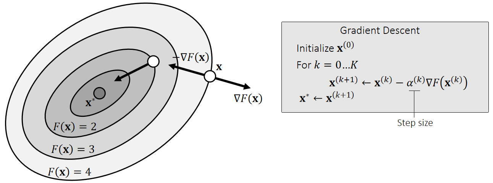   

How to find the optimal step size becomes a critical question.    

P20   
## Line Search Methods    

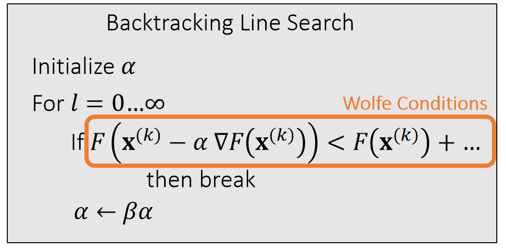   

simple  Low overhead    

P21   
## Descent Directions   

The direction \\(\mathbf{d(x)}\\) is descending, if a sufficiently small step size \\(α\\) exists for:    

$$
F(\mathbf{x} )>F(\mathbf{x} +α\mathbf{d} (\mathbf{x} ))
$$

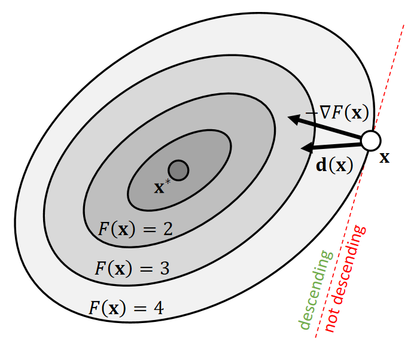   

|  In other words,      $$−∇F(\mathbf{x} )\cdot \mathbf{d} (\mathbf{x} )>0$$  |  
|---| 

P22    
### Descent Methods    

With line search, we can use any search direction as long as it’s descending:    

$$
F(\mathbf{x} ^{(0)})>F(\mathbf{x} ^{(1)})>F(\mathbf{x} ^{(2)})>F(\mathbf{x} ^{(3)})>…
$$

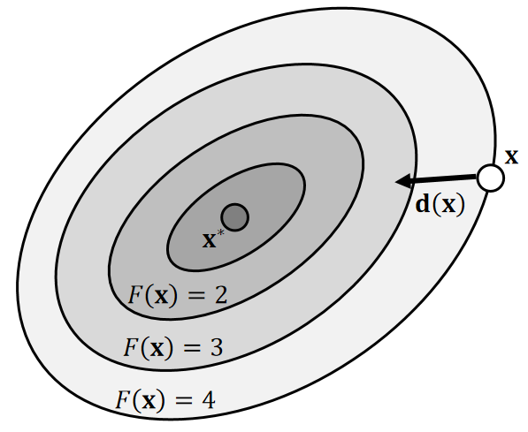   

| Descent Methods      Initialize \\( \mathbf{x} ^{(0)} \\)    For \\(k=0…K\\)         \\(\mathbf{x} ^{(k+1)}\longleftarrow \mathbf{x} ^{(k)}+α^{(k)}\mathbf{d} (\mathbf{x} ^{(k)})\\)  \\(\mathbf{x} ^∗\longleftarrow \mathbf{x} ^{(k+1)}\\)  |   
|----|   

P23   
### Descent Methods    

 - Gradient descent is a descent method, since:    

$$
\mathbf{d} (\mathbf{x} )=−∇F(\mathbf{x} )\quad \Rightarrow  \quad −∇F(\mathbf{x} )\cdot (−∇F(\mathbf{x} ))>0
$$

 - Newton’s method is also a descent method, if the Hessian is always positive definite:   

$$
\mathbf{d} (\mathbf{x} )=−(\frac{∂^2F(\mathbf{x} )}{∂\mathbf{x} ^2})^{−1}∇F(\mathbf{x} ) \quad \Rightarrow  \quad −∇F(\mathbf{x} )\cdot (−(\frac{∂^2F(\mathbf{x} )}{∂\mathbf{x} ^2})^{−1}∇F(\mathbf{x} ))>0
$$

 - **Any method using a positive definite matrix P to modify the gradient** yields a descent method:    

$$\mathbf{d} (\mathbf{x} )=−\mathbf{P} ^{−1}∇F(\mathbf{x} )
\quad \Rightarrow  \quad 
−∇F(\mathbf{x} )\cdot (−\mathbf{P} ^{−1}∇F(\mathbf{x} ))>0
$$

P24  
### Descent Methods    

A unified descent framework     

| Descent Methods      Initialize \\(x^{(0)}\\)        \\(\mathbf{x} ^{(k+1)}\longleftarrow \mathbf{x} ^{(k)}−α^{(k)}(\mathbf{P} ^{(k)})^{−1}∇F(\mathbf{x} ^{(k)})\\)        \\(\mathbf{x} ^∗\longleftarrow \mathbf{x} ^{(k+1)}\\)  |   
|----|  

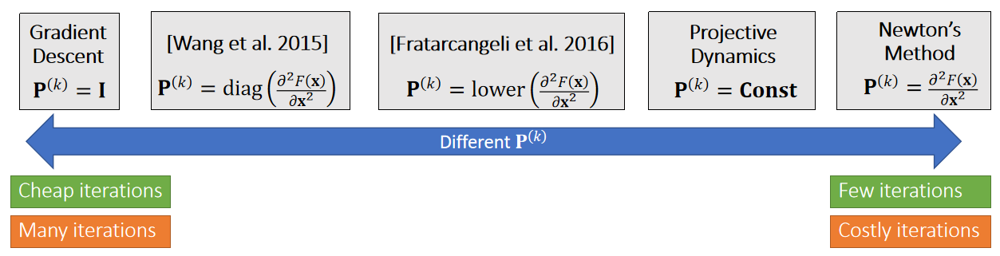   

P25   
### Descent Methods    

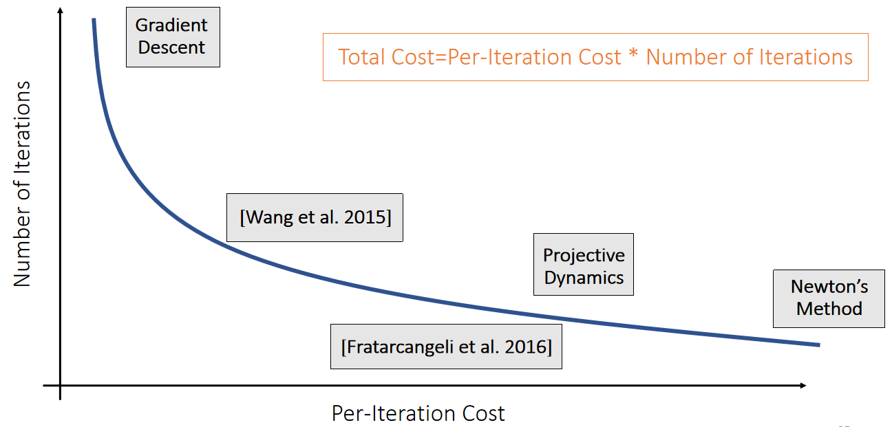   

> &#x2705; 图形学中更关注 Total Cost. 让 P 更加接近 H，可以减少迭代数，让 P 更容易得到，减少迭代成本。   
Traction：物体表面上的力的密度，有点像压强   
模拟的公式通常都固定，很难有突破、瓶颈在于计算量、随着分辨率的提升，模拟的计算量几乎是无止境的。   

P27   
### After-Class Reading    

Wang. 2016. Descent *Methods for Elastic Body Simulation
on the GPU*. TOG (SIGGRAPH Asia).    

P28  
# A Summary For the Day  

 - We can calculate the Hessian of the FEM elastic energy based on SVD derivatives.  

 - The goal of doing this is for implicit time integration. 

 - Fundamentally, the goal is to solve a nonlinear optimization.   
    - Gradient Descent, Newton’s method, and others can all be considered as descent methods.    
    - The key question is the matrix for calculating the search direction.    
    - We need both the per-iteration cost and the number of iterations to be small.   

---------------------------------------
> 本文出自CaterpillarStudyGroup，转载请注明出处。
>
> https://caterpillarstudygroup.github.io/GAMES103_mdbook/
