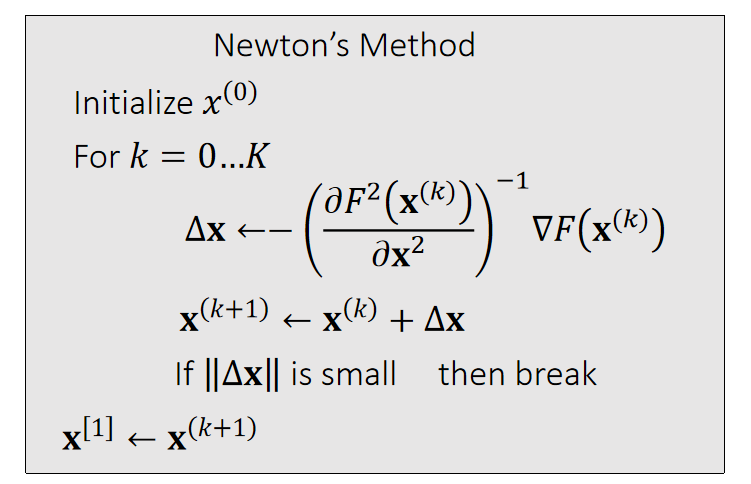

# Newton-Raphson Method   

## x是值的F(x)函数

The Newton-Raphson method, commonly known as Newton’s method, solves the optimization problem: \\(x^{[1]}\\) = argmin \\(F(x)\\).   

    

Given a current \\(x^{(k)}\\), we approximate our goal by: 

$$
0={F}' (x)≈{F}'(x^{(k)})+{F}'' (x^{(k)})(x−x^{(k)})
$$

> &#x2705; \\(a = \min F(x)⇒ F'(a)= 0\\)，\\({F}' (x)\\) 是非线性函数，直接解\\({F}' (x)=0\\) 很难解    
> &#x2705; 对\\({F}'(x)\\) 做一阶泰勒展开，保留到二阶项。   
> &#x2705; 假设\\(x^{[k]}\\)为任意已知值，就变成了解线性方程，很容易解出\\(x\\).   
> &#x2705; 因为\\({F}'(x)\\) 是一个近似的，\\(x\\) 也是一个近似解。但\\(x^{[k]}\\) 越接近真实解，\\(x\\) 也会越接近真实解。因此，选代是\\(x^{[k]}\\)和\\(x\\) 都不断逼近真实解的过程。  
> &#x2705; 普通的梯度下降是把\\({F}' (x)\\) 近似到一阶，牛顿法是近似到二阶，因此下降更快。    

    

> &#x2705; Overshooting 的本质：误差会积累和放大   

P16    
Newton’s method finds an extremum, but it can be a minimum or maximum.    

    

 - At a minimum \\(x^∗, {F}'' (x^∗)>0\\).     
 - At a maximum \\(x^∗, {F}''(x^∗)<0\\). 
 - If \\({F}''(x)>0\\) is everywhere, \\(F(x)\\) has no maximum.  \\(=> F(x)\\) has only one minimum.     

> &#x2705; \\(F'(a)= 0,a\\)  有可能是最大值或最小值，因此要判定解是否合理。判定方法： \\({F}''(x)\\)  

P17  
## x是向量的F(x)函数    

Now we can apply Newton’s method to: \\(x^{[1]} \\)= argmin \\(F(x)\\).
Given a current \\(x^{(k)}\\), we approximate our goal by: 

$$
0=\nabla F( \mathbf{x}) ≈\nabla F (\mathbf{x} ^{(k)})+\frac{∂F ^2(\mathbf{x} ^{(k)})}{∂\mathbf{x} ^2} (\mathbf{x−x} ^{(k)}) 
$$

    

> &#x2705; 按照 \\(\Delta x\\) 的更新公式，只需要用到\\(F'(x)\\) 和 \\({F}''(x)\\)， 不需要知道 \\(F(x)\\).   
> &#x2705; 此处\\(x\\)是向量，因此\\(F'(x)\\)是向量，\\({F}''(x)\\)是 Hession 矩阵  

[TODO]怎么保证 \\(\mathbf{x}\\) 收敛    

---------------------------------------
> 本文出自CaterpillarStudyGroup，转载请注明出处。
>
> https://caterpillarstudygroup.github.io/GAMES103_mdbook/