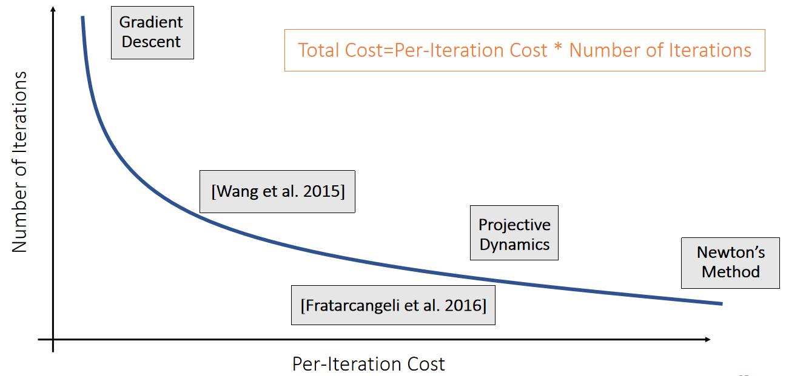

P24  
## A unified descent framework     

A unified descent framework

   

   

P25   
   

> &#x2705; 图形学中更关注 Total Cost. 让 P 更加接近 H，可以减少迭代数，让 P 更容易得到，减少迭代成本。   
Traction：物体表面上的力的密度，有点像压强   

P27   
### After-Class Reading    

Wang. 2016. Descent *Methods for Elastic Body Simulation
on the GPU*. TOG (SIGGRAPH Asia).    

P28  
# A Summary For the Day  

 - We can calculate the Hessian of the FEM elastic energy based on SVD derivatives.  

 - The goal of doing this is for implicit time integration. 

 - Fundamentally, the goal is to solve a nonlinear optimization.   
    - Gradient Descent, Newton’s method, and others can all be considered as descent methods.    
    - The key question is the matrix for calculating the search direction.    
    - We need both the per-iteration cost and the number of iterations to be small.   

> &#x2705; 模拟的公式通常都固定，很难有突破、瓶颈在于计算量、随着分辨率的提升，模拟的计算量几乎是无止境的。   

---------------------------------------
> 本文出自CaterpillarStudyGroup，转载请注明出处。
>
> https://caterpillarstudygroup.github.io/GAMES103_mdbook/
