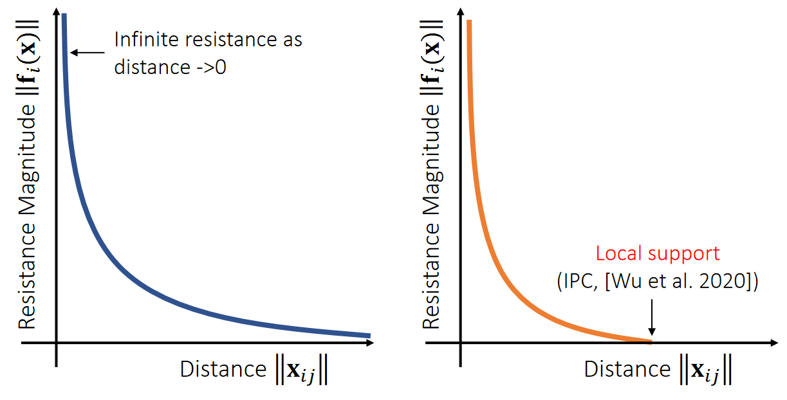

P30   
## Log-Barrier Interior Point Methods   

内点法把碰撞解除抽象为带约事优化问题。优化的目标是\\(x^{[0]}→x^{[1]}\\)，优化的约束是不碰撞。问题是如何把离散曲面的碰撞检测描述为优化公式？     
\\(||x_{ij}||\\)就是这个目的。    

### 算法过程

For simplicity, let’s consider the Log-barrier repulsion between two vertices.     

$$E(\mathbf{x} )=−\rho \text{ log} ||\mathbf{x} _{ij}||$$    

$$
\mathbf{f} _i(\mathbf{x} )=−∇_iE=ρ\frac{\mathbf{x} _ {ij}}{||\mathbf{x} _ {ij}||^2} \\\\
\mathbf{f} _j(\mathbf{x} )=−∇_jE=−ρ\frac{\mathbf{x} _ {ij}}{||\mathbf{x} _{ij}||^2}
$$

[TODO]    
$$
\frac{\alpha ||\mathbf{x}|| }{\alpha \mathbf{x}} =\frac{\mathbf{x}^\mathbf{T} }{||\mathbf{x}||} 
$$

> &#x2705; 用 Log 定义能量、前面某一节课讲过。距离 → 能量 → 斥力    
> &#x2753; \\(||\mathbf{x}_{ij}|| \\) 的物理含义没有定义。可能是希望两个三角形之间穿透矩离。\\( \mathbf{x}\\) 代表两个刚体的状态。   

   

> &#x2705; 不需要互斥力一直存在，因此做了一个截断（IPC）      

P31   
### 算法实现      

We can then formulate the problem as:   

$$
\bar{\mathbf{x} }^ {[1]}\longleftarrow \mathrm{argmin} _\mathbf{x} (\frac{1}{2} ||\mathbf{x} −\mathbf{x} ^{[1]}||^2−ρ\sum \mathrm{log} ||\mathbf{x} _{ij}||)
$$

> &#x2705; 优化目标：点的位置与目标位置（穿模）尽量接近，且不穿模。   
> &#x2705; 绿色是来自\\(\mathbf{x}^{[1]}\\)的引力，对应公式第1页。黄色是来自边界的斥力对应公式第2页。    
> &#x2753; ||\\(X_{ij}\\)||代表穿模情况，为什么是用距离的方式定义？   

   

Gradient Descent:    

>\\(\mathbf{x} ^{(0)}\longleftarrow \mathbf{x} ^{[0]}\\)   
For \\(k=0…K\\)    
$$\mathbf{x} ^{(k+1)}\longleftarrow \mathbf{x} ^{(k)}+α(\mathbf{x} ^{[1]}−\mathbf{x} ^{(k)}+ρ\sum \frac{\mathbf{x} _{ij}}{||\mathbf{x} _{ij}||^2})$$ 
\\(\bar{\mathbf{x} }^ {[1]}\longleftarrow \mathbf{x} ^{(k+1)}\\)

> &#x2705; **每走一小步都需要反复的碰撞检测，重新计算**\\(||\mathbf{x} _{ij}||\\)。    
> &#x2705; 关键是步长\\(\alpha \\)     

The step size \\({\color{Red} α}\\) must be adjusted to ensure that no collision happens on the way.  To find \\({\color{Red} α}\\), **we need collision tests**.    

[&#x2753;] \\( \alpha \\) 不是 learning rate 吗？为什么碰撞检测的结果会影响到\\( \alpha \\) ？

---------------------------------------
> 本文出自CaterpillarStudyGroup，转载请注明出处。
>
> https://caterpillarstudygroup.github.io/GAMES103_mdbook/