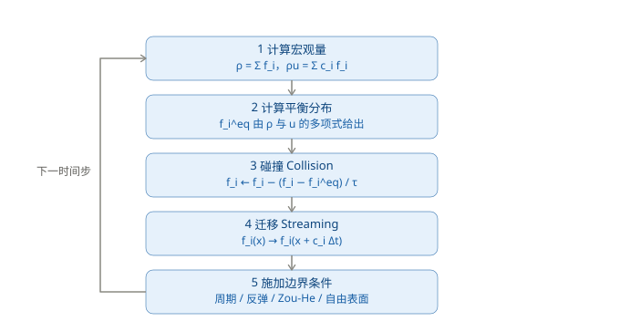
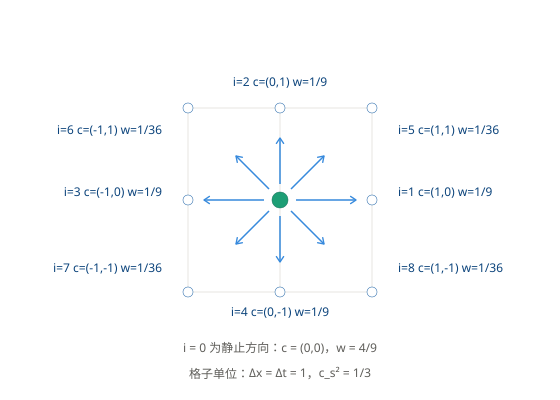

# 格子玻尔兹曼方法

## **从格子气到格子玻尔兹曼**

1988 年 McNamara 与 Zanetti 提出了关键的一步：**不再演化布尔的占据数 \\(n_i\\)，而是演化它的期望值。**

\\[f_i(\mathbf{x}, t) = \langle n_i(\mathbf{x}, t) \rangle \in \mathbb{R}\\]

\\(f_i\\) 的物理含义是"沿方向 \\(\mathbf{c}_i\\) 运动的粒子数密度"。因为直接演化系综平均，涨落不需要事后平均掉——**统计噪声归零**。

演化方程变成：

\\[f_i(\mathbf{x} + \mathbf{c}_i\Delta t, \; t+\Delta t) = f_i(\mathbf{x}, t) + \Omega_i(f)\\]

## **迁移是精确的**

LBM 有一个和有限差分类似但更干脆的性质：**离散速度的大小恰好使得一个时间步的位移等于一个格间距**。

\\[|\mathbf{c}_i| \Delta t = \Delta x \quad \Longrightarrow \quad \text{CFL} = 1\\]

所以迁移步不需要任何插值、不需要半拉格朗日回溯，只是把数据搬到相邻格点。这一点是从格子气继承来的，代价见后文的弱可压限制。

## **D2Q9 速度模板**

二维最常用的模板是 D2Q9：D = 2 维，Q = 9 个方向。

|方向 \\(i\\)|\\(\mathbf{c}_i\\)|权重 \\(w_i\\)|
|---|---|---|
|0|(0, 0)|4/9|
|1, 2, 3, 4|(1,0), (0,1), (-1,0), (0,-1)|1/9|
|5, 6, 7, 8|(1,1), (-1,1), (-1,-1), (1,-1)|1/36|

权重必须满足两条归一化条件，才能保证各向同性：

\\[\sum_i w_i = 1, \qquad \sum_i w_i c_{i\alpha}c_{i\beta} = c_s^2 \delta_{\alpha\beta}\\]

在格子单位下（\\(\Delta x = \Delta t = 1\\)），声速为

\\[c_s = \frac{1}{\sqrt{3}}, \qquad c_s^2 = \frac{1}{3}\\]

三维常用 D3Q19 与 D3Q27，\\(c_s^2\\) 同样是 1/3。

## **平衡分布**

平衡分布是密度与速度的多项式展开，保留到二阶：

\\[f_i^{eq} = w_i \rho \left[ 1 + \frac{\mathbf{c}_i\cdot\mathbf{u}}{c_s^2} + \frac{(\mathbf{c}_i\cdot\mathbf{u})^2}{2c_s^4} - \frac{|\mathbf{u}|^2}{2c_s^2} \right]\\]

代入 \\(c_s^2 = 1/3\\)：

\\[f_i^{eq} = w_i \rho \left[ 1 + 3(\mathbf{c}_i\cdot\mathbf{u}) + \frac{9}{2}(\mathbf{c}_i\cdot\mathbf{u})^2 - \frac{3}{2}|\mathbf{u}|^2 \right]\\]

这个多项式形式是 LBM 与格子气的又一个分界：格子气的平衡分布是 Fermi-Dirac 型，受排他原理限制；而这里显式写成了 \\(\mathbf{u}\\) 的多项式，因此**伽利略不变性得以恢复**。

## **碰撞：BGK 算子**

\\[\Omega_i = -\frac{1}{\tau}\left(f_i - f_i^{eq}\right)\\]

合起来，一个完整的时间步是：

\\[f_i(\mathbf{x}+\mathbf{c}_i\Delta t, t+\Delta t) = f_i(\mathbf{x},t) - \frac{1}{\tau}\left[f_i(\mathbf{x},t) - f_i^{eq}(\mathbf{x},t)\right]\\]

## **宏观量**

\\[\rho = \sum_i f_i, \qquad \rho\mathbf{u} = \sum_i \mathbf{c}_i f_i, \qquad p = c_s^2 \rho\\]

最后一条是**状态方程**。LBM 中的压强不是待求的 Lagrange 乘子，而是由密度直接给出的。

## **为什么不需要投影步**

这是从 [欧拉模型](../11_EulerianFluids.md) 走过来时最需要对照的一点。

|步骤|有限差分 + 投影法|格子玻尔兹曼方法|
|---|---|---|
|平流 / 迁移|半拉格朗日回溯 + 插值，会耗散|沿 \\(\mathbf{c}_i\\) 精确搬到邻居，无插值|
|强制不可压|解泊松方程 \\(\nabla^2 p = \frac{\rho}{\Delta t}\nabla\cdot\mathbf{u}^*\\)|不需要|
|压强来源|作为 Lagrange 乘子，由泊松方程求出|由状态方程 \\(p = c_s^2\rho\\) 直接给出|
|不可压条件|到线性求解精度内满足|近似满足，误差 \\(O(Ma^2)\\)|
|每步计算量|含一次全局线性求解|纯局部运算，无全局耦合|

原因在于：碰撞步把分布函数松弛到局部平衡，非平衡部分自动贡献出粘性应力，Chapman-Enskog 展开在 \\(O(Ma^2)\\) 精度内给出无散度的速度场。**压强的作用被代数松弛取代了。**

代价是**弱可压**：LBM 模拟的实际上是低马赫数的可压缩流体。

## **参数与稳定性**

Chapman-Enskog 展开给出运动粘度与松弛时间的关系：

\\[\nu = c_s^2\left(\tau - \frac{1}{2}\right)\Delta t = \frac{1}{3}\left(\tau - \frac{1}{2}\right)\Delta t\\]

- \\(\tau > 1/2\\) 是粘性为正的必要条件
- \\(\tau \to 1/2\\) 时粘度趋于 0，数值稳定性迅速恶化
- 马赫数 \\(Ma = |\mathbf{u}|/c_s\\) 需要足够小：工程上常取 \\(Ma \lesssim 0.1\\)，上限约 0.3；压缩性误差为 \\(O(Ma^2)\\)
- 由 \\(\nu\\) 与目标雷诺数 \\(Re\\) 确定 \\(\tau\\) 之后，网格分辨率仍受稳定性约束，高雷诺数问题需要更细的网格

## **与第 11 章的定位对照**

|对照项|第 11 章：欧拉模型|本章：格子动理学|
|---|---|---|
|离散对象|Navier-Stokes 方程|玻尔兹曼输运方程|
|状态变量|\\(\rho\\)、\\(\mathbf{u}\\)（宏观场）|\\(f_i\\)（介观分布函数）|
|时间步约束|CFL：\\(|\mathbf{u}|\Delta t < \Delta x\\)|固定为 1 格 / 步|
|压强|待求量，来自泊松方程|状态方程给出|
|主要瓶颈|全局线性求解|内存带宽（纯局部运算）|

---------------------------------------
> 本文出自CaterpillarStudyGroup，转载请注明出处。
>
> https://caterpillarstudygroup.github.io/GAMES103_mdbook/
